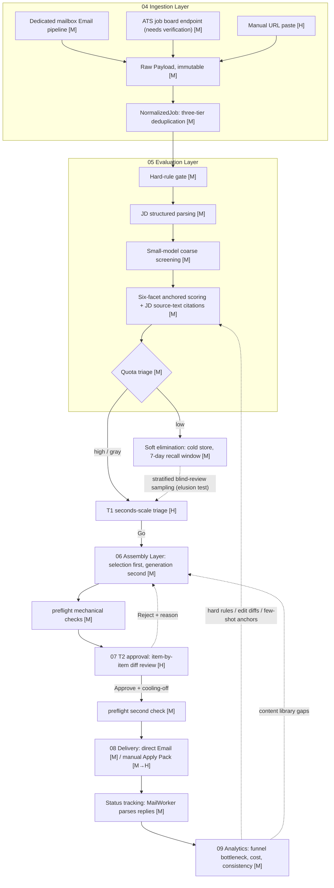

# AI-Automated Job Search System: Analysis and Planning Overview

This document is the entry point to the `ai-career` analysis and planning document set. The project is currently greenfield, with no code yet; the job of this document set is to make clear what should be built, what should not, and why — before the first line of code is written.

---

## 1. What This System Is

**In one sentence**: a job-search pipeline tool that a single job seeker (or a small team) runs on their own machine, normalizing job postings scattered across email notifications, ATS job boards and recruiter emails into deduplicable, sortable data, using an LLM for structured parsing and match scoring, concentrating human effort on two judgements — "should I apply to this" and "does this output represent me" — then assembling a customized résumé and cover letter from a human-verified content library, sending it after human approval and tracking the reply. It is not SaaS, not a submission bot, and it does not chase submission volume.

**Why understand it as a "bid/RFP response management system + a human–machine review queue"**: this analogy is productive not because it sounds sophisticated, but because it solves three design problems at once. First, bid/RFP response management has already dealt with this exact set of constraints — many opportunities, limited bid-writing capacity, every proposal customized, mandatory sign-off before sending — and its Go / No-Go gates, content library, source traceability and pre-sign-off diff review transplant directly. Second, the engineering mechanics of the "review at scale" part (confidence-based triage, sampling audits, countering automation bias) already have mature practice in content moderation and AI-assisted review in eDiscovery (TAR); transplantable, but the parameters must be recomputed. Third — and most important — where this analogy **breaks down** marks exactly where the real design difficulty of this project lies.

`01-domain-mapping.md` lists seven breakdown points, three of which rewrote every document that follows:

- **Three orders of magnitude difference in scale** (thousands of bids a year for a company vs roughly 100–150 submissions a year for an individual), which invalidates statistical quality control and A/B significance testing wholesale.
- **Asymmetric reputational cost** (one bad submission may live permanently in the other side's ATS), which forces every red line to be a code-level hard block rather than self-discipline.
- **A job seeker cannot review their own work** (you are both the producer and the only reviewer), which forces independence to be manufactured artificially through calibration questions and a cooling-off period.

In other words: **half of this analogy's value lies in where it is wrong.**

---

## 2. Core Arguments

The eight points below are the key judgements the whole document set converges on — opinionated assertions, not a summary. The full argument for each is in the documents named in parentheses.

1. **The bottleneck is never generation speed; it is the throughput and quality of human review.** So the triage threshold should not be set by an absolute score but derived backwards from capacity — weekly available hours ÷ time per review — using quota to cut the high / gray / low bands. Score only ranks; capacity draws the line. (`05-scoring-triage.md`, `07-review-gate.md`)

2. **The content library is the asset; the code is just the glue that assembles it.** The ceiling on output quality is set by verified fact blocks, not by the model. Cold-starting the library is estimated at 4–8 hours, and the whole system's break-even point is roughly 30–50 submissions — these two numbers decide whether the project is worth doing far more than any technology choice does. (`06-content-assembly.md`)

3. **Honesty cannot rest on prompt-level self-discipline; only on deterministic mechanism.** Résumé bullets are taken verbatim from verified blocks, only the summary and the cover letter permit constrained generation, and that is backed by post-processing — number allowlist, entity allowlist, proficiency ladder — plus NOT NULL foreign keys and triggers in the database to enforce that human-in-the-loop cannot be skipped. An instruction like "please do not fabricate" does not count as a defense. (`03-data-model.md`, `06-content-assembly.md`, `10-risk-compliance.md`)

4. **The ingestion side has APIs; the delivery side has almost none.** The center of gravity for automation necessarily sits upstream. The delivery layer's mainstay is direct Email plus the manual Apply Pack; official submission APIs keep an interface but no implementation; Playwright semi-automated form filling does not pay off at individual volume (a single ATS would need 160+ submissions a year to break even), so v1 skips it outright. (`08-delivery-tracking.md`)

5. **An individual's sample size will never support statistical inference, so the analytics layer must be downgraded.** A ContentBlock performance leaderboard and cover-letter A/B testing do not hold up mathematically; this is explicitly not done. The analytics layer's job becomes directing attention, generating hypotheses, controlling cost and auditing decision consistency; the core metrics are where the funnel bottleneck sits and human minutes per submission. (`09-analytics-feedback.md`)

6. **Human time costs 10–30× what tokens cost, and that sets the direction of every cross-layer trade-off.** If spending more tokens saves human minutes, spend them; the reverse optimization — adding a manual step to save API fees — is rejected across the board. And because cost lands in the low tens of US dollars per month and is not a constraint, introducing a vector database, a message queue or container orchestration on those grounds is explicitly opposed. (`09-analytics-feedback.md`, `11-tech-stack-roadmap.md`)

7. **Approval is an architectural chokepoint, not a button in the UI.** Approval must bind to `bundle_hash` plus a single-use nonce, and sending may only go through one module, to prevent the "approve v3, send v4" TOCTOU problem. The approval fingerprint uses render_key rather than a hash of the PDF bytes (PDF timestamps would make the hash never match). (`02-architecture.md`, `07-review-gate.md`, `10-risk-compliance.md`)

8. **"Do not fight the platform" is not a moral posture; it is a structural constraint written into the tables.** It takes the form of `tos_note`, `enabled` and an auto-disable-on-terms-review-expiry column on the source registry, not a stated principle. Any source that cannot be automated compliantly is downgraded to manual paste. (`02-architecture.md`, `04-ingestion.md`, `10-risk-compliance.md`)

---

## 3. End-to-End Flow

`[M]` = machine-automated, `[H]` = human, `[M→H]` = machine prepares, human makes the final call.

Three points: (a) **humans appear in only three places** — T1 triage, T2 approval and backfilling manual submissions; everything else is machine; (b) status tracking is a **loop running parallel to** the main pipeline, not a box at the tail end; (c) the feedback loop may only write back prompt templates, few-shot anchors and rubric weights, **no fine-tuning**, and every write-back requires human approval.

---

## 4. Document Index

| Suggested order | File | Title | In one sentence |
|---|---|---|---|
| 1 | [`00-overview.md`](00-overview.md) | Overview and Index | This document: positioning, core arguments, flow diagram, reading paths |
| 2 | [`01-domain-mapping.md`](01-domain-mapping.md) | Domain Mapping | Validates the core analogy and names the seven points where it breaks down |
| 3 | [`02-architecture.md`](02-architecture.md) | System Architecture | The L0–L7 eight-layer breakdown, three cross-cutting components, explicitly rejected technologies |
| 4 | [`03-data-model.md`](03-data-model.md) | Data Model and State Machines | SQLite schema, two-level state machines, human-in-the-loop enforced by constraints |
| 5 | [`04-ingestion.md`](04-ingestion.md) | Ingestion Layer | Email as the backbone, ATS as the supplement, a hard cap of three automated sources |
| 6 | [`05-scoring-triage.md`](05-scoring-triage.md) | Evaluation Layer | Four-stage scoring, quota triage, elusion test audit |
| 7 | [`06-content-assembly.md`](06-content-assembly.md) | Assembly Layer | Selection first and generation second, deterministic post-processing, dual-track zh/en content library |
| 8 | [`07-review-gate.md`](07-review-gate.md) | Approval Gate | Maximizing the share of real judgement under a fixed time budget, cooling-off period and calibration questions |
| 9 | [`08-delivery-tracking.md`](08-delivery-tracking.md) | Delivery Layer and Tracking | preflight gate, append-only send records, MailWorker |
| 10 | [`09-analytics-feedback.md`](09-analytics-feedback.md) | Analytics and Feedback | Why there is no A/B testing, cost breakdown, three invariants |
| 11 | [`10-risk-compliance.md`](10-risk-compliance.md) | Risk, Ethics and Compliance | Six architectural corrections, four situations where this system should not be used |
| 12 | [`11-tech-stack-roadmap.md`](11-tech-stack-roadmap.md) | Tech Stack and Roadmap | Why not off-the-shelf tools, Phase 0–4 and the DoD for each |
| 13 | [`12-reference-career-ops.md`](12-reference-career-ops.md) | Comparison with career-ops | What to borrow and what to reject; markdown cannot give you mechanism |
| 14 | [`13-repo-layout.md`](13-repo-layout.md) | Directory Layering and Data Governance | Four classification tiers, three physical locations, the private tier lives outside the repo |
| 15 | [`14-browser-automation.md`](14-browser-automation.md) | Browser Automation | Playwright + a dedicated Chrome, human/machine handoff, the never-do list |
| 16 | [`15-target-tsmc.md`](15-target-tsmc.md) | TSMC Playbook | sitemap ingestion; the single talent-pool model overturns per-JD customization |
| 17 | [`16-plan-revisions.md`](16-plan-revisions.md) | Revision List for the Existing Plan | Per-file revisions to 00–11 with priorities |
| ★ | [`17-decisions.md`](17-decisions.md) | **Ruling Record A1–A4** | **Authoritative wherever it conflicts with any document**; A3 deliberately held open |
| — | [`98-revision-gaps.md`](98-revision-gaps.md) | Gaps and Contradictions in This Batch | A5–A14 / B1–B4 / C1–C4 **still awaiting ruling** |
| — | [`99-gaps.md`](99-gaps.md) | First-Round Completeness Review | P0 gap list |

---

## 5. Suggested Reading Paths

**"I want to know whether to do this project at all" (about 40 minutes)**
`00-overview.md` (sections 2 and 7 of this document) → `01-domain-mapping.md` (the falsification conditions in section 1) → `11-tech-stack-roadmap.md` (the "why not off-the-shelf tools" section and the Phase 0 DoD) → `10-risk-compliance.md` ("four situations where this system should not be used").
The decision does not hinge on technical feasibility but on two numbers: the share of your job-posting population genuinely worth applying to, and how many submissions you intend to make.

**"I'm ready to start coding" (in order)**
`02-architecture.md` → `03-data-model.md` → `11-tech-stack-roadmap.md` (Phase 0/1 scope) → `04-ingestion.md`.
Get Phase 0's Manual URL Drop working end to end and validate everything downstream before touching any automated source. The schema in `03` is the contract for every layer that follows; read it through before you start.

**"I only care about output quality"**
`06-content-assembly.md` → `07-review-gate.md` → `05-scoring-triage.md`.

**"I'm worried about crossing a line"**
`10-risk-compliance.md` → `04-ingestion.md` (source registry) → `08-delivery-tracking.md` (delivery channels).

---

## 6. The Three Biggest Open Questions Right Now

The answers to these three rewrite the design; they are not details:

1. **How long does one full review (T2) actually take?** This is the single most critical number in the whole document set. The entire capacity model, the quota formula and every cost conclusion rest on it (`07` estimates 60–90 seconds per diff review, `09` estimates 8–15 minutes for the whole item; the two use different definitions and neither is verified). **How to verify**: in the MVP's first month set no target number of seconds — just record `decision_ms` and recompute from the median of the first 20. If the median is far off, the throughput table in section 8 of `07` and the triage cut points in `05` all have to be recomputed.

2. **What is the actual state of ATS public job endpoints and their ToS?** The documents repeatedly cite Greenhouse / Lever / Ashby job board endpoints, but **all of this is speculation and needs real testing**. If most are unavailable or the terms do not permit it, the ingestion layer degrades to pure Email plus manual; `04`'s Phase 1 backbone is unchanged but the enrichment capability disappears, and falling full-text JD coverage will drag down scoring quality in `05`. **How to verify**: actually issue GETs against the board tokens of companies known to use each ATS and record the HTTP status and field structure; at the same time read the automated-access clauses of the terms word by word and copy the original clause numbers and the date consulted into the source ledger in `10-risk-compliance.md`. The compliance part must not rely on memory or secondhand sources.

3. **What share of the job-posting population is "genuinely worth applying to" (prevalence)?** Section 1 of `01-domain-mapping.md` states it plainly: above 50% the falsification condition fires and you should stop building this system — because triage itself has no value and what you should do is just apply. **How to verify**: randomly sample 50 items from the last month's sources and count them by hand. This costs two hours and can save two weeks.

---

## 7. The Case Against: This Project May Not Be Worth Doing

This section is not a disclaimer; it is an honest objection.

**The core arithmetic**: 4–8 hours to cold-start the content library, plus implementation time for Phase 0–1 (conservatively 20–40 hours), puts total up-front investment at roughly 30–50 hours. If each submission saves 20 minutes, break-even needs 90–150 submissions — well above the 30–50 that `06` optimistically estimates, the difference being whether coding time is counted. And a typical job-search cycle may only produce 40–80 actual submissions. **On paper, this project very likely loses money.**

In the following five situations, close the editor and go send résumés:

1. **Your main channel is referrals.** Both `01` and `09` note that the reply-rate gap between referrals and cold applications may reach 3–10×, and the referral channel is **entirely outside this system**. If you have 20 former colleagues you can ask, the 30 hours going into the system should go into coffee meetings instead. This is the strongest objection here.
2. **You only plan to send 20 or fewer.** For a small number of heavily customized submissions, doing it by hand is faster than building a pipeline. The system's value is in repetition; without enough repetitions it does not hold.
3. **Your financial runway is tight.** The system has to run for several weeks before it starts producing feedback signal; when you are unemployed and savings are running out, two weeks of tool development is pure opportunity cost. Apply first, then come back and build once you have a job or a buffer.
4. **More than half of your job-posting population is "genuinely worth applying to."** The value of triage equals the volume of noise it screens out. Without enough noise, the whole evaluation layer is expensive decoration.
5. **Your real problem is not process but content.** If your résumé is not convincing in the first place, or there is a substantive gap between your skills and your target postings, this system will only deliver the same weak résumé to more places more efficiently. It amplifies existing quality; it does not create quality.

**And an honest psychological risk**: `08` notes that the dashboard brings a morale cost. Quantifying "being rejected" into a funnel conversion rate is a useful disenchantment for some people and, for others, a fresh hit every morning when they open it. Which one you are, you know best.

**Conversely, when it is worth doing**: you expect 60+ submissions, cold applications make up a large share of your target market, you enjoy building this kind of tool for its own sake (a legitimate reason — do not pretend otherwise), or you also want a demonstrable project out of it. That last point is routinely underrated — this system is itself a portfolio piece, and the return on a portfolio piece may exceed the time it saves. If that is your real motive, write it plainly in the README rather than dressing it up as "improving job-search efficiency," or you will optimize on the wrong metric.

---

## 8. Points Not Yet Converged Across Documents

An honest record of three places where the documents are not yet aligned, instead of pretending the planning is complete:

- **Inconsistent definitions of review time** (`07`'s 60–90 seconds vs `09`'s 8–15 minutes). The former means the diff review, the latter the whole-item time including back-and-forth edits, but each document's cost model uses its own number. The definition should be unified once measured.
- **The storage form of `artifact_bundle` is undecided** (`03` provisionally stores `artifact_id` in a JSON array, which forces statistics queries to match with `LIKE`). Whether to switch to a join table depends on the actual query frequency in `09`; decide after implementation.
- **The position and threshold of the feasibility gate** (`06` moves it after the scoring matrix; the 0.6 threshold was set out of thin air). It needs recalibrating against the first 30 items of real data, especially the cases that were force-passed.
