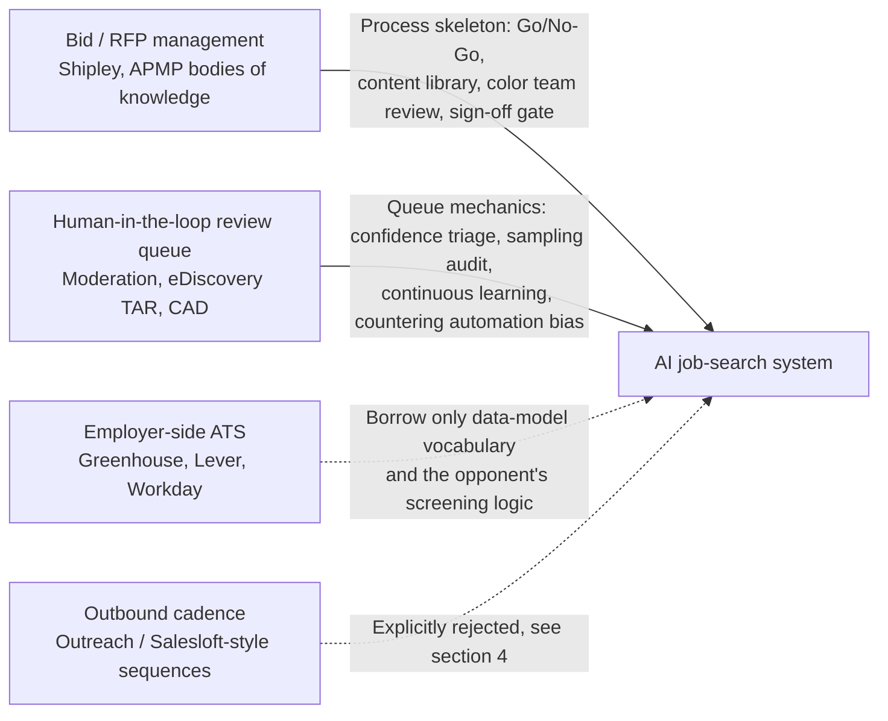

# Domain Mapping: Bid/RFP Response Management and the Human-in-the-Loop Review Queue

> **What this document does**: validate the core analogy "an AI job-search system ≈ a bid/RFP response management system + a human-in-the-loop review queue," find where it holds and where it breaks down, and turn the conclusions into design constraints for the documents that follow. If the analogy does not hold up, everything designed from [02-architecture.md](./02-architecture.md) onward has to be redone.
>
> **What this document does not do**: no functional specs, no technology choices. This handles only "where to steal from, what to steal, and what cannot be stolen."
>
> Related documents: [00-overview.md](./00-overview.md), [05-scoring-triage.md](./05-scoring-triage.md), [07-review-gate.md](./07-review-gate.md), [09-analytics-feedback.md](./09-analytics-feedback.md)

---

## 1. First, how this analogy gets falsified

The biggest risk with an analogy is not that it is wrong, but that it is right too vaguely, which leads us to copy the source domain's rituals (multi-person approval chains, statistical quality control, workflow engines) along with everything else. So the criteria get nailed down first.

**Conditions for the analogy to hold (all three must hold at once)**

1. The output is a one-shot, non-resubmittable customized document, not a message you can reach someone with repeatedly.
2. The decision point is "submit or not," not merely "how to write it," and the volume eliminated exceeds the volume kept by at least an order of magnitude.
3. There is a human approval action before sending that cannot be skipped (Product Principle 1).

**Evidence that would falsify the analogy** (if it shows up, come back and rewrite this document, do not force it)

| Observed phenomenon | What it means | What should change |
|---|---|---|
| In actual use, the share worth submitting to is > 50% | Triage has no value | Degrade into a "writing assistant," cut the queue and the scoring, see section 8 |
| A round only handles 10–20 job postings | The build cost of queue mechanics > the payoff | Same as above |
| The main entry channel is referrals and headhunters | The funnel runs the other way | The system degrades into a CRM; this design does not apply (see 6.8) |

---

## 2. Division of labor between the two source domains

The bid domain supplies the process skeleton, but it does not answer "how does one person reliably review 60 AI outputs in two hours without falling apart." That is the review-queue domain's problem.



The third domain (ATS) supplies only vocabulary and an understanding of "how the opponent thinks"; the fourth (outbound cadence) is listed in order to be **explicitly rejected**, because it is the failure mode this system slides into most easily.

---

## 3. Item-by-item mapping: job-search steps ↔ bid steps

> **Confidence note**: in the "Mature practice" column below, the methodology layer (Shipley's gate concept, weighted scorecards, compliance matrix, color team review) belongs to published industry bodies of knowledge and is fairly reliable; **the feature names and details of named commercial tools are speculation and need verification** (see section 11). What matters is not whether a feature name is precise, but "what a mature team invests in this cell."

| # | Job-search step | Bid counterpart | Mature practice | Portability |
|---|---|---|---|---|
| 1 | Ingest job postings | Ingest tenders | Government procurement mostly has official subscribable sources (the US SAM.gov offers a public API, **details need verification**); commercial RFPs mostly land straight in an inbox, and tools provide email intake | Partial. The job-search side has no unified source, and email intake is in fact the mainstay, see [04-ingestion.md](./04-ingestion.md) |
| 2 | Parse the JD into structured fields | Parse the RFP into requirement items | Break the RFP into a per-question list (question extraction), producing a worksheet that can be answered item by item | Portable in concept, but a JD is not a requirements document, see 6.2 |
| 3 | AI scores the match | Go / No-Go scoring | A weighted scorecard (capability fit, relationship, competitive position, resource cost, win probability), an explicit no-bid threshold, **a written decision record** | **Highly portable, the biggest win** |
| 4 | Triage (high / gray / low) | Qualification gate | An early gate eliminates deals not worth bidding on, concentrating resources on the few with high win probability | Highly portable, but the source of the threshold has to change, see 3.1 |
| 5 | Content library | Answer / Content Library | Every entry has an owner, tags, a last-reviewed date, an expiry reminder, a review status, a usage count and a win rate | **Highly portable**, but the multi-person approval chain has to be cut, see [06-content-assembly.md](./06-content-assembly.md) |
| 6 | Assemble résumé / cover letter | Proposal assembly and auto-answering | Generate a draft from the content library, **and retain source traceability for "which entry this passage came from"** | Highly portable; source traceability is the technical implementation of the honesty principle |
| 7 | Hard-requirement checking | Compliance matrix | List every shall / must requirement and map it to where it is answered; miss one and the bid can be ruled non-responsive | Must be split into a hard and a soft layer, see 6.2 |
| 8 | Manual review queue | Color team review (Pink / Red Team) | The Red Team has **people who did not write the proposal** play the evaluation panel and score it item by item | Portable but needs rework: a one-person project has no second person, see 6.7 |
| 9 | Approval gate | Gold Team / sign-off | The authorized person signs off at the end, and the record is archived | **Ported directly**, corresponds to Product Principle 1 |
| 10 | Send | Submit the bid | E-procurement portals usually have a formal submission channel, and automation is permitted or even encouraged | **Not portable**, see 6.9 and [08-delivery-tracking.md](./08-delivery-tracking.md) |
| 11 | Performance analytics | Win-rate analysis and win/loss debrief | Record wins and losses, competitors and scoring feedback; public-sector tenders often come with a formal debrief | Portable in concept, **but the data quality is three grades worse**, see 6.6 |

### 3.1 The four things most worth stealing

1. **A written Go / No-Go decision record.** A bid team writes down its reasons even when it decides not to bid. The value of this in job search is enormous: looking back three months later at "why did I skip these 40 job postings" is the only reliable data source for calibrating the scoring model — because that is **your own manual labeling**, not a reply signal contaminated by the ATS. A suggested concrete form (field definitions are governed by [03-data-model.md](./03-data-model.md)):

```yaml
decision_record:
  job_id: jd_2026_0412_acme_be
  decided_at: 2026-09-14T21:03:00+08:00
  decision: no_go              # go | no_go | deferred
  ai_score: 71                 # the human gut-feel score before the reveal is stored separately as blind_score
  blind_score: 45              # filled in only during a sampled blind review, see 5.3
  reasons:                     # at least one required, the free text must not be blank
    - code: seniority_mismatch
      note: "JD says 5 years but they actually want a team lead, I have never managed people"
    - code: location
      note: "requires three days a week in the office, 90-minute commute"
  time_spent_sec: 42
```

2. **Content health.** Every entry has a last-reviewed date and an expiry reminder. Facts in a job-search content library expire (years of experience, tech-stack versions, project numbers), and without an expiry mechanism you start lying without noticing — this is the breach through which time most easily erodes the honesty principle.

3. **Bid cost model: derive the threshold from cost.** A bid team computes "how many hours one bid costs and what it is expected to be worth," then sets the threshold. The job-search counterpart is a **time budget**, and this overturns the original architecture's intuition of "cutting three bands by score":

   ```
   One complete submission (AI draft + human review + edits + send + record)
       ≈ 25–40 min   ← this number must be validated with real timing, do not guess it
   5 hours available per week  →  8–12 submissions/week
   ```

   → **Original thinking**: triage cuts high / gray / low bands by absolute score. **Why it changed**: absolute thresholds drift with batch quality — a good batch drowns you, a bad batch leaves you idle, while human capacity is fixed. **What it became**: the score is only responsible for **ranking**, the actual cut is "top-N after ranking, N = this week's capacity," and an absolute score floor stops a bad batch from being padded out to fill the quota. See [05-scoring-triage.md](./05-scoring-triage.md).

4. **The Red Team role definition: the reviewer must not be the writer, and must score item by item from the evaluator's point of view.** The original process sketch has no such step; adding it is recommended (see section 9, item 1).

---

## 4. Adjacent domains, and why they are less alike

| Domain | Surface similarity | Why it is not alike | Still worth borrowing |
|---|---|---|---|
| **CRM / sales pipeline** | Staged funnel, activity log, conversion rate | Sales can push many opportunities at once without them interfering, failure is cheap and negotiation is repeatable; job search is winner-take-one, and after a submission there is almost no "follow-up warming" lever — too much follow-up actively costs you points | The data-model vocabulary for stage definitions and conversion rates |
| **Outbound cadence** | High-volume customized sends, open tracking, A/B testing | **The unit-cost structure is exactly inverted**: in outbound the marginal cost per email is near zero and failure leaves no record; in job search every submission carries a reputation cost and the sample size is only two digits. Copying the cadence mindset is this system's **most dangerous failure mode** | Almost nothing. It is listed in order to be explicitly rejected |
| **Employer-side ATS** | Handles the same object (application) | **The viewpoint is inverted**: an ATS is many-to-one convergent screening, a job seeker is one-to-many divergent proposing, so the process cannot be copied | Data-model vocabulary (requisition, stage, disposition reason); plus understanding the opponent's screening logic (knockout questions, keyword matching), which has direct value for the assembly layer |
| **Academic submission management** | desk-reject-style triage, format compliance checking | Academia forbids simultaneous submission (job search can and should submit in parallel); peer review has a defined cycle and written comments, so **feedback quality is far higher than in job search** (where the main outcome is silence) | The desk-reject triage mental model; automated format compliance checks |

---

## 5. Stealing engineering practices from the review-queue domain

### 5.1 Content moderation

| Practice | Original use | Ported to the job-search system | Cost |
|---|---|---|---|
| Three-band triage on a confidence score | High confidence auto-actioned, the middle goes to a human, low confidence is escalated | High scores go to assembly, the gray band goes to the queue, low scores are eliminated (**but the cut is determined by capacity, see 3.1**) | Thresholds need continuous calibration |
| Golden set | Mix in known answers to measure reviewer accuracy and drift | Hand-label 20–30 JDs as a fixed test set and re-run it every time the prompt changes, as a **regression test** | 2–3 hours of pure manual work up front, and the labeling itself is biased |
| Precedent library | Hard rulings are written up as precedent for later reference | Every time a human overrides the AI score, record the reason, accumulating a pool of few-shot examples | The example pool expires and needs periodic pruning |
| Queue mechanics | One item at a time, homogeneous batches, a cap on session length | Review job postings of the same type together, with a per-session cap of 30–45 minutes | Sacrifices the cross-posting comparison view |
| Reviewer well-being | Rotation, mandatory breaks | Job-search fatigue is not a question of hours but of **the psychological cost of being rejected**, see 6.7 | Shift rotation is entirely ineffective |

### 5.2 eDiscovery's TAR / predictive coding

This is the most instructive domain for this project, because what it handles is exactly "a large volume of documents, a binary decision, and the need to prove externally that nothing important was missed."

- **CAL (continuous active learning)**: learn while reviewing — every human judgment feeds back immediately and the model keeps pushing the most likely relevant items to the front, with no control set needed up front.
  → Ported: train no model of our own; every human override is a new few-shot sample used to re-rank the **remaining queue**.
- **Elusion test**: randomly sample from **the discarded pile** for manual re-review, estimating how many genuinely relevant documents were missed.
  → This is precisely the formal name and methodology for the original architecture's "automatic elimination + sampling audit." **It must be done, and done on a fixed schedule.**
- **Richness / prevalence estimation**: estimate the share of relevant documents in the population first, so you know where to set the stopping criterion.
  → Ported: first estimate "the share of this batch of job postings genuinely worth submitting to"; that number directly determines where the floor sits.
- **Stopping criterion**: not reviewing every document, but stopping once recall hits target.
  → Ported: a round need not be reviewed to completion — stop once "N consecutive gray-band items have been judged no-go by you," with N suggested to start at 8 and the actual value recorded.

> US courts have already ruled on the admissibility of predictive coding (*Da Silva Moore v. Publicis Groupe*, S.D.N.Y. 2012 is generally considered the first case). **The case details need verification**, and this project involves no legal proceedings; the citation is only a methodological source.

### 5.3 AI-assisted medical image reading (CADe / CADt)

What this domain contributes is mainly **warnings**, not practices:

- **Automation bias**: when AI markings are present, human readers tend to accept them wholesale and look more carelessly at unmarked regions.
  → Countermeasure: the review interface **hides the AI score first** by default, the human gives a gut-feel judgment (`blind_score` in the schema above), and then the score is revealed and the difference recorded.
  → **State the cost plainly**: a blind review costs about 60–90 extra seconds per item. So blind review is forced only on a sampled 10–20%, and the rest show the score directly. That 10–20% is simultaneously free data for measuring model quality.
- **Triage vs concurrent reader**: CADt only changes the ordering (suspected emergencies go first) and does not change the diagnosis; a concurrent reader influences the read and is far riskier.
  → Ported: the AI score's main job is **ranking**, not deciding for you. This and the capacity-driven threshold in 3.1 are the same conclusion derived from two directions.
- **Reviewer agreement**: multi-reader studies measure agreement with metrics such as Cohen's kappa.
  → Ported: a one-person system has no inter-rater agreement, only **intra-rater**: put the same JD back into the queue a week later and see whether you give the same judgment. If your agreement with yourself is low, you should not expect the AI to learn your preferences, nor trust any scoring calibration result.

---

## 6. Where this analogy breaks down

**This is the most important section in this document.** Every item below directly rewrites the design in the documents that follow.

### 6.1 The scale is three orders of magnitude off, so every statistical method fails

A bid team handles hundreds to thousands of RFPs a year with 5–50 people; a job seeker handles roughly 30–150 job postings per round with 1 person.

Assume a baseline reply rate of 10%; to detect a 5 percentage point lift (10% → 15%) with two-tailed α=0.05 and power=0.8, the sample size required per group is:

```
n ≈ (z₀.₉₇₅ + z₀.₈)² · [p₁(1−p₁) + p₂(1−p₂)] / (p₂ − p₁)²
  = (1.96 + 0.84)² · (0.09 + 0.1275) / 0.05²
  ≈ 7.85 · 0.2175 / 0.0025
  ≈ 683  per group
```

A round of 100 submissions is more than an order of magnitude short of "683 per group," and that is before counting drift over time (market conditions and your own résumé are both changing).

→ **Original thinking**: the analytics layer runs A/B performance comparisons between versions. **Why it changed**: the sample size cannot possibly support it. **What it became**: version comparison is demoted to a directional signal, relying mainly on qualitative debriefs and decision records; any win/loss conclusion about a version must be labeled "not statistically significant" in the UI. See [09-analytics-feedback.md](./09-analytics-feedback.md).

**The sampling audit rate also has to be recomputed.** Industry elusion tests sample 1–2%, which on a population of 100 is 1–2 items — meaningless. But do not overestimate its power once the rate is raised either:

```
Sample 15 for re-review, all confirmed correctly eliminated
  → by the rule of three, the 95% one-sided upper bound on the elusion rate ≈ 3/15 = 20%
Sample 30, all correct → upper bound ≈ 10%
(with a finite population the true bound is slightly tighter, but the order of magnitude is unchanged)
```

→ **What it became**: sample a fixed 10–15 items or 15%, whichever is larger, **and state plainly in the report that "this is a qualitative check, not a statistical estimate."** Pushing the upper bound below 10% means sampling 30, which already eats half a session's capacity — that trade-off is the user's to make, do not make it for them behind their back.

**Active learning cannot learn anything either.** CAL only shows its power on tens of thousands of documents; at 100, even a few-shot example pool is a stretch. → Rules + LLM few-shot, with human overrides accumulating as examples, and **no model of our own is trained**.

### 6.2 An RFP is a specification, a JD is marketing copy

An RFP has itemized shall / must clauses, explicit scoring weights and a formal Q&A period, and missing one answer can make the bid non-responsive outright. A JD, on the other hand: half the "requirements" are a wish list, the real decision preferences are not written down, the same JD carries completely different weights in different recruiters' hands, and it may even be a ghost job that nobody intends to hire for (**widespread, but the percentage figures are unreliable and need verification**).

→ **What it became**: the compliance matrix is split into two layers.

| Layer | Content | How it is handled |
|---|---|---|
| Hard elimination criteria | Work authorization / visa, location and on-site requirements, language, licenses | Automatable, **should be a mandatory check**, a mismatch eliminates the posting and the reason is recorded |
| Soft requirements | Years-of-experience numbers, tech-stack lists, "nice to haves" | Only mapped to evidence for the human's reference, **never entering the scoring formula** |

At the same time, **an RFP has a hard deadline while most JDs accept applications on a rolling basis**. The time pressure comes not from a deadline but from the empirical property that "the earlier you submit, the more likely you are to be seen near the top of the résumé pile" (**the strength of this needs verification**). → `deadline` in the data model should be null for most postings, with `first_seen_at` driving priority instead, see [03-data-model.md](./03-data-model.md).

### 6.3 Reputation cost is severely asymmetric

Lose a bid and you can still bid for the same client next year. Job search is different: the application record stays inside the employer's ATS for a long time, a company that repeatedly receives low-quality applications may flag you internally, and the headhunter and HR social network is smaller than you think. **The cost of spraying applications is delayed, unobservable and irreversible.**

→ This is the real basis for Product Principle 4 (fewer but better), and why the bid system's objective function of "raise bid throughput capacity" **must not** be copied over. The success metric has to be "hit rate per submission," and any dashboard metric that induces volume-chasing should be removed from the UI — not hidden, removed.

### 6.4 The content library is a different animal

| Aspect | Bid content library | Job-search content library |
|---|---|---|
| Owner | Shared by the team, with a review chain | One person, no second person to review |
| Fact stability | Descriptions of company capability go unchanged for years | Years of experience, tech stack and project numbers drift continuously |
| Multiple versions | Different versions can coexist for different clients | The emphasis can be adjusted, but **the fact layer must not have two versions** (Principle 2) |
| How it evolves | A version approval workflow | Grows naturally with experience, needs a low-friction write path |

→ Drop the multi-person approval chain; keep the content health expiry reminder; **add something the bid system does not have: separation of the fact layer and the phrasing layer**. The fact layer (`fact`: dates, company, quantified result) must not be rewritten by an LLM; the phrasing layer (`phrasing` variants) may be recombined by an LLM. This is the only reliable technical guarantee of the honesty principle, see [06-content-assembly.md](./06-content-assembly.md).

### 6.5 Outcome data is right-censored and missing not at random

A bid's win or loss is unambiguous, and public-sector tenders often even come with a formal debrief. The most common job-search outcome is **silence**, and you never know whether the reason is a keyword filter, a recruiter who never opened it, a posting already earmarked for someone, a ghost job, or that you genuinely were not good enough.

In statistical terms, this is **censored data + missing not at random (MNAR)**. Feeding "no reply" back into the scoring model as "failure" means learning "the preferences of the ATS keyword filter" rather than "what work suits me."

→ **Original thinking**: the analytics layer feeds reply rate back into the scoring model. **Why it changed**: reply rate is a contaminated label. **What it became**: outcomes are counted in three separate classes — (1) explicit progress (recruiter screen or beyond), (2) explicit rejection, (3) silence (**excluded from every rate's denominator, tracked separately**). Only (1) and (2) are used as weak feedback, and a non-reply is classified as silence only after an observation window (21 days suggested, to be adjusted against real data).

### 6.6 The job seeker is both the product and the salesperson

In a bid system the proposal manager is not the thing being sold. The job seeker is.

- **You cannot score yourself objectively.** Self-assessment bias is systematic (not random noise), so the human-override data is itself biased, and the feedback loop **amplifies** rather than corrects it. This is why the intra-rater agreement check (5.3) has to be done.
- **There is no second person to run a Red Team.**
  → Compromise: have an LLM play the recruiter and score item by item. **Admit the limitation honestly**: with the same vendor, there is a self-consistency bias of reviewing your own work. Mitigation: run the Red Team on **a model from a different vendor**, and give it only the JD plus the output, not the content library and not the prompt used to write it. This is still mitigation, not a solution — models from different vendors still share much of the same training-data distribution.
  → **The Red Team's failure mode**: an LLM tends to produce criticism of any text that looks specific but is in fact generic. **Test whether it can tell good from bad before shipping it**: hand it one deliberately padded output and one genuine output and see whether the scores separate; if they do not, this step is a placebo and should be turned off.
  → **A cheaper alternative that should be tried first**: delayed self-review — review 24 hours after producing the output, without looking at your own drafting notes. Zero cost, and no hallucination risk.
- **Fatigue is a different kind.** Content-moderation fatigue comes from repetition and harmful content; job-search review fatigue comes from **the accumulated psychological cost of being rejected**. Shift rotation does not fix it. Design implication: the queue must be pausable at any moment without losing state, and rejection notifications **must not interrupt the review flow** (they are presented in batches at fixed times), see [07-review-gate.md](./07-review-gate.md).

### 6.7 The delivery layer cannot be copied

Automated bid submission is permitted or even encouraged in the bid domain; job platforms' terms of service mostly prohibit automated submission and large-scale scraping (**the specific clauses vary by platform and need to be verified one by one, see section 11**).

→ **Original thinking**: "the delivery layer is semi-automated with Playwright." **Kept but tightened**: Playwright is used only to "open the page, pre-fill the fields, and stop before the submit button for the human to press," restricted to the user's own logged-in session; it does not bypass CAPTCHAs, does not run large volumes in parallel, and does not disguise traffic. Where an official API or an email application channel exists, take that instead. See [08-delivery-tracking.md](./08-delivery-tracking.md) and [10-risk-compliance.md](./10-risk-compliance.md).

### 6.8 The one area the analogy does not cover at all: referral

**Before** the RFP is even issued, the bid domain has a whole discipline of capture management (cultivating the client relationship, shaping how the requirements are written). The job-search counterpart is referrals and networking, and its conversion rate is usually far higher than cold applications.

**This system handles none of it, this is its largest functional gap, and it is deliberate** — networking is not work that can be queued. But the documentation has to mark the gap honestly, or the user will mistake running the system well for doing job search well. Practical recommendation: state plainly in the success metrics in [00-overview.md](./00-overview.md) that "this system covers the cold-application channel only."

---

## 7. Breakdown points → design consequences

| Breakdown point | Consequence | Which document it lands in |
|---|---|---|
| 6.1 Insufficient scale | A/B demoted to a directional signal; the sampling rate raised and labeled non-statistical; no model of our own is trained | [09](./09-analytics-feedback.md), [05](./05-scoring-triage.md) |
| 6.2 A JD is not a specification | compliance split into a hard and a soft layer; `deadline` mostly null, `first_seen_at` used instead | [05](./05-scoring-triage.md), [03](./03-data-model.md) |
| 6.3 Reputation asymmetry | Throughput KPIs removed; the success metric becomes hit rate | [09](./09-analytics-feedback.md), [00](./00-overview.md) |
| 6.4 The content library is a different animal | Multi-person approval cut; fact layer / phrasing layer separation added | [06](./06-content-assembly.md) |
| 6.5 MNAR labels | Three outcome classes; silence excluded from the denominator; an observation window set | [09](./09-analytics-feedback.md), [03](./03-data-model.md) |
| 6.6 You cannot review yourself | Sampled blind review, intra-rater checks, cross-vendor Red Team (with a capability test) | [07](./07-review-gate.md) |
| 6.7 ToS restrictions | Playwright stops before the submit button; official channels first | [08](./08-delivery-tracking.md), [10](./10-risk-compliance.md) |
| 6.8 The referral gap | State the system boundary plainly, do not pretend to cover it | [00](./00-overview.md) |
| 3.1 Capacity-driven threshold | The score only ranks; the cut = top-N by weekly capacity + an absolute floor | [05](./05-scoring-triage.md) |

---

## 8. When this architecture should not be used

Honestly, this design is over-engineering in the following situations:

- **A round only submits to 10–20 companies.** Open a spreadsheet and write each one by hand, using AI purely as a copy-polishing tool. The build cost of the whole queue-and-scoring apparatus far exceeds the time it saves. Triage only has value when "what gets eliminated outnumbers what gets kept by an order of magnitude."
- **The target is a handful of dream companies.** What to do is deep research and networking (capture management), which this system does not handle and which often has a higher return.
- **You are in a highly passive market (headhunters come to you).** The funnel runs the other way and the system degrades into a CRM.
- **The user will send AI output straight out.** Then this system's net effect is to raise the throughput of low-quality submissions, and it **does more harm than good**. That the approval gate cannot be skipped is not a moral posture; it is the precondition for this design to hold at all.
- **There is no content library yet.** With no structured real facts to assemble, the assembly layer will produce nothing but generic templates. **Spend a week writing the content library first** — there is no shortcut, and it should not be handed to an LLM to ghostwrite.

---

## 9. Conclusion: what to steal, what to drop, what to change

### Steal outright

| Source | Item | Where it lands |
|---|---|---|
| Bid | Go / No-Go weighted scorecard + **a written decision record (including no-go reasons)** | [05](./05-scoring-triage.md) |
| Bid | Content library + tags + usage tracking + **content health expiry reminders** | [06](./06-content-assembly.md) |
| Bid | Source traceability (which content-library fact each generated passage maps to) | [06](./06-content-assembly.md), [07](./07-review-gate.md) |
| Bid | Gold Team-style final sign-off + archived sign-off records | [07](./07-review-gate.md) |
| Bid | Compliance checking of hard elimination criteria | [05](./05-scoring-triage.md) |
| Bid | Bid cost model → **a capacity-driven triage cut** | [05](./05-scoring-triage.md) |
| Review queue | **Elusion test: sampled re-review of automatically eliminated job postings** | [05](./05-scoring-triage.md), [09](./09-analytics-feedback.md) |
| Review queue | Golden set as a prompt regression test set | [09](./09-analytics-feedback.md) |
| Review queue | The spirit of CAL: human overrides feed back immediately and re-rank the remaining queue | [05](./05-scoring-triage.md) |
| Review queue | Queue mechanics: one item at a time, homogeneous batches, a session length cap | [07](./07-review-gate.md) |
| Medical imaging | **Sampled blind review: hide the AI score first, let the human judge first** | [07](./07-review-gate.md) |
| Medical imaging | The AI's job is ranking (triage), not a binary life-or-death call | [05](./05-scoring-triage.md) |

### Explicitly dropped

| Item | Reason |
|---|---|
| Multi-person collaboration, SME assignment, workflow engines | Single-user; pure complexity debt |
| Statistical quality control, A/B significance testing | The sample size is two to three orders of magnitude short, so the conclusions are noise (6.1) |
| Automated sending / automated submission | Violates Product Principles 1 and 3, and carries reputation and ToS risk |
| Pricing / cost model (Green Team) | No job-search counterpart; salary negotiation is late in the funnel and is not won inside the proposal |
| Large-scale content library governance and version approval chains | A one-person content library needs low-friction writes, not approvals |
| Throughput-style dashboard KPIs (submission count, new postings this week) | Vanity metrics that induce volume-chasing, violating Principle 4 |
| The outbound cadence mindset (automated follow-up sequences) | In job search, too much follow-up costs you points |
| Training our own ranking / scoring model | Insufficient sample size, and the labels are contaminated by MNAR (6.1, 6.5) |

### Four concrete changes to the original architecture

1. **Add a "Red Team simulated review" step** (absent from the original architecture), inserted between the assembly layer and the approval gate. What the human sees at the approval gate is "my output + the Red Team's criticism," not just the output itself. **Validate whether this step has any value with zero-cost delayed self-review first, then consider shipping the LLM version**, and the LLM version must pass the "padded output vs genuine output" discrimination test before it goes live.
2. **The triage threshold becomes capacity-driven.** The original "high / gray / low" three bands are kept as a UI presentation, but the cut is determined by "hours available this week ÷ time per submission," and the score is only responsible for ranking (3.1).
3. **"The analytics layer feeds back into the scoring model" is demoted** to "the analytics layer supplies evidence for decisions." The labels are contaminated by MNAR and are unfit as an automatic feedback signal; the real feedback comes from human-override records and qualitative debriefs.
4. **"The delivery layer is semi-automated with Playwright" is tightened** to "pre-fill and stop before the submit button," with the things it will not do listed explicitly in [10-risk-compliance.md](./10-risk-compliance.md) (CAPTCHAs, mass parallel execution, disguised traffic).

---

## 10. Next: do these five things first

This section exists because after reading this document you should know what to do tomorrow morning, not just have read a pile of concepts. None of these five require writing any system code, but they determine every parameter that follows.

1. **Hand-label a golden set.** Collect 25–30 real JDs and give each one a go / no-go plus a reason yourself. This is simultaneously the first batch of few-shot examples, the prompt regression test set, and the baseline for the intra-rater check in 6.6. Estimated 2–3 hours.
2. **Time three complete submissions.** Complete three customized submissions manually (no code) and record the actual time spent, giving you the real value behind the 25–40 minutes in 3.1. That number directly determines triage capacity.
3. **Estimate prevalence.** Randomly sample 50 items from the last month of job posting sources and count how many you would genuinely be willing to submit to. That share determines where the floor should sit, and whether section 1's ">50% falsifies the analogy" criterion fires.
4. **List the sources and how to obtain them.** Label every channel as "official API / RSS / email notification / manual only," write it into [04-ingestion.md](./04-ingestion.md), and complete section 11's verification items at the same time.
5. **Write the first 20 facts of the content library.** Fact-layer format (dates, company, role, quantified result), written purely by hand, no LLM. Without this, the assembly layer has nothing to assemble even once it is built.

After finishing 1–3, go back and look at section 1's falsification conditions. **If prevalence exceeds 50%, stop and do not build this system.**

---

## 11. Open Verification Items

Everything below is an external fact cited in this document that cannot be confirmed here. It is marked as speculation and must be verified yourself before use.

| # | Open verification item | How to verify |
|---|---|---|
| 1 | Whether Greenhouse offers a public job board JSON endpoint, its path format, and whether authorization is required | Send a GET straight at the board token of a company known to use Greenhouse and observe the response; also read the Job Board API chapter of their official developer documentation |
| 2 | Whether ATSes such as Lever, Ashby and Workable have equivalent public job board endpoints | Same as above, test each one plus read the official docs; record whether an API key is needed |
| 3 | Whether Workday tenants have a pollable public endpoint, or only email notifications | Pick 2–3 known Workday tenants and watch whether their job pages' network requests hit a stable JSON endpoint; if there are only dynamic POSTs with no documentation, treat it as unusable |
| 4 | Whether the US SAM.gov offers a public API and machine-readable tender data | Check the official SAM.gov API documentation page; this only supports the analogy and is not a dependency of this system, so verification priority is low |
| 5 | The specific clauses in the ToS of platforms such as LinkedIn / Indeed / 104 covering "automated submission," "automated browsing" and "running scripts under your own account" | Read the "automated access / robots" chapter of each platform's user terms and developer terms one by one, and copy the original clause numbers into [10-risk-compliance.md](./10-risk-compliance.md). This is a compliance matter — do not rely on memory or secondhand sources |
| 6 | What each platform's robots.txt allows for job posting pages | Fetch each site's robots.txt directly and compare it against the paths you actually intend to access |
| 7 | Whether Loopio / Responsive / Qvidian really do have AI auto-answering and content health features, and what they are called | Check each vendor's official feature pages or public documentation; **this affects only the wording precision of this document, not the design conclusions**, so it can be low priority |
| 8 | The authoritative definitions of Shipley gate numbering and APMP scorecard fields | Check APMP's published BOK or Shipley's official publications; same as above, wording only |
| 9 | Whether *Da Silva Moore v. Publicis Groupe* really is the first ruling to accept predictive coding, and the court and year | Check a full-text case database; this is only a methodological source and does not affect the design |
| 10 | The actual share of ghost jobs | Check recent public survey reports; **do not cite a specific percentage unless you find the original methodology** — this document only needs the qualitative conclusion that they "exist and cannot be ignored" |
| 11 | The strength of the rule of thumb that "the earlier you submit, the more likely you are to be seen" | Verify with your own data: record the gap between `first_seen_at` and submission and cross it against whether a reply arrived. The sample size cannot support a statistical test, so treat it as a directional signal only (see 6.1) |
| 12 | The retention period of application records inside an employer's ATS and their visibility across postings | Check the data retention policy documents of the major ATS vendors; this affects how strongly 6.3 can be argued |
| 13 | The actual time each complete submission takes | Section 10, item 2 — time three of them yourself |
| 14 | The share of the job posting population that is "genuinely worth submitting to" (prevalence) | Section 10, item 3 — randomly sample 50 and count by hand |

---

> Steal **the process skeleton and the discipline** from bid/RFP response management, steal **the queue mechanics and the quality control** from the human-in-the-loop review queue,
> but drop the implicit assumption both domains share — "the scale is large enough for statistics to work, and failure is cheap enough to try a lot."
> Neither assumption holds in job search, and **that they do not hold is itself the reason the whole design must keep the human in the loop.**

*Next document: [02-architecture.md](./02-architecture.md) — turning this document's mapping conclusions into actual system layers and component boundaries.*
