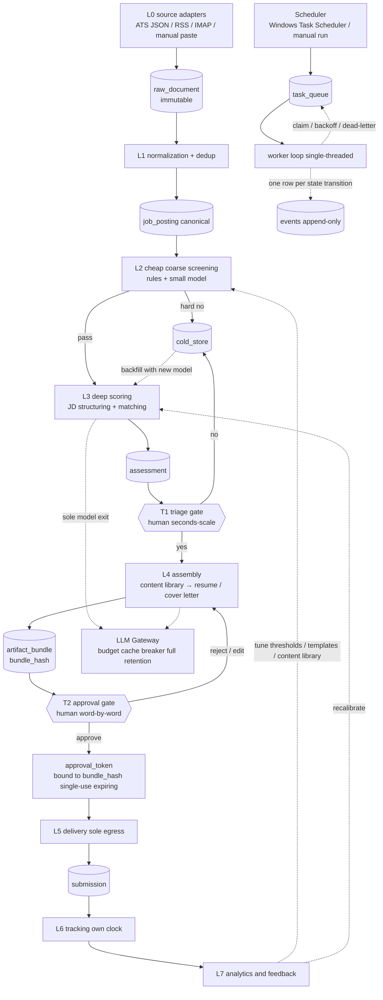

# System Architecture

This document defines the overall architecture of the "AI-automated job search system". The derivation of the domain analogy is in [01-domain-mapping.md](./01-domain-mapping.md); entity and state-machine definitions are in [03-data-model.md](./03-data-model.md). This document covers only four things: **where things sit, how data flows, what to do when things break, and which designs are explicitly not done**. The algorithms and interfaces inside each layer are left to 04–09.

**Scale baseline (the one hard constraint running through this entire document)**: a single job seeker, 20–200 new job postings per day, 50–300 submissions in total per job search round. The system's entire lifetime of data fits into one laptop's memory. Any design decision justified by "scalability" is wrong here. There are only three real constraints: **the developer's time**, **money for the LLM**, and **the two hours per week the job seeker is willing to spend on review**. The third is the scarcest, and the one architecture diagrams most often ignore.

**Deployment target**: one personal computer (this project's actual development environment is Windows 11 + Python). That fact drives the choice of scheduler, browser automation, and file paths, each of which is called out below.

---

## 1. Differences from the original sketch (original thinking → why it changed → what it became)

The original layered sketch points in the right direction, but six things break down in engineering practice. Each one is spelled out; nothing is swapped silently.

| # | Original thinking | Why it changed | What it became |
|---|---|---|---|
| 1 | "Ingest job postings → parse the JD" is one step | Parsers and prompts will certainly be revised. If extraction and parsing are bound together, changing the parser means re-fetching; re-fetching hits source rate limits, and sources such as notification emails and recruiter emails **cannot be re-fetched at all** | Split into **L0 raw extraction** (`raw_document`, append-only, immutable) and **L1 normalization**. A new parser version can be re-run against old raw material at any time. Side-effect bonus: the raw material is the fixture source for regression tests |
| 2 | There is a single "manual review" point, placed after "generate customized content" | That puts expensive assembly (multiple LLM calls, PDF generation) before "decide whether to apply at all", burning money outright; and the cognitive load of the two human decisions differs by an order of magnitude: one is a seconds-scale Go/No-Go, the other is a minutes-scale word-by-word review. Mixing them in one queue fatigues the human, and a fatigued human phones in the second one | Split into a **T1 triage gate** (seconds-scale) and a **T2 approval gate** (word-by-word review). Assembly happens only between the two |
| 3 | Low-score "auto-elimination" is a terminal state | The scoring model will be revised. Eliminated samples are the only raw material for false kill analysis; delete them and you can never see what you missed | Changed to a **cold store, never deleted**, with a backfill channel kept so a new model version can go back and re-score |
| 4 | "Status tracking" is the last cell of the pipeline | Tracking is triggered by the outside world (replies, interview invitations), on a completely different clock from the main pipeline: the main pipeline runs a few times a day, tracking moves only when an event arrives, and a single item's cycle can run for months | Changed into a **concurrent loop**, not the tail of the pipeline. See the three-clock model in §2.3 and [08-delivery-tracking.md](./08-delivery-tracking.md) |
| 5 | No cross-cutting components | Without a unified LLM exit there is no complete prompt/cost retention, and the feedback loop in [09-analytics-feedback.md](./09-analytics-feedback.md) has no raw material to work from; there is also nowhere to uniformly enforce "which data may not leave the local machine" | Added three cross-cutting components: **LLM Gateway**, **Artifact Store**, **Secret Store** |
| 6 | "Do not fight the platform" is just a stated principle | A principle written in a document gets routed around by your own deadline-chasing self | Turned into a **structural constraint at the architecture layer**: the source registry carries an `access_mode` column, only sources with `manual_assisted` can trigger browser automation, and a human must be present. See §5.6 |

---

## 2. Architecture overview

### 2.1 Data-flow view

Solid lines are data flow; dashed lines are control flow and feedback. The human stands on the two diamond gates, and they **cannot be skipped**.



### 2.2 Process and deployment view

The data-flow diagram is a conceptual map, not a process table. In reality there are only three or four processes:

```
one personal computer
+----------------------------------------------------------------------------+
|  ai-career worker              (process 1, short-lived: exits when done)   |
|    woken by the scheduler every 1-4 hours; drains task_queue until empty   |
|                                                                            |
|  ai-career review              (process 2, interactive: opened by a human) |
|    T1 / T2 review UI (v0 is CLI + $EDITOR; v1 is a local web app)          |
|                                                                            |
|  browser-worker                (process 3, optional: only for delivery)    |
|    Playwright; heavy, crashes, needs a real browser profile                |
|                                                                            |
|  ollama / llama.cpp            (process 4, optional: local model backend)  |
+----------------------------------------------------------------------------+
        |                         |
   app.db (SQLite, WAL)     artifacts/<sha256[:2]>/<sha256>
        |                         |
        +-- backup = copy these two --+
```

Processes 1 and 2 write the same SQLite file at the same time; this is the only concurrent-write point, and its handling is in D3. A crash in process 3 must not take the main worker down with it, and this is the only process boundary whose cost is worth paying.

### 2.3 Three clocks

Treating the flow as a single pipeline is the biggest conceptual mistake. There are in fact three mutually unsynchronized clocks in the system, and the architecture must decouple them:

| Clock | Period | Driven by | Design consequence |
|---|---|---|---|
| **Machine clock** | one round every 1–4 hours | the scheduler | Everything is re-runnable, interruptible, and can catch up offline. If the laptop is off for three days, one catch-up run after boot is enough; there is no need to make up every missed schedule |
| **Human clock** | bursty: two hours on Sunday, untouched on weekdays | the job seeker's mood and calendar | Artifacts must be stable and reviewable offline; background tasks **must not** modify a bundle that is pending review. The review UI has to handle dozens of items in one sitting |
| **World clock** | hours to months, unpredictable | company HR, interviewers | Tracking is a resident concurrent loop, not the tail of the pipeline. A submission's lifetime is two orders of magnitude longer than one pipeline run |

"The human is not a station on the pipeline; the human is an interrupt." That sentence determines the UI investment order in §7.

---

## 3. Layer responsibilities, inputs, outputs, and failure modes

| Layer | Responsibility | Input | Output | Main failure mode | Failure handling |
|---|---|---|---|---|---|
| **L0 source adapters** | Fetch raw data, **interpret nothing** | HTTP / IMAP / manual | `raw_document` | Source schema changes; 429; expired IMAP credentials; **silent failure** (HTTP 200 with zero rows) | An independent circuit breaker per source. "N consecutive runs with zero rows" counts as an anomaly, not as normal — this is the most commonly ignored failure mode, precisely because it never throws an error |
| **L1 normalization + deduplication** | Extract fields, normalize company names/locations, build dedup clusters | `raw_document` | `job_posting` + `dedup_link` | False merge (two different job postings judged to be the same one); missed merge | Conservative merge thresholds, with the gray band handed to human confirmation; **merges must be reversible** (keep the link instead of deleting the original record) |
| **L2 cheap coarse screening** | Use rules and a small model to cut 70–90% (this ratio is a target, to be calibrated against real data) | `job_posting` | `triage_decision(auto)` | False kills of good opportunities (false negatives, and invisible ones) | A fixed proportion is sampled back into a human audit; cold store, never deleted |
| **L3 deep scoring** | Structure the JD, compare it against the profile, produce a score and a rationale | `job_posting` + `profile@version` | `assessment` | The LLM hallucinates requirements that are not in the JD; swapping the model or the prompt causes score calibration drift | The rationale must cite a span of the JD's original text; `template_version` and `model_id` are bound to the assessment, and **scores from different versions cannot be compared directly** (reports must force grouping) |
| **L4 assembly** | Select passages from the content library, rewrite the tone, generate the files | `assessment` + `content_library@version` | `artifact_bundle` | **Fabricated facts** (violates product principle 2); broken formatting; over the page limit | Claim-level provenance: every passage must point back to a `content_block.id`, and anything without a source is marked red and **blocks approval**. See [06-content-assembly.md](./06-content-assembly.md) |
| **L5 delivery** | The sole egress for outbound side effects | `bundle` + `approval_token` | `submission` + `delivery_attempt` | Duplicate submissions; wrong recipient; **uncertainty about whether the send succeeded** | Record the intent before executing; ambiguous outcomes are never retried automatically (see §5.1) |
| **L6 tracking** | Match the outside world's responses back to a submission | IMAP / manual | `status_event` | Replies that do not match (different domain, no thread id); misread rejection letters | Low-confidence matches go to the manual queue; automation may only advance to a "suspected" state, and terminal states are confirmed by a human |
| **L7 analytics** | Turn results into the next round's parameters | everything | Reports + threshold recommendations | Too few samples causing overfitting; survivorship bias (you only see the ones that went out) | Reports must state n and confidence intervals; recommendations are **never applied automatically** — they always go through human adoption and leave an event behind |

---

## 4. Key architectural decisions and trade-offs

### D1: Scheduled batches + a queue table, not an event-driven message broker

**Decision**: the scheduler enqueues tasks periodically, the tasks live in SQLite's `task_queue` table, and a single worker loop claims them one at a time. No Kafka, no Redis, no Celery, no RabbitMQ.

| | Queue table + scheduler | Message broker (Kafka / Redis Streams) |
|---|---|---|
| Latency | minutes to hours | seconds |
| Operations | zero (it is just that `.db` file) | a process that has to stay alive |
| Inspectability | `sqlite3 app.db "select * from task_queue"` | needs dedicated tooling |
| Re-running historical tasks | `update status='pending'` | you have to deal with offsets / consumer groups |
| Fan-out and backpressure | none | yes |
| State after a crash | right there in the table, readable by eye | check consumer lag |

Rationale: this system can tolerate delays of hours. The only genuinely time-sensitive question is whether applying early raises the reply rate — a common claim in the industry, but one that **needs verification** (see §9); and even if it is true, a 1–4 hour polling interval is enough. The queue table's greatest value is not simplicity but that **a task is itself an auditable row**, natively in the same transaction as the `events` table.

**The concrete scheduler choice (Windows)**: prefer the operating system's Task Scheduler triggering `ai-career run` over writing your own resident process. The reason is that a laptop shuts down and sleeps, so liveness management for a resident process is wasted work; Task Scheduler has a "run a missed schedule after boot" option. The cost is that setup happens through a GUI or the `schtasks` command and cannot go into version control the way crontab can — mitigated by writing the registration command as a `setup-schedule.ps1` in the repo. Consider APScheduler when a cross-platform requirement actually appears.

**When to change this**: when a second user appears, or when latency under 5 minutes is required. Before that, bringing in a message broker is pure self-harm.

### D2: A modular monolith with exactly one process boundary

One Python package; modules interact only through repository interfaces and state-machine transitions. **The only process worth splitting out is browser automation** (Playwright): it is heavy, it crashes, it needs a real browser profile and possibly a display environment, and when it dies it must not take the main worker with it. The local model backend is already a separate process, so it does not count as an extra split.

Risk: the monolith rots into spaghetti. The mitigation is to treat **the state machine as the module seam** — layers may communicate only through state transitions and may not call each other's internal functions directly. That rule is checked in CI by a tool such as import-linter, not by self-discipline.

**Rejected in passing: do not use an autonomous agent loop.** The temptation is to make the whole pipeline an agent that "decides its own next step". Three reasons to refuse: (a) it is not reproducible — the same input run twice gives different results, so there is no way to write regression tests; (b) token cost is unpredictable, which conflicts with the budget gate in §5.4; (c) the audit trail becomes a stream of natural-language thinking instead of queryable state transitions. This system wants a deterministic pipeline with LLM calls at fixed positions, not an autonomous agent. The LLM appears in exactly three places: L2 coarse screening, L3 scoring, L4 rewriting.

### D3: SQLite + a content-addressed filesystem, not Postgres

- **Why SQLite**: local-first (product principle 5), zero operations, backup is copying one file plus one folder, FTS5 for full-text search, JSON1 for semi-structured JD fields.
- **Vector search**: the content library holds at most a few thousand `content_block`s, so brute-force cosine is enough (5,000 × 1536-dimensional float32 is about 30 MB, and a single scan takes milliseconds). `sqlite-vec` is usable but not necessary, and how conveniently its prebuilt Windows package installs **needs verification**. A standalone vector database service at this scale is pure over-engineering.
- **Cost: a single writer.** The worker (process 1) and the review UI (process 2) writing at the same time will collide on locks. Mitigation: enable WAL mode, set `busy_timeout` (5000ms suggested), and keep transactions extremely short. The more fundamental mitigation is a **division of write paths**: the worker writes the derived data of L0–L4, and the review UI writes only three things — `triage_decision`, `approval_token`, `events` — so the two sides almost never touch the same rows.
- **One hard rule**: **never call an LLM inside an open database transaction.** A single 30-second model call locks the whole writer out, and the review UI freezes outright. Fetch the data, close the transaction, make the call, then open a new transaction to write back.
- **Large objects stay out of the DB**: PDF / DOCX / raw HTML live at `artifacts/<sha256[:2]>/<sha256>`, and the DB stores only the hash. Backups are fast, the DB stays small, content addressing deduplicates for free, and "identical content necessarily means an identical path" is precisely the foundation of the approval mechanism in §6.
- **Cost: orphan files.** Content-addressed storage has no reference counting, so deleting a DB record does not delete the file. Accept that cost (a few hundred MB at most) and write a `gc --dry-run` command that lists unreferenced files, with **no automatic deletion**.
- **When to switch to Postgres**: multiple people sharing it, a need for concurrent writes, or putting the service in the cloud. The schema would barely have to change at that point, but that is not a v1 problem.

### D4: LLM calls are always asynchronous, but retention is non-negotiable

Every model call is a task in the queue, never hung off any request path. Reasons: retries, cost attribution, rate limits, provider outages, and the ability to swap in a very slow local model without freezing the UI.

**Exception**: "rewrite this paragraph" in the review UI needs streaming feedback, so a direct streaming call is allowed — but **an `llm_calls` record must be written whether it completes or is aborted** (the aborted one too, flagged in the `error` column), otherwise that raw material is lost forever.

**An honest objection**: for v0, synchronous calls are perfectly workable and async can be deferred. But **the `llm_calls` record cannot be deferred** — you can never recover data you did not write down at the time. If v0 gets to do exactly one thing "for the future", do this one.

### D5: The LLM Gateway is the sole model exit

A single chokepoint, responsible for: versioned prompt template IDs, data classification checks, token counting and cost computation, budget checks, circuit breaking, a cache keyed by `(template_version, model, input_hash)`, and persistence of the complete call record.

```sql
CREATE TABLE llm_calls (
  id            TEXT PRIMARY KEY,
  trace_id      TEXT NOT NULL,        -- one pipeline run
  subject_id    TEXT,                 -- job_posting / bundle id
  template_id   TEXT NOT NULL,
  template_ver  INTEGER NOT NULL,
  model         TEXT NOT NULL,
  params_json   TEXT NOT NULL,
  prompt_ref    TEXT NOT NULL,        -- sha256 in the Artifact Store
  response_ref  TEXT,
  prompt_tokens INTEGER, completion_tokens INTEGER,
  cost_usd      REAL, latency_ms INTEGER,
  cache_hit     INTEGER NOT NULL DEFAULT 0,
  error         TEXT,
  created_at    TEXT NOT NULL
);
```

This table is the raw-material store for [09-analytics-feedback.md](./09-analytics-feedback.md).

**Data classification (the enforcement point for product principle 5)**: the Gateway is the only place that knows what may leave the local machine. The suggested tiers:

| Tier | Content | May go to a cloud model |
|---|---|---|
| P0 | JD original text, company name, job title | Yes (it is public information anyway) |
| P1 | Achievement statements and skills from the resume content library | Yes, but previous employer names are masked by default (the user can turn this off) |
| P2 | Real name, phone number, address, national ID number, salary expectation, reference contact details | **No**. Send placeholders; backfill locally |

P2 backfill must happen after the LLM responds and before the artifact is written. The cost of this design is very real: the model never sees the real name, so the opening of a generated cover letter may read oddly and has to be handled at the template layer. The detailed list and the compliance rationale are in [10-risk-compliance.md](./10-risk-compliance.md).

### D6: Secrets go neither into the DB nor into the repo

IMAP passwords / app passwords, ATS API keys, model provider keys, and the HMAC key used for approvals all go into the operating system's credential manager (Windows Credential Manager, accessed through the `keyring` package); the DB stores only a string saying which keyring entry a given source uses.

The reason is not to stop hackers but to stop yourself: mailing yourself a backup of `app.db`, pushing the repo to GitHub, pasting a DB dump into a chat window — these are all things that will happen, and if the keys are not in there, they cannot leak. The cost is that headless environments (CI, containers) cannot reach the keyring and need an environment-variable fallback; that fallback path must be explicitly marked "test only" and must refuse to run under `AICAREER_LIVE=1`.

---

## 5. Cross-cutting concerns

### 5.1 Idempotency: L1–L4 are naturally idempotent, L5 relies on a nonce

Every step in L1–L4 writes its result as a derived row keyed by `(input_hash, template_version)`. Re-running the same input = cache hit = no LLM money spent and no new rows.

**L5 cannot possibly be idempotent**, because sending mail and submitting forms are external side effects. The approach is "record the intent, then execute, and never auto-retry an ambiguous outcome":

```
1. In one transaction: burn the approval_token nonce (UNIQUE violation = already used → reject)
                       write delivery_attempt(status = IN_FLIGHT)
2. Outside the transaction: perform the real send
3. Success → SENT + receipt
   Explicit failure (SMTP 5xx, the form reports a definite error) → FAILED, can be re-approved and re-sent
   Timeout / connection drop → UNKNOWN → manual queue, never auto-retried
```

After a crash and restart, any row still marked `IN_FLIGHT` is treated as `UNKNOWN`. **Better to miss one send and have a human fill it in than to send twice and burn a company.**

There is also a re-application guard: the same company plus the same role family may be applied to only once per 90 days (the number of days is configurable; this is the default), and an override requires a human-written reason and leaves an event behind.

### 5.2 Deduplication strategy (staged, each stage more expensive than the last)

```
Stage 0  source fingerprint   sha256(source_id, external_id)  same-source re-fetch hits here
Stage 1  URL normalization    strip utm_*, gh_src, ref, etc.  same posting, different link
Stage 2  content fingerprint  sha256(company_id | title_norm | loc_bucket | jd_simhash)
Stage 3  fuzzy matching       JD SimHash distance <= k  or  embedding cosine >= 0.93
Stage 4  human confirmation   candidate pairs in the gray band (0.88, 0.93)
```

0.93 / 0.88 are starting values, not truth; the right approach is to collect two weeks of data, hand-label 50 pairs, and only then fix the thresholds.

The dirtiest piece is company name normalization: `Google` / `Google LLC` / `Alphabet` / the name of a headhunting firm recruiting on their behalf. The pragmatic approach is to maintain a `company_alias` table and fill it in by hand over time — **do not expect this to be solved automatically**. This is destined to be the ugliest part of the whole system; accept it.

### 5.3 Retries and backoff

| Error class | Example | Handling |
|---|---|---|
| Transient | 429, 5xx, timeout | Exponential backoff + jitter, capped at 5 attempts, then into the dead-letter queue |
| Permanent | 401, schema mismatch, template rendering failure | Fail immediately, no retry, raise an alert |
| Ambiguous side effect | Delivery timeout | **No retry**, into the manual queue |

The dead-letter queue is not a black hole: `ai-career stats` must print the dead-letter count on its first line, otherwise it is a black hole.

### 5.4 Cost caps and circuit breaking

| Mechanism | Trigger | Action |
|---|---|---|
| Daily soft cap | 80% of the budget consumed | Warn, and stop low-priority lanes such as backfill |
| Daily hard cap | 100% reached | Keep only the interactive lane (regeneration while a human is reviewing) |
| Monthly kill switch | 100% reached | Stop everything; requires a manual `--override` |
| Per-call token cap | prompt exceeds N tokens | Truncate or chunk; do not blindly send an entire 40k-token JD |
| Provider circuit breaker | 5 consecutive 5xx / timeouts | Open the circuit for 10 minutes, probe half-open, and fall back to the local model on failure |

**How to estimate the order of magnitude of the cost** (no perishable unit prices quoted; a formula instead):

```
daily cost ≈ N_L2 × tok_L2 × price_small + N_L3 × tok_L3 × price_large
           + N_assemble × tok_L4 × price_large × rounds

baseline values: N_L2 = 200, N_L3 = 30 (after coarse screening), N_assemble = 5 (after T1)
tok_L3 is about 3k–8k input (one full JD + a profile summary)
rounds is about 2–4 (the human will ask for rewrites)
```

The key observation: **cost is not determined by the number of job postings but by the number that pass T1**. L4 assembly costs an order of magnitude more per item than L3 scoring. This is exactly why the gate order has to be "T1 first, then assembly" (§1, item 2). Real unit prices must come from the provider's pricing page at the time — **needs verification**.

The biggest cost lever is not in this table but in the **cheap-model-first cascade**: rules cut first, the small model cuts next, and only what survives reaches the large model. Details in [05-scoring-triage.md](./05-scoring-triage.md).

### 5.5 Observability and the audit trail

- **Structured logs**: JSON Lines, every line carrying a `trace_id` (one pipeline run) and a `subject_id`.
- **Do not bring in Prometheus / Grafana.** One `stats` CLI command plus a few SQL views is enough. A personal tool's observability requirement is "answer one question three months from now", not "alert in real time".
- **The `events` table is an append-only audit trail**. Hard rule: **any UPDATE to a state column must happen in the same transaction as the INSERT of the corresponding event**. Funnel this through a single `transition()` function, or enforce it with a SQLite trigger. An event records `actor` (human / system / which model version), `from_state`, `to_state`, `reason`, `payload_hash`.
- The practical value of this rule: three months from now you will want to know "why was this resume written this way" and "which model version produced this score", and the answer has to be queryable from the data rather than recalled from memory.

### 5.6 Structural enforcement of "do not fight the platform"

Principle 3 cannot rest on self-discipline alone. The approach is to give every source an `access_mode` in the registry and have the code dispatch on it:

| `access_mode` | Meaning | Permitted actions |
|---|---|---|
| `api` | An official public or licensed API | Scheduled polling, obeying the documented rate limit |
| `feed` | A **public read-only endpoint** that can be polled on a schedule: RSS / Atom / **sitemap** / a single-page HTTP GET | Scheduled polling, and it **must** use conditional requests (`If-Modified-Since` / `If-None-Match`) |
| `email` | Subscribed notification emails, recruiter emails | IMAP reads of your own mailbox |
| `manual_paste` | The human copies and pastes it themselves | No automation |
| `manual_assisted` | The human has a browser open and the tool helps fill the form | **L5 delivery only**, with a human present and running in the foreground |

> **Ruled (A1)**: **no new enum values are added** to `access_mode`. Sitemaps and single-page GETs both fall under `feed`, because their permitted actions are exactly the same as RSS's; the format difference is carried by the `'sitemap'` value of `source.kind`. See [17-decisions.md](./17-decisions.md#a1--sitemap-keeps-access_mode--feed).

The code-level constraint: **browser automation may only ever happen inside the `browser/` package** (see §6 and ruling A2), and the interactive capability of `browser/assisted.py` is open only to `manual_assisted` sources; no `access_mode` permits solving CAPTCHAs automatically, spoofing the User-Agent, or bypassing a login wall. When you hit a platform reachable only by scraping, the correct answer is that **that platform is left to the human to handle manually**, not that you find a way around it. The actual ToS text for each platform **needs verification**; see [10-risk-compliance.md](./10-risk-compliance.md).

---

## 6. Why the approval gate must be an architectural chokepoint, not a button in the UI

### The problem

If approval is nothing more than `applications.approved = true`, then any code path can set it to true: a bug, a batch fix-up script, an overzealous re-run command. Worse still is **TOCTOU (time-of-check to time-of-use)** — the human approved cover letter v3, but by the time it is sent a background task has regenerated the file into v4, and that boolean column knows nothing about it. This destroys product principle 1 outright.

### The design: bind approval to the bytes that are about to be sent

```
 assembly --> artifact_bundle (files land in the Artifact Store, content-addressed)
              |
              |  bundle_hash = sha256(canonical_json({
              |      files:  [(role, sha256), ...],
              |      channel, recipient,
              |      jd_snapshot_hash, profile_version, template_versions
              |  }))
              v
 review UI --> human approves --> approval_token {
                              bundle_hash, approver, issued_at,
                              expires_at, scope{channel, recipient},
                              nonce, hmac
                            }
                                  |   HMAC key is in the OS credential manager, not in the DB
                                  v
 delivery --> "recompute" bundle_hash from the bytes about to be sent
              +- mismatch --> reject + write an event + into the manual queue
              +- match    --> burn the nonce (same transaction) --> really send
```

72 hours is the suggested `expires_at`. The reason is not security but semantics: approval means "I just read this content and judged it right for this posting", and a week later that judgment is no longer fresh (the JD may have changed, your own thinking may have changed). Too short a window breaks the rhythm of reviewing a batch on Sunday and sending on Monday, so do not set it to 1 hour.

```python
# deliver/gate.py — the only module in the whole system allowed to import smtplib
# Note: playwright is now owned by the browser/ package and is no longer imported here (ruling A2)
def deliver(bundle: ArtifactBundle, token: ApprovalToken) -> DeliveryResult:
    if os.environ.get("AICAREER_LIVE") != "1" or KILL_SWITCH_FILE.exists():
        return DeliveryResult.dry_run(bundle)          # dry-run is the default

    actual = bundle_hash(bundle)                       # recomputed from the bytes about to be sent
    verify_hmac(token, key=keyring.get("approval_hmac"))
    require(token.bundle_hash == actual)               # the TOCTOU defense
    require(token.scope.channel == bundle.channel)
    require(token.scope.recipient == bundle.recipient)
    require(token.expires_at > now())

    with db.transaction():
        burn_nonce(token.nonce)                        # single use, guaranteed by UNIQUE
        attempt = record_intent(token, actual)         # IN_FLIGHT
    # the real send runs outside the transaction; result write-back in 5.1
```

### What each of the three mechanisms blocks

| Mechanism | What it blocks | Is it cheap? |
|---|---|---|
| **Content hash binding** | "approve v3, send v4". Regenerating any content automatically invalidates the token | Extremely cheap, and **must never be skipped** |
| **Single-use nonce** | Duplicate submissions caused by re-running the worker | One UNIQUE index |
| **HMAC signature** | Code that only has DB write access forging an approval | Requires key management |

### An honest objection

For a single-person local tool, **the HMAC is partly theater**. The threat model is not a remote attacker but "me at two in the morning, running a script I wrote badly". If something has to go, cut the HMAC and keep these three: the content hash, the single-use nonce, and the sole-egress module — what actually solves TOCTOU is the hash, not the signature.

Another undecided trade-off: should `bundle_hash` include `jd_snapshot_hash`? If it does, the company fixing a single typo in the JD invalidates the approval and forces a re-review, which is going to be annoying; if it does not, then after a substantive JD revision you are still sending content customized for the old version. The inclination is to include it, but only the JD's **structured fields** (job title, requirements, location), not the full text. Whether that compromise is stable enough **needs verification** — the method is to run for two weeks, record the actual frequency of changes to the JD's structured fields, and then decide.

The sole egress has to be enforced by tooling: an import-linter rule forbids any module other than `deliver/gate.py` from importing `smtplib`, and CI checks it. Human self-discipline alone will not do.

> **Ruled (A2)**: the `playwright` boundary is **handled separately** from `smtplib`. It no longer belongs to `gate.py` but is consolidated into a `browser/` package containing three submodules that **may not import one another** — `render.py` (`file://` only), `capture.py` (read-only GET only, no form filling or clicking), and `assisted.py` (human present, foreground). The reason is that the original single-module rule left JD snapshot evidence with no legitimate home. **The cost is weaker static enforcement**: one contract becomes four, and "who may touch the browser" goes from a binary question to a table. The full text of the four import-linter contracts is in [17-decisions.md](./17-decisions.md#a2--a-browser-package-with-three-submodules-that-cannot-import-each-other).
>
> **Consequential correction**: this document and `14`/`16` originally all wrote `delivery/`, but the actual directory name is `src/aicareer/deliver/` (see [11-tech-stack-roadmap.md](./11-tech-stack-roadmap.md) §16). **import-linter contracts are string comparisons, so a rule with the wrong path passes silently** — this must be fixed.

---

## 7. Pain points: where this architecture will be over-engineered

**The diagram above is a conceptual map, not a package directory.** If you create 12 packages on day one, you will spend your job-hunting time refactoring.

### The genuinely correct v0

One SQLite file, one Python package of about six modules, one Typer CLI, files sitting on disk. No web UI — review means looking at the generated Markdown diff in `$EDITOR`. No `task_queue` table — a `status` column plus a `run` command. No HMAC — an `approved_bundle_hash` column plus a `send` function.

```
ai-career/
  db.py          # SQLite schema + transition()
  sources/       # one file per source, returns raw_document
  normalize.py
  score.py
  assemble.py
  gate.py        # the only place that can send
  cli.py
```

Mapped onto this document's layers: L0 in `sources/`, L1 in `normalize.py`, L2+L3 merged into `score.py`, L4 in `assemble.py`, L5 in `gate.py`, and L6+L7 are **manual** in v0 (read your own mailbox, count your own reply rate). This is not laziness, it is the correct order: before 20 submissions have gone out, the analytics layer has no data to analyze.

### Four things that cannot be skipped even in v0

1. **Raw extraction is immutable** — re-fetching is usually impossible, and what is lost cannot be recovered.
2. **Full retention of `llm_calls`** — you can never recover data you did not write down, and this is the only raw material for improving the scoring model.
3. **Approval bound to a content hash** — retrofitting it later means rewriting the entire delivery path.
4. **dry-run is the default** — the first real send must be a deliberate act (set an environment variable + pass a flag).

### Warning signs of over-engineering

Kafka / Redis / Celery; a microservice per layer; Kubernetes; a standalone vector database service; five containers in a Docker Compose file; an ML training platform built for 40 labeled samples; writing your own scheduler; a multi-tenancy abstraction; an autonomous agent loop; "let us build a plugin system first so it is easy to extend later".

The criterion is simple: **any abstraction that "will be needed later" but has no user today does not get built.** This project's user count is known and equals one.

### The risk in the other direction (more often ignored)

A pure CLI version makes the review step painful, and **a painful step is a step that gets skipped** — which breaks product principle 1 outright. If a T2 review requires switching between four terminal windows to get through one cover letter, you will start "glancing at it and hitting approve", and the system degrades into a spray-and-pray machine, violating principle 1 and principle 4 at once.

So the one place worth spending early UI effort is the review queue: keyboard-driven, batch-capable, diffs legible at a glance, one item per screen. This is the single spot in the entire project where UI quality directly determines output quality. See [07-review-gate.md](./07-review-gate.md).

### When this architecture should not be used at all

If one job search round means only 10–20 submissions, every target company comes through a referral, and each one is worth two hours of writing by hand — then this system's build cost will never pay itself back, and a spreadsheet for status tracking is all you need. This architecture's precondition is **a submission volume too large to keep in your head, where each one still needs customization** (the 50–300 range). Below that volume, the tool's value is negative.

---

## 8. Related Documents

| Topic | Document |
|---|---|
| Why the analogy is a bid/RFP response management system and a review queue | [01-domain-mapping.md](./01-domain-mapping.md) |
| Entities, fields, and state machines | [03-data-model.md](./03-data-model.md) |
| L0 / L1 per-source details and the `access_mode` list | [04-ingestion.md](./04-ingestion.md) |
| L2 / L3 scoring and triage | [05-scoring-triage.md](./05-scoring-triage.md) |
| L4 content library and claim provenance | [06-content-assembly.md](./06-content-assembly.md) |
| T1 / T2 review interfaces | [07-review-gate.md](./07-review-gate.md) |
| L5 / L6 delivery and tracking | [08-delivery-tracking.md](./08-delivery-tracking.md) |
| L7 metrics and feedback | [09-analytics-feedback.md](./09-analytics-feedback.md) |
| ToS, privacy, data classification, and ethics | [10-risk-compliance.md](./10-risk-compliance.md) |
| Language, libraries, and the phased roadmap | [11-tech-stack-roadmap.md](./11-tech-stack-roadmap.md) |
| Overview and index | [00-overview.md](./00-overview.md) |

---

## Open Verification Items

Every item below is an external fact that this document's reasoning depends on but that has not been confirmed first-hand. Verify each one before starting work, and write the results back into [04-ingestion.md](./04-ingestion.md) or [10-risk-compliance.md](./10-risk-compliance.md).

| # | Open verification item | How to verify |
|---|---|---|
| 1 | **Whether each ATS has a public job board endpoint that can be polled directly** (Greenhouse, Lever, Ashby, Workable, and so on), and whether ones like Workday and Taleo genuinely do not | Pick 3–5 target companies and use the browser developer tools to watch the XHR requests on their job pages; re-issue the same URL with `curl` with no authentication and no cookies, and confirm whether it still returns 200 and JSON. Record the actual URLs and response fields in `04-ingestion.md`; do not rely on a remembered endpoint format |
| 2 | **The actual ToS text on automated access for each platform**, especially LinkedIn, Indeed, and the ATS vendors | Read the site's Terms of Service and `robots.txt` directly, and copy the key passages verbatim (with date and URL) into `10-risk-compliance.md`. Any source you have doubts about is downgraded to `manual_paste` |
| 3 | **Whether "the earlier you submit, the higher the reply rate" is true** | This is a common claim in the industry, unverified by this project. Method: record the difference between `jd_first_seen_at` and `submitted_at` in your own `submission` data, and once more than 50 have accumulated, see whether the reply rate falls as the delay grows. Until there is data, do not shorten the polling interval for this reason |
| 4 | **The model's real unit prices and token usage** | The formula in §5.4 needs real unit prices. Method: run 20 real JDs through the full L3 + L4, read the measured `prompt_tokens` / `completion_tokens` values from the `llm_calls` table, and multiply by the price on the provider's pricing page at that moment |
| 5 | **How conveniently `sqlite-vec` (or an alternative) installs on Windows** | Try a `pip install` in a clean Windows Python environment and confirm whether a prebuilt wheel exists and whether Visual Studio Build Tools are required. If it does not go smoothly, just use brute-force cosine with numpy; it is not worth getting stuck on |
| 6 | **The actual behavior of Windows Task Scheduler's "run a missed schedule after boot"** | Register an hourly test task, let the machine sleep for two hours and then wake it, and check the history for whether it catches up once or twice. This determines whether the worker needs its own "only one run per round" guard |
| 7 | **The authentication method each mail provider requires for IMAP access** | Confirm whether the target mailbox (Gmail / Outlook / self-hosted) needs an app password, OAuth, or has basic authentication disabled. This determines what type of credential D6's Secret Store has to hold, and how often that credential expires |
| 8 | **Whether `bundle_hash` should include the structured fields of `jd_snapshot_hash`** | Run for two weeks, re-fetching the same batch of job postings daily and comparing how often the structured fields (job title, requirements, location) change. If the change rate is under 5% per month, include them; if companies tweak their JDs frequently, switch to updating the snapshot only at a human re-review |
| 9 | **Whether L2 coarse screening's "cut 70–90%" matches the real data distribution** | After collecting two weeks of job postings, hand-label 100 of them Go/No-Go and back out the rule layer's recall and cut rate. If the cut rate is far below 70%, the sources were picked too precisely (a good thing; L2 can be simplified); if recall is below 90%, the rules are too aggressive and must be loosened |
| 10 | **The job seeker's own actual tolerance for reviewing** | This is the most important verification and the most often skipped. Method: in the first week after v0 goes live, record the start and end time of every review session and how many items it handled. If a single T2 review takes more than 5 minutes, or a session cannot get through 10 items, then the "UI investment" described in §7 has to be pulled forward to v0.5 rather than v1 |
