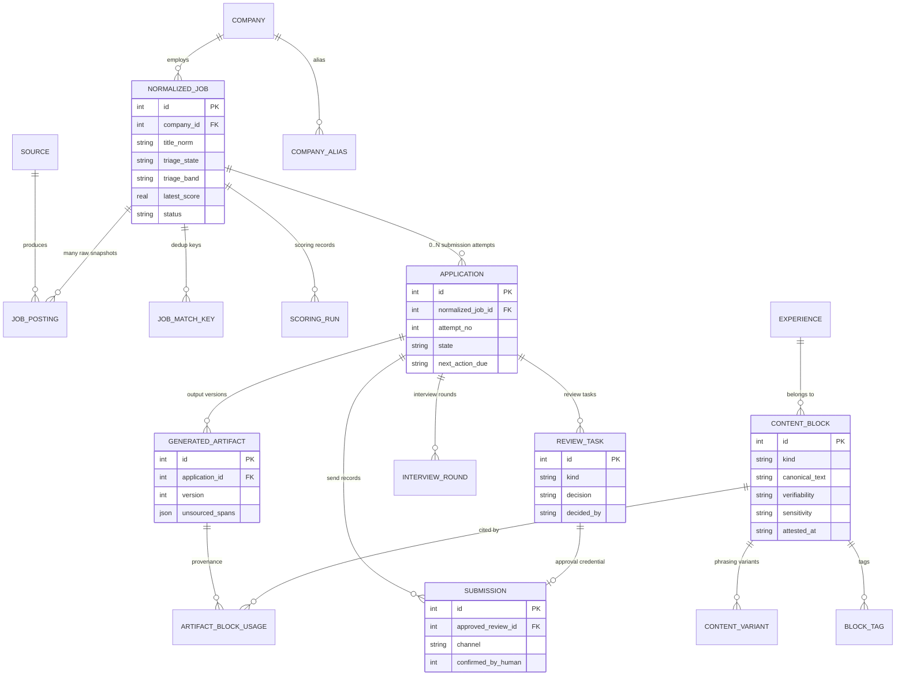
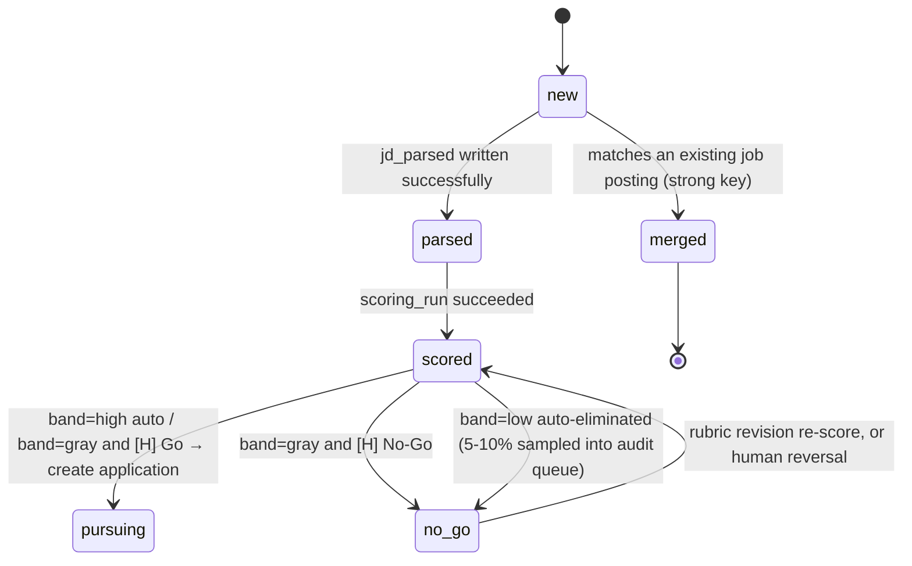
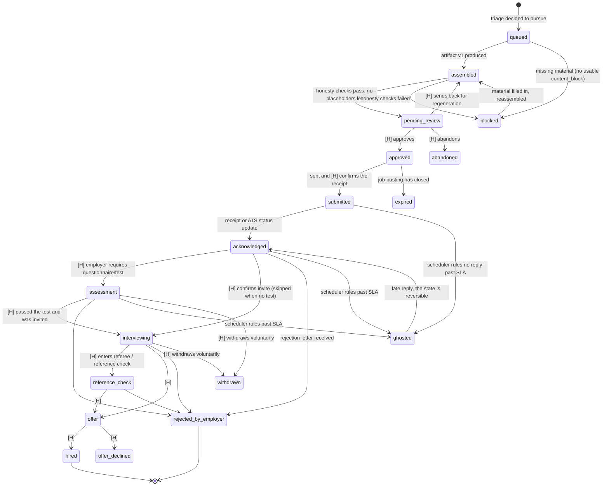

# Data Model and State Machines

> This document is part 3 of the [`00-overview.md`](./00-overview.md) series. Upstream is [`02-architecture.md`](./02-architecture.md) (component decomposition); downstream are the per-layer implementation documents starting with [`04-ingestion.md`](./04-ingestion.md). The schema and state machines defined here are the only formal contract between the layers: when any layer needs a new field or a new state, what changes is this document, not that layer.

---

## 0. Design Premise: Get the Orders of Magnitude Straight First

Annual volume estimates for an individual job seeker (not a SaaS). These numbers are **estimates, to be corrected against the first three months of measured values**, but the orders of magnitude are right:

| Entity | Annual volume | Basis of estimate | Impact |
|---|---|---|---|
| `job_posting` (raw snapshots) | 2,000 – 8,000 | Polling 10–30 sources daily, each averaging 1 new or content-changed entry | The only somewhat large table; the main cost is the full JD text (3–15 KB each) |
| `normalized_job` | 600 – 1,500 | After deduplication, with a cross-source merge ratio of about 3:1 | — |
| `application` | 80 – 200 | Under the "fewer but better" principle there should not be more (product principle 4) | The denominator of every rate in the analytics layer |
| `content_block` | 150 – 400 | A résumé covering 5 years has roughly 40–80 bullets, plus variant sources and Q&A answers | Slowest growing, highest value |
| `scoring_run` | 1,500 – 4,000 | Every normalized_job is scored at least once, and re-scored when the rubric is revised | — |
| `event` | 8,000 – 20,000 | Records only state transitions, human decisions, LLM calls, and outbound sends (see §6) | Keeping all of it is about 20–60 MB |

Conclusion: **a single SQLite file is enough, and will be enough for a long time.** No Postgres, no vector database, no message queue, no container orchestration. A full cosine similarity over 400 blocks × 768-dimensional float32 is a matrix multiply of 300,000 multiply-adds, under 0.1 ms on any modern CPU; the real latency is the single network round trip that ships the query string off to be embedded, and adopting pgvector would only enlarge the operational surface without saving the user one millisecond of waiting.

This judgement directly determines that all the DDL below is written in the SQLite dialect; the full rationale for the technology choice and the phasing plan are in [`11-tech-stack-roadmap.md`](./11-tech-stack-roadmap.md).

**Conventions**: times are always stored as UTC ISO-8601 strings (`2026-03-14T09:20:31.482Z`); SQLite has no native datetime type, and string ordering is chronological ordering. Booleans use `INTEGER` with `CHECK (x IN (0,1))`. JSON fields are stored as `TEXT` and read with `json_extract()`.

If a port to Postgres ever does become necessary, the only changes are: `INTEGER PRIMARY KEY` → `BIGSERIAL`, JSON's `TEXT` → `JSONB`, FTS5 → `tsvector`; the partial index syntax is identical (Postgres supports partial indexes too). That is one day of work, not worth paying for in advance.

---

## 0.5 Criteria for Creating a New Table (A10 ruling)

> **A new table is justified when the thing has a lifecycle of its own and is queried by primary key from more than one place. Both conditions must hold.**

The reason for setting this criterion is not aesthetics: `12` argues for restraint ("buys you nothing at a volume of 80–200 submissions"), `16` R-03-1 adds eight entities in one go, and `15` adds three more — the same document received revisions in two opposite styles with **no arbitration standard whatsoever**, so anyone wanting to add a table later could cite either one as precedent.

Applying this criterion retroactively to the entities already proposed:

| Entity | Verdict | Where it goes |
|---|---|---|
| `target_employer` | **Passes** | New table; an employer's lifecycle far outlasts any single application, and scoring, throttling, and analytics all query it |
| `application_question` | **Passes** | New table; see §3.x (A6 ruling) |
| `interview_story` | Fails | → `content_block(kind='story')` + a `reflection` field (A11) |
| `comp_research` | Fails | → a field group on `target_employer` |
| `role_class` | Fails | An enum value does not need a table |
| `job_flag` | Fails | Follows `12`'s argument for restraint |
| `block_note` | Fails | Same as above |

**A11's reasoning is worth recording on its own**: making `interview_story` a separate entity would **fork the provenance chain** of the honesty principle — résumé bullets go through `artifact_block_usage` back to `content_block`, interview stories take another route, and the factual-assertion check in [`07-review-gate.md`](./07-review-gate.md) §5.3 **only recognizes the former**.

**A12, consequentially**: `posting_kind` describes **what** a posting is (`job` / `talent_pool` / `evergreen`); `disposition` describes **how we decided to handle it** (`ok` / `blocked` / `flagged`). Remove the `'evergreen_pool'` value from `disposition` — otherwise one row can carry the self-contradictory combination `disposition='ok'` + `posting_kind='evergreen'`.

The full rulings are in [17-decisions.md](./17-decisions.md).

---

## 1. Differences from the Reference Architecture (original thinking → why it changed → what it became)

| # | Original sketch / common practice | Problem | What this document does |
|---|---|---|---|
| 1 | `Opportunity/Application` merged into one entity | "This job posting exists" is a fact about the world; "whether I apply, and how far I have got" is my relationship to it. Merged together, a re-application or a multi-channel submission has nowhere to live | Split into `normalized_job` (the fact) and `application` (the relationship), one-to-many, with a partial unique index guaranteeing only one in-flight row at a time |
| 2 | **A single state machine running from "discovered" all the way to "hired"** | This is the first draft's biggest hole: if `discovered / scored / triaged` are all `application` states, the year needs 600–1,500 application rows, which flatly contradicts the 80–200 in §0, and the analytics layer's reply-rate denominator is distorted immediately | **Split into two state machines**: the pre-triage lifecycle hangs on `normalized_job.triage_state`; an `application` is created only after the decision to apply, with `queued` as its opening state. See §4 |
| 3 | `rejected` as a state machine state | Semantic overload: "I gave up before applying", "I applied but dropped out midway", and "they rejected me" are three different things, and conflating them makes the rejection rate computed in [`09-analytics-feedback.md`](./09-analytics-feedback.md) meaningless | Split into four: `no_go` at the triage layer, and at the application layer `abandoned` (given up before sending), `withdrawn` (dropped out voluntarily after sending), and `rejected_by_employer` |
| 4 | Deduplication on one set of natural keys | The same posting has completely misaligned fields on LinkedIn, on the company site, and in a recruiter email; any single key either misses matches or produces false merges | A multi-key alias table plus strong/weak grading: strong keys merge automatically, weak keys only create a manual merge task |
| 5 | The first draft listed `content_hash` as a strong key | One company often pastes the same JD template into several reqs (different teams, different locations); the body text is word-for-word identical but these are **different job postings**. As a strong key it produces false merges | Demoted to weak; only an exact text collision across companies, that is, outside the same `company_id`, counts as a strong signal (that is almost certainly a repost) |
| 6 | `ghosted` as a state machine state | No event ever "triggers" being read and ignored; it is a function of time | Kept as a state, but written only by a scheduled job according to an SLA, and **reversible** (a late reply flips it back to `acknowledged`) |
| 7 | `triaged(high/gray/low)` as three states | The number of states explodes as evaluation facets are added | In the DB it is `triage_state='scored'` plus a `triage_band` field; the state diagram draws three branches only for readability |
| 8 | Multiple interview rounds not addressed | Giving first round, second round, and onsite each their own state makes the state machine unmanageable | `interviewing` is a single state; the rounds live in the `interview_round` child table |
| 9 | The first draft claimed `review_task` / `submission` / `generated_artifact` were core constraints but gave no DDL | "Human-in-the-loop cannot be skipped" is enforced by these three tables; not writing them out is the same as not designing them | §3.6 fills them in, together with the `BEFORE INSERT` trigger that actually blocks people |

---

## 2. Entity Relationships



Four structural points:

1. **`job_posting` is an append-only raw snapshot**, whose content is never UPDATEd. Re-fetch the same posting and find the content changed (a salary range filled in, say, or "5 years of experience required" quietly added to the JD) and you simply get one more snapshot. This makes "the JD was edited mid-flight" detectable, and lets historical data be re-run once the parsing logic is upgraded.
2. **Scoring hangs on `normalized_job`, not on `application`**. Scoring exists to decide whether to create an application at all, so in time it necessarily comes first.
3. **`submission.approved_review_id` is a `NOT NULL` foreign key, plus a `BEFORE INSERT` trigger**. This is product principle 1 realized at the database layer. What it does and does not block is stated honestly in §4.3.
4. **`artifact_block_usage` is the skeleton of the honesty principle**. Every span of text that goes out must point back to a `content_block`; spans that cannot are recorded in `generated_artifact.unsourced_spans` and are forcibly marked red in the review interface (see [`07-review-gate.md`](./07-review-gate.md)).

---

## 3. Schema

### 3.1 Runtime prerequisites (skip this and every constraint below is decoration)

```sql
PRAGMA foreign_keys = ON;      -- SQLite defaults to foreign key checks [OFF]; every connection must enable them
PRAGMA journal_mode = WAL;     -- reads and writes do not block each other (scheduled jobs write, review UI reads)
PRAGMA busy_timeout = 5000;
PRAGMA synchronous = NORMAL;   -- a sensible compromise under WAL
```

`PRAGMA foreign_keys` **is per-connection and defaults to OFF** (for backward compatibility). If one application-layer connection forgets to enable it, the `submission.approved_review_id` foreign key is never checked — every claim of "database-layer protection" in this document rests on that single line. So it must live in the one entry point of the DB connection factory, backed by a startup assertion that `PRAGMA foreign_keys` returns 1. Triggers, by contrast, are unaffected by this pragma and always run, which is exactly why §4.3 chooses a trigger as the last line of defense.

Migrations use numbered plain SQL files (`migrations/0001_init.sql`…) plus a `schema_version(version, applied_at, checksum)` table, not an ORM's auto-migrate. The reason: this project's data is irreplaceable (the content library is years of accumulation), and most auto-migrate implementations handle a column rename by DROPping and then ADDing. Before every migration, automatically `VACUUM INTO 'backups/pre-0007.db'`; local disk is cheap enough that skipping that step buys you nothing.

### 3.2 Sources and raw snapshots

```sql
CREATE TABLE source (
  id       TEXT PRIMARY KEY,               -- 'greenhouse', 'lever', 'email:linkedin-alert', 'manual'
  -- A1: add 'sitemap' (an authoritative job index explicitly allowed by robots.txt and carrying <lastmod>; TSMC is one)
  kind     TEXT NOT NULL CHECK (kind IN ('ats_api','rss','sitemap','email','recruiter','manual')),
  -- A1: access_mode describes "the permitted action", kind describes "the data format"; never conflate them.
  -- A sitemap's access_mode is 'feed', because its permitted action is exactly the same as RSS.
  access_mode TEXT NOT NULL CHECK (access_mode IN ('api','feed','email','manual_paste','manual_assisted')),
  requires_login INTEGER NOT NULL DEFAULT 0 CHECK (requires_login IN (0,1)),  -- B1: 1 always means manual, no exceptions
  tos_note TEXT,                           -- key ToS points and limits for this source, see 10-risk-compliance.md
  poll_min_interval_s INTEGER,             -- polite polling interval; do not fight the platform (product principle 3)
  enabled  INTEGER NOT NULL DEFAULT 1 CHECK (enabled IN (0,1))
);

CREATE TABLE job_posting (
  id                INTEGER PRIMARY KEY,
  source_id         TEXT NOT NULL REFERENCES source(id),
  source_job_id     TEXT,                  -- the source's own ID; may be NULL for email / recruiter mail
  fetched_at        TEXT NOT NULL,
  url               TEXT,
  url_canonical     TEXT,                  -- UTM and tracking params stripped, host and case normalized
  raw_payload       TEXT NOT NULL,         -- JSON / HTML / full email text, untouched
  content_hash      TEXT NOT NULL,         -- sha256(normalized JD body)
  normalized_job_id INTEGER REFERENCES normalized_job(id),
  link_method       TEXT CHECK (link_method IN ('ats_ref','url','content','fuzzy','human')),
  link_confidence   REAL
);

-- The key to idempotency: fold NULL into the empty string, otherwise SQLite treats every
-- NULL as distinct and email sources insert a new row on every re-fetch.
CREATE UNIQUE INDEX ux_posting_identity
  ON job_posting(source_id, COALESCE(source_job_id,''), content_hash);
CREATE INDEX ix_posting_hash     ON job_posting(content_hash);
CREATE INDEX ix_posting_njob     ON job_posting(normalized_job_id);
CREATE INDEX ix_posting_unlinked ON job_posting(fetched_at) WHERE normalized_job_id IS NULL;
```

With `ux_posting_identity` in place, a repeated fetch is idempotent under a plain `INSERT OR IGNORE`; if the content changed, a new snapshot is naturally added. `ix_posting_unlinked` is a partial index serving exactly one query — "which snapshots are not yet attached to a normalized_job" — which runs on every ingestion.

### 3.3 Deduplication: how to design the natural key

This is the part of this document that needs the most care. **The same job posting looks completely different in four places**:

| Source | Company name | Title | Location | Usable identifier |
|---|---|---|---|---|
| Official ATS API | `Acme Inc.` | `Senior Backend Engineer` | `Taipei, Taiwan` | tenant + job id (strong) |
| LinkedIn | `Acme` | `Senior Backend Engineer (Remote-friendly)` | `Greater Taipei Area` | the platform's own job id + outbound apply URL |
| Company website | `Acme 台灣分公司` | `資深後端工程師` | `台北市` | usually an embedded ATS iframe |
| Recruiter email | "a well-known fintech company" | `Backend Engineer, Senior` | `Taipei` | **nothing at all** |

So no single natural key exists. Use a multi-key alias table instead, with each key carrying a strong/weak grade:

```sql
CREATE TABLE job_match_key (
  key_type          TEXT NOT NULL CHECK (key_type IN
                      ('ats_ref','url_canonical','platform_ref','content_hash','fuzzy')),
  key_value         TEXT NOT NULL,
  normalized_job_id INTEGER NOT NULL REFERENCES normalized_job(id) ON DELETE CASCADE,
  strength          TEXT NOT NULL CHECK (strength IN ('strong','weak')),
  first_source_id   TEXT REFERENCES source(id),
  created_at        TEXT NOT NULL,
  PRIMARY KEY (key_type, key_value)
);
CREATE INDEX ix_matchkey_job ON job_match_key(normalized_job_id);
```

| key_type | Strength | Value form | Notes |
|---|---|---|---|
| `ats_ref` | strong | `greenhouse:acme:4123456` | Extract `(vendor, tenant, job_id)` from the URL or the API. **The single most critical key**: LinkedIn's outbound apply button and the company site's embedded iframe in most cases ultimately point at the same ATS URL (**needs verification**, see the end of this document) |
| `url_canonical` | strong | The full URL with params stripped | Fallback for when `ats_ref` cannot be extracted |
| `platform_ref` | strong | `linkedin:3912345678` | Strong only within the same platform; meaningless across platforms |
| `content_hash` | weak | sha256 of the JD body | A word-for-word repost (recruiters often copy the JD straight across). **But JD templates within one company collide with each other**, so it is demoted to a weak key |
| `fuzzy` | weak | `sha1(company_norm \| title_norm \| location_bucket)` | Normalization: lowercase, strip `Inc./Ltd./股份有限公司`, strip parentheses and req numbers from the title, collapse the location into a bucket (`TW-TPE` / `REMOTE-APAC`) |

The merge algorithm:

```python
keys = extract_all_keys(posting)          # see 04-ingestion.md
hits = [lookup(job_match_key, k) for k in keys]
strong = {h.normalized_job_id for h in hits if h.strength == 'strong'}

if len(strong) == 1:
    attach(posting, strong.pop()); backfill_missing_keys()     # auto-merge
elif len(strong) > 1:
    open_review_task('merge_conflict', candidates=strong)      # strong keys fight → hand to the human
elif weak_hits or simhash_hamming(posting, cand) <= 3:
    open_review_task('merge_conflict', diff=jd_diff(...))      # weak key → propose only
else:
    create_normalized_job(posting)
```

Similarity uses a threshold of **Hamming distance ≤ 3 on a 64-bit SimHash** (not "cosine > 0.9", a formulation that means nothing for SimHash). This threshold is a starting value and needs calibrating by hand-labeling your own first 200 records.

**Weak keys never auto-merge.** A false merge costs far more than a duplicate: two identically titled postings from different teams collapsed into one means silently throwing away an opportunity, and nothing anywhere will tell you. A duplicate costs one extra reading of a JD.

Another distinction that gets confused constantly: **"the same job posting" is not "the same submission channel"**. A recruiter referral and a direct application on the company site are the same `normalized_job`, but if both go out, the company sees duplicate résumés and the recruiter side gets a placement-fee dispute. The fix is not "don't merge" — that pollutes deduplication — but to merge and then have `ux_submission_channel` and the delivery layer's guard intercept it (see [`08-delivery-tracking.md`](./08-delivery-tracking.md)).

### 3.4 Companies and normalized jobs

```sql
CREATE TABLE company (
  id             INTEGER PRIMARY KEY,
  canonical_name TEXT NOT NULL,
  domain         TEXT UNIQUE,
  ats_vendor     TEXT,           -- 'greenhouse' | 'lever' | 'ashby' | 'workday' | NULL
  ats_tenant     TEXT,
  blocklist      INTEGER NOT NULL DEFAULT 0 CHECK (blocklist IN (0,1)),
  meta           TEXT,           -- JSON: size, industry, my private notes, reason for blocking
  created_at     TEXT NOT NULL
);

CREATE TABLE company_alias (
  alias_norm TEXT PRIMARY KEY,   -- lowercase, suffix stripped, whitespace stripped
  company_id INTEGER NOT NULL REFERENCES company(id) ON DELETE CASCADE
);

CREATE TABLE normalized_job (
  id              INTEGER PRIMARY KEY,
  company_id      INTEGER REFERENCES company(id),   -- may be NULL for a recruiter email
  company_hint    TEXT,                             -- keeps the original, e.g. "a well-known fintech company"
  title           TEXT NOT NULL,
  title_norm      TEXT NOT NULL,
  seniority       TEXT,
  location_text   TEXT,
  location_bucket TEXT,
  remote_mode     TEXT CHECK (remote_mode IN ('onsite','hybrid','remote','unknown')),
  salary_min      INTEGER, salary_max INTEGER,
  salary_currency TEXT,    salary_period TEXT,
  jd_text         TEXT,
  jd_parsed       TEXT,                             -- JSON, schema in 05-scoring-triage.md
  jd_parser_version TEXT,
  posted_at       TEXT,
  closes_at_date  TEXT,                             -- often a date with no timezone, hence the _date suffix
  first_seen_at   TEXT NOT NULL,
  last_seen_at    TEXT NOT NULL,
  status          TEXT NOT NULL DEFAULT 'open'
                    CHECK (status IN ('open','closed','unknown')),
  -- triage lifecycle (see §4.1)
  triage_state    TEXT NOT NULL DEFAULT 'new'
                    CHECK (triage_state IN ('new','parsed','scored','pursuing','no_go','merged')),
  triage_band     TEXT CHECK (triage_band IN ('high','gray','low')),
  latest_score    REAL,
  latest_rubric   TEXT,
  no_go_reason    TEXT,
  merged_into_id  INTEGER REFERENCES normalized_job(id),
  simhash         TEXT
);
CREATE INDEX ix_njob_company_title ON normalized_job(company_id, title_norm);
CREATE INDEX ix_njob_open   ON normalized_job(last_seen_at) WHERE status = 'open';
CREATE INDEX ix_njob_triage ON normalized_job(triage_state, latest_score DESC);
```

`last_seen_at` is the reliable basis for judging whether a posting is still open: absent from N consecutive polls (N=3 recommended, so a single failed fetch does not cause a misjudgement) → `status='closed'`. This beats trusting `closes_at_date`, because most ATSs simply never fill in a closing date; and `closes_at_date` frequently carries a date with no timezone, so comparing it directly is off by up to a day.

### 3.5 Scoring

```sql
CREATE TABLE scoring_run (
  id                INTEGER PRIMARY KEY,
  normalized_job_id INTEGER NOT NULL REFERENCES normalized_job(id) ON DELETE CASCADE,
  rubric_version    TEXT NOT NULL,      -- the rubric itself must be versioned
  model_id          TEXT NOT NULL,      -- full version string; never just 'gpt' or 'claude'
  prompt_hash       TEXT NOT NULL,
  score             REAL NOT NULL,
  band              TEXT NOT NULL CHECK (band IN ('high','gray','low')),
  breakdown         TEXT NOT NULL,      -- JSON: per-facet scores + rationale + offsets of cited JD spans
  raw_response      TEXT,               -- nulled by a vacuum job after 30 days, leaving only the hash
  raw_response_hash TEXT,
  cost_usd          REAL, latency_ms INTEGER,
  created_at        TEXT NOT NULL,
  UNIQUE (normalized_job_id, rubric_version, prompt_hash)
);
CREATE INDEX ix_scoring_job ON scoring_run(normalized_job_id, created_at DESC);
```

`rubric_version` is not optional. Every time the rubric changes, historical scores become incomparable data; without this field, every trend chart in [`09-analytics-feedback.md`](./09-analytics-feedback.md) is fake. The `UNIQUE` constraint incidentally turns "re-score the same JD with the same rubric" into a no-op, which saves money.

### 3.6 Application, review, artifacts, delivery

```sql
CREATE TABLE application (
  id                INTEGER PRIMARY KEY,
  normalized_job_id INTEGER NOT NULL REFERENCES normalized_job(id),
  attempt_no        INTEGER NOT NULL DEFAULT 1,     -- re-applying six months later is attempt 2
  state             TEXT NOT NULL,
  decided_by        TEXT NOT NULL,                  -- 'auto:band_high' | 'human:me'
  priority          REAL,                           -- for queueing: score × timeliness × scarcity
  state_entered_at  TEXT NOT NULL,
  next_action_due   TEXT,                           -- drives the ghosted determination and follow-up reminders
  last_actor        TEXT,                           -- used by the audit trigger
  closed_reason     TEXT,
  notes             TEXT,
  created_at        TEXT NOT NULL,
  updated_at        TEXT NOT NULL,
  UNIQUE (normalized_job_id, attempt_no)
);

-- only one in-flight application per job posting at any time
CREATE UNIQUE INDEX ux_app_active ON application(normalized_job_id)
  WHERE state NOT IN ('abandoned','rejected_by_employer','withdrawn',
                      'expired','offer_declined','hired');

CREATE INDEX ix_app_queue ON application(state, priority DESC);
CREATE INDEX ix_app_due   ON application(next_action_due) WHERE next_action_due IS NOT NULL;

CREATE TABLE generated_artifact (
  id              INTEGER PRIMARY KEY,
  application_id  INTEGER NOT NULL REFERENCES application(id) ON DELETE CASCADE,
  kind            TEXT NOT NULL CHECK (kind IN
                    ('resume','cover_letter','form_answers','outreach_msg')),
  version         INTEGER NOT NULL,
  lang            TEXT NOT NULL CHECK (lang IN ('zh-TW','en')),
  body_md         TEXT NOT NULL,          -- provenance offsets are relative to this field
  render_path     TEXT,                   -- relative path of the produced pdf/docx
  generator       TEXT NOT NULL,          -- 'template' or a model_id
  prompt_hash     TEXT,
  unsourced_spans TEXT NOT NULL DEFAULT '[]',   -- JSON: [[start,end,reason],...]
  honesty_checks  TEXT,                   -- JSON: pass/fail for each automated check
  superseded_by   INTEGER REFERENCES generated_artifact(id),
  created_at      TEXT NOT NULL,
  UNIQUE (application_id, kind, version)
);

CREATE TABLE artifact_block_usage (
  artifact_id     INTEGER NOT NULL REFERENCES generated_artifact(id) ON DELETE CASCADE,
  span_start      INTEGER NOT NULL,
  span_end        INTEGER NOT NULL,
  block_id        INTEGER REFERENCES content_block(id),
  variant_id      INTEGER REFERENCES content_variant(id),
  edited_by_human INTEGER NOT NULL DEFAULT 0 CHECK (edited_by_human IN (0,1)),
  PRIMARY KEY (artifact_id, span_start)
);
CREATE INDEX ix_usage_block ON artifact_block_usage(block_id);

CREATE TABLE review_task (
  id                INTEGER PRIMARY KEY,
  kind              TEXT NOT NULL CHECK (kind IN
                      ('gray_triage','artifact_approval','merge_conflict',
                       'low_sample_audit','reply_classification')),
  normalized_job_id INTEGER REFERENCES normalized_job(id),
  application_id    INTEGER REFERENCES application(id),
  artifact_id       INTEGER REFERENCES generated_artifact(id),
  payload           TEXT,                 -- JSON: the context to show the reviewer (diff, rationale, citations)
  priority          REAL,
  created_at        TEXT NOT NULL,
  decided_at        TEXT,
  decision          TEXT CHECK (decision IN
                      ('approve','revise','reject','go','no_go','merge','keep_separate')),
  decided_by        TEXT,                 -- 'human:<id>' | 'system:<job>'
  decision_note     TEXT,
  dwell_ms          INTEGER,              -- dwell time; for rubber-stamping detection, see 07-review-gate.md
  CHECK (decided_at IS NULL OR decision IS NOT NULL)
);
CREATE INDEX ix_review_open ON review_task(kind, priority DESC) WHERE decided_at IS NULL;

CREATE TABLE submission (
  id                 INTEGER PRIMARY KEY,
  application_id     INTEGER NOT NULL REFERENCES application(id),
  approved_review_id INTEGER NOT NULL REFERENCES review_task(id),
  artifact_bundle    TEXT NOT NULL,       -- JSON: [artifact_id,...] the versions actually sent
  channel            TEXT NOT NULL CHECK (channel IN
                       ('ats_form','email','referral','recruiter','platform_apply','manual')),
  channel_meta       TEXT,                -- JSON; the fields differ completely per channel
  submitted_at       TEXT NOT NULL,
  confirmed_by_human INTEGER NOT NULL DEFAULT 0 CHECK (confirmed_by_human IN (0,1)),
  receipt            TEXT,                -- path to the receipt screenshot / message-id of the confirmation mail
  external_ref       TEXT
);
-- one application must never be sent twice through the same channel (duplicate-résumé defense)
CREATE UNIQUE INDEX ux_submission_channel ON submission(application_id, channel);

CREATE TABLE interview_round (
  id             INTEGER PRIMARY KEY,
  application_id INTEGER NOT NULL REFERENCES application(id) ON DELETE CASCADE,
  round_no       INTEGER NOT NULL,
  kind           TEXT,                    -- 'phone_screen'|'tech'|'onsite'|'hm'|'final'
  scheduled_at   TEXT, outcome TEXT, notes TEXT,
  UNIQUE (application_id, round_no)
);
```

---

## 4. Two-Layer State Machines

The first draft strung "discovered → scored → triaged → assembled → sent → outcome" into one `application` state machine. That does not survive contact with the volumes: 1,500 normalized_job rows a year turn into only 120 submissions, and if every job gets an application row, ninety percent of the `application` table is "never actually sent" and every rate's denominator is polluted. Hence two layers.

### 4.1 Layer one: `normalized_job.triage_state` (before triage)



The `no_go → scored` path back is deliberate: after a rubric version update, historical postings can be re-scored, and "I misread it at the time" is extremely common.

### 4.2 Layer two: `application.state` (after deciding to apply)



Four senses of "it is over", deliberately kept apart, because [`09-analytics-feedback.md`](./09-analytics-feedback.md) computes completely different metrics from them:

| State | Meaning | Role in the analytics layer |
|---|---|---|
| `no_go` (triage layer) | Screened out before applying | Denominator of triage precision |
| `abandoned` | Application created, given up before sending | Assembly-layer waste rate; a high number means the triage threshold is too loose |
| `withdrawn` | Sent, then withdrew voluntarily during interviews | Not counted in the rejection rate |
| `rejected_by_employer` | They rejected me | Numerator of the rejection rate |
| `ghosted` | No reply past SLA (presumed, reversible) | **Must never be aggregated with rejected**, see §7 |

### 4.3 Transitions: trigger, guard, and who may execute

| Transition | Trigger | Guard condition | Who may execute |
|---|---|---|---|
| `new → parsed` | ingestion completes | `jd_text` non-empty and parsing raised no exception | System |
| `parsed → scored` | scoring scheduler | the same `(rubric_version, prompt_hash)` has not been scored | System |
| `scored → pursuing` | band=high | company not on `blocklist`; no in-flight application for the same posting | System |
| `scored → pursuing/no_go` (gray) | the gray-band review task is decided | `review_task.kind='gray_triage'` has been decided | **Human only** |
| `scored → no_go` (low) | immediate | 5–10% sampled into a separate `low_sample_audit` task | System |
| `queued → assembled` | assembly scheduler | every cited block has `attested_at IS NOT NULL` and `sensitivity='public'` | System |
| `assembled → pending_review` | assembly completes | `unsourced_spans='[]'`; no template placeholders left; every `claim_delta` annotated | System |
| `pending_review → approved` | approval action | must produce `review_task(kind='artifact_approval', decision='approve', decided_by LIKE 'human:%')` | **Human only** |
| `approved → submitted` | send completes | a valid `submission` row exists with `confirmed_by_human=1` | **Human confirmation only** |
| `submitted → acknowledged` | parsed reply / ATS status | a low-confidence parse may only **propose**; writing requires a decided `reply_classification` task | System proposes + human confirms |
| `* → ghosted` | daily scheduler | `now > next_action_due`; SLA by channel (starting values: ATS 21 days, email 14 days, recruiter 7 days; calibrate against your own data) | System |
| `ghosted → acknowledged` | late reply | same as above, requires human confirmation | System proposes + human confirms |
| `interviewing / offer / hired` | the fact occurs | — | **Human only** |

**The database layer's last line of defense**:

```sql
CREATE TRIGGER trg_submission_requires_human_approval
BEFORE INSERT ON submission
WHEN NOT EXISTS (
  SELECT 1 FROM review_task r
   WHERE r.id = NEW.approved_review_id
     AND r.kind = 'artifact_approval'
     AND r.decision = 'approve'
     AND r.application_id = NEW.application_id
     AND r.decided_by LIKE 'human:%'
     AND r.decided_at IS NOT NULL
)
BEGIN
  SELECT RAISE(ABORT, 'submission requires a human-approved review_task for this application');
END;
```

**What this trigger does and does not block has to be spelled out.**

What it blocks: any code path that "skips the review UI and calls the send function directly" — including a refactor that accidentally routes around the application-layer check, a scheduled job firing by mistake, or a future version of yourself writing a "batch submission" script. It is not a one-line `if` that can be commented out, and triggers are unaffected by `PRAGMA foreign_keys`, so they always run.

What it does not block: somebody with DB write access — that is, the user themselves — running `INSERT INTO review_task (..., decision='approve', decided_by='human:me')` first and then sending. **This schema guards against accidents and oversights, not against the user cheating themselves.** No local database design can do the latter, and claiming otherwise is a lie. The real mechanism for countering rubber-stamping is behavioral — `review_task.dwell_ms`, sampling audits, and the interface design in [`07-review-gate.md`](./07-review-gate.md) — not constraints.

---

## 5. The Content Library (ContentBlock): The System's Real Asset

Job postings expire, models get swapped out, crawlers break; the only thing that accumulates value is the content library. Three design decisions:

### 5.1 Granularity: one achievement bullet

| Granularity | Problem |
|---|---|
| One project | Too coarse. Against a different JD you can only take or drop the whole block; you cannot shift where the emphasis falls |
| **One achievement bullet** | **Adopted.** It is the smallest narrative unit that can stand alone in a résumé, and also the natural unit of judgement when a human reads it over |
| One skill keyword | Too fine. Assembly comes out as keyword salad, and an individual keyword cannot carry evidence of its own |

### 5.2 Separating fact from phrasing

`content_block` stores the **fact**; `content_variant` stores the **phrasing**. Evidence hangs on the fact, and customization may only touch the phrasing — this is the one leverage point where the honesty principle can be machine-checked.

```sql
CREATE TABLE experience (              -- the single source of truth for tenure
  id INTEGER PRIMARY KEY,
  org TEXT NOT NULL, role_title TEXT NOT NULL,
  start_date TEXT NOT NULL, end_date TEXT,
  is_current INTEGER NOT NULL DEFAULT 0 CHECK (is_current IN (0,1))
);

CREATE TABLE content_block (
  id             INTEGER PRIMARY KEY,
  kind           TEXT NOT NULL CHECK (kind IN
                   ('achievement','role_summary','project','skill_claim',
                    'story','qa_answer','intro_hook')),
  experience_id  INTEGER REFERENCES experience(id),
  canonical_text TEXT NOT NULL,        -- neutral, unembellished statement of fact (never used verbatim in a résumé)
  period_start   TEXT, period_end TEXT,
  metric_value   REAL, metric_unit TEXT,
  metric_basis   TEXT,                 -- "how this 40% was computed" — an interview will always ask
  verifiability  TEXT NOT NULL CHECK (verifiability IN
                   ('documented','corroborated','self_reported')),
  evidence       TEXT,                 -- JSON: [{type,uri,note}]
  sensitivity    TEXT NOT NULL DEFAULT 'public'
                   CHECK (sensitivity IN ('public','nda','internal_only')),
  attested_at    TEXT,                 -- human confirmation that "this is true"; NULL forbids use in assembly
  retired_at     TEXT,
  created_at TEXT NOT NULL, updated_at TEXT NOT NULL
);
CREATE INDEX ix_block_usable ON content_block(kind)
  WHERE attested_at IS NOT NULL AND retired_at IS NULL AND sensitivity = 'public';

CREATE TABLE content_variant (
  id           INTEGER PRIMARY KEY,
  block_id     INTEGER NOT NULL REFERENCES content_block(id) ON DELETE CASCADE,
  lang         TEXT NOT NULL CHECK (lang IN ('zh-TW','en')),
  register     TEXT,                   -- 'resume_bullet' | 'cover_para' | 'oral'
  length_class TEXT CHECK (length_class IN ('short','medium','long')),
  text         TEXT NOT NULL,
  origin       TEXT NOT NULL CHECK (origin IN ('human','llm_draft','llm_approved')),
  claim_delta  TEXT,                   -- JSON: claims added/strengthened relative to canonical_text
  created_at   TEXT NOT NULL,
  UNIQUE (block_id, lang, register, length_class, text)
);

CREATE TABLE block_tag (
  block_id INTEGER NOT NULL REFERENCES content_block(id) ON DELETE CASCADE,
  tag TEXT NOT NULL, weight REAL NOT NULL DEFAULT 1.0,
  PRIMARY KEY (block_id, tag)
);
CREATE INDEX ix_tag_block ON block_tag(tag);

CREATE TABLE block_embedding (
  block_id INTEGER PRIMARY KEY REFERENCES content_block(id) ON DELETE CASCADE,
  model TEXT NOT NULL, dim INTEGER NOT NULL,
  vec BLOB NOT NULL                    -- float32 little-endian, length = dim*4
);

-- Deliberately the plainest possible FTS5 table (not external-content / contentless):
-- duplicating the text for 400 rows costs nothing and saves maintaining a sync trigger.
CREATE VIRTUAL TABLE block_fts USING fts5(block_id UNINDEXED, text, tags);
```

Four fields deserve particular explanation:

- **`attested_at`** — an LLM-generated candidate block defaults to NULL, and the timestamp is written only after a human confirms "I really did this, and this number really is what it says". Assembly-layer queries always carry `WHERE attested_at IS NOT NULL`. This turns the honesty principle into a SQL filter instead of an imperative sentence inside a prompt.
- **`claim_delta`** — the dishonesty most likely to creep in when a variant is rewritten is not invention out of thin air but **quiet escalation**: "participated in the migration" becomes "led the migration", "helped optimize" becomes "cut latency by 40%". This field records what the variant claims over and above the fact, so the reviewer only has to read the difference instead of the whole passage again. It is produced by the assembly layer's check step (method in [`06-content-assembly.md`](./06-content-assembly.md)); **this document is responsible only for guaranteeing that it has somewhere to live and that a non-empty value blocks `assembled → pending_review`**.
- **`sensitivity`** — content inside the scope of an NDA must not appear in an outbound document. This is a classification that will cause real damage, and only the person themselves knows it, so it must be a first-class field rather than something stuffed into JSON, and like `attested_at` it is a hard filter at the assembly layer.
- **`metric_basis`** — "how the 40% was computed". Without this field, the pretty number on the résumé turns into a trap in the interview room.

### 5.3 Retrieval

Three recall paths, then merge: exact tag match (fast, explainable) → FTS5 full text (covers synonyms) → embedding cosine (handles semantics). Computing cosine over all 400 blocks is on the order of 0.1 ms, so no vector index is needed; the bottleneck is the network round trip that ships the query off to be embedded. Details in [`06-content-assembly.md`](./06-content-assembly.md).

### 5.4 Performance statistics: store counts, not rates

> **Ruled (A5 / A6)**:
>
> - **A5**: the background-check stage is named **`reference_check`** (not `background_check`) — what gets checked is referees and credentials, and in Taiwan "background check" reads as a private-investigator credit check. Plus a standing rule: **any new state goes into §4.2 of this document first, and [08-delivery-tracking.md](./08-delivery-tracking.md) §5.1 is its projection**; 08 may not add state names of its own.
> - **A6**: add an **`application_question`** entity to carry questionnaire items (the employer's asset, which disappears with the posting), with `question_key` / `question_variants` hanging on it; answers remain `content_block`, and the type **keeps the existing `qa_answer` unrenamed** (a rename would touch the CHECK and the existing data); provenance runs through the existing `artifact_block_usage`. The reason is that questions and answers have different lifecycles: the question dies when the posting comes down, the answer gets reused for years.
>
> See [17-decisions.md](./17-decisions.md).

```sql
-- A6: questionnaire items become their own entity. The question belongs to the employer, the answer (content_block kind='qa_answer') belongs to me.
CREATE TABLE application_question (
  id              INTEGER PRIMARY KEY,
  job_id          INTEGER NOT NULL REFERENCES normalized_job(id),
  question_key    TEXT    NOT NULL,   -- stable key for aligning across postings, e.g. 'why_this_company'
  prompt_text     TEXT    NOT NULL,   -- the actual wording used by this posting
  required        INTEGER NOT NULL DEFAULT 1,
  max_length      INTEGER,
  first_seen_at   TEXT    NOT NULL,
  UNIQUE(job_id, question_key)
);
-- Phrasing variants of one question_key across postings fall out naturally as multiple rows
-- in the table above; the question_variants field proposed by 15 is unnecessary.
CREATE INDEX ix_aq_key ON application_question(question_key);
```

```sql
CREATE VIEW v_block_stats AS
SELECT b.id AS block_id,
       COUNT(DISTINCT CASE WHEN s.id IS NOT NULL THEN u.artifact_id END)  AS times_submitted,
       COUNT(DISTINCT u.artifact_id)                                      AS times_drafted,
       SUM(CASE WHEN u.edited_by_human = 1 THEN 1 ELSE 0 END)             AS times_edited,
       -- 'assessment' included: an employer demanding a test is itself a reply signal (A4 ruling; omit it and the reply rate is understated)
       COUNT(DISTINCT CASE WHEN a.state IN
             ('acknowledged','assessment','interviewing','offer','hired')
             THEN a.id END)                                               AS times_in_replied
FROM content_block b
LEFT JOIN artifact_block_usage u ON u.block_id = b.id
LEFT JOIN generated_artifact g   ON g.id = u.artifact_id
LEFT JOIN application a          ON a.id = g.application_id
LEFT JOIN submission s           ON s.application_id = a.id
                                AND json_extract(s.artifact_bundle,'$') LIKE '%' || g.id || '%'
GROUP BY b.id;
```

The denominator must be "what actually went out", not "what was ever generated" — drafts run to several versions, and using `times_drafted` for a reply rate understates it systematically. (The `LIKE` comparison above is an expedient; moving `artifact_bundle` to a join table would be cleaner. v1 uses JSON — see the promotion criterion in §7.1.)

**Rate fields are deliberately not stored.** At 120 submissions a year with 12 blocks per résumé, a single block's sample size runs from single digits to the low twenties; a computed "33% reply rate" is good for nothing except misleading yourself. Rates are always estimated with Beta shrinkage in the analytics layer, and the UI hides them outright when n < 20 (see [`09-analytics-feedback.md`](./09-analytics-feedback.md)).

The one signal usable immediately is `times_edited / times_drafted`: that is not job-search performance, it is "I have to rewrite this passage every single time", which is meaningful at any sample size — and the rewritten version should be written back as a new variant.

---

## 6. Event Sourcing vs Snapshots: The Trade-off

| Option | Upside | Cost | Verdict |
|---|---|---|---|
| A. Pure event sourcing | Fully replayable, retrospective debugging, time-travel queries | Every query needs a replay or a maintained projection; for a one-person project the maintenance cost far exceeds the return | Rejected |
| B. Snapshots only | Simplest | Cannot answer "why was this one rejected" or "where did last week's score come from"; the analytics layer is effectively dead | Rejected |
| C. **Mutable state tables + an append-only event log** | State tables for queries (simple), the event log for audit and analytics | The dual write can fall out of sync | **Adopted** |

The dual-write risk is eliminated with a trigger, so that writing the event cannot be forgotten:

```sql
CREATE TABLE event (
  id             INTEGER PRIMARY KEY,
  occurred_at    TEXT NOT NULL,
  actor          TEXT NOT NULL CHECK (actor IN ('system','llm','human','external')),
  verb           TEXT NOT NULL,
  entity_type    TEXT NOT NULL, entity_id INTEGER NOT NULL,
  from_state     TEXT, to_state TEXT,
  payload        TEXT,
  correlation_id TEXT
);
CREATE INDEX ix_event_entity ON event(entity_type, entity_id, occurred_at);
CREATE INDEX ix_event_time   ON event(occurred_at);

CREATE TRIGGER trg_app_state_audit
AFTER UPDATE OF state ON application
WHEN OLD.state IS NOT NEW.state
BEGIN
  INSERT INTO event(occurred_at, actor, verb, entity_type, entity_id, from_state, to_state)
  VALUES (strftime('%Y-%m-%dT%H:%M:%fZ','now'),
          CASE WHEN COALESCE(NEW.last_actor,'') LIKE 'human:%' THEN 'human' ELSE 'system' END,
          'state_changed', 'application', NEW.id, OLD.state, NEW.state);
END;

CREATE TRIGGER trg_app_create_audit
AFTER INSERT ON application
BEGIN
  INSERT INTO event(occurred_at, actor, verb, entity_type, entity_id, from_state, to_state)
  VALUES (strftime('%Y-%m-%dT%H:%M:%fZ','now'),
          CASE WHEN NEW.decided_by LIKE 'human:%' THEN 'human' ELSE 'system' END,
          'created', 'application', NEW.id, NULL, NEW.state);
END;
```

(The first draft missed the INSERT trigger, with the result that every application's first state never entered the audit trail.)

Supplementary rules:

- **The event table is never UPDATEd or DELETEd.** To correct something, append a compensating event with `verb='correction'`.
- **State tables can be rebuilt from the event log**, as a means of verification rather than a query path. Run the rebuild and compare once a week and dual-write holes get caught.
- **Retention tiers for LLM calls**: `model_id` + `prompt_hash` + the structured output are kept forever; the full `raw_response` is kept for 30 days and then nulled by a vacuum job. Full reproduction requires a pinned model version anyway, and cloud models do not guarantee reproducibility (**needs verification**: whether the provider in use offers a dated pinned version ID and commits to leaving it alone), so the marginal value of keeping the full text decays fast.
- **The `actor` field is the dividing line between the LLM and the human.** Any event with `to_state='approved'` and `actor != 'human'` is a serious bug, and there should be a daily scanning assertion for it.

For the human-facing "where is this right now" query, a view stitches the two layers of state together:

```sql
CREATE VIEW v_pipeline AS
SELECT nj.id AS job_id, c.canonical_name AS company, nj.title,
       nj.triage_state, nj.triage_band, nj.latest_score,
       a.id AS application_id, a.state AS app_state, a.next_action_due
FROM normalized_job nj
LEFT JOIN company c ON c.id = nj.company_id
LEFT JOIN application a ON a.normalized_job_id = nj.id
     AND a.state NOT IN ('abandoned','rejected_by_employer','withdrawn',
                         'expired','offer_declined','hired')
WHERE nj.triage_state <> 'merged';
```

---

## 7. Where This Design Will Hurt

### 7.1 The risk of freezing the schema too early

The biggest risk is not having too few fields, it is **guessing wrong about which fields need to be queried**. The criterion:

> Appears in `WHERE` / `ORDER BY` / `JOIN` / a state machine guard condition / an honesty check → first-class field. Everything else → JSON.

| JSON for now | Reason | When to promote |
|---|---|---|
| `job_posting.raw_payload` | Never queried, only replayed | Never |
| `normalized_job.jd_parsed` | The parse schema will go through at least 5 revisions | Once it stabilizes, promote `years_required` and `must_have_tech` |
| `scoring_run.breakdown` | The scoring facets will certainly change | Promote a facet once it becomes a fixed threshold |
| `content_block.evidence` | Evidence types are varied and sparse | Probably never needed |
| `submission.channel_meta` | The fields differ completely per channel | Never |
| `generated_artifact.unsourced_spans` | Read out as a whole bundle only during review | Promote if you want to count "which kinds of sentences most often have no source" |

SQLite's promotion path is nearly painless (generated column + index; **needs verification that the runtime's SQLite is ≥ 3.31**):

```sql
ALTER TABLE normalized_job ADD COLUMN years_required INTEGER
  GENERATED ALWAYS AS (json_extract(jd_parsed, '$.years_required')) VIRTUAL;
CREATE INDEX ix_njob_years ON normalized_job(years_required);
```

No migration backfill is needed; old data becomes queryable immediately. This is the hidden dividend of choosing SQLite.

**Conversely, these must never go into JSON**: `state`, `triage_state`, `triage_band`, `attested_at`, `sensitivity`, `approved_review_id`, `confirmed_by_human`. They are bound up with constraints, indexes, or the honesty principle, and putting them in JSON means giving up the database's protection.

### 7.2 The cost of two-layer state machines

Splitting into two layers solves the denominator pollution, but the cost is that **"where is this posting now" is no longer a single field**: any UI query has to join two tables (which is why `v_pipeline` exists), and the two layers can disagree — an application already `abandoned` while `normalized_job.triage_state` is still `pursuing`, for example. This consistency is **not** enforced with a trigger, because cross-table triggers in SQLite easily produce recursion and ordering problems that are painful to debug. A once-daily assertion scan is used instead:

```sql
SELECT nj.id FROM normalized_job nj
WHERE nj.triage_state = 'pursuing'
  AND NOT EXISTS (SELECT 1 FROM application a
                  WHERE a.normalized_job_id = nj.id
                    AND a.state NOT IN ('abandoned','rejected_by_employer','withdrawn',
                                        'expired','offer_declined','hired'));
```

This is an explicit trade of a check for simplicity. If this inconsistency turns out to show up every week, it is time to reconsider turning `triage_state` into a view derived from application.

### 7.3 Other places it will hurt

- **SQLite's foreign keys are off by default.** §3.1 already said this; it is said again here because it is the single point of dependency behind every "database-layer protection" claim in this document. One connection that forgets the pragma is enough to let `approved_review_id` point at a row that does not exist. The startup assertion is not optional.
- **Triggers guard against accidents, not cheating.** §4.3 already states this honestly. If the user wants to skip review, no local design blocks them, and none should pretend to.
- **Company normalization is a bottomless pit.** Parent and subsidiary, acquisitions, Taiwan branch vs global, renames, different companies with the same name. v1 explicitly **does not build** a company graph: `company_id` may be NULL, and aliases get added by hand through `company_alias`. Spending two weeks on entity resolution has essentially no effect on decision quality across 120 submissions a year.
- **Granularity has no right answer.** Cut too fine and the assembly reads like machine collage; cut too coarse and customization loses resolution. The escape hatch is mandatory: allow free-form editing directly in the review interface (`artifact_block_usage.edited_by_human=1`), then write the edit back afterwards as a new variant or a new block. **Without this escape hatch, the user bypasses the entire system and edits the docx directly, and the content library dies.**
- **`ghosted` is statistical poison.** It is an event fabricated out of a time threshold. Setting the threshold at 14 days or at 30 days directly changes the reply-rate number, and there is no objective standard. Every chart must be annotated with the SLA setting in force at the time, the state must always stay reversible, and it **must never be aggregated with `rejected_by_employer`**.
- **The event table will drown in noise.** Write an event for every poll and every parse and the year produces several hundred thousand rows, at which point reading the audit trail by hand is impossible. The rule: **only state transitions, human decisions, outbound sends, and LLM calls are written to `event`**; routine polling goes to an application-layer log file.
- **Deletion and forgetting.** Local-first lowers the leak risk but does not exempt "a company demands I delete their data" or "I want to forget an episode entirely". A hard delete breaks foreign keys and the audit chain. The compromise: `content_block` soft-deletes via `retired_at`, `job_posting.raw_payload` may be emptied while the shell and the hash are kept, and `event` is never deleted but its payload may be redacted. Also, this `.db` file is itself a highly sensitive personal-data file — disk encryption and backup encryption are discussed in [`10-risk-compliance.md`](./10-risk-compliance.md) and are out of scope here.
- **When this schema should not be used**: if the goal is "300 submissions in a week", every constraint in this design is an obstacle — `attested_at`, the human approval gate, weak keys not auto-merging, `ux_submission_channel`, all of it slows you down. That is a different product, and one that this system's product principle 4 explicitly opposes. This schema assumes "100–200 high-quality submissions a year"; if that assumption does not hold, do not use it.

---

## 8. What Comes Next

- The JSON schema for `jd_parsed` and the rubric definition → [`05-scoring-triage.md`](./05-scoring-triage.md)
- How each source yields `ats_ref`, and how the polling interval is decided → [`04-ingestion.md`](./04-ingestion.md)
- How `claim_delta` is computed and how `unsourced_spans` are marked → [`06-content-assembly.md`](./06-content-assembly.md)
- Ordering of the `review_task` queue, the batch interface, and countering rubber-stamping → [`07-review-gate.md`](./07-review-gate.md)
- Per-channel implementation of `submission.channel` and receipt confirmation → [`08-delivery-tracking.md`](./08-delivery-tracking.md)
- Metric definitions derived from the `event` table, and Beta shrinkage → [`09-analytics-feedback.md`](./09-analytics-feedback.md)
- The original reasoning behind the domain mapping → [`01-domain-mapping.md`](./01-domain-mapping.md)

---

## Open Verification Items

Below are external facts this document depends on but has **not verified first-hand**. Each should be confirmed before the first line of code is written, with the results written back into this document or [`04-ingestion.md`](./04-ingestion.md).

1. **Whether the outbound apply button on a LinkedIn job page reliably points at the underlying ATS URL** (the viability of `ats_ref` as the master key rests entirely on this).
   *How to verify*: take 20 postings by hand from companies known to use Greenhouse / Lever, inspect the final destination of the apply link in a browser, and count the share from which `(vendor, tenant, job_id)` can be extracted successfully. Below 70% and `url_canonical` has to become the master key.
2. **Whether Greenhouse / Lever / Ashby expose a public job board endpoint, whether it requires authorization, and whether the returned fields include a stable job id**. This document assumes `ats_ref` takes the form `greenhouse:acme:4123456`, which is only a guessed format.
   *How to verify*: check each vendor's developer documentation one by one, actually issue a request against a known tenant, and record the real field names into `source.tos_note`.
3. **Whether Workday has a pollable public interface**. This document assumes it does not, leaving only email notifications or manual work.
   *How to verify*: check the job pages of 2–3 companies using Workday for an RSS or JSON endpoint; if there is none, confirm whether their job notification emails are parseable.
4. **Each platform's ToS position on "storing the full JD text locally"**. Keeping the original text in `job_posting.raw_payload` is the foundation of the entire replay capability.
   *How to verify*: read each source's ToS clauses on scraping / caching / personal use and summarize them clause by clause into `source.tos_note`; any source in doubt goes straight to `enabled=0` and switches to email notifications. The related risk analysis is in [`10-risk-compliance.md`](./10-risk-compliance.md).
5. **The runtime's SQLite version and compile options**: generated columns need ≥ 3.31, partial indexes need ≥ 3.8.0, and FTS5 must be enabled at compile time (some distributions' bundled Python sqlite3 does not carry FTS5).
   *How to verify*: `python -c "import sqlite3;print(sqlite3.sqlite_version)"`, then run `CREATE VIRTUAL TABLE t USING fts5(x);` and see whether it errors. If FTS5 is unavailable, fall back to `LIKE` plus tag matching (400 rows handle that comfortably).
6. **Whether the chosen LLM provider offers a dated pinned model version ID and commits to not swapping that version in place**. This decides whether `model_id` + `prompt_hash` genuinely carries reproduction value.
   *How to verify*: read the provider's model versioning and deprecation policy documents; absent a commitment, annotate the retention tiers in §6 with "reproduction is approximate only".
7. **The starting SLA values for `ghosted`** (ATS 21 days / email 14 days / recruiter 7 days) are pure guesswork.
   *How to verify*: once the first 50 sends have accumulated, plot the distribution of "send to first response", take the 80th–90th percentile as the threshold, and annotate the chart with the value used.
8. **The SimHash Hamming distance ≤ 3 merge threshold**.
   *How to verify*: hand-label 200 JD pairs (same posting / different posting), sweep the precision / recall curve across distance 0–10, and pick the largest threshold where precision is close to 1.0 — better to miss a match than to make a false merge.
9. **The actual frequency of JD-template text collisions within one company** (this decides whether `content_hash` should be a weak key or a conditional strong key).
   *How to verify*: fetch all postings from one large company and count the share with identical `content_hash` but different job ids. If the share is close to 0, consider promoting it to a strong key to cut down on manual merge tasks.
