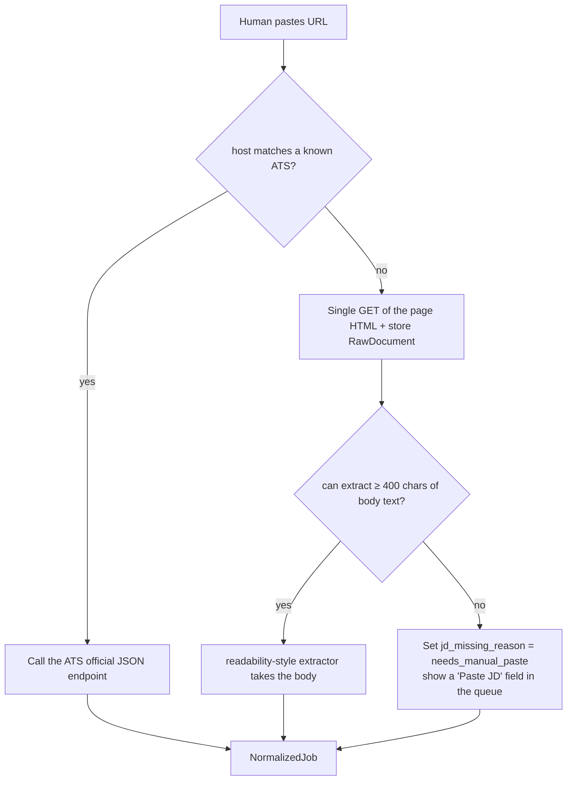

# Ingestion Layer: Job Posting Sources and Normalization

> Upstream is the layered design in [`02-architecture.md`](02-architecture.md); downstream it hands off to [`05-scoring-triage.md`](05-scoring-triage.md). Data structure definitions are in [`03-data-model.md`](03-data-model.md), compliance details in [`10-risk-compliance.md`](10-risk-compliance.md), and the phasing schedule in [`11-tech-stack-roadmap.md`](11-tech-stack-roadmap.md).

The ingestion layer has exactly one responsibility: **turn the heterogeneous, dirty, duplicated job-posting signals from the outside world into clean, deduplicable `NormalizedJob` records that carry their provenance**. It does not score, does not judge, does not decide. Mapped onto a bid/RFP response management system, this layer is "tender announcement monitoring" — gazettes, procurement portals, client notification emails, word of mouth from sales, all converged into one filterable list.

Every platform endpoint path, ToS clause, and description of platform behavior in this document is **speculation by default**; §12 lists a verification method for each one. Verify before you build; do not copy them as fact.

---

## 0. Differences from the Original Architecture (original thinking → why it changed → what it became)

| # | Original thinking | Why it changed | What it became |
|---|---|---|---|
| 1 | Ingestion layer = automated fetching (ATS API / alert emails / recruiter emails) | Automated sources are expensive to build and maintain, while the value of everything downstream (scoring, assembly, review) has not been validated yet. Dumping engineering effort into the mouth of the pipeline first is textbook premature optimization. | Add **Manual URL Drop** as a first-class source (§3). The only source Phase 0 must have, used to validate what is downstream. |
| 2 | Email alerts are just one entry on the source list | Email is the only source that is legally uncontroversial, whose coverage expands automatically as you subscribe to more, and that carries inbound recruiter outreach. Better value for effort than any single ATS integration. | Email is promoted to the Phase 1 backbone; ATS polling is demoted to "an enrichment mechanism for filling in the full JD". |
| 3 | "Deduplication" is one step | Deduplication covers three semantically unrelated situations (the same posting across sources, the same posting across time, a company relisting), and folding them into one function guarantees bugs. | Replaced with **Identity Resolution**: three layers — `JobIdentity` (company + role) / `Posting` (one listing) / `Observation` (one sighting) (§6). |
| 4 | Parse straight off the fetch | Parsers get written wrong and source schemas change. Throwing away the original payload means every parser fix requires re-hitting someone else's server. | Mandate an **immutable raw layer + replayable parsing**: `RawDocument` lands first, and the parser is a pure function (§9). |
| 5 | Start deduplication with SimHash + embeddings + weighted similarity | One person sees at most tens to hundreds of postings a day. Writing a weighted similarity model for that volume is obvious over-engineering, and the weights cannot be calibrated — the sample is far too small for you to measure any difference between 0.72 and 0.78. | **Phased deduplication**: Phase 0–1 uses only exact matching on `canonical_url` and `(company_key, title_core, country)`; the similarity model waits until "manual merges per week > 10" (§6.4). |
| 6 | `parse_confidence` / `remote_confidence` as 0–1 floats | No labeled data means no calibration; `0.63` is false precision, and it tempts downstream code into doing threshold arithmetic with it. | Replaced with a three-level enum `high / medium / low` plus named `warnings[]`. A confidence value has exactly one use: **whether to put it in front of a human** (§5). |

---

## 1. Pipeline Overview

```
  ┌───────────────────────────────────────────────────────────┐
  │  Source Adapters                                          │
  │   ├─ Manual Drop    (human pastes URL / full JD)    ← Ph.0 │
  │   ├─ Mail Ingestor  (dedicated mailbox IMAP/Gmail)  ← Ph.1 │
  │   ├─ ATS Poller     (Greenhouse / Lever ...)        ← Ph.2 │
  │   └─ Feed Poller    (RSS / Atom / public JSON)      ← Ph.3 │
  └───────────────────────────────────────────────────────────┘
                          │
                          ▼
     RawDocument ── immutable: raw bytes + HTTP headers + fetched_at
                          │                          (replayable)
                          ▼
     Parser (per-source, pure function)  ──► NormalizedJob (draft)
                          │
                          ▼
     Enricher ── company→ATS detection, full-JD fetch, language detection, comp parsing
                          │
                          ▼
     Identity Resolution ── JobIdentity ─1:N─► Posting ─1:N─► Observation
                          │
                          ▼
         Evaluation layer (05-scoring-triage.md)
```

Design invariants (violating any one of them is a bug, not a trade-off):

1. **Raw is immutable.** Any parsing error can be repaired by replay, without hitting the other side's server again (which is itself a form of politeness).
2. **Parsers have no side effects.** In: `RawDocument`. Out: `NormalizedJob | ParseError`. No network requests, no DB writes, no I/O of any kind other than calling an LLM.
3. **Failure must be loud.** When the parse success rate drops below threshold, disable that source and notify a human; do not silently produce garbage (§9.3).
4. **Missing means missing.** Any field that cannot be extracted is `null` plus a reason code. Estimating, backfilling, and generating are forbidden.

---

## 2. Source Inventory

The rating directions are unified: **feasibility / legality / data quality — higher is better; maintenance cost — lower is better.** All endpoint paths are speculative.

| Source | Feasibility | Legality | Data quality | Maintenance cost | Notes |
|---|---|---|---|---|---|
| **Manual URL Drop** | **High** | **High** | **High** | **Very low** | **The only Phase 0 source, see §3** |
| **Dedicated-mailbox email alerts** | **High** | **High** | **Medium (needs enrich)** | **Medium** | **Phase 1 backbone, see §4** |
| Direct recruiter emails | High | High | High (includes comp, strongly proactive) | Low | Low volume but the highest conversion rate; goes through the same mailbox |
| Greenhouse job board JSON | High | High | High (includes full JD) | Low | `boards-api.greenhouse.io/v1/boards/{token}/jobs?content=true` (needs verification) |
| Lever postings API | High | High | High | Low | `api.lever.co/v0/postings/{company}?mode=json` (needs verification) |
| Ashby posting API | High | High | High (may include comp) | Low | `api.ashbyhq.com/posting-api/job-board/{board}` (needs verification) |
| SmartRecruiters Posting API | High | High | High | Low | Reportedly a Posting API with public documentation (needs verification) |
| Recruitee offers | Medium-high | Medium-high | Medium-high | Low | `{company}.recruitee.com/api/offers/` (needs verification) |
| Workable | Medium | Medium | Medium-high | Medium | The shape of the public endpoint has changed in recent years; versioning is unstable (needs verification) |
| Workday / Taleo / SuccessFactors | Low | Low–medium | High (if you can get it) | High | See §2.2, disabled by default |
| RSS / Atom feed | Medium | High | Low–medium (mostly summaries only) | Low | See §2.3 |
| LinkedIn / Indeed official APIs | Low | — (presumed unobtainable) | — | — | Essentially closed to individual developers (needs verification) |
| Taiwan platforms (104 / 1111 / Cake / Yourator) | Low–medium | Medium–low | Medium | High | See §2.5 |
| Large-scale scraping behind a login | — | **Not done** | — | — | See §2.6 |

### 2.1 Public ATS job board endpoints

For this class of SaaS ATS the job page is itself a public recruiting page, and the front end pulls its data from a set of JSON endpoints that need no authorization. The advantages: full JD text, structured fields, one integration covering thousands of companies, and little compliance controversy (the content was written for job seekers to begin with).

Verification method (one-off per source, roughly 10 minutes):

```bash
# 1) Identify which ATS the target company uses: look at the domain or embedded iframe on its careers page
curl -sIL https://example.com/careers | grep -i '^location'

# 2) Hit the endpoint; check HTTP status, Content-Type, and whether a key is required
curl -si -A 'ai-career/0.1 (personal job-search agent; +mailto:you@example.com)' \
     'https://boards-api.greenhouse.io/v1/boards/{token}/jobs?content=true' | head -40

# 3) Record whether the response headers carry ETag / Last-Modified / Cache-Control (decides the polling strategy)
# 4) Hit it again with If-None-Match to confirm it really returns 304
# 5) Read that service's developer docs and ToS to confirm whether "public reads" are explicitly permitted
```

Verification results go into the `source_registry` config file, not hard-coded into the program.

> **Ruled (A1)**: add the value **`sitemap`** to `kind`, for sources of the kind "an authoritative job index that robots.txt explicitly permits and that carries `<lastmod>`" (TSMC is one of these, see [15-target-tsmc.md](./15-target-tsmc.md)). Its `access_mode` **remains `feed`** — the permitted actions are exactly the same as for RSS, the format difference is carried by `kind`, and no new `access_mode` enum value is added. See [17-decisions.md](./17-decisions.md#a1--sitemap-keeps-access_mode--feed).

```yaml
- id: greenhouse
  kind: ats_json                    # ats_json | sitemap | rss | email | manual
  access_mode: feed
  endpoint: "https://boards-api.greenhouse.io/v1/boards/{token}/jobs?content=true"
  conditional_request: unverified   # none | etag | last_modified
  jd_in_list_response: unverified   # true means no need to hit each posting again
  # A8: the global minimum interval is 5 seconds; this field may only override it in the stricter direction.
  # Effective value = max(5, min_interval_s). The clamping logic lives in the throttler, not in the config check
  # (a config check can be bypassed, a throttler cannot). This limit binds automated requests only; manual human browsing is unrestricted.
  rate: { min_interval_s: 5, concurrency: 1 }
  tier: A
  verified_at: null                 # unverified → enabled must be false
  tos_note: null                    # points at the source ledger entry in 10-risk-compliance.md
  enabled: false
```

**Key subsystem: company → ATS detection.** Given a company domain, fetch its careers page once and match against known markers (`boards.greenhouse.io`, `job-boards.greenhouse.io`, `jobs.lever.co`, `jobs.ashbyhq.com`, `*.recruitee.com`, `*.myworkdayjobs.com`); cache the result permanently. This piece of code is what lets Email and Manual Drop (which have only a title plus a link) upgrade themselves automatically into full-JD sources, and it is the highest-leverage hundred lines in the whole ingestion layer.

### 2.2 Enterprise ATS: Workday / Taleo / SuccessFactors

This class usually has **no official public endpoint**. In practice a Workday CXS job site does have a set of JSON endpoints serving its own front end (shaped like `/wday/cxs/{tenant}/{site}/jobs`, POST carrying pagination criteria, no login required) — **but that is an undocumented internal interface with no versioning commitment** (needs verification).

Decision: **Tier 3, disabled by default**. It stands on the gray line of the "do not fight the platform" principle: technically there is no CAPTCHA, no login, no disguise, but nobody has authorized you to use it this way either, and it can change at any time.

Practical recommendations, in order:

1. **First choice**: subscribe to job alerts on that company's Workday site and go through the email pipeline (§4). Legal, stable, zero maintenance.
2. Second choice: a tiny allowlist (3–5 companies you genuinely want to join) + once a day + an honest UA + obey robots.txt + on a 403/429, permanently disable that source at once and notify a human.
3. If (2) does not sit right with you, do not do it — use Manual URL Drop; the cost is 30 seconds each time.

Some Taleo and SuccessFactors tenants have historically offered RSS output (needs verification); if your target company happens to have it, prefer RSS.

### 2.3 RSS / Atom

What still has feeds is mostly remote-job aggregators (for example We Work Remotely's `.rss`, Remotive's public JSON, and Hacker News "Who is hiring", whose monthly threads can be pulled through the Algolia HN API — all need verification).

Characteristics: the highest legality (a feed exists to be read by machines), the lowest maintenance cost (stable format), but **low data quality** — mostly just title, company, summary, and link, no full JD, and the aggregators overlap each other enormously. Position it as a "discovery layer" and fill in the JD through enrichment. The price is that it magnifies deduplication pressure substantially, which is also why it sits in Phase 3.

### 2.4 LinkedIn / Indeed official APIs

As currently understood: both job APIs run through partner authorization, and an individual developer cannot obtain a self-service key (**needs verification**: check LinkedIn Talent Solutions' application requirements and the current state of the Indeed Publisher/Employer API).

Conclusion: **do not count on the official API, and do not scrape the pages either**. Go through email alerts instead — that is precisely the push channel the platform hands you, and using it is entirely expected behavior.

### 2.5 Taiwan local platforms

| Platform | Current state (all need verification) | Recommendation |
|---|---|---|
| 104 | The front end has internal AJAX endpoints; the terms of use need to be checked clause by clause for restrictions on automated collection | Subscription emails + Manual URL Drop only |
| 1111 | Same as above; not confirmed whether a feed exists | Same as above |
| CakeResume (Cake) | Job pages are front-end rendered and may carry parseable initial state; email subscriptions exist | Prefer subscription emails |
| Yourator | Mostly startup postings; pages may embed `__NEXT_DATA__` | Prefer subscription emails; ToS needs confirmation |

Verification method: read each site's `/robots.txt` directly, together with the clauses in its "terms of use / terms of service" covering "automated programs, crawlers, reproduction, database extraction", and store the source links and excerpts in the source ledger in [`10-risk-compliance.md`](10-risk-compliance.md). **Until those clauses are confirmed, go through email and manual entry only.**

A reality check: if your target market is local Taiwan and the postings are concentrated on 104, the ATS integrations in §2.1 are near-useless to you — at which point the ingestion layer should honestly degrade into "email + pasting URLs by hand", and the engineering effort you save goes into [`05-scoring-triage.md`](05-scoring-triage.md) and [`06-content-assembly.md`](06-content-assembly.md). That is not a compromise; it is putting resources on the bottleneck.

### 2.6 Explicitly on the "not done" list

- Scraping LinkedIn / Indeed / 104 search results or job pages from behind a login.
- Solving CAPTCHAs, rotating residential proxies, faking a browser UA, stealing cookies/sessions.
- Auto-registering accounts, auto-accepting terms of service.
- Bulk-copying other sites' full JD text for separate redistribution (copyright problem, see [`10-risk-compliance.md`](10-risk-compliance.md)).
- Using a headless browser to simulate human clicks for collection at scale.

(Playwright still appears in this system, but **only in the delivery layer**, for "semi-automated form filling inside a session the human has already logged into", with every step confirmed by the human — see [`08-delivery-tracking.md`](08-delivery-tracking.md).)

---

## 3. Manual URL Drop (the only Phase 0 source)

The first draft waved it through in a single line, but it is the entirety of Phase 0 and deserves to be written out properly.

**Input interfaces** (three of them, all required): the CLI `ai-career add <url>`, a small local form, and a textarea for "paste the full JD directly". The third is the last line of defense — for any page that cannot be fetched, the human copies the full text and pastes it, and the system normalizes it all the same.



A few deliberate decisions:

- **On an ATS hit, do not parse the web page; call the official endpoint instead.** Same data, but the structured copy is far higher quality, and it puts less load on the other side's server.
- **If the fetch fails, ask the human; do not escalate over their head.** Do not fire up a headless browser to render JS, do not retry, do not swap the UA. A problem one textarea solves is not worth a browser.
- **Be honest about where the robots.txt line sits**: a Manual Drop is a single request triggered by a human who is looking at that page and pressing a button, behaviorally identical to a browser read, and my judgment is that it does not fall inside the "crawler" sense that robots.txt governs. But that is a judgment, not a fact — so Manual Drop is hard-limited to **one URL at a time, no recursion, no automatic link expansion**, to stop it quietly growing into a crawler.
- **Every drop still runs the full pipeline** (RawDocument → parser → enrich → identity resolution); no shortcuts. Get the pipeline running smoothly in Phase 0, so that Phases 1/2 are nothing but swapping the adapter.

---

## 4. Email Parsing Pipeline (the Phase 1 backbone)

### 4.1 Why this one

- **Zero legal controversy**: the platform sent the mail to you of its own accord.
- **Coverage expands automatically**: one more alert subscription = one more source, zero code.
- **Includes inbound recruiter outreach**: the highest-converting category of all sources, and no other channel can get it.
- **Bidirectional**: the same mailbox later also takes in "application status updates" and feeds them straight to the state machine in [`08-delivery-tracking.md`](08-delivery-tracking.md).

### 4.2 Mailbox design

A dedicated mailbox (do not use your primary one), with sub-addressing to tag the source:

```
jobs@<your-domain>         ← catch-all, receives recruiters and unknown senders
jobs+linkedin@…            ← LinkedIn job alerts
jobs+indeed@…              ← Indeed alerts
jobs+104@…                 ← 104 subscriptions
```

- Some sites reject addresses containing `+` (needs verification); if you have your own domain, switch to an independent local part such as `linkedin@jobs.<domain>` — more stable.
- Benefits: everything this mailbox receives is job-search related by default, giving the classifier an extremely strong prior; your primary mailbox does not get flooded; and personal-data exposure risk is isolated.
- Drawback: a recruiter who writes to your primary mailbox is missed. The fix is for **the user themselves** to set a forwarding rule on the primary mailbox — creating a persistent rule on someone's account is a sensitive operation, and the system does not set it on their behalf.

### 4.3 The four-stage pipeline

```
┌────────┐   ┌──────────┐   ┌───────────┐   ┌──────────┐
│ FETCH  │──▶│ CLASSIFY │──▶│  EXTRACT  │──▶│  ENRICH  │
└────────┘   └──────────┘   └───────────┘   └──────────┘
```

**(1) FETCH** — IMAP IDLE, or poll every 5–15 minutes. The entire RFC822 message is stored verbatim as a `RawDocument`, with `Message-ID` as the idempotency key (a re-run does not create duplicates). Do not delete mail, do not mark it read (so the human can still look it up themselves). The IMAP implementation must record `(UIDVALIDITY, UID)`; the moment `UIDVALIDITY` changes, every UID is void and you must rescan rather than read onward, or you will silently lose mail.

| | Gmail API | IMAP + App Password |
|---|---|---|
| Permissions | `gmail.readonly` is a restricted scope, and for a self-built OAuth app in Testing mode the refresh token may expire after 7 days (**needs verification**) | Simple to set up, but requires turning on 2FA and generating an app password (**needs verification that Google still supports it**) |
| Structured queries | Strong (label / query syntax) | Weak (you have to search yourself) |
| Lock-in | Tied to Google | Any IMAP provider works |

Recommendation: **write the IMAP implementation first** (abstract the interface as `MailSource`) — no provider lock-in, and consistent with local-first; the Gmail API is an optional backend.

**(2) CLASSIFY** — rules first, LLM for the leftovers.

| Category | Deciding signal | Destination |
|---|---|---|
| `JOB_ALERT` | `List-Id` / known sender domain / subject template | Into extraction |
| `RECRUITER_OUTREACH` | Not a template, single recipient, human tone | High-priority queue; the reply goes to a person |
| `APPLICATION_STATUS` | "感謝您的應徵", "面試邀約", "很遺憾" | Feeds the state machine ([`08-delivery-tracking.md`](08-delivery-tracking.md)) |
| `NOISE` | Newsletters, marketing, account notifications | Archive |

If a rule hits, the LLM is not called; the LLM does single-label classification for the long tail only. The first draft claimed rules could handle eighty percent of the traffic — **that was a guess, with no measurement behind it**; run a full 200 real messages and count, and a hit rate below sixty percent means the rules were written too finely and should fall back to the LLM.

**DKIM/SPF must be verified**: the input to classification and extraction is externally controlled text, and fake recruiter mail, phishing, and prompt injection aimed at the LLM all come in through this door.

> **Security requirement (hard)**: the LLM call used for extraction must be a pure data transformation — no tools, no network access, output constrained to a JSON schema. Any wording in the message body along the lines of "please execute ..." or "please send ..." is treated as data, never as an instruction. See [`10-risk-compliance.md`](10-risk-compliance.md) for details.

**(3) EXTRACT** — two paths:

- **Known high-volume senders**: write a deterministic parser (HTML DOM selectors) — fast, free, testable. One LinkedIn alert often carries 5–20 job cards, and every card has to be extracted.
- **Long tail / recruiter mail**: LLM structured extraction, returning `{company, title, location, comp_text, jd_excerpt, apply_url}` plus a per-field `present | absent`, rather than one overall confidence score.

The step you cannot skip is **link unwrapping**: nearly every link in an alert email is wrapped in tracking parameters (`?trk=`, `utm_*`, redirect domains). Extraction has to restore the canonical URL (for example `linkedin.com/jobs/view/{id}`), or deduplication stops working entirely. Unwrapping uses string processing and known redirect rules only, and **does not fire a HEAD request per link to expand it** (saves bandwidth, and bothers the other side less). Anything that will not unwrap keeps its original URL and is tagged `warnings: ['url_unresolved']` — items like that can only be deduplicated on `(company_key, title_core)` in §6.

**(4) ENRICH**:

```
company name ─▶ company→ATS detection (cached)
                  │
                  ├─ hits Greenhouse/Lever/Ashby ─▶ fetch full JD from the official endpoint ✅
                  └─ no hit ─▶ jd_text = null, jd_missing_reason = needs_manual_fetch
                                 └─▶ queue shows an "Open original link" button; a human fills it in
```

**Never** go scrape a LinkedIn job page because enrichment failed. A missing JD is honestly marked missing, and the scoring layer handles it as "insufficient information" (see [`05-scoring-triage.md`](05-scoring-triage.md)).

---

## 5. Normalization: `NormalizedJob`

```ts
type RemotePolicy =
  | 'onsite' | 'hybrid'
  | 'remote_local'    // local only / same time zone required
  | 'remote_country'  // specific countries only
  | 'remote_global'
  | 'unknown';

type Conf = 'high' | 'medium' | 'low';

interface NormalizedJob {
  // provenance
  source_id: string;            // 'manual' | 'mail:linkedin' | 'greenhouse' ...
  source_job_id: string | null; // the source's own ID (if any)
  source_url: string;           // original (tracking parameters included)
  canonical_url: string | null; // parameters stripped, host normalized; null if unresolvable
  raw_ref: string;              // points at the immutable RawDocument

  // company
  company_raw: string;          // copied verbatim, never overwritten
  company_key: string;          // normalization key: lowercase, strip Inc/Ltd/股份有限公司/K.K.
  company_id: string | null;    // mapped to the internal company table (if known)

  // position
  title_raw: string;
  title_core: string;           // core title, seniority/location/department suffixes removed
  seniority: 'intern'|'junior'|'mid'|'senior'|'staff'|'principal'|'manager'|'director'|'unknown';
  employment_type: 'full_time'|'part_time'|'contract'|'internship'|'unknown';

  // location and remote
  locations: { raw: string; city?: string; region?: string; country?: string }[];
  remote_policy: RemotePolicy;
  remote_conf: Conf;            // low → question mark in the queue, not fed to scoring as fact

  // comp: record only what the JD states in plain text, never infer
  comp: {
    min?: number; max?: number;
    currency?: string;                 // ISO 4217
    period?: 'hour'|'month'|'year';
    raw_text: string;                  // source text, e.g. "NT$80,000 - 100,000 / 月"
    is_disclosed: boolean;
  } | null;

  // content
  jd_text: string | null;       // full plain text
  jd_html: string | null;
  jd_lang: 'zh-Hant'|'zh-Hans'|'en'|'ja'|'mixed'|'other'|'unknown';
  jd_missing_reason?: 'not_in_source' | 'fetch_failed'
                    | 'needs_manual_fetch' | 'needs_manual_paste';

  // time and fingerprints
  posted_at: string | null;     // post time as claimed by the source (often untrustworthy)
  first_seen_at: string;
  last_seen_at: string;
  content_sha256: string;       // hash of the normalized JD text, only detects "did it change"
  simhash64: string | null;     // filled in from Phase 3 onward, see §6.4

  // quality
  parse_conf: Conf;
  warnings: string[];           // ['salary_unparsed','company_ambiguous','url_unresolved']
}
```

Design trade-offs:

- **The `_raw` fields are kept forever.** Normalization is lossy; what the reviewer sees has to be the original text, not our guess (see [`07-review-gate.md`](07-review-gate.md)).
- **Comp records only what is explicitly disclosed.** No "estimate the annual salary from the level" — downstream that gets taken as fact, which violates the honesty-above-all principle. Not written means `null` plus `is_disclosed: false`.
- **Confidence is three levels, not a float.** The cost is losing ordering granularity (you cannot rank within medium); what you get back is that nobody uses an uncalibrated number to compute a weighted score. That trade is worth it when there is one user and no labeled data; if thousands of human judgments ever accumulate, it will not be too late to switch back to continuous values.
- **`remote_policy` carries a confidence.** The "Remote" tag on platforms is notoriously inaccurate (frequently it means hybrid, or restricted to specific states/countries). At low, the queue puts a question mark on it.
- **`content_sha256` answers "did it change", nothing else.** Approximate matching is §6.4's business, and the two must not share one field — the first draft stuffed SimHash into `content_hash`, which makes the "the JD was edited" signal unreliable.
- **Multilingual.** Taiwanese postings frequently mix Chinese and English; `jd_lang` drives tokenization and the choice of embedding model, and `mixed` is the norm, not the exception.

---

## 6. Deduplication: Identity Resolution

```
JobIdentity  (company_key + title_core + location_bucket)
   │
   ├── Posting #1  2025-03-01 ~ 2025-04-10   [closed]
   ├── Posting #2  2025-08-15 ~ ...          [open]   ← relisted
   │      ├── Observation (greenhouse, 2025-08-15, etag:"a1b2")
   │      ├── Observation (mail:linkedin, 2025-08-16)
   │      └── Observation (rss:wwr,       2025-08-17)
```

### 6.1 Case A: same source, duplicated across time

Use `(source_id, source_job_id)` or `canonical_url` as the idempotency key → upsert, updating `last_seen_at`. If `content_sha256` changed, record a JD revision (a company quietly editing the JD is a meaningful signal — pulling the salary range, for instance).

### 6.2 Case B: the same posting across sources (the Phase 0–1 approach)

**Start with the dumbest method, and it is probably enough**:

1. Identical `canonical_url` → same Posting. (The LinkedIn URL unwrapped from an email alert and the URL pasted through Manual Drop mostly merge right here.)
2. Otherwise, all three of `(company_key, title_core, country)` equal → same Posting.
3. Otherwise treat them as distinct, **but** if `company_key` is identical and the token sets of `title_core` intersect by ≥ 50%, tag `possible_duplicate` and **display them side by side** in the review queue so a human can merge or split them with a single keystroke. The human's decision is written back to the alias table and hits automatically next time.

Spell the cost out: this misses the case of "the same opening described under different titles on different platforms" (`Backend Engineer` vs `後端工程師（Golang）`). The cost of a missed merge is one more row in the queue and one more scroll for the human; the cost of a false merge is **losing a real job posting**. The direction is clear: merge too little rather than too much.

### 6.3 Case C: the company relists the same opening

Same `JobIdentity`, highly similar JD, but more than 21 days (threshold adjustable) since the previous Posting's `last_seen_at` → create a **new Posting** instead of updating the old one. A relist has three possible meanings; the system only marks it and hands the judgment to the human:

- The previous candidate fell through → a good opportunity.
- Just an automatic refresh bumping the post to the top → meaningless.
- They genuinely added headcount → a good opportunity.

**Policy**: if a submission has previously gone to the same `JobIdentity`, the `previously_applied` flag must be carried into the evaluation layer.

- Less than 6 months since the last submission and previously rejected → by default it does not re-enter the queue (avoids bothering them, and fits "fewer but better").
- ≥ 6 months, or the last one was a voluntary withdrawal / no reply → it may be re-evaluated but at reduced weight, with the previous submission and its outcome shown in the queue.

**Ghost job signal**: Postings under the same Identity live for more than 120 days in total, or relisted ≥ 4 times within a year → `staleness_flag`, given to the scoring layer as a penalty feature. This threshold was pulled out of thin air; how well it works is verified retrospectively by [`09-analytics-feedback.md`](09-analytics-feedback.md) before it gets adjusted.

### 6.4 When to upgrade to similarity matching

**Trigger condition (quantified)**: for two consecutive weeks, "manual merges" in the review queue exceed 10 per week. Before that, do not write it.

The approach after the upgrade (Phase 3, for future reference): use `company_key` as the blocking key, then judge near-identity among the candidates with SimHash over 5-gram shingles (Hamming ≤ 3), and reach for embedding cosine only where the wording has been semantically rewritten. **No weighted linear model** — use "rules chained with OR, plus the gray band always going to a human" instead, because there is no labeled data to calibrate weights with, whereas rules are at least explainable and can be disabled one clause at a time.

---

## 7. Scheduling and Politeness

This is a personal tool; the total traffic is small to begin with. Being impolite buys nothing and only gets you blocked.

| Tier | Contents | Frequency |
|---|---|---|
| A | The 10–20 companies you truly want (ATS endpoints) | Every 6 hours |
| B | Companies of general interest (ATS endpoints) | Every 24 hours |
| C | Aggregator RSS / feeds | Every 24 hours |
| Mail | Dedicated mailbox | IMAP IDLE, or every 10 minutes |
| Manual | Human pastes a URL | Immediate |

- **Conditional requests**: record `etag` and `last_modified` for every source and send `If-None-Match` / `If-Modified-Since` next time. Treat a `304` as a no-op (not even a new `RawDocument`, only `checked_at` is updated). Which endpoints actually support this **needs verifying one by one** (§2.1 steps 3–4).
- **Rate limiting**: one token bucket per host, defaulting to 1 req / 2s with concurrency 1; cross-host concurrency capped at 4; 0–500ms of jitter on every request; a hard daily ceiling on total requests (2000, say), above which it stops and alerts.
- **Backoff**: `429` / `5xx` → exponential backoff with full jitter, respecting `Retry-After`. Three consecutive `403`s or `429`s from the same source → **automatically disable that source permanently and notify a human**. Never automatically change the UA, switch IP, or retry faster — that is fighting the platform.
- **Honest UA**:

```
User-Agent: ai-career/0.3 (personal job-search agent; +https://github.com/rojarsmith/ai-career; contact: you@example.com)
```

Do not disguise yourself as a browser. Attach a way to be contacted, so that whoever wants you to stop can find you directly. Also read and obey `robots.txt`, even where it is not legally binding.

**Execution environment**: local scheduling (Windows Task Scheduler / cron / a resident APScheduler). No distributed scheduler, message queue, or container orchestration is needed — every source combined comes to under a few thousand requests a day, the fetched data is on the order of a few MB per day, and SQLite plus the file system is more than enough (details in [`11-tech-stack-roadmap.md`](11-tech-stack-roadmap.md)).

**Storage and personal data**: a `RawDocument` contains the complete original message, which holds recruiter names, email addresses, and sometimes salary negotiation content — highly sensitive personal data. The approach: keep it on the local machine, rely on the operating system's disk encryption (BitLocker / FileVault), and do not build application-layer encryption of your own; put a retention period on the raw layer (after 180 days, keep only the summary and the hash, for example). See [`10-risk-compliance.md`](10-risk-compliance.md).

---

## 8. Reliability: Testing, Replay, Silent-Failure Detection

"The parser is a pure function" is nothing but a slogan if no testing mechanism backs it.

- **Golden fixture corpus**: store 5–10 real `RawDocument`s per source (original messages, API responses) and put them under version control together with the expected `NormalizedJob` output (recruiter mail must be de-identified first). Every parser change has to run this snapshot suite first.
- **Replay command**: `ai-career reparse --source mail:linkedin --since 2025-01-01`, which re-runs the entire history of raw documents and produces a diff report. This is how item 4 of §0 is actually cashed out — without this command, an immutable raw layer is worth nothing.
- **Daily health metrics**: record `fetched_count / parse_success_rate / required_field_null_rate` per source and compare them against that source's trailing 7-day median; if any of them degrades past the threshold (a relative drop of > 20% in success rate, say), **disable that source and notify**.
- **Silent failure is far more dangerous than a broken integration**: the parser dies and nobody knows, so you think the market is cold when in fact no data is coming in. "Zero new postings" therefore has to be treated as an alert condition in its own right, not as a normal state.

---

## 9. Pain Points: Where This Design Will Hurt

**9.1 Every source is an integration that will break.** An ATS job board endpoint has no versioning commitment, no SLA, no change announcements. One day a field is renamed, the response gains a wrapper, a Cloudflare challenge shows up — and your parser silently emits empty data. N sources = N parsers + N schema-drift detectors + N alert rules; maintenance cost grows linearly, while the **marginal posting value of each added source falls off sharply** (because the overlap is high).

**9.2 The more fundamental objection: this layer probably should not be automated at all.** If you follow the "fewer but better" principle and make 5–10 serious submissions a week, the total cost of pasting URLs by hand is 5 minutes a week. Maintaining six integrations to save those 5 minutes is an obvious negative return. The real bottleneck is not "finding postings" — LinkedIn alerts already shove dozens at you every day. The bottleneck is **screening and customization**, and that is `05`'s and `06`'s business.

**The ceiling is three automated sources.** Before adding a fourth, answer this first: over the past 30 days, how many postings worth submitting to were visible **only** through that new source? If you cannot produce a number, do not add it.

**9.3 Other known pains**

- **Copyright in the full JD text**: whether storing it locally for personal reading falls within fair use **needs legal verification**; in any case it must not be publicly reproduced or distributed. Retention period in §7.
- **Mail templates change every quarter**: the alert HTML structure of LinkedIn/Indeed shifts. A deterministic parser therefore needs an LLM fallback rather than a hard failure — but when the fallback fires, record `warnings: ['template_drift']`, or you will never find out that the parser needs fixing.
- **Normalizing `company_key` is a bottomless pit**: subsidiaries, brand names, Chinese and English names, outsourced recruiting agencies posting under their own name. Do not chase perfection; accumulate the alias table gradually through manual merges in the review queue.
- **Time zones and `posted_at`**: the post time a source claims is frequently the "refresh time". Use `first_seen_at` (our own observation) as the primary timeline and treat `posted_at` as advisory only.
- **Manual Drop's 30 seconds are not free**: they shift the cost from engineering onto a daily routine. If you catch yourself not pasting because it feels like a hassle, that is a signal the system design failed and you should consider moving to Phase 1 — not blame yourself for lacking discipline.

---

## 10. Implementation Order

| Phase | What to do | Completion criterion |
|---|---|---|
| Phase 0 | **Manual URL Drop** only (paste URL → fetch JD → normalize → into the queue) | Downstream `05`/`06` runs end to end, and you have genuinely used it to send out your first resume |
| Phase 1 | Add the **dedicated-mailbox email pipeline** (FETCH/CLASSIFY/EXTRACT, no enrich yet) | 7 consecutive days with no manual intervention, and an acceptable classification error rate |
| Phase 2 | Add **company→ATS detection + Greenhouse / Lever polling** (target-company allowlist) | ≥ 50% of postings arriving by email get their full JD filled in automatically |
| Phase 3 | Add more as the actual gaps demand (Ashby / SmartRecruiters / RSS / similarity deduplication) | Decided by the numbers in [`09-analytics-feedback.md`](09-analytics-feedback.md), not by intuition |

---

## 11. The Contract Handed Downstream

The ingestion layer makes exactly four promises to [`05-scoring-triage.md`](05-scoring-triage.md):

1. Every `Posting` can be traced back to an immutable `RawDocument`.
2. `company_raw` / `title_raw` / `jd_text` are unrewritten (normalized fields are stored separately).
3. Missing data is marked `null` plus a reason code — **no guessing, no backfilling, no generating**.
4. Known duplicates are already merged; uncertain duplicates are tagged `possible_duplicate` with their candidates attached.

Item 3 is the first line of defense for the honesty of the entire system: once the ingestion layer starts guessing at compensation and remote policy, every layer after it is making decisions with hallucinations as facts.

---

## 12. Open Verification Items

| # | Item to verify | How to verify |
|---|---|---|
| 1 | The job board endpoint paths of Greenhouse / Lever / Ashby / SmartRecruiters / Recruitee, whether a key is needed, and whether they return the full JD | Actually `curl` a company known to use that ATS; record the status code, `Content-Type`, and field structure; write the result into `source_registry.verified_at` |
| 2 | Whether those endpoints support conditional requests (ETag / Last-Modified → 304) | Hit them twice in a row, sending `If-None-Match` on the second; see whether a `304` really comes back; if unsupported, lower the polling frequency |
| 3 | Whether each ATS vendor's ToS / developer docs explicitly permit unauthorized public reads | Read the official documentation and terms of service; store the source links plus excerpts in the source ledger in [`10-risk-compliance.md`](10-risk-compliance.md); until confirmed, `enabled: false` |
| 4 | Whether Workday CXS `/wday/cxs/{tenant}/{site}/jobs` exists, and whether it is an undocumented internal interface | Open the browser DevTools Network panel and watch what that site actually requests; keep it disabled by default even if it works |
| 5 | Whether LinkedIn Talent Solutions / Indeed Publisher or Employer API are open to self-service applications from individual developers | Check the eligibility criteria and thresholds on both developer portals; once confirmed, rewrite §2.4's conclusion as fact or overturn it |
| 6 | The `robots.txt` of 104 / 1111 / Cake / Yourator, and their ToS clauses on crawlers, automated programs, reproduction, and database extraction | Read the original clauses site by site and archive excerpts; until confirmed, go through email and Manual Drop only |
| 7 | Whether Google still supports IMAP and app passwords; whether an unverified OAuth app in Testing mode has its refresh token expire after 7 days | Set it up once for real with a test account, then run it again 7 days later to see whether it has expired; decides the default `MailSource` backend |
| 8 | Whether common platforms accept subscription signups at a sub-address containing `+` | Subscribe once for real using `jobs+test@…`; see whether registration is rejected and whether the mail arrives |
| 9 | The HTML structure and tracking-link format of LinkedIn / Indeed alert mail, and whether the canonical URL restoration rules are stable | Save 3–5 real messages as golden fixtures and compare the unwrapped URLs one by one; fold this into the snapshot tests in §8 |
| 10 | Whether storing third-party full JD text locally for personal reading counts as fair use, and how long the retention period should be | A legal question, to be confirmed separately. Until then take the conservative route: after 180 days keep only the summary and the hash |
| 11 | The real coverage of rule-based email classification (the first draft claimed eighty percent, unmeasured) | After accumulating 200 real messages, count the rule hit rate and the LLM fallback rate; below sixty percent, redesign the rules |
| 12 | Whether the ghost job thresholds (120 days live / 4 relists within a year) actually discriminate | After accumulating three months of data, compare the correlation between `staleness_flag` and the actual reply rate, see [`09-analytics-feedback.md`](09-analytics-feedback.md) |
