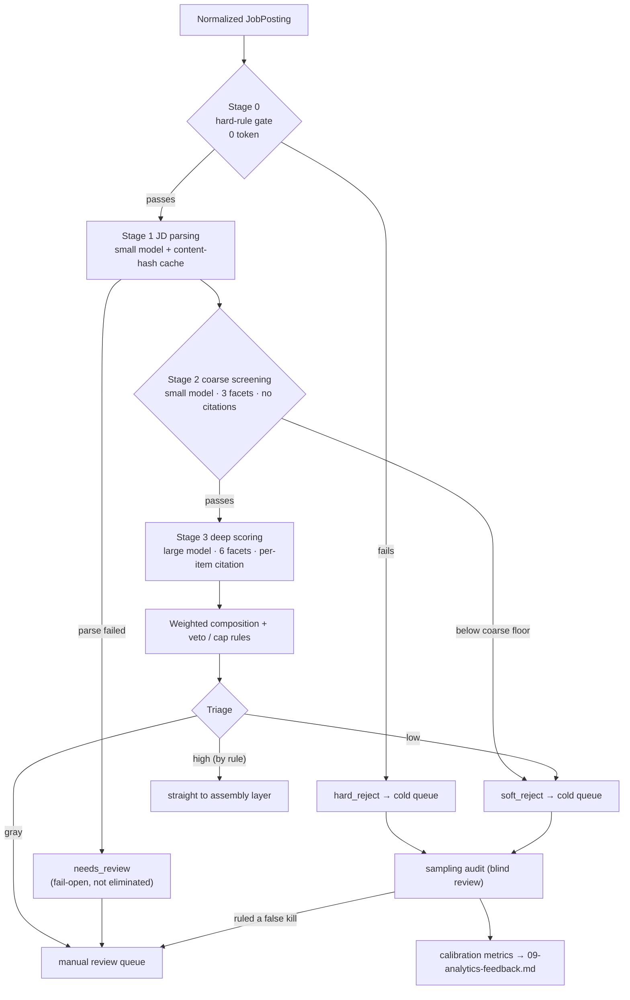

# Evaluation Layer: JD Parsing, Match Scoring and Triage

> Maps to the **Go / No-Go decision** in a bid/RFP response management system. Upstream is the normalized `JobPosting` produced by [`04-ingestion.md`](./04-ingestion.md); downstream are [`06-content-assembly.md`](./06-content-assembly.md) (assembly) and [`07-review-gate.md`](./07-review-gate.md) (the manual review queue).
>
> This layer **produces no content that will ever be sent** and **fetches no web pages** (all fetching lives in 04). It produces exactly one thing: the judgement of whether a job posting is worth a human's time, plus the auditable evidence that backs that judgement.

---

## 1. Responsibility Boundary

| Item | Content |
|---|---|
| Input | `JobPosting` (raw JD full text, source, company, ingestion time, post-deduplication canonical id, listing history) |
| Output | `ParsedJD` + `ScoringResult` + `TriageDecision` + `AuditSample` |
| Out of scope | Does not write résumés, does not write cover letters, does not decide whether to apply, does not send anything automatically, does not fetch anything from the network |
| Definition of success | The time the user spends each week reading job postings they should not have read goes down, **with no systematic false kills** |

The second condition matters more than the first. A triage engine that throws everything away saves time with 100% efficiency and is worth nothing. The whole layer is therefore designed around **auditability**, not accuracy.

The relationship between this layer and the product principles needs stating up front: what it saves is the cost of **ranking and reading order**, not the judgement itself. A high-scoring posting must still pass the approval gate in [`07-review-gate.md`](./07-review-gate.md). No exceptions.

---

## 2. Pipeline Overview



### 2.1 Five Changes to the Original Architecture

The original flow sketch drew this layer as a single "AI scoring" box. Each item below states original thinking → why it changed → what it became.

**Change one: split into parsing / coarse screening / deep scoring, and move the hard rules ahead of the LLM.**
Original thinking: one call returns a score.
Why it changed: a single call carries both "read the JD correctly" and "judge the match", so a wrong score cannot be attributed (did it not understand the JD, or understand it and judge wrong?), and cost and quality are welded together so neither half can be upgraded alone.
What it became: three stages. `ParsedJD` becomes a cacheable intermediate artifact that [`06-content-assembly.md`](./06-content-assembly.md) can reuse, and parsing errors can be tested in isolation.

**Change two: "automatic elimination" becomes "soft elimination + a 7-day recall window".**
Original thinking: low scores are eliminated outright.
Why it changed: if the sampling audit only catches a false kill two weeks later, the posting may already be closed; deleted data also cannot be used for calibration after the fact.
What it became: state is set to `cold` with the full scoring record preserved; within 7 days the audit process or a manual search can recall it, after which it moves to `archived` (**never physically deleted**, unless the user explicitly asks). The state machine is defined in [`03-data-model.md`](./03-data-model.md).

**Change three: thresholds go from "set the score line first" to "set the human capacity first".**
Original thinking: define three score lines for high / gray / low.
Why it changed: at cold start there is no data to set a line with, only guesswork; a fixed line makes queue volume swing with the market (flooded in peak season, idle in the off-season).
What it became: quota mode, see §6.

**Change four: the high band is decided by rules, not by a score line.**
Original thinking: `score ≥ T_h` means high band.
Why it changed: quota mode solves `T_l` (the gray/low boundary) but leaves `T_h` with nowhere to be set — the original draft wrote "high band target flow 8–12%", yet under quota mode nothing guarantees that ratio, so the line is still a guess.
What it became: the high band becomes a conjunctive rule: `skill_match ≥ 3` and `seniority_fit ≥ 3` and every other facet `≥ 2` and no severity-3 red flag and no `confidence` of `low`. The rule is explainable, usable from day one, and does not drift with the market. The share that actually lands in the high band is an observed value, not a target; if it is 0 for two consecutive weeks, the rubric anchors are set too strictly and what needs adjusting is the anchors, not the rule.

**Change five: character offsets in evidence are backfilled by code, not produced by the LLM.**
Original thinking: the schema requires the LLM to output `{quote, start, end}`.
Why it changed: LLMs get character offsets wrong at a very high rate (especially with mixed Chinese-English text and full-width characters), which produces a flood of spurious validation failures.
What it became: the LLM outputs only `quote`; code backfills `start` / `end` by string search, and on a miss the whole evidence entry is discarded. The validation logic is unchanged, but the failure signal becomes clean — a failure is now genuinely a hallucination, not an arithmetic error.

---

## 3. (a) JD Parsing

### 3.1 Why a JD Cannot Be Fed Straight to the Scorer

A JD is marketing copy, not a requirements spec. A sizeable share of a JD (**rough estimate 40–60%, needs measurement against real samples**) is noise irrelevant to the judgement: company blurb, benefits list, EEO / equal-opportunity statements, compliance boilerplate. Across multiple JDs from the same company these passages are near-verbatim identical. Feeding the whole thing into the scoring prompt costs three things: wasted tokens, diluted attention, and **the company's copywriting quality contaminating the match score** (a company with enthusiastic copy scores higher, which measures the JD writer's skill, not the posting's fit).

Stage 1's output must therefore be the requirements skeleton with the copy stripped off.

### 3.2 Extraction Schema

```ts
type Evidence = {
  quote: string;          // the only thing the LLM produces
  start?: number;         // backfilled by code via string search; miss → entry discarded
  end?: number;
};

type Requirement = {
  text: string;
  kind: "skill" | "experience_years" | "education" | "certification"
      | "language" | "legal" | "domain" | "other";
  canonical?: string;              // controlled vocabulary: "K8s" → "kubernetes"
  years_min?: number;
  firmness: "firm" | "soft" | "unknown";  // "must have" vs "nice to have"
  evidence: Evidence[];
};

type ParsedJD = {
  jd_id: string;
  source_hash: string;             // sha256 of the normalized full text → cache key
  parser_version: string;          // prompt + schema version
  language: "zh-TW" | "en" | "ja" | "mixed" | "other";

  role: {
    title_raw: string;
    title_normalized: string;
    seniority: {
      level: "intern"|"junior"|"mid"|"senior"|"staff"|"principal"
           |"manager"|"director"|"unknown";
      inferred: boolean;           // true when inferred from years / responsibilities
      evidence: Evidence[];
    };
    employment_type: "fulltime"|"contract"|"parttime"|"intern"|"unknown";
    work_mode: { kind: "onsite"|"hybrid"|"remote"|"unknown";
                 onsite_days_per_week?: number };
  };

  requirements: { hard: Requirement[]; nice: Requirement[] };

  tech_stack: { name: string; canonical: string;
                centrality: "core"|"peripheral"|"mentioned" }[];

  comp: { min?: number; max?: number; currency?: string;
          period?: "year"|"month"|"hour";
          disclosed: boolean; source: "jd"|"none" };

  location: { raw: string; city?: string; country?: string;
              relocation_offered?: boolean;
              visa_sponsorship: "yes"|"no"|"unknown" };

  org_signals: {
    team_size_hint?: number;       // "join a 5-person platform team"
    reports_to?: string;
    company_stage_hint?: "seed"|"series_a_b"|"growth"|"public"|"sme"|"unknown";
    hiring_reason_hint?: "new_team"|"backfill"|"expansion"|"unknown";
    evidence: Evidence[];
  };

  red_flags: { code: RedFlagCode; severity: 1|2|3; evidence: Evidence[] }[];

  boilerplate_spans: [number, number][];  // char ranges: EEO / benefits / company blurb
  unknowns: string[];                     // fields explicitly marked "not in the JD"
  parse_warnings: string[];               // evidence validation failures, etc.
};

type RedFlagCode =
  | "high_pressure"        // "must handle pressure well"
  | "wear_many_hats"       // "wearing many hats"
  | "solo_ownership"       // the only X engineer, no peers
  | "vague_scope"          // responsibilities with no concrete deliverable
  | "unpaid_overtime_hint" // "flexible with the project schedule"
  | "family_culture"       // "we're like a family here"
  | "no_comp_disclosed"
  | "age_coded_language"   // age-coded phrasing
  | "reposted_repeatedly"; // determined from 04's listing history, not LLM-extracted
```

`age_coded_language` is more than a red flag: in Taiwan it may fall under the employment discrimination provisions of the Employment Service Act (**the exact article numbers and their scope need verification**, see [`10-risk-compliance.md`](./10-risk-compliance.md)). The system only records and flags; it makes no legal determination and files no complaints.

### 3.3 Prompt Design Direction

What matters is not the wording but **separating extraction from inference, strictly**:

```
[system]
You are a JD structured extractor. Your only job is to turn the input job description into the specified JSON schema.

1. Every non-null field must carry evidence: a verbatim quote from the JD text.
   If no verbatim quote exists, fill null.
2. Do not infer, do not complete, do not fill gaps with industry common sense. "A role like
   this usually requires X" is explicitly forbidden. If you cannot find it, put it in unknowns[].
3. The only field where inference is allowed is role.seniority, and inferred must be set to true,
   with the evidence the inference rests on listed (years required, scope of responsibility, reporting line).
4. red_flags marks only phrasing that appears in the JD text; output code + verbatim quote.
   Do not make value judgements about the company, do not write commentary.
5. boilerplate_spans marks the ranges of EEO statements, company blurb, benefits lists, compliance boilerplate.
6. firmness is judged by wording: "必須 / required / must" → firm;
   "尤佳 / a plus / nice to have" → soft; undeterminable → unknown.
7. Output only JSON that conforms to the schema.
```

Engineering support (all four are low-cost and high-value, and should be built first):

- **Structured output** (JSON schema / tool calling) is mandatory; never parse free text in post-processing.
- **evidence validator**: after extraction, run a string search on every entry in code (normalizing whitespace and full-/half-width forms first); on a miss, drop that field and record a `parse_warning`. This is the most effective defence against hallucination — an LLM can invent a requirement, but it cannot invent a quote that hits the source text. The validation failure rate is itself a metric that belongs on the dashboard: a sudden spike usually means the model version was silently swapped.
- **Cache**: `source_hash → ParsedJD` in local SQLite. A posting ingested from several sources (ATS + alert email + recruiter forward) is parsed once. Re-parse only when `parser_version` changes. The size of the saving **depends on the real deduplication rate and needs measurement**.
- **Language handling**: when `language` is not a language the user reads (a Japanese JD for a user with no Japanese, say), that is not an elimination — parse as usual and let the "language" rule in Stage 0 handle it. Treat language ability as a hard requirement instead of complicating the parser.

---

## 4. (b) Hybrid Match Scoring

> Explicitly against "throw the JD and the résumé at an LLM and ask for a 0–100 score". That number has no auditable source, cannot be attributed, drifts on re-run, and is completely uncontrollable with respect to weight tuning.

Also explicitly against the other common alternative: **cosine similarity between JD and résumé embeddings as the score**. Three reasons: (1) it cannot be attributed, and is as much a black box as a single LLM score; (2) it is insensitive to negation — "no Kubernetes experience required" and "Kubernetes experience required" sit almost on top of each other in vector space; (3) it cannot be decomposed into facets, so weights cannot be tuned. Its one legitimate use is as a **cheaper substitute** for the Stage 2 coarse screening (zero LLM cost), at the price of a coarse-screening false-kill rate that is harder to control — that trade-off is left as an option in the §10 roadmap.

### 4.1 Stage 0: Hard-Rule Gate (Zero Token)

Pure code, running before any LLM call. The point is **not to burn tokens on postings that are obviously impossible**.

| Rule | Data source | Decision | False-kill risk and mitigation |
|---|---|---|---|
| Location / commute | `location` + the user's set of acceptable locations | not in the set and not remote → reject | High. JDs often list the HQ address when the role is in fact remote → block only when `work_mode=onsite` and the city is explicit |
| Work visa / nationality restriction | `visa_sponsorship=no` + the user needs sponsorship | reject | Medium. `unknown` **always passes** |
| Language | `kind=language` inside `requirements.hard` | required language not on the user's list → reject | Low |
| Seniority range | `seniority.level` vs the acceptable range | gap ≥ 2 levels → reject | Medium. When `inferred=true`, downgrade to a penalty rather than elimination |
| Employment type | `employment_type` | not on the accepted list → reject | Low |
| Blocklist | A user-maintained list of companies / staffing agencies | reject | Low. Renamed subsidiaries and brand names that differ from legal entity names cause both misses and false blocks; match primarily on canonical company id, with string matching as a fallback |
| Re-application | Already submitted to the same company and role within 90 days | reject | Low. But a genuinely reopened req is a real signal, so anything hitting this rule always enters the audit sample |

Design principle: **`unknown` always passes**. Hard rules only handle what the JD states explicitly and that explicitly does not match. Treating uncertainty as mismatch is the main source of false kills.

### 4.2 Stage 2: Coarse Screening (Small Model)

Input is only `ParsedJD` (not the raw text) plus a summary of the user profile; output is coarse scores on three facets, with no citations, no rationale, and a 250-token output cap. The sole purpose is to stop "tech stack with zero overlap" and "completely unrelated domain" before they reach the large model.

The bar is deliberately loose. Design targets: a coarse-screening elimination rate around 35–45%, and among the postings deep scoring would have placed in the high band, a coarse-screening false-kill rate < 2% (**both numbers are initial assumptions and need calibration against real measurements**). Recall matters far more than precision at this stage.

### 4.3 Stage 3: Deep Scoring Rubric (Large Model)

Six facets, each scored independently, on a **0–4 anchored rating scale** rather than 0–100.

Why: an LLM's "resolution" on a 0–100 scale is fake — in practice it only emits a few attractors like 65 / 70 / 75 / 85, and the precision in between is noise. A discrete scale with textual anchors has better test-retest consistency (**this is engineering judgement plus a general observation from the public literature; this project must verify it with the retest metric in §5.4**).

**Facet one: `skill_match`, full anchors**

| Score | Anchor description |
|---|---|
| 4 | Every `firmness=firm` hard requirement has citable implementation evidence in the content library; at least 2 core stack items have evidence at the "led / built from scratch" level |
| 3 | firm requirement coverage ≥ 80%, and every gap is a peripheral tool (self-taught before the start date) |
| 2 | firm requirement coverage 50–80%, or the gaps include 1 `centrality=core` technology |
| 1 | firm requirement coverage < 50% |
| 0 | Zero overlap between the core tech stack and the content library |

The other five facets (same anchor format, compressed here):

| Facet | What it measures | Score 4 | Score 0 |
|---|---|---|---|
| `seniority_fit` | Scope of responsibility vs actual seniority | Matches the existing experience level with 1 level of headroom | Gap ≥ 2 levels (too high or too low alike) |
| `domain_fit` | Industry / business domain | Deep experience in the same domain, able to talk business detail directly | Completely unfamiliar domain and the JD explicitly requires domain knowledge |
| `company_fit` | Against the company preferences the user filled in (size, stage, remote policy, product type) | All hit | 0 hits and an explicit anti-preference |
| `growth` | What new ground this job opens up | Explicit exposure to new technology / new responsibility the user listed as a goal | Pure repetition of the current job |
| `comp_fit` | Compensation range vs expectation | Bottom of the range ≥ the expectation | Top of the range < the bottom of the expectation |

**Output structure per facet:**

```json
{
  "facet": "skill_match",
  "score": 3,
  "confidence": "medium",
  "rationale": "The JD's firm requirements are Kubernetes, Go and distributed tracing. The first two have lead-level evidence; the third has usage experience only.",
  "jd_evidence": [{ "quote": "5+ years building distributed systems in Go" }],
  "profile_evidence": ["blk_0a3f", "blk_11c9"]
}
```

`profile_evidence` must be `ContentBlock` ids from the content library (defined in [`06-content-assembly.md`](./06-content-assembly.md)). **Citing "you probably know this" or "inferred from your background" is not allowed — it directly violates product principle 2, honesty above all.** A skill that cannot be cited to an existing block does not count as a match. The same code-level validation applies: ids that do not exist are stripped and the facet's confidence is lowered.

**How are profile fragments selected into the prompt?** A personal content library is on the order of tens to hundreds of `ContentBlock`s (**needs confirmation against the real library size**). If the whole thing serializes to < 6k tokens, **put all of it in the prompt prefix** and do no retrieval — that is both simpler and hits prompt caching. Above that, take the top N fragments by `canonical` skill-tag intersection plus BM25, with N derived backwards from the budget. **Explicitly against introducing a vector database for this**: at this data volume, building the index, maintaining embedding versions and handling update invalidation cost far more than they return, and they make the prompt prefix unstable, destroying cache hits.

### 4.4 Weighted Composition and Output Schema

```python
base    = sum(w[f] * score[f] / 4 for f in facets) / sum(w.values()) * 100
penalty = min(sum(cfg.per_severity * fl.severity for fl in red_flags),
              cfg.max_total)
cap     = 30 if score["seniority_fit"] == 0 else 100
total   = clamp(min(base - penalty, cap), 0, 100)

if score["skill_match"] == 0:            # single-facet veto
    total, decision = 0, "hard_reject"
```

Veto and cap rules live only in the config file and are executed by code reading that config (this avoids the two-headed situation where the config and the code each hold their own copy of the rules):

```yaml
# scoring/profile.yaml
version: 7
facets:
  skill_match:   { weight: 0.30, veto_at_zero: true }
  seniority_fit: { weight: 0.20, cap_at_zero: 30 }
  domain_fit:    { weight: 0.15 }
  company_fit:   { weight: 0.20 }
  growth:        { weight: 0.15 }
  comp_fit:      { weight: 0.00 }   # default 0: most JDs do not disclose, so a weight computes nothing
red_flag_penalty: { per_severity: 3, max_total: 15 }
high_band_rule:                      # §2.1 change four
  min: { skill_match: 3, seniority_fit: 3, _others: 2 }
  forbid_severity_3: true
  forbid_low_confidence: true
thresholds:
  mode: quota                        # quota | fixed
  weekly_review_capacity: 12
  t_low_guardrail: [35, 60]
  fixed: { low: 45 }
audit:
  weekly_cap: 20
  warmup_weeks: 4
  rates_warmup: { hard_reject: 1.00, borderline: 0.20, low: 0.05 }
  rates_steady: { hard_reject: 0.03, borderline: 0.20, low: 0.05 }
  very_low_fixed_per_week: 2
  exploration_slots: 3
```

`comp_fit` defaults to weight 0 but must stay adjustable — a career switcher wants `growth` high, someone in a stable phase wants `company_fit` high, and someone who needs the money should not have `comp_fit` at 0. That is the same system at different life stages, and it cannot be hard-coded.

Downstream objects (the persistence schema lives in [`03-data-model.md`](./03-data-model.md); only the interface shape is fixed here):

```ts
type ScoringResult = {
  jd_id: string; scorer_version: string; profile_version: number;
  facets: FacetScore[];                 // an array of the JSON above
  base: number; penalty: number; total: number;
  k: 1 | 3; facet_range?: Record<string, number>;   // the range when k=3
  model: { id: string; temperature: number };
  scored_at: string;
};

type TriageDecision = {
  jd_id: string; band: "high" | "gray" | "low";
  reason: "rule_high" | "quota_grey" | "below_t_low" | "hard_reject"
        | "veto_skill" | "parse_failed" | "exploration_slot"
        | "audit_recall" | "uncertainty_forced";
  t_low_used?: number; priority?: number; decided_at: string;
};

type AuditSample = {
  jd_id: string; stratum: "hard_reject"|"borderline"|"low"|"very_low";
  sampled_at: string;
  verdict?: "should_be_grey" | "reject_correct" | "unsure";
  note?: string; verdict_at?: string;
};
```

---

## 5. (c) Scoring Reliability and Calibration

### 5.1 Three Sources of Instability

| Source | Symptom | Countermeasure |
|---|---|---|
| Sampling randomness | The same JD re-run scores 5–15 points apart | `temperature=0` (or the provider's minimum) + structured output + a fixed seed (**whether each provider offers a seed needs verification**) |
| Position bias / order effects | Position influences the score when several postings are compared in one batch | **Score exactly one posting at a time**, never rank across postings inside one prompt; ranking is always done in code from the composed score |
| Prompt sensitivity | A small rubric rewording shifts every score | The rubric is version-controlled together with the prompt; a `scorer_version` change counts as a "recalibration required" event |

Even `temperature=0` guarantees nothing deterministic (provider-side batching, hardware non-determinism and silent model version updates all cause drift). So treat test-retest consistency as a continuously monitored metric rather than an assumption.

### 5.2 Self-Consistency: Gray Band Only

Sampling several times and taking the median reduces variance at linear cost. The trade-off resolves as:

- High band, low band: **k=1**. Decisions in these two bands are insensitive to ±5 points.
- Gray band (and the boundary within 5 points of `T_l`): **k=3, taking the median of each facet score**, recording the dispersion.
- If any facet's range under k=3 is ≥ 2 (half the scale on a 0–4 range), the posting is **forced into the manual queue** (`reason=uncertainty_forced`) regardless of the median. The cases the model itself is unsure about are exactly the cases a human should see.

### 5.3 Using the User's Past Decisions as Few-Shot Anchors

Pick 4–6 examples from postings that have already been through manual review and put them in the rubric prompt: 2 high-band and approved, 2 gray band but rejected, 1–2 low band but recalled. Each example carries only the `ParsedJD` summary, the actual decision, and the one-line reason the user wrote at the time.

Three traps:

1. **Data leakage**: the example pool must exclude the posting being scored and recent postings from the same company, otherwise the model is just copying the answer.
2. **Distribution shift**: the user's preferences change as the search progresses (a few interview rounds revise expectations). Give the example pool a rolling window of the last 60 days.
3. **Selection bias**: examples come only from postings that made it into the manual queue, so the eliminated region is structurally absent. That is the other value of the §7 sampling audit — it is the only source of labelled data from the eliminated region.

There is also a hidden cost: few-shot examples change every week with the rolling window, **destroying the prompt prefix cache**. The mitigation is to drop the example pool's refresh rate to once a week (recomputed Monday, fixed for the week) so the prefix stays verbatim-stable within a week.

### 5.4 Calibration Metrics: What Is Readable at Small Sample Sizes

A personal job search runs at tens to a few hundred postings a week and a dozen-odd manual decisions. At that scale **no meaningful confidence interval can be computed**; metrics like AUC and Brier score vary too much to interpret. The honest approach is to watch only four coarse metrics (definitions and dashboard in [`09-analytics-feedback.md`](./09-analytics-feedback.md)):

| Metric | Computation | Healthy value (**initially an assumption; revise after 8 weeks of measurement**) |
|---|---|---|
| Stratified approval-rate monotonicity | Bucket by score; the manual approval rate per bucket | Must increase monotonically. Non-monotonic = the score has no discriminative power |
| Top-k hit rate | Of postings that produced an interview invitation, what share originally landed in the system's top-10 | > 60% |
| Elusion rate | The share of audit samples ruled "should have been gray band" | < 5% |
| Test-retest consistency | Re-run 5 random postings the next day; the share whose total moves ≤ 5 points | > 80% |

Two limits that must be stated:

- **The number of buckets must scale with the data.** About 12 manual decisions a week is about 96 over 8 weeks; 5 buckets means 19 per bucket and monotonicity is dominated by noise. Use **3 buckets** for the first 12 weeks, and move to 5 only past 150 accumulated decisions.
- **Top-k hit rate is essentially unreadable for the first 3 months.** Total interview invitations may be a single-digit number, which makes this a "ratio" over 1–3 data points. It works only as a qualitative check ("were those two interviews in the top 10 at the time?") and cannot be used to tune weights.

**A score is not a probability.** 72 does not mean a 72% chance of an interview. The UI never shows decimals; continuous values are for internal ranking only (see §11.4).

---

## 6. (d) Triage Thresholds

### 6.1 The Three Bands

```
 100 ┬────────────────────────────────────┐
     │  High: by rule (§2.1 change four)  │  → 06 drafts → 07 human approval
     ├────────────────────────────────────┤
     │  Gray: manual review queue         │  flow = weekly human capacity N
     │  (this is the real battleground)   │  → human picks "assemble" or "drop"
  T_l┼────────────────────────────────────┤  T_l = score of the Nth ranked item
     │  Low: soft elimination → cold queue│  → 7-day recall window + sampling audit
   0 └────────────────────────────────────┘
```

**The high band is not automatic submission.** A high score only removes the question of whether to bother; the draft still goes through the diff review and approval in [`07-review-gate.md`](./07-review-gate.md). Product principle 1 has no exceptions.

### 6.2 Quota Mode (the Default for the First 6–8 Weeks)

Do not set a score line, set the human time budget: first carve out the high band with the rule from §2.1 change four, then rank the rest by `total` and take the top N (`N = weekly_review_capacity`); `T_l` is the Nth item's score, computed dynamically per batch.

Upside: queue volume is predictable (set 12 and you get 12, never 60 in some week), so the user does not abandon the system because the queue exploded; and at cold start there is no score line to guess out of thin air.

The downside has to be stated just as plainly: **under quota mode the threshold floats with the market**. In a dry week the 12th-ranked posting may score only 38, which stuffs the queue with things not worth reading; in a peak week the 12th may score 68, which drops a pile of qualified postings. The mitigation is a hard guardrail: `T_l` is clamped to `[35, 60]`, and when it would fall outside that range the queue volume is allowed to deviate from the quota, with the dashboard showing "abnormal market supply this week".

> **Ruled (A9)**: the lower guardrail is upgraded from "**clamping `T_l`**" to "**hard elimination**" — anything below 35 does not enter the queue even when the quota has an open slot; the slot is left empty instead (for what to do with an empty slot, see the capture planning recommendation in `12`).
>
> **No new `score_floor` constant.** The floor value proposed by `16` R-05-3 happens to also be 35, fully overlapping the guardrail already in this section — under quota mode a new constant is close to a no-op, while adding one more number to maintain and one more definition site that can drift out of sync with this section. One number and one observable anchor is enough.
>
> **The activation condition reuses the existing 80-decision threshold in §6.3 below**, introducing no fourth number. "Accumulated manual decisions" had been given three thresholds and three meanings — **40 / 80 / 80** — by `12` and `16`; all are unified at 80.
>
> See [17-decisions.md](./17-decisions.md#a9--no-new-score_floor-upgrade-the-existing-guardrail).

The 35 and 60 in the guardrail **are initial values set by feel**, with no data behind them. Their job is to provide an observable anchor — log every time `T_l` hits the guardrail, then after 8 weeks see whether it hits the upper or the lower bound more often and adjust accordingly. They are not truth.

### 6.3 Conditions for Switching to fixed Mode

All three at once: (1) accumulated manual decisions ≥ 80; (2) the stratified approval rate monotonic for 3 consecutive weeks; (3) elusion rate < 5% for 3 consecutive weeks. At that point take the median of the past 8 weeks' quota boundaries as the initial `T_l`, and recalibrate every 4 weeks thereafter.

### 6.4 Ordering Inside the Gray Band Is Not by Score

The presentation order inside the gray band is "what should be read first", not "what scores highest":

```
priority = total_score        × 0.5
         + uncertainty_bonus  × 0.2   # wide k=3 dispersion → human judgement worth more
         + deadline_urgency   × 0.3   # days to deadline / days listed
```

Of two postings 3 points apart, one closes in three days — read that one first. The three coefficients are likewise hand-set starting points, adjustable in `profile.yaml`.

---

## 7. (e) Sampling Audit of Automatic Elimination

This is the most important section in the document. It is borrowed from eDiscovery's **elusion test / null set sampling**: Technology Assisted Review (TAR) does not earn a court's trust by claiming the model is accurate, but by sampling from the set the machine excluded and showing nothing important was missed. A job-search system works the same way — the only difference is that here no opposing counsel comes to check, which makes it that much easier to skip.

### 7.1 Stratified Sampling Design

False-kill risk varies a lot by elimination reason, so sample by stratum rather than uniformly.

| Stratum | Definition | Sampling rate | Rationale |
|---|---|---|---|
| `hard_reject` | Eliminated by Stage 0 hard rules | **100% for the first 4 weeks** (capped at 15 per week), 3% thereafter | The rules are written by the user; a bad rule **systematically** false-kills an entire class of postings. The highest-risk stratum |
| `borderline` | Score within 5 points below `T_l` | 20% | The boundary is inevitably where errors concentrate |
| `low` | `T_l - 5` down to 25 | 5% | Routine monitoring |
| `very_low` | < 25 | Fixed 2 per week | A cheap sanity check, mainly to catch a broken pipeline (parse failures dragging everything low, say) |
| Exploration slots | 3 random draws from `low`, **placed straight into the gray band** (not merely audited) | Fixed 3 per week | ε-greedy, preventing the model from permanently sealing off a region (see §11.2) |

Overall cap of 20 per week (exploration slots counted separately). The cap is deliberate: an audit must be completable within 15 minutes, or it gets skipped, and a skipped audit does not exist.

Auditing 100% of `hard_reject` for the first 4 weeks has a real feasibility problem: if the hard rules eliminate 60 in some week, a cap of 15 means actual coverage is 25%. That is a deliberate trade-off — **better under-covered than an audit that becomes a burden**. Above the cap, switch to random sampling and show the actual coverage on the dashboard; do not pretend it is 100%.

### 7.2 Blind Review Flow

The audit UI shows only a **de-identified JD summary**: title, company, the first 5 hard requirements, location, compensation range.

**Not shown**: the score, the facet detail, the rationale, the elimination reason.

The reason is anchoring — once you have seen "this one is 32, because the tech stack has no overlap", you will almost certainly agree. Judging after seeing the reason turns the audit into a recitation of the model and destroys its debugging value.

The user answers one of three:

```
[ Should be gray band ]   [ Elimination correct ]   [ Not sure ]
```

On "should be gray band" the user **may optionally** add a sentence ("I know someone there, worth a shot" / "the JD is badly written but the company is one I want"). That sentence is worth more than any automatic learning signal, and it feeds the few-shot pool in §5.3.

### 7.3 Rulings and Actions

`elusion_rate = count("should be gray band") ÷ (total sampled − count("not sure"))`

| Range | Action |
|---|---|
| < 5% | Normal, record only |
| 5–10% | Open the full rationale for the false-killed samples and attribute by hand: bad JD parse? bad anchor on some facet? wrong weight? → adjust manually and replay |
| > 10% for 2 consecutive weeks | **Freeze automatic elimination.** The system degrades to a pure ranker: every non-`hard_reject` posting enters the queue (ordered by score) until the fix passes an audit again |

Two limits that have to be stated honestly:

1. **These thresholds are not statistical tests, they are operational triggers.** An eDiscovery elusion test computes a sample size to reach a specified confidence level; at 20 samples a week, 5% and 10% are statistically indistinguishable. The design intent is "an alarm that goes off", not "a statistically correct conclusion". Accepting that limit beats skipping the audit entirely because no confidence interval can be computed.
2. **Dropping "not sure" from the denominator systematically overestimates the elusion rate** (the denominator shrinks). That direction is safe (it errs toward more alarms), but if "not sure" exceeds 30% of samples, the **blind-review summary carries too little information** — what needs fixing is the summary fields (two more requirements, add team size), not the model. This share is itself a dashboard metric.

---

## 8. (f) Cost Control

### 8.1 Tiered Budget

Estimated over a batch of 100 raw postings (**every number is a rough estimate and must be revised against measured JD length and deduplication rate**):

| Stage | Model tier | Calls | Input tok/call | Output tok/call | Input subtotal | Notes |
|---|---|---|---|---|---|---|
| Stage 0 hard rules | — | 100 | 0 | 0 | 0 | ~40% eliminated → 60 pass |
| Stage 1 parsing | Small | 40 (60 less ~1/3 cache hits) | ~2,500 | ~700 | 100k | The schema is ~1,300 tok and can be prefix-cached |
| Stage 2 coarse screening | Small | 60 (including cache hits) | ~1,800 | ~250 | 108k | The input is `ParsedJD`, not the raw text |
| Stage 3 deep scoring | Large | ~25 | ~7,000 | ~1,300 | 175k | Profile fragments dominate |
| Stage 3 gray band k=3 | Large | ~20 (10 postings × 2 extra runs) | ~7,000 | ~1,300 | 140k | self-consistency |

Per batch: roughly **208k input / 43k output** on the small model and **315k input / 58k output** on the large one. Amortized over each raw posting that is about 2.1k small-model and 3.2k large-model input tokens.

**What does that cost in money?** At the order of "single-digit US dollars per million input tokens on a large model, output about 5× that" (**actual prices must be checked against the provider's current rates, and they change**), 100 postings a week lands at **a few dollars a week, a little over ten dollars a month**. The conclusion matters: **for a single user, the LLM cost of this layer is not the binding constraint**. The real constraint is how many postings the user can review per week. So the optimizations in §8.2 should be limited to the cheap ones; complicating the architecture to save a few dollars is not worth it.

Budget guardrail: when the average large-model input per posting exceeds 4k tokens, fire an alert and auto-degrade (turn off k=3, cut the number of profile fragments). The guardrail exists to catch bugs (boilerplate stripping broken, profile fragment selection running away), not to save money.

### 8.2 Four Concrete Cost Savings (Ranked by Value for Effort)

1. **Content-hash cache**: `source_hash → ParsedJD` in local SQLite. Cross-source duplicates and postings relisted in a later week are entirely free. One hour to implement, the highest return.
2. **Boilerplate stripping**: the `boilerplate_spans` marked in Stage 1 are never passed to later stages. There is no reason to pay to read the same company's EEO paragraph every single time.
3. **Replay from cached results**: replaying after a weight change (§11.2) recomputes only the composition formula and **does not re-run the LLM**. This is the biggest practical benefit of separating facet scores from weighted composition — the marginal cost of tuning a weight is zero.
4. **Prompt prefix stabilization**: pin "profile summary + rubric + schema + few-shot" verbatim at the very front and put the varying part (`ParsedJD`) last, to hit the provider's prompt caching (**each provider's minimum prefix length, TTL and billing model need verification**). It ranks last because it is the most fragile: one changed character invalidates it, and it has to be coordinated with the weekly refresh cadence in §5.3.

### 8.3 Local Model Substitution Points

Per product principle 5, Stage 1 (parsing) and Stage 2 (coarse screening) are the first targets for local models: the task is structured, the output is short, the demand on reasoning depth is low — and the evidence validator in §3.3 supplies a **model-independent quality yardstick**: local and cloud models can be compared directly on "evidence hit rate" and "schema validation pass rate", with no human labelling. Stage 3 deep scoring is quality-sensitive and stays in the cloud for now. The switching interface is defined in [`11-tech-stack-roadmap.md`](./11-tech-stack-roadmap.md).

---

## 9. Execution Environment and Failure Handling

### 9.1 Where This Layer Runs

A single-process CLI batch program, run once a day (or by hand), reading and writing local SQLite. **No message queue, no worker pool, no container orchestration, no scheduling service.** At 100 postings a week and a few seconds of LLM call each, total runtime is on the order of minutes, and 4–8 concurrent tasks under `asyncio` is enough.

Explicitly against introducing Kafka / Celery / Airflow / Kubernetes at this layer. Those things solve multi-tenancy, high throughput and cross-machine failure, while the scale here is one person, once a day, on one machine. Their costs are real: local deployment complexity, harder debugging, and most importantly — **the user cannot get it running on their own laptop, which directly violates product principle 5, local-first**. If scheduling is genuinely needed later, the operating system's cron / task scheduler is enough.

### 9.2 Re-Run Semantics

The batch must be repeatable without producing duplicate data: `(jd_id, parser_version)` and `(jd_id, scorer_version, profile_version)` are the idempotency keys. On a re-run, existing results are skipped unless `--force` is passed. This makes "re-run after a mid-way failure" and "recompute after a version bump" the same single command.

### 9.3 Every Failure Fails Open

| Failure | Error handling |
|---|---|
| Stage 1 parsing returns invalid JSON | Retry once (raising the temperature reduces schema adherence — do not do that; resend the original prompt instead). Still failing → `needs_review`, **into the gray band queue, not eliminated** |
| Every evidence entry fails validation | Record a `parse_warning`; `ParsedJD` is still usable but that field counts as `unknown` → takes the "unknown always passes" path |
| Stage 3 API timeout / quota exhausted | The batch is marked incomplete, the postings stay in `pending_scoring` for the next run. **Never eliminate a posting because it could not be scored** |
| The model returns fewer than 6 facets | The result is voided; do not zero-fill (zero-filling silently depresses the score and causes false kills) |

The principle: **the consequence of any technical failure must be "spend more human time", never "see one fewer posting"**. That is consistent with the definition of success in §1.

---

## 10. Minimum Viable Version and Rollout Order

The full design (6 facets + k=3 + stratified audit + exploration slots + quota) is heavy for a one-person tool. The pragmatic approach is to ship in three stages, each of which stands on its own:

| Milestone | Includes | Excludes | Done when |
|---|---|---|---|
| **M1 ranker** | Stage 0 + Stage 1 + Stage 3 (6 facets, k=1) + composition + everything into the queue ordered by score | Coarse screening, automatic elimination, the audit, quota | Read 20 by hand and find the ordering "broadly sensible" |
| **M2 triage engine** | Adds quota triage, soft elimination, the cold queue, the blind-review audit UI, elusion rate | k=3, exploration slots, fixed mode | elusion rate < 10% for 2 consecutive weeks |
| **M3 calibration** | Adds Stage 2 coarse screening, k=3 with forced queueing, exploration slots, the few-shot pool, the replay tool | — | The switching conditions in §6.3 are met |

**M1 deliberately leaves out Stage 2 coarse screening**, because when cost is not the constraint (§8.1), coarse screening only adds one more place to false-kill. Add it once the token bill or the runtime genuinely becomes a problem.

In implementation order, the first three things to write should be: the `ParsedJD` schema and the evidence validator; the `profile.yaml` loader and the composition function (pure functions, easy to test); and the cold queue table. The scoring prompt can come last — it is the easiest part to change.

---

## 11. Pain Points and Objections

### 11.1 Cold Start: the First Month's Scores Are Basically Guesses

With no feedback data, the weights are filled in by feel, the few-shot pool is empty, and the thresholds rest on nothing. The honest approach is not to pretend the system works, but to **say plainly that the first four weeks are a calibration period** and get through them with four measures:

1. **Seed labelling**: label 20–30 historical postings in one sitting (submitted / wanted to but did not / skipped at a glance), about 30–60 minutes. It is the only way to have few-shot anchors on day 0.
2. **No automatic elimination for the first 2 weeks** (that is, M1): every posting enters the queue, low scores just sort to the bottom. The user scrolls past them quickly, but the system gets valuable labels across the whole distribution.
3. **Weights from a questionnaire, not from learning**: learning-to-rank at n < 100 is self-deception and overfits immediately. Hand-tune first.
4. **High-coverage auditing of `hard_reject` for the first 4 weeks** (§7.1).

### 11.2 The Goodhart Trap: Optimizing for "the AI Thinks It's Good"

This is the most dangerous failure mode. Feedback signals come in two qualities:

| Signal | Latency | Volume | Meaning |
|---|---|---|---|
| Manual approve / reject | Immediate | High | The user's **present preferences** (existing biases included) |
| Interview invitation / rejection letter | 2–6 weeks | Sparse | The real market signal |

Tuning weights on the first signal alone trains the system into an amplifier of the user's existing biases: the user habitually skips a class of company → the model learns to score it low → that class never appears in the queue again → the user never gets a chance to change their mind. This is a self-sealing loop.

Three defences:

- **Weights never update automatically.** They change only when a human edits `profile.yaml` and commits. No form of online gradient update is accepted.
- **Replay is mandatory.** Every weight change recomputes triage over the past 8 weeks of postings (at zero cost, see §8.2) and reports "N triage results flipped". A flip rate above 20% requires item-by-item confirmation before it takes effect.
- **Exploration slots.** 3 low-band postings a week are forced into the queue (§7.1). It wastes a little time, and it is the only mechanism that breaks the self-sealing loop.

### 11.3 Well-Argued Hallucination Turns Manual Review into Rubber-Stamping

An LLM rationale always reads persuasively. After 30 consecutive "score + reason" items, a person slides fast into automation bias: no longer judging independently, merely confirming the model's judgement. That leaves the whole human-in-the-loop design formally present and substantively dead.

What this layer can do about it:

- Audits are always blind (§7.2) — this is the one place in the system where a human must judge independently, and it cannot be contaminated.
- Every rationale carries a verbatim JD quote, so a person can verify in 3 seconds instead of believing.
- The UI marks `confidence=low` facets red and sorts them to the top, actively steering attention to where the model is unsure.

Deeper mitigations (pacing design in the review UI, a daily review cap) belong to [`07-review-gate.md`](./07-review-gate.md).

### 11.4 False Precision and Score Superstition

Showing "87.3" makes the user believe the system knows something it does not. The countermeasure: the UI shows only a band (A / B / C) and a 0–4 bar chart of the six facets; the continuous score is for internal ranking only. **A score is for ordering, not for estimating.**

### 11.5 The Audit Itself Will Get Skipped

This is the failure most likely to actually happen, and there is no good technical fix. 20 blind reviews a week is pure cost with zero immediate return, and in the weeks someone is busy interviewing it will certainly be skipped. Available mitigations: hold the audit cap low enough to finish within 15 minutes (§7.1), schedule it into the same working session as the review queue, and **automatically freeze automatic elimination after 2 consecutive weeks of incomplete audits** (degrading to a pure ranker). That last one is the key: it makes the consequence of not auditing land on the system (slower, longer queue) rather than on false kills the user never sees.

### 11.6 When This Layer Should Not Be Used

- **Someone making only 3–5 submissions a week.** The cost of building and maintaining the rubric (weight tuning, audits, few-shot upkeep) exceeds the return; reading JDs by hand is faster. The break-even point for this layer is **roughly** a flow of 40+ postings a week (**this threshold is an estimate and should be verified against the user's real flow and review time**).
- **Extremely vertical roles.** A niche field where only 10 companies are hiring, say: read every one of them by hand, no triage needed.
- **Someone who has not worked out what they want.** This system faithfully amplifies whatever weights you put into it. If the weights are garbage, all it does is move you toward the wrong thing more efficiently. What to do instead is read 50 JDs by hand first, work out what you want, and only then configure the system.

### 11.7 The LLM Scorer's Own Biases

The model may systematically favour well-known companies, particular keywords, and JDs written in polished English. Worse, it may fold age / gender / ethnicity cues from the JD into its judgement — even though the rubric never asked for them.

Mitigation: before `ParsedJD` enters the scoring stage, strip identifying descriptions other than the company name. Also run a **controlled test**: take 10 already-scored JDs, re-run them with only the company name replaced by a fictional name (and a second arm replaced with a big-name brand), and compare the distribution of `total` differences; if the median absolute difference exceeds 5 points, the company name itself is driving the score and it should be stripped from the scoring prompt too (with `company_fit` evaluating structured company attributes instead of the name). Run this test on every `scorer_version` change, at a cost of about 30 large-model calls. The ethics and compliance angle is in [`10-risk-compliance.md`](./10-risk-compliance.md).

---

## 12. Interface Contracts

| Direction | Counterpart | Content |
|---|---|---|
| ← Input | [`04-ingestion.md`](./04-ingestion.md) | Normalized `JobPosting` + canonical id + listing history (for deciding `reposted_repeatedly`) |
| → Output | [`06-content-assembly.md`](./06-content-assembly.md) | `ParsedJD` (assembly uses the hard requirements to decide which ContentBlocks to emphasize) + `ScoringResult.profile_evidence` (already-matched block ids, as the starting point for assembly) |
| → Output | [`07-review-gate.md`](./07-review-gate.md) | The gray band queue (ordered by `priority`) + the audit sample queue + the `needs_review` queue |
| → Output | [`09-analytics-feedback.md`](./09-analytics-feedback.md) | Raw events for the four calibration metrics + the evidence validation failure rate + the "not sure" share |
| ← Input | [`06-content-assembly.md`](./06-content-assembly.md) | The `ContentBlock` list and canonical skill tags (for `profile_evidence` validation and fragment selection) |
| ↔ Shared | [`03-data-model.md`](./03-data-model.md) | The persistence schema for `ParsedJD` / `ScoringResult` / `TriageDecision` / `AuditSample`, and the job posting state machine |
| ← Constraint | [`10-risk-compliance.md`](./10-risk-compliance.md) | Forbidden facets (protected characteristics must not enter scoring), data retention policy |

The theoretical basis for the domain mapping is in [`01-domain-mapping.md`](./01-domain-mapping.md); this layer's place in the whole is in [`00-overview.md`](./00-overview.md) and [`02-architecture.md`](./02-architecture.md); model selection and local substitution are in [`11-tech-stack-roadmap.md`](./11-tech-stack-roadmap.md).

---

## Open Verification Items

Everything below is an external fact this document depends on but cannot currently confirm. Each should be confirmed item by item before launch, with the result written back into this document.

| # | Open verification item | How to verify |
|---|---|---|
| 1 | Whether the LLM provider in use supports a `seed` parameter for reproducible output | Check the parameter table for the messages / chat completions endpoint in that provider's API reference; measure by running the same prompt with the same seed 5 times and comparing whether the output is verbatim identical |
| 2 | The minimum prefix length, TTL and billing model of prompt caching | Check the provider's pricing page and prompt caching documentation; measure by calling twice in a row with the same prefix and comparing the cache-read token count in the returned usage |
| 3 | Current per-million-token prices for the large and small models (the cost conclusion in §8.1 depends on this) | Check the provider's pricing page; run a week of real batches, reconcile against the bill, and backfill the §8.1 table |
| 4 | Whether `temperature=0` is genuinely close to deterministic at that provider | Re-run the same JD 5 times on a later day and record the range of `total` — the test-retest consistency metric in §5.4 |
| 5 | Field restrictions in structured output / JSON schema mode (nesting depth, union types, array length) | Send the full `ParsedJD` schema from §3.2 to the API once and see whether it is rejected; if restricted, simplify the schema or switch to tool calling |
| 6 | The exact article numbers and scope of the employment discrimination provisions of Taiwan's Employment Service Act (§3.2 `age_coded_language`) | Check the original text in the national Laws & Regulations Database; the system only records and makes no legal determination, but the citations in this document must be correct |
| 7 | The real boilerplate share of a JD (the 40–60% rough estimate in §3.1) | Collect 30 real JDs, mark the EEO / benefits / company blurb ranges by hand, and take the median character share |
| 8 | The real deduplication rate (which sets the 1/3 cache-hit assumption in §8.1) | Run 4 weeks of ingestion and tabulate the distribution of repeat counts for identical `source_hash` |
| 9 | The real size of the user's content library (which decides whether §4.3 needs fragment retrieval) | Once the library is built, count the `ContentBlock`s and the serialized token count; under 6k, stuff it all in |
| 10 | The user's real weekly review capacity (`weekly_review_capacity` initial value 12) | Time the first 2 weeks of M1: record the actual review seconds per gray band posting, then divide the weekly available time by the median |
| 11 | Whether the concurrency in §9.1 trips the provider's rate limit | Check the RPM / TPM limits of that account plan; measure by running one 100-posting batch and watching for 429 responses |
| 12 | Whether each facet's anchors are decidable on real JDs (especially `growth` and `company_fit`) | Have both a human and the model score the 20–30 seed-labelled postings against the anchors, then compare the facets that disagree and revise the anchor text |
