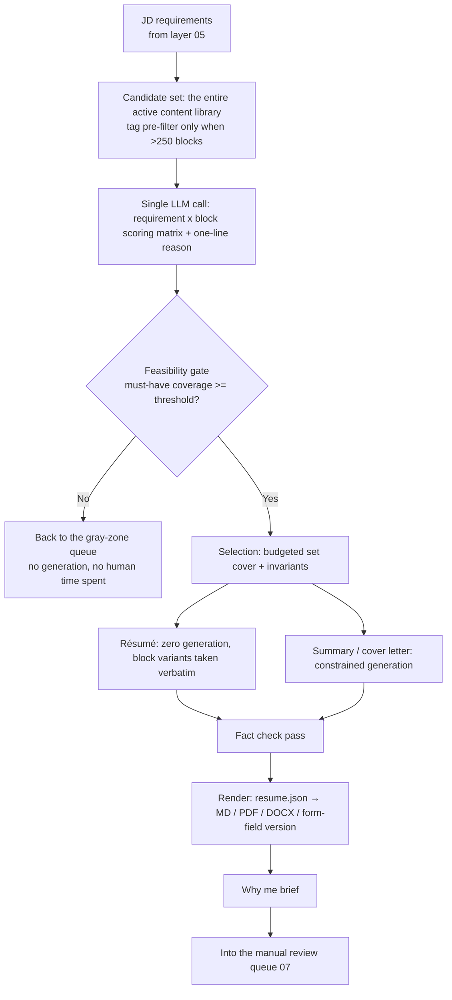

# Assembly Layer: The Content Library and Customized Output

> This document corresponds to the "assembly layer" of the original layered architecture (**proposal assembly** in the bid/RFP response management system). Upstream input comes from the scoring and requirement-extraction results of [`05-scoring-triage.md`](05-scoring-triage.md); downstream output goes to the manual review queue in [`07-review-gate.md`](07-review-gate.md). [`03-data-model.md`](03-data-model.md) is authoritative for the formal schema; this document describes only the fields, algorithms and failure modes specific to this layer.

---

## 1. What This Layer Actually Does

Proposal assembly in a bid/RFP response management system is not "writing a proposal" — it is "picking the right sections out of the content library, fitting them into the format the customer demands, and passing the compliance check". The job-search system is isomorphic:

| Bid/RFP system | This system |
|---|---|
| Content library (past case studies, team CVs, solution sections) | ContentBlock content library |
| RFP requirement matrix | JD requirements (from layer 05) |
| Compliance matrix (requirement by requirement → proposal section) | Coverage map (requirement → block id) |
| Proposal assembly + pink/red team review | Selection + constrained generation + fact check |
| Proposal PDF / mandated form format | ATS-friendly PDF / DOCX / **platform form-field version** |

The key insight: **the content library is the only long-term asset in this entire system**. Models will be swapped out, platforms will change their APIs, prompts will be rewritten — but a structured, evidence-backed, recombinable career content library will still be good three years from now. The largest up-front human investment should go into the content library, not into prompt tuning.

### 1.1 Three Changes to the Original Architecture

**Change A: split "assembly" into "selection" and "surfacing"; résumé bullets are zero-generation by default.**

- Original thinking: the assembly layer = "assemble a résumé and cover letter out of the content library", which implicitly means an LLM reads the JD and the content library and writes the résumé text directly.
- Why it changed: any generative freedom given to the LLM costs three things — (1) the design and compute of the fact-check guardrails, (2) the homogeneous "obviously written by AI" register, (3) provenance that can only be reconstructed by after-the-fact comparison. What those three buy is "a tone that hugs the JD more closely", and tone-matching very likely contributes almost nothing to the effectiveness of **résumé bullets** (no evidence; see "Open verification items").
- What it became: résumé bullets take a **pure selection path** — the LLM only decides "which blocks to pick, which length variant to use, how to order them", and the text is taken verbatim from existing variants in the content library. Generative freedom is retained in exactly three places: the summary at the top of the résumé, the body of the cover letter, and the "why me" brief written for the reviewer. Provenance for the résumé therefore becomes trivially correct (a bullet *is* a block id), and the fact check only has to handle the summary and the cover letter.
- **The price of this change (recorded honestly)**: generation cost is front-loaded into human cost — the content library must already contain multiple length variants and multiple angles on the same material, otherwise the résumé will read as detached from the JD and every submission will look the same. Mitigation: make "controlled rewriting" an opt-in switch at T2 and above, run rewritten bullets through the same fact check as the summary, and mark them "rewritten" in the review UI so the human knows that sentence is not verbatim.

**Change B: the feasibility gate goes after the scoring matrix and before generation and human review.**

- Original thinking: scoring → triage → assembly, straight down the line.
- Why it changed: assembly itself is not expensive (LLM tokens are pocket change); **human review time is the genuinely scarce resource**. When must-have coverage is too low, whatever gets assembled is necessarily forced, but the human still has to spend 10 minutes reviewing it before discovering it should never have been submitted.
- What it became: right after the one cheap requirement × block scoring call, compute must-have coverage; below the threshold, **do not generate and do not enter the review queue** — send it back to the triage layer marked "gray zone — insufficient coverage" and let the human decide whether to force assembly. The suggested initial threshold is 0.6, but that number was set out of thin air and must be calibrated against the first 30 real submissions (record whether the force-passed cases ever got a reply). This directly serves product principle 4 (fewer but better).

**Change C: cut the vector retrieval layer.**

- Original thinking: BM25 + embedding hybrid retrieval → rerank → select, the standard three-stage RAG.
- Why it changed: that is an architecture designed for a corpus, not for **one person**. The content library of someone with 8–10 years of experience tops out around 150–200 blocks; each block, including variants, claims and tags, is about 150 tokens, so the whole library is about 20,000–30,000 tokens — **just stuff the entire thing into the context**. Introducing an embedding index brings a whole string of real costs: embedding model version management, re-indexing after every content-library update, the local vs. cloud embedding privacy decision (product principle 5), and a vector-database dependency that a personal tool has no business having.
- What it became: the candidate set = **the entire active content library**, and one call produces the complete scoring matrix. The whole library is a fixed prefix, so use prompt caching directly and let several applications on the same day share the cache. Only when the library exceeds roughly 250 blocks (or the token count leaves the comfortable range once the Chinese/English dual track is added) do you turn on a **deterministic pre-filter**: set intersection between `tags.skills` and the technology terms extracted from the JD, plus "always keep every block from the last 3 jobs". The pre-filter is a readable, debuggable rule, not black-box similarity.
- The price: more input tokens. One T2 assembly has an input of roughly 30,000–60,000 tokens; even on a complete cache miss, that is far below the opportunity cost of the reviewer's 10 minutes.

---

## 2. The Content Library: Breaking One Person's Career into Recombinable Units

### 2.1 Block Types

| type | Purpose | Typical count (engineer with 8–10 years' experience, estimate) |
|---|---|---|
| `achievement_bullet` | Résumé body; one achievement per sentence, with a quantified number | 40–80 |
| `project_narrative` | Project narrative, with short/medium/long variants | 8–15 |
| `skill_claim` | Skill claim + proficiency + pointer to evidence | 30–60 |
| `role_context` | One line of background for the company/role (scale, industry, team size) | 3–6 |
| `letter_opening` | Cover letter opening skeleton and raw material (not a finished product) | 5–8 |
| `letter_closing` | Closing paragraph | 3–4 |
| `faq_answer` | Reason for leaving, salary expectations, employment gaps, why change careers | 10–20 |
| `credential` | Education, certifications, public work, talks | 5–15 |

### 2.2 The ContentBlock schema (the fields this layer cares about)

```jsonc
{
  "id": "blk_ach_kafka_latency_2023",
  "type": "achievement_bullet",
  "role_id": "role_acme_sre_2021_2024",
  "text_variants": {
    "zh-TW": {
      "short":  "將訂單事件管線 p99 延遲從 1.8s 降到 240ms。",
      "medium": "重構訂單事件管線的 Kafka consumer group 配置與批次策略，p99 延遲自 1.8s 降至 240ms，日均處理 420 萬筆事件。",
      "long":   "...(background / approach / result / downstream impact, about 3-4 lines)"
    },
    "en": { "short": "...", "medium": "...", "long": "..." }
  },
  "claims": [
    {"claim_id": "clm_p99_order_pipeline", "kind": "metric", "text": "p99 1.8s -> 240ms"},
    {"claim_id": "clm_events_per_day",     "kind": "metric", "text": "4.2M events/day"},
    {"claim_id": "clm_tech_kafka",         "kind": "tech",   "text": "Kafka"},
    {"claim_id": "clm_scope_e2e",          "kind": "scope",  "text": "end-to-end ownership"}
  ],
  "evidence": [
    {
      "kind": "metric_dashboard",      // commit | doc | perf_review | certificate | public_link | self_attested
      "source": "Grafana snapshot 2023-08; PR #4412",
      "verifiable_by_employer": true,
      "confidential": false,           // NDA / contains customer names → excluded by default; a de-identified version needs a manual unlock
      "caveat": "number is a two-week average before and after launch, not a single best-case point"
    }
  ],
  "tags": {
    "skills": ["kafka", "distributed-systems", "performance", "go"],
    "domains": ["e-commerce", "backend"],
    "seniority_signal": "owned_end_to_end"
  },
  "is_signature": true,                // signature achievement: always selected first, whatever the JD says
  "line_cost": {"short": 1, "medium": 2, "long": 4},
  "period": {"start": "2023-04", "end": "2023-09"},
  "status": "active",                  // active | retired | needs_refresh
  "verified_at": "2026-01-12"
}
```

Four design points:

1. **`evidence` is a mandatory non-empty array.** `self_attested` (self-reported only, no external evidence) is a legal value, but such blocks are down-weighted during selection and marked "must be explainable on the spot in an interview" in the review UI. This is the first **structural** line of defense for honesty — not a prompt that says "do not fabricate", but a data model that leaves an unsupported claim nowhere to hide.
2. **`claims` carry stable `claim_id`s.** The first draft had only free text, which made the rule "the same metric must not appear twice" impossible to check in code. With ids, deduplication is a one-line set operation. Claims are drafted by the LLM and confirmed by a human.
3. **`caveat` records the conditions under which a number holds.** It never appears on the résumé, but it does appear in the "why me" brief, as a reminder of what needs to be explainable before the interview.
4. **`line_cost` and `is_signature` are inputs to the selection algorithm**, and they are data rather than program constants, so the user can adjust them by hand without touching code.

### 2.3 The proficiency ladder for skill_claim

Skill inflation is the most common form of résumé falsification and the easiest one to get caught out on in an interview. Use a hard ladder to bind the adjectives to the evidence:

| level | Permitted wording | Required evidence | May appear in the résumé Skills section |
|---|---|---|---|
| `exposure` | exposure to | mentioned in ≥1 block | No (only inside project narrative body text) |
| `working` | working knowledge | ≥1 achievement block, ≥1 month of use | Yes, secondary list |
| `strong` | proficient | ≥2 achievement blocks, across ≥2 projects, ≥6 months cumulative | Yes, primary list |
| `expert` | led the design of | external evidence required (public repo, talk, patent, internal standards document) | Yes, may enter the summary |

Banned-word dictionary (never permitted in **generated** text): `精通`, `專家級`, `熟悉所有`, `full-stack 全能`, and any tenure wording the model writes on its own. Hard-blocked by regular expression in the post-processing layer; no reliance on model self-discipline.

Note one implementation trap: **the banned words apply only to generated passages, never to block text taken verbatim**. Block text has already been human-verified; if the user wrote `精通` in a block themselves and is willing to stand behind it, the system should not quietly rewrite their words.

### 2.4 The Chinese/English dual track and localized variants

In practice a job seeker in Taiwan needs two sets of content: English or mixed Chinese/English for foreign companies and ATS systems, Chinese for local job boards. Handling principles:

- `text_variants` is keyed by language at the top level. The Chinese and English versions are **parallel variants, not translations** — each is confirmed separately by a human, and machine-translating then submitting directly is forbidden. Translation itself creates no new facts, but it does create an unnatural register and wrong technical terminology (for example, rendering 可觀測性 back into something other than `observability`).
- Consistency check: across the Chinese and English variants of the same block, every number in `claims` with `kind: "metric"` must be verbatim identical. This can be checked in code, and it should be — a number that differs between the Chinese and English versions is a deeply embarrassing error.
- **Personal-data variant**: résumé forms on Taiwanese job boards routinely include photo, date of birth, gender and military service fields; foreign-company ATS systems and submissions to the US and Europe should omit all of them (some jurisdictions treat them as a discrimination risk). Use `profile_variant: "tw_local" | "intl"` to control whether the render template emits those fields, rather than making the user delete them by hand every time. For the personal-data minimization principle see [`10-risk-compliance.md`](10-risk-compliance.md).

### 2.5 The cold-start flow

Do not ask the user to "fill in a blank form" — that is the most painful and least completable path. Do **extraction + confirmation** instead:

```
Input: old resumes (every version), LinkedIn export, performance review documents,
       personal PR/commit list, project documents, cover letters written in the past
   |
   +- Step 1: LLM drafts blocks (type + text + inferred claims + tags)
   |
   +- Step 2: human confirms item by item — cannot be skipped
   |            every block answers three questions:
   |              (a) is this sentence literally true?
   |              (b) where does the number come from? (fill in evidence.source)
   |              (c) can I hold up for three minutes if pressed on it in an interview?
   |
   +- Step 3: fill in the length variants (LLM produces short/long, human confirms no new facts were added)
   |
   +- Step 4: mark is_signature, fill in line_cost, build the tag index
```

**Warning: the biggest risk in step 1 is "inheriting the puffery of the old résumé".** The old résumé says "improved system performance by 300%" and you long ago forgot how that was computed — the LLM will lift it untouched into a block, and from then on the system treats it as "fact". So the default state in step 2 must be "unverified", and a block may not enter the candidate pool until a human has confirmed it.

Time estimate: about 4–8 hours for the initial build-out for someone with 8–10 years of experience, best split across 3–4 sittings (an estimate; to be verified in real use). This is the largest up-front human cost in the system, and the pain point §9 has to face honestly.

---

## 3. The Assembly Pipeline



### 3.1 The scoring matrix

One LLM call; input = the requirement list + all candidate blocks, output = a 0–3 score plus a one-line reason for every (requirement, block) pair. Two details:

- **Score per requirement, do not treat the whole JD as one query.** The noise in a long JD drowns out the critical requirements; scoring requirement by requirement also produces the coverage map directly.
- **The reason field is not decoration** — it feeds straight into the "why me" brief and saves a call.

Set temperature to 0, and record the full matrix in `GenerationRun` so it can be reproduced and debugged afterwards.

### 3.2 Selection: budgeted set cover

This is not a top-k problem, it is a **budgeted set cover problem**. Greedy is enough; do not reach for ILP (over-engineering at a scale of 150 blocks).

```python
# Invariants: a violation is a build failure, not a prompt instruction
INVARIANTS = [
  "I1 most recent job >=3 bullets, and must include its highest-scoring block",
  "I2 any one job has between 0 and 5 bullets; a job with 0 bullets is still listed as a single line",
  "I3 the same claim_id appears at most once",
  "I4 at least 1 is_signature block is selected, whatever the JD says",
  "I5 no block with confidential=true in evidence may be selected unless the run carries unlock_token",
  "I6 every technical term on the resume maps to the claims of a selected block",
]

def select(blocks, reqs, budget_lines):
    chosen = mandatory(blocks)                     # I1 / I4 go in first
    while True:
        cands = [b for b in blocks - chosen
                 if feasible(chosen | {b}, budget_lines)]   # invariants checked at every step
        if not cands: break
        b = max(cands, key=lambda x: gain(x, reqs, chosen) / x.line_cost)
        if gain(b, reqs, chosen) <= 0: break
        chosen.add(b)
    return chosen
```

Three notes:

- **Feasibility is checked inside the loop, not patched up afterwards.** The first draft ran the greedy selection to completion and then called `enforce_hard_rules()`, which cuts blocks that have already consumed budget at the last moment, so the result satisfies neither the coverage nor the rules.
- **I2 allowing 0 bullets is a deliberate escape hatch.** "at least 1 bullet per job" + "chronologically continuous, no skipping" + "one page" is an unsatisfiable combination of constraints for someone with 6 jobs. Older jobs degrade to a single-line entry (company / title / dates), which keeps the chronology continuous without wasting space. Employment gaps are handled by `faq_answer`, not by hiding them — hiding is futile, the ATS computes the date differences itself.
- **Any constraint that can be expressed as a deterministic rule should never be handed to a probabilistic model.** "the most recent job must be included" goes into the code, not into the prompt.

Layout budget: < 10 years of experience → 1 page (about 42 usable lines); otherwise ≤ 2 pages.

### 3.3 Constrained generation: the summary and the cover letter

These are the only two places where the LLM may produce new text, and they get a double guardrail.

At the core of the **prompt layer (the first guardrail)** is an explicit **allowlist of actions**:

```
You may do only the following four things:
  1. "Select" which of the provided blocks to mention
  2. "Rewrite the tone" (formal <-> direct)
  3. "Adjust the length"
  4. "Switch the emphasis" (same thing, a different angle)

You absolutely may not:
  - Add any number, company name, technology name, job title, tenure or degree that is not in the blocks
  - Merge numbers from two blocks into a new number
  - Upgrade "participated in" to "led", or "assisted with" to "owned"
  - Claim any proficiency level the proficiency ladder has not authorized

Output format: after every sentence, tag the block id that supports it, in the form [blk_xxx].
Tag a sentence with no block support as [TEMPLATE] (pure transition sentences and pleasantries only).
```

The **post-processing layer (the second guardrail)** is the one that is actually reliable, because it does not depend on the model cooperating:

| Check | Method | Action on failure |
|---|---|---|
| Verbatim number allowlist | Regex out every number / percentage / duration and compare each against the `claims` and `text_variants` of the selected blocks | Mark red, block auto-approval |
| Entity allowlist | Company names, product names, schools, job titles, technology names, compared against the content library allowlist + a (restricted) JD vocabulary | Mark red |
| Tenure computation | Always derived from the `role` table and filled in by template; any tenure wording the model writes itself is removed outright | Removed automatically |
| Proficiency wording | Banned-word dictionary + proficiency ladder comparison (generated passages only) | Downgrade the wording automatically, or mark red |
| Chinese/English number agreement | Verbatim comparison of the metric claims across the two language versions | Block |
| AI register | Cliché dictionary (`熱衷於`, `豐富的經驗`, `在快節奏的環境中`, `不僅…更是`) + dash density | Warn (does not block) |
| Per-sentence attribution | A second LLM call (independent context, preferably a different model); input = the generated sentences + the selected blocks, output = supported / unsupported / template per sentence | `unsupported` marked red |

The output of the fact check is a per-sentence attribution table, fed straight into the review UI:

```json
{"sent_id": 3,
 "text": "At Acme I brought the p99 latency of the order pipeline down to 240ms.",
 "verdict": "supported",
 "support": ["blk_ach_kafka_latency_2023"],
 "checks": {"numbers_ok": true, "entities_ok": true, "ladder_ok": true}}
```

**An honest self-criticism:** the second LLM call gets things wrong too, and is especially prone to misjudging a "reasonable inference" as supported. Its role is **a hint, not a pass certificate** — a deterministic check may block, an LLM check may only mark red for a human. Approval authority always stays with the human (product principle 1). "Whether switching models meaningfully reduces misjudgment" is a reasonable hypothesis but an unverified one; see "Open verification items".

### 3.4 Cross-submission consistency

An easily overlooked risk: **multiple submissions to the same company must not contradict each other.** Recruiters and the ATS keep the résumé you sent three months ago; if the same experience says "led" this time and "participated in" last time, or the same project is 6 months this time and 1 year last time, the damage is far greater than any amount of wording that fails to hug the JD.

Implementation: at assembly time, load the `selected_block_ids` and claim sets of the historical `GenerationRun` records for the same `company_id` (last 12 months), and do two things —

1. Deterministic check: mark red immediately when this run's metric / dates / job title conflict with the historical record.
2. Selection preference: **up-weight** blocks used before when submitting to the same company again, so the narrative stays consistent instead of being reshuffled every time.

---

## 4. Output Artifacts

### 4.1 The résumé: hard rules for ATS friendliness

The following go into the template as engineering constraints, not as "suggestions". One thing has to be said honestly first: **the résumé parsing behavior of the mainstream ATS products (Workday, Greenhouse, Lever, iCIMS) is not publicly documented**, and most of the rules below come from industry hearsay rather than verifiable specifications. What they have in common is that they are "extremely cheap hedges" — following them costs nothing, so follow them; but do not treat them as verified facts.

- **Single-column layout.** Some parsers read a two-column layout by interleaving the left and right columns (the differences between vendors need verification).
- **No tables, text boxes, images or icons, and no substantive information in the header/footer.** Contact information goes in the first paragraph of the body.
- **Standard section headings**: `Work Experience`, `Education`, `Skills`, `Projects`; the Chinese version maps to 工作經歷 / 學歷 / 技能 / 專案. Do not use creative headings like "My Journey".
- **A uniform date format**, `YYYY/MM – YYYY/MM`, with `Present` / `迄今` for the current role.
- **The PDF must have a real text layer.** After output, run a `pdftotext -layout` round-trip, feed the plain text back into your own section splitter, and treat a failure to split as a build failure. This is an automated check you can put in CI, and the only rule in this document that "you can verify yourself instead of trusting hearsay".
- **Embed the fonts**, and avoid exotic ligatures and non-standard bullet glyphs (use `-` or a standard `•`).

**Where keyword alignment ends and keyword stuffing begins**: alignment is "saying the same thing in the JD's vocabulary" — the content library says 容器編排, the JD says `Kubernetes`, and your block really did do K8s, so use `Kubernetes`. Stuffing is listing things you have not done, or cramming keywords into white text or a wall of skills. The system rule (I6 in §3.2): **every technical term on the résumé must be supported by the claims of at least one selected block**; the vocabulary in the Skills section is derived backwards from the selected blocks, not copied over from the JD. This is an honesty guardrail and an anti-stuffing mechanism at the same time.

### 4.2 The platform form-field version (Taiwan context; an artifact the first draft missed)

The dominant submission mechanism on local job boards such as 104 and 1111 is a **structured on-site résumé**, not a PDF upload; the uploaded file is often just an attachment, and what the recruiter actually reads is the platform's own layout. So the assembly layer has to emit a third format:

```
fields.json
  ├─ self_intro           plain text, character limit varies by platform (needs verification)
  ├─ work_experience[]    per job: company/title/dates/description (plain text, no markdown)
  ├─ skills[]             item by item, mapped to the platform's skill tags or free input
  └─ faq / other fields   desired compensation, availability date, and so on
```

Design points: **plain text, no markdown, no special symbols** (platform input boxes usually swallow or escape them), with a character limit annotated per field and checked at render time. Actually filling in the form belongs to [`08-delivery-tracking.md`](08-delivery-tracking.md); this layer is only responsible for producing "field content you can copy and paste directly". Even if every paste is done by hand, the value is still high — what the human saves is the time spent composing sentences, not the time spent moving the mouse.

The platforms' field names and character limits **need verification** (see the end of this document).

### 4.3 The cover letter

The structure is fixed at four paragraphs, each with a different degree of freedom:

| Paragraph | Content | Degree of freedom |
|---|---|---|
| Opening | Why this company | **Must contain one human-written anchor sentence**, or one extracted from the company's public material but marked "pending human confirmation" |
| Middle A | Addresses must-have #1, cites 1–2 blocks | Constrained generation |
| Middle B | Addresses must-have #2, or fills an obvious gap | Constrained generation |
| Closing | Call to action + interview availability | Template |

That opening anchor sentence is deliberately left to the human: it is the spot in the letter where AI authorship is easiest to spot, and the only spot that genuinely moves a recruiter's impression. Ninety seconds spent writing one sentence yourself beats any amount of prompt engineering.

**An objection (recorded honestly):** a substantial share of job postings never read the cover letter, and some have no field to upload one at all; in those cases writing one is pure waste. Let the tier in §7 decide whether to produce one, and track "cover letter vs. no cover letter against reply rate" in [`09-analytics-feedback.md`](09-analytics-feedback.md) — but expect the sample size to be too small to conclude anything (see the arithmetic in §7).

### 4.4 The "why me" brief (for the reviewer)

This is the key to review-queue efficiency: it lets the human judge in 30 seconds whether "this is worth 10 minutes of full review". Fixed format:

```
■ Matches (3)
  R2 Large-scale stream processing  <- blk_ach_kafka_latency_2023
                                       p99 1.8s->240ms | evidence: Grafana + PR#4412
  R4 Go service development         <- blk_ach_go_migration_2022 (strong)
  R1 SRE on-call experience         <- blk_role_ctx_acme (medium, background only)

■ Gaps (2)
  R5 Kubernetes Operator development   <- no supporting block, not claimed in the draft ✔
  R7 Finance industry experience       <- no supporting block, not claimed in the draft ✔

■ Risks (3)
  Cover letter paragraph 1 mentions "your recent X product" <- source: company website, unverified
  caveat on blk_ach_kafka_latency_2023: number is a two-week average, must be explainable in interview
  Versus the version sent to the same company 2026-03: consistent (no conflicting claims)

■ Coverage: must-have 4/5 (80%) | nice-to-have 3/7
```

The ✔ after each "gap" is the point: it tells the reviewer explicitly that "the system did not fabricate anything to fill the hole". That is more persuasive than any claim that "this system never fabricates".

---

## 5. Versioning and Provenance: GenerationRun

Every assembly leaves one complete record; without it, the version-effectiveness analysis in [`09-analytics-feedback.md`](09-analytics-feedback.md) has nothing to work with.

```jsonc
{
  "run_id": "run_2026_0916_0031",
  "application_id": "app_...",
  "company_id": "co_acme",                 // for the cross-submission consistency check (§3.4)
  "jd_snapshot_hash": "sha256:...",        // the JD may be edited; used for comparison
  "selected_block_ids": ["blk_...", "..."],
  "score_matrix": [
    {"req_id": "R2", "block_id": "blk_ach_kafka_latency_2023", "score": 3,
     "reason": "directly addresses large-scale stream latency optimization"}
  ],
  "coverage": {"must_have": [4, 5], "nice_to_have": [3, 7]},
  "prompt_versions": {"summary": "sum@v7", "cover_letter": "cl@v4"},
  "models": {
    "scorer":       {"name": "...", "temperature": 0.0},
    "generator":    {"name": "...", "temperature": 0.3},
    "fact_checker": {"name": "...(deliberately different from generator)"}
  },
  "fact_check_result": {"hard_fail": 0, "llm_unsupported": 1, "style_warn": 2},
  "tier": "T2",
  "degraded_from": null,                   // degradation record, see §8
  "human_edits": {
    "diff": "...",
    "edit_distance_ratio": 0.18,
    "edited_sections": ["cover_letter.opening"]
  },
  "artifact_hashes": {"resume_json": "...", "resume_pdf": "...", "fields_json": "..."},
  "created_at": "2026-09-16T00:31:12+08:00"
}
```

`human_edits` is the core of the whole feedback loop: **whatever the human edits out every single time is exactly what the prompt or the content library needs to fix.** If 80% of cover letter openings get rewritten, stop generating the opening (switch it to mandatory human input). If some block gets deleted every time it is selected, change its `status` to `retired`. All of this can be detected and surfaced automatically — but mind the sample size: a "trend" over fewer than 20 submissions is mostly noise, and the threshold should sit at a minimum of 20–30 observations.

---

## 6. The Rendering Toolchain

**The single source of truth is structured data, not the PDF.**

```
resume.json (custom schema; field naming may follow JSON Resume)
   ├─→ resume.md      human-readable, git diff friendly, displayed directly in the review UI
   ├─→ resume.pdf     the primary format for upload-style submission
   ├─→ resume.docx    required by some ATS products and headhunters (which platforms genuinely prefer DOCX needs verification)
   └─→ fields.json    for local platform forms (§4.2)
```

| Option | PDF quality | DOCX | Layout control | Main risk |
|---|---|---|---|---|
| Typst + custom template | Good | Needs a further pandoc step; quality needs verification | High | Newer ecosystem; you write the templates yourself |
| Pandoc + `reference.docx` → LibreOffice headless to PDF | Medium | Good | Medium | One more LibreOffice dependency; conversion details are not controllable |
| LaTeX | Good | Poor | High | Text-layer ordering is anomalous in some templates' PDFs (hearsay; needs a round-trip measurement) |
| HTML + WeasyPrint / Playwright print-to-PDF | Good | None | Medium (CSS pagination is hard to control) | Must confirm the text layer and selection order are correct |
| python-docx generating DOCX directly | None | Good | Low | Verbose code |

> ### ⚠ The "recommendation" in this section is suspended (ruling A3)
>
> The table above **stays a flat list of candidates, unranked**. The ruling on the rendering mainline is **deliberately deferred** until the prerequisite question **V4** is answered by measurement: **what is the difference in parsing success rate between `.docx` and PDF on the target ATS?**
>
> The reason is that the sole justification [11-tech-stack-roadmap.md](11-tech-stack-roadmap.md) §8 gives for recommending docxtpl ("`.docx` has the higher parsing success rate") is itself tagged **needs verification** — choosing a tool before the prerequisite question is answered is rolling dice. And this document and `11` each carry an incompatible recommendation, which is the hard contradiction listed as A3 in [98-revision-gaps.md](98-revision-gaps.md).
>
> **The cost of waiting is low**: [15-target-tsmc.md](15-target-tsmc.md) verified that TSMC uses an **online structured résumé form and takes no document upload**, so the first vertical never passes through the rendering layer at all.
>
> For the release conditions and the full rationale see [17-decisions.md](17-decisions.md#a3--résumé-rendering-the-ruling-is-deliberately-deferred). **Until V4 is complete, no document may declare a mainline.**

~~**Recommendation**: use Typst for PDF (fast compilation, readable templates, and single-column résumé layout is not a demanding problem) and Pandoc + `reference.docx` for DOCX, both starting from the same `resume.json`, with a `pdftotext` round-trip check added to CI.~~ (Suspended, for the reason above; the original text is kept to preserve the argument.) For the selection rationale and the version-pinning strategy see [`11-tech-stack-roadmap.md`](11-tech-stack-roadmap.md).

---

## 7. The Marginal Return on Customization: a Tiered Strategy

Not every application deserves the same investment. Four tiers, decided by the match score from layer 05 and by human tagging:

| Tier | Action | LLM calls | Human time | When to use |
|---|---|---|---|---|
| **T0 generic** | Use the base résumé as is, no changes | 0 | 0 | Attachment ahead of a referral, first contact from a headhunter |
| **T1 light customization** | Reorder / swap bullets, change the summary, align the Skills section | 2 | ~2 min | Mid-range match score |
| **T2 standard customization** | T1 + cover letter + "why me" brief + full fact check | 4–5 | 8–12 min | High match score (**the workhorse**) |
| **T3 all-in** | T2 + human rewrite of the opening and the project narratives + portfolio + targeted preparation | — | 30–60 min | The top 5%, the dream job |

**Core claim: the system's best return on investment is the T1 → T2 stretch, and T3 should not be automated.** T3's value comes from "this person really did research our company", which is precisely what an LLM is worst at faking and should least be faking. The system's contribution to T3 is "get the raw material ready and free up the time", so the human has room to do that 30 minutes of homework.

How much does the marginal reply rate improve going from T1 to T2? The honest answer is **nobody knows, and most likely nobody can know**. With a 10% baseline reply rate and a wish to detect an improvement to 13%, a two-proportion test (α=0.05, power=0.8) roughly requires about 1,800 submissions per arm, 3,600 across both — an individual's annual submission volume is usually only 100–300, an order of magnitude short. Therefore: **treat tier assignment as a cost-control tool (spending limited human time on the largest number of high-quality submissions), not as a parameter that can be empirically optimized.** This has to be stated plainly in the layer 09 document; do not pass noise off as insight.

---

## 8. Failure and Degradation

A personal tool does not need high availability, but it does need **predictable failure**. Assembly is a chain of external calls, and any step of it can die:

| Failure | Handling |
|---|---|
| Scoring call fails / times out | Retry once; if it still fails, mark the whole run `failed`, send the job posting back to the queue, and **produce no half-finished artifact** |
| Generation call fails | Degrade to T1 (the résumé is still producible, because the résumé is a zero-generation pure selection path), set `degraded_from: "T2"` and flag it in the review UI |
| Fact check call fails | The artifacts still enter the review queue, but are **marked "unchecked" and forced into an expanded per-sentence inspection**; quick approval is not allowed |
| Render fails (including failing the round-trip check) | Build failure, no file produced. Never emit a PDF whose text layer has not been verified |
| Content library is empty / coverage is 0 | Refuse to assemble outright and prompt the user to add blocks; do not produce a hollow generic résumé |

The shared principle: **better to produce nothing at all than to produce something that looks complete but never went through the guardrails.** The most dangerous thing about a half-finished artifact is that it looks ready to hit "approve".

---

## 9. Where This Design Will Hurt

**Pain point 1: content library cold start.** 4–8 hours of human effort, and it is "very valuable but very boring" work, extremely easy to abandon halfway. Mitigations: (a) allow incremental build-out — 20 blocks covering the last two jobs is already enough to run T1; (b) make "adding blocks" a by-product of the review flow, filling gaps on the spot whenever review reveals missing material; (c) say plainly that this is a one-time investment. But admit it: **if you only intend to apply to 5 companies, this system's total cost exceeds writing 5 résumés by hand.** The break-even point is roughly 30–50 submissions (an estimate).

**Pain point 2: homogeneity.** Even with a banned-word list, LLM sentences still have a recognizable rhythm and structure. When a recruiter reads 200 in a day, "this looks AI-written" is itself a deduction. Change A (zero-generation résumé bullets) mitigates it substantially, but the cover letter is still exposed. Extra mitigations: force the human anchor sentence, prepare 3 skeletons and rotate them, and **do not** let every letter have exactly the same structure.

**Pain point 3: overfitting to JD keywords.** The system will tend to pick the blocks that "read most like the JD" rather than the blocks that "best prove capability", and the résumé ends up a mirror of the JD with no through-line narrative. Mitigation: the `is_signature` invariant (I4) forces the signature achievements to stay in. But that also means coverage will never reach 100% — a deliberate trade-off.

**Pain point 4: using an LLM to check an LLM.** As said above: it can only mark red, it cannot pass. The real line of defense is the deterministic checks and the data model (`evidence` mandatory, `claims` structured); the LLM check is icing on top.

**Pain point 5: content library rot.** Numbers expire ("currently serving 4 million users" is wrong two years later), projects get taken down, `verified_at` ages. You need a `needs_refresh` status and periodic reminders, but in a personal-tool setting those are extremely easy to ignore. Suggestion: down-weight blocks unverified for more than 12 months during selection, and mark them yellow in the review UI.

**Pain point 6: the invariants fight each other.** I1 (most recent job ≥3 bullets), I3 (no repeated claim) and I4 (signature achievement must be selected), plus a one-page budget, are unsatisfiable for certain career shapes. The system must detect the unsatisfiability and report an explicit error — "constraint conflict, relax the layout or adjust the signature markings" — rather than silently dropping one of the rules; silently dropping a rule makes the human believe the guardrail is still there.

**When this design should not be used**: (a) submission volume < 30; (b) highly homogeneous career content (a new graduate with a single internship cannot be split into 40 blocks; writing by hand is faster); (c) the target is an academic CV, a design portfolio, or a role that requires visual presentation — this layer's assumptions collapse entirely in those cases, and forcing it will only produce something terrible.

---

## 10. The Minimum Viable Version: What to Build First, What Not to Build Yet

The minimum path that can run in the first week (everything else is deferred):

1. The JSON schema for `ContentBlock` + a local JSON/SQLite storage layer.
2. The cold-start extraction script (feed in old résumés → produce draft blocks) + a crude CLI confirmation interface. **Start using it after just 20–30 blocks**.
3. The single scoring call + the coverage computation + the feasibility gate.
4. Greedy selection + invariant checks (implement I1, I3, I4, I5 first).
5. `resume.json` → Typst → PDF, with the `pdftotext` round-trip check.
6. The "why me" brief (pure template assembly, no LLM at first).

**Do not build yet**: vector indexing, DOCX output, cover letter generation, the Chinese/English dual track, an A/B testing framework, or an embedding service of any kind. All of these come after confirming that "the selection path really does produce a submittable résumé".

---

## 11. Interfaces with Other Layers

| Up/downstream | Interface | Document |
|---|---|---|
| Upstream | `JDRequirement[]` (with must/nice markings), match score, tier recommendation | [`05-scoring-triage.md`](05-scoring-triage.md) |
| Downstream | `GenerationRun` + per-sentence attribution table + "why me" brief + rendered artifacts + `fields.json` | [`07-review-gate.md`](07-review-gate.md) |
| Downstream | Form filling, file upload, submission records | [`08-delivery-tracking.md`](08-delivery-tracking.md) |
| Feedback | `human_edits.diff`, retired blocks, rewritten paragraphs | [`09-analytics-feedback.md`](09-analytics-feedback.md) |
| Constraints | NDA / confidential content, honesty red lines, personal-data minimization and the photo field | [`10-risk-compliance.md`](10-risk-compliance.md) |
| Storage | The formal schema and migration strategy for ContentBlock / GenerationRun | [`03-data-model.md`](03-data-model.md) |
| Tooling | Typst / Pandoc version pinning, local model options | [`11-tech-stack-roadmap.md`](11-tech-stack-roadmap.md) |

All data in this layer (the content library, the output artifacts, `GenerationRun`) stays on the local machine by default. What is sent when calling a cloud model is **either the subset of blocks needed for that run or the entire active content library** — the latter, once prompt caching is in use, amounts to handing a complete career record to the model vendor, and that is a trade-off the user must knowingly accept; in local-model mode nothing leaves the machine at all (product principle 5; details in [`02-architecture.md`](02-architecture.md)).

---

## Open Verification Items

| # | Open item | How to verify |
|---|---|---|
| 1 | How the mainstream ATS products (Workday / Greenhouse / Lever / iCIMS) parse two-column layouts, tables and headers | No official documentation. Use your own `pdftotext -layout` round-trip as a lower-bound check; when the chance arises, observe whether the fields the platform auto-filled are correct on postings you actually submitted to. Do not trust ATS myth articles on the internet |
| 2 | Whether each platform prefers PDF or DOCX | Go through each submission page's accepted-format notes and file size limits one by one; record them in the platform field of the source list ([`04-ingestion.md`](04-ingestion.md)) |
| 3 | The résumé field names, character limits, and whether line breaks and symbols are accepted on local platforms such as 104 and 1111 | Log into your own account and inspect the forms directly (a read-only action, no scraping involved), then copy the field specifications into the `fields.json` schema |
| 4 | Whether each platform's ToS restricts automated form filling / uploading | Read the terms of service platform by platform; when in doubt, fall back to manual copy-paste (product principle 3). This layer does not submit anything itself; the main risk sits in layer 08 |
| 5 | The contribution of "tone matched to the JD" to the effectiveness of résumé bullets | No statistical conclusion is reachable at individual sample sizes (the arithmetic in §7). Verify qualitatively instead: ask 2–3 people with recruiting experience to blind-compare the zero-generation version against the rewritten version |
| 6 | Whether switching the fact check to a different model significantly reduces misjudgment | Build a human-labeled test set of 30–50 sentences (including deliberately planted hallucinations) and compare accuracy between the same-model and different-model settings |
| 7 | Whether the feasibility gate threshold of 0.6 is reasonable | Over the first 30 submissions, record the cases "blocked by the threshold but force-passed by the human" and track their reply rate; if the force-passed reply rate matches the normal group, the threshold is too strict |
| 8 | The 4–8 hour cold start and the 30–50 submission break-even point | Record your own actual time spent and submission count, then backfill the corrections once the first job search round ends |
| 9 | The quality of Typst → Pandoc → DOCX | Produce one representative résumé and measure it: open it in Word and in Google Docs separately and check the layout and the text layer |
| 10 | The privacy acceptability of sending the entire content library to a cloud model | This is the user's value judgment, not a technical question. Ask explicitly at first-time setup, and offer two alternative paths: "send a subset only" and "local model" |
