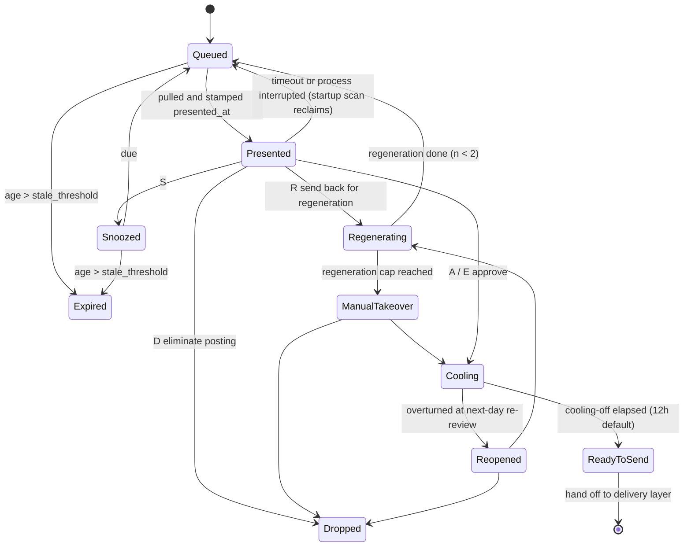

# Approval Gate: The Manual Review Queue

> This document belongs to the `ai-career` analysis and planning series. Upstream are [`05-scoring-triage.md`](./05-scoring-triage.md) (triage) and [`06-content-assembly.md`](./06-content-assembly.md) (assembly); downstream is [`08-delivery-tracking.md`](./08-delivery-tracking.md) (delivery). The state machine and field definitions are in [`03-data-model.md`](./03-data-model.md); the overall placement is in [`02-architecture.md`](./02-architecture.md).

## 1. The Problem This Layer Solves

Product principle 1 says "human-in-the-loop, and it cannot be skipped." For that to be more than a slogan, the "human" has to be engineered as a **component with a throughput ceiling, that fatigues, and that degrades into rubber-stamping**.

This layer's objective function is not "make the human look at more." It is:

> Under a **fixed weekly budget of human time**, maximize the fraction of what goes out that passed through real judgment.

Two corollaries run through the whole document:

1. **Human time is the scarcest resource in the system.** The upstream triage threshold should be derived backwards from this budget (section 8), not set by gut feel at "score 70 and above."
2. **"Pressed approve" is not "reviewed."** The system must be able to tell the two apart, or it will degrade into a spray-and-pray tool without the user noticing (section 10).

**This layer is not responsible for**: JD parsing and scoring (→ `05`), text generation (→ `06`), actual submission and status tracking (→ `08`). This layer only handles "present what needs deciding at the lowest possible cognitive cost, catch the human's decision, and turn that decision into a structured signal."

---

## 2. The Reference Domain, and One Difference That Overturns Part of the Borrowing

[`01-domain-mapping.md`](./01-domain-mapping.md) argues that this system is closest to a bid/RFP response management system. But on the specific matter of "sign-off before the bid goes out," bid-system practice is actually primitive (mostly Word files passed back and forth with tracked changes). The two domains that turned "human-machine collaborative review" into an engineering discipline are different ones:

| Domain | Mechanisms worth borrowing | Corresponding sections |
|---|---|---|
| Content moderation | Queue prioritization, homogeneous batch grouping, session length caps, mandatory breaks, gold-set calibration questions, decision-consistency measurement | Sections 3, 6 |
| eDiscovery / TAR (Technology-Assisted Review) | Tiered review (different depths), sampling audits of what was auto-eliminated, reviewer self-consistency (intra-rater reliability), retraining the classifier on human labels | Sections 6.3, 7 |
| Code review | Diff-oriented review, hunk-level accept/revert, structured send-back reasons | Sections 4, 5 |

All three share a premise that holds here: per-decision cost is high, one decision is final, and human judgment is the only source of quality.

**The key difference: this system has exactly one reviewer.** No second opinion, no inter-rater reliability, no external ground truth. Every mechanism that depends on "comparing across people" (double-blind re-review, consensus labeling, reviewer assignment algorithms) is unavailable and has to be rebuilt as "self-comparison across time" (sections 6.3, 7).

That same fact cuts out a large set of components taken for granted in SaaS review systems: **no work assignment, no tenant isolation, no worker pool, no message queue.** The implementation of this layer should be "one SQLite table in one local process plus one local UI." Any design that drags in Redis / Celery / a message broker is pure operational debt at a volume of 8–18 items per week.

---

## 3. Four Modifications to the Original Architecture

Per the spec, the differences from the user's original sketch are listed explicitly.

### 3.1 "Deadline Urgency" Mostly Does Not Exist in Job Hunting

- **Original thinking**: queue ordering = score × deadline urgency × company priority, mirroring the bid submission deadline in a bid system.
- **Why it changed**: a bid has a statutory or contractually specified deadline; job postings **overwhelmingly have no closing date**. A posting on an ATS usually carries only `posted_at`, and when it closes is up to the recruiter at any moment (whether each platform exposes a `closes_at` field is **speculation — needs verification**, see section 14). Put a nonexistent field into the ordering formula and the implementation will simply be forced to stuff in a fake value.
- **What it became**: use **recency decay** on `posted_at` as the primary proxy variable; use a real deadline only when the source explicitly provides one (campus recruiting, government postings, referral windows, a reply deadline given by a headhunter), and distinguish the two with a `deadline_confidence` field.
- **Needs verification**: "applying within 72 hours of a posting going up gets a significantly higher reply rate" is widely repeated in the job-hunting industry, but most sources are recruiting platforms' own marketing content with opaque methodology. **Do not hard-code it as a constant.** Until there is enough first-party data, use a conservative linear decay and mark `assumed: true` in the config file.

### 3.2 Triage Thresholds Become Quota-Based Rather Than a Fixed Score

- **Original thinking**: after AI scoring, triage into high / gray / low, implicitly cut by a fixed score.
- **Why it changed**: two problems. First, an LLM's absolute score drifts with prompt revisions, model versions, even temperature; a 75 today is not the same thing as a 75 next month. Second, and more fundamentally: a fixed threshold makes **the number of items entering manual review float with weekly ingestion volume**, while human time is fixed — in a week when ingestion spikes, the queue blows up.
- **What it became**: the threshold is set by a **quota derived backwards from the time budget** (formula in section 8). The score still has to be displayed (the human needs to know how confident the AI is), but **the triage decision looks at rank, not the absolute value**.
- **A simplification relative to common practice**: do not maintain a "score distribution over the last 90 days" and take a percentile from it — that needs three or four weeks before the distribution is stable, and has no answer at cold start. Instead, **rank in weekly batches**: sort this week's 30 ingested items together and take the top `n_A` into Tier A. This needs no historical distribution at all and works in week one.
- **Lower-bound protection on the quota**: pure ranking would mean "even in a bad week we still send out the top 8." So the quota governs only the upper bound; the lower bound is held jointly by `05`'s hard-condition rules and a conservative absolute score floor. If in some week fewer than `n_A` items clear the floor, that week simply has fewer reviews — we do not top it up.

### 3.3 Adding "Approve → Cool Off → Send"

- **Original thinking**: once past the approval gate, go straight to the delivery layer.
- **Why it changed**: a bid system must send immediately after sign-off because there is a hard deadline; job hunting has no such pressure (see 3.1). And the most effective way to detect misjudgments caused by review fatigue is **to let time pass and look again** — but if it goes out the moment it is approved, discovering the error the next day does not get it back.
- **What it became**: after approval the item enters a **cooling-off queue (12 hours by default)**, during which a next-day sampling re-review can overturn it (section 7). A case with a real deadline can be flagged `expedite` to skip cooling off, but that requires a second confirmation, and `expedite` usage counts must be recorded — if it becomes the norm, that means the cooling-off design has failed, not that the user is busy.

### 3.4 The Two Human Touchpoints Merge Into One UI

- **Original thinking**: the gray zone's "manual review queue" sits in the evaluation layer and "diff review → approve" sits in the approval gate — two separate human touchpoints.
- **Why it changed**: two interfaces = two sets of muscle memory = double the context-switch cost. For a single-user system, the number of interfaces is itself a cost.
- **What it became**: the same UI, the same shortcut keys, the same session, differing only in task type (`task_mode`): `triage` (gray-zone quick screen, at which point nothing has been generated yet) and `full_approval` (full review). The other two, `audit_sample` (sampling audit) and `next_day_review` (next-day re-review), go through the same interface.

---

## 4. Queue Engineering

### 4.1 The Priority Formula

```
priority = w_score   · pct_week(score)        // percentile among this week's scores, not the absolute value
         + w_recency · decay(posted_at)       // switch to deadline urgency when a real deadline exists
         + w_company · tier(company_id)       // user-maintained company tiers (dream / normal / fallback)
         + w_scarce  · scarcity(role_family)  // scarce-posting weighting (v2 only, see below)
         - w_stale   · norm(age_in_queue)     // negative: demote what has sat in the queue too long
```

Every term must be normalized to `[0,1]` before weighting, or the weight numbers are meaningless (`decay` outputs 0–1, `tier` maps to {1.0, 0.6, 0.3}, `age_in_queue` is divided by `stale_threshold` and clamped). This sounds trivial, but left unwritten, every implementation makes a different assumption.

Suggested initial weights `w_score=0.45, w_recency=0.20, w_company=0.25, w_stale=0.10`, and they **must be adjustable by the user in the config file** — an urgent job change and passive browsing want completely different weights.

`w_stale` is deliberately counter-intuitive. A normal queue moves long-waiting items forward (to avoid starvation); job postings are the opposite: **a posting that has sat in the queue for two weeks has very likely closed or already filled its resume quota**, and processing it first wastes human time. Unprocessed items past `stale_threshold` (14 days suggested, adjust per source) move automatically into `Expired` and are logged, so they do not hold a slot forever.

`scarcity(role_family)` requires counting how often a class of posting appears within a quarter. At a volume of 30–50 per week this estimate is extremely noisy (a given role_family may have single-digit samples in a quarter). **The recommendation is to build it in neither MVP nor v1**; set the weight to 0 and re-evaluate after a year of accumulated data. This is the only feature in this document explicitly marked "cut it for now."

### 4.2 Batch Grouping: An Honest Objection About Volume

Ideally, within one session you would group by `batch_key` first and sort second, for three reasons: similar JDs share evaluation standards; they share the same `resume_variant` baseline, so the diff mental model stays constant; and, most importantly, **looking at five similar postings in a row naturally produces relative judgment** ("of these five, only the third is worth applying to"), which is far more accurate than looking at a posting in isolation.

**But at this system's volume, this design almost entirely fails.** The four-dimensional key originally envisioned:

```
batch_key = role_family | seniority | location_mode | resume_variant
e.g.: backend-go | senior | remote-TW | variant_v7
```

Total weekly volume entering manual handling is about 18 items (Tier A 8 + Tier B 10, see section 8). Cut along four dimensions and **typical batch size is about 1–2 items** — grouping that groups nothing, plus a pile of extra code.

The corrected approach:

1. **Group on `role_family` alone**, with the remaining dimensions serving only as sort tie-breakers.
2. **Accumulate across days rather than grouping within a session**: make the grouping unit "the whole week's pending-review pool" rather than "today's 12 items," so that items of the same role_family land in the same session where possible.
3. **Set a trigger threshold**: when a role_family has `< 3` items in the pending pool, do not enable grouping; just sort by priority.

State the cost plainly: grouping sacrifices global priority ordering, and a high-scoring but solitary posting can end up behind a mid-scoring batch. The compromise is to keep a hard priority override — anything above P95 is forced to the front of the session, exempt from grouping.

### 4.3 Per-Item Time Budget

| Task type | Target seconds | Notes |
|---|---:|---|
| `triage` (Tier B quick screen) | 20–30 | Gray zone: look only at the JD summary + scoring rationale and decide "is it worth spending money to generate content." **There is no output artifact yet.** |
| `full_approval` (Tier A) | 60–90 | Already assembled; do diff review + fact check + decide |
| Approve with edit (additional) | +90–180 | This is the only stretch that is genuinely "typing" time |
| `audit_sample` (sampling audit of auto-eliminations) | 20–30 | Confirm the AI did not false-kill |
| `next_day_review` (next-day re-review) | 40–60 | Only check whether yesterday's own decision was reasonable |

These are design targets, not measured values — measured values come from calibrating against accumulated `decision_ms` from section 9.

---

## 5. The Review Interface: Diff Review Is the Key to Throughput

### 5.1 Three-Column Layout

```
┌─ Review 3/8 ─ batch: backend-go ──────────────────────────────────────── ⏱ 00:47 ─┐
│ ① JD highlights & rationale   │ ② Diff review (vs baseline v7)  │ ③ Preview       │
│ ────────────────────────────  │ ──────────────────────────────  │ ──────────────  │
│ Acme Corp / Series B          │ ▸ H1 §Summary        rewrite    │ [Resume]        │
│ Score 82 (P91 this week)      │   - Backend engineer, API des…  │ [Cover letter]  │
│                               │   + Distributed backend engi…   │                 │
│ ✓ Go 5y   ← JD L12            │     ⮡ fact:exp.acme.go ✓        │ (rendered)      │
│   "5+ yrs of Go in prod"      │ ▾ H2 §Exp[0].b3      replace    │                 │
│ ✓ K8s     ← JD L18            │ ▾ H3 §Skills         reorder    │                 │
│ ✗ Kafka (not in library)      │ ▸ H4 §Skills  add "gRPC"        │                 │
│ ⚠ Needs EU permit ← JD L31    │     ⮡ fact:skill.grpc ✓         │                 │
│                               │                                 │                 │
│ Assertions 6/6 bound ✓        │ Unbound assertions: 0           │                 │
├───────────────────────────────────────────────────────────────────────────────────┤
│ [A]Approve [E]Approve+edit [R]Send back [D]Eliminate [F]Add fact [S]Later [?]Help │
└───────────────────────────────────────────────────────────────────────────────────┘
```

The key design in the left column is that **every scoring rationale must carry a quotation from the JD source text plus a line number**. A rationale without a quotation is the AI's word alone, and the human cannot verify it in 5 seconds. This requires the ingestion layer to keep a snapshot of the JD source text together with character offsets (see [`04-ingestion.md`](./04-ingestion.md)), or quotation highlighting drifts; when a JD is edited after posting, the quotation refers to the snapshot rather than the live version, and the UI has to show the snapshot time.

### 5.2 The Assembly Layer Must Output a Patch, Not a Whole Document

This is this document's **hard interface requirement** on [`06-content-assembly.md`](./06-content-assembly.md):

> The assembly layer's output should not be "a complete resume text" but "baseline resume `variant_v7` + a set of named edit operations."

```json
{
  "baseline_ref": "resume_variant:v7",
  "hunks": [
    {
      "hunk_id": "h1",
      "op": "rewrite",
      "target": "section.summary",
      "before": "Backend engineer, specializing in API design and database optimization.",
      "after": "Distributed backend engineer, 5 years of Go in production, specializing in high-throughput APIs and K8s operations.",
      "fact_refs": ["exp.acme.go", "skill.k8s"],
      "jd_evidence": { "line": 12, "span": [418, 447] },
      "rationale": "JD explicitly lists Go 5+ years and K8s; the baseline summary does not foreground them"
    },
    {
      "hunk_id": "h4",
      "op": "insert",
      "target": "section.skills",
      "content": "gRPC",
      "fact_refs": ["skill.grpc"],
      "jd_evidence": { "line": 18, "span": [702, 706] }
    }
  ]
}
```

Note that `insert` uses `content` rather than `after` — `before`/`after` already carry "before and after the change" semantics in `rewrite`, and reusing them creates parsing ambiguity. `jd_evidence.span` is a character offset into the normalized JD snapshot, and `line` is derived from the span (giving only `line` drifts as soon as the JD is re-wrapped).

Why not derive the diff from a text diff? Because a derived diff has no `fact_refs` and no `jd_evidence` — and **those two fields are the actual content of the review**. What the human has to judge is not "does this sentence read well" but "is this claim backed by a fact, and does it really answer the JD."

### 5.3 Fact-Assertion Checking and Its Escape Hatch

A diff shows only what changed, which works for a resume (unchanged = baseline text = known true), but it has a blind spot: **when a whole section is rewritten, the diff highlights the whole section and attention is diluted instead.**

So add a layer on top of the diff: extract every **verifiable assertion** in the output (years-of-experience numbers, quantified results, technology names, job titles, education) and try to bind each one back to a `fact_id` in the content library.

- Binding succeeds → green check, the human does not need to read them one by one
- **Binding fails → marked red, and that output cannot be approved** (a system-level hard block, not a warning)

This rule directly implements product principle 2 (honesty above all), and it is more reliable than any prompt engineering because it is a deterministic check rather than model self-discipline.

**But a hard block must have an escape hatch, or it gets routed around.** The real situation is: the user genuinely does know gRPC, the content library just has not recorded it yet. If the only way out is "send back for regeneration," after three times the user will learn to edit the prompt or turn the check off — exactly what section 10.3 warns about, that "friction which can be bypassed eventually destroys the signal attached to it."

Hence `F` (add fact): write the assertion into the content library on the spot, **but `evidence_note` (when, on which project, what source can corroborate it) and a `proficiency` level are mandatory**, and `added_during_review=true` plus the current `review_event_id` are recorded. This is not a back door, because:

1. It forces the user to **explicitly declare "this is true"** rather than quietly wave it through.
2. The new fact enters the content library permanently, will be reused by every future output, and will be seen in every future review.
3. The list of facts with `added_during_review=true` is **reviewed together once a quarter** (honesty audit, see [`10-risk-compliance.md`](./10-risk-compliance.md)). A fact added in the middle of a review is inherently more suspicious than one added at leisure — the flag exists precisely to make that suspicion visible.

If `F` is used ≥ 3 times within one session, the UI should say "content library coverage may be insufficient; consider leaving review mode and filling in the content library" — this is a content library problem and should not be patched piecemeal inside the review flow.

### 5.4 The Cover Letter's Diff Degradation Problem

**An honest limitation**: a cover letter is almost entirely newly generated, so a text diff degenerates into "the whole thing highlighted," which is no diff at all. This is a genuine weakness of the design.

The alternative: split the cover letter into **fixed paragraph slots** (opening hook / why this company / three relevant achievements / close), diff at the slot level only against "the previous letter for the same role_family," and add a separate **list of factual assertions**. What the human reviews is "is each of these four slots right," not a read-through of the whole text.

- **Needs verification**: whether this interface really can be reviewed in 60–90 seconds can only be settled by using it. If not, the fallback is to lower the cover letter's degree of automation — generate only the "achievements paragraph" (fact-backed, diffable) and use a fixed template or hand-writing for the opening and close.

---

## 6. Decision Actions, Fatigue, and Calibration

### 6.1 Shortcut Keys and Signals

| Key | Action | Semantics | Signal produced |
|---|---|---|---|
| `A` | Approve | The output can be sent as is | Positive sample (scoring + assembly both correct) |
| `E` | Approve with edit | Enter inline editing, `Ctrl+Enter` to submit | **Most valuable**: the edit diff points precisely at where the assembly layer fell short |
| `R` | Send back for regeneration | Mandatory reject code + one mandatory note | **Most precious**: a labeled negative sample |
| `D` | Eliminate posting | This posting itself should not be applied to | Negative sample; the fault lies with the scoring layer, not the assembly layer |
| `F` | Add fact | See 5.3 | Content library coverage gap |
| `S` | Look at it later | Must pick a reason and a reschedule time | Neutral; snoozing the same item repeatedly is a hesitation signal |
| `J`/`K` | Move up/down between hunks | — | Interaction telemetry |
| `Space` | Expand/collapse hunk | — | Interaction telemetry |
| `Ctrl+Z` | Revert a single hunk | Accept the baseline text | Equivalent to "this change was unnecessary" |

### 6.2 An Asymmetric Design: Batch Elimination Yes, Batch Approval Never

The system provides `Shift+D` for batch elimination (check several items and discard them at once), but **deliberately provides no form of batch approval whatsoever**.

The risks of the two actions are completely asymmetric: the worst case for batch elimination is missing a few opportunities (recoverable — eliminated postings are still kept in the database and can be dug up afterwards); the worst case for batch approval is putting a batch of unexamined, possibly overclaiming documents in front of real recruiters (unrecoverable, and it damages reputation).

This is one of the few places in the system where friction should be **created on purpose**. Any request for "approve everything with one click" should be refused, even when the user makes it themselves.

### 6.3 The Send-Back Reason Taxonomy

Send-back reasons are the fuel of the feedback loop and must be a **controlled vocabulary**, not free text (free text cannot be aggregated for analysis).

| code | Meaning | Flows back to |
|---|---|---|
| `FACT_UNSUPPORTED` | The fact is not in the content library and the user is unwilling to register it with `F` | Assembly layer (severe) + honesty audit |
| `OVERCLAIM` | Proficiency or results overstated | Assembly layer + content library proficiency annotations |
| `JD_MISREAD` | The scoring rationale misread the JD | **Scoring layer** |
| `SENIORITY_MISMATCH` | Seniority level does not match | Scoring layer (hard-condition rules) |
| `TONE_MISMATCH` | Tone or culture does not fit | Assembly layer (style prompt) |
| `GENERIC` | Too canned, not targeted | Assembly layer |
| `KEYWORD_STUFFING` | Keyword stuffing | Assembly layer |
| `STRUCTURE` | Layout or length problem | Template layer |
| `COMPANY_FIT` | Do not want to apply to this company at all | **Company preference model**, not a content problem |

Listing `COMPANY_FIT` separately matters: it looks like a send-back but is really a signal about user preference. Dumped into the "the content was bad" bucket, the assembly layer learns the wrong thing.

### 6.4 A Cap on Regeneration Attempts

`R` triggers regeneration and returns the item to the queue, but there has to be a cap: **after 2 regenerations of the same posting, no more are allowed**, forcing the user to choose between "manual takeover" and "eliminate." Without a cap, the system develops a loop in which the user keeps sending back, the LLM keeps generating, and both sides waste time. The cap is itself a signal: failing twice in a row to produce acceptable content very likely means the posting was never a match.

### 6.5 Session Design and Fatigue

Rising error rates under continuous review are observed across several domains (vigilance decrement, decision fatigue, the shift-and-break regimes standard in the content moderation industry). **But be honest about the evidence level**: the task shape in those studies (hours at a stretch, hundreds of decisions) is a long way from this system (12 items, 25 minutes at a time), and **the effect sizes cannot be extrapolated directly**. The table below is a conservative engineering starting point, not an empirical conclusion, and has to be calibrated against one's own re-review flip rate.

| Parameter | Suggested value | Basis |
|---|---|---|
| Per-session cap | 12 items **or** 25 minutes (whichever comes first) | Conservative starting point, needs calibration |
| Mandatory break | 5 minutes (skippable but logged) | Skipping is itself a fatigue indicator |
| Daily session cap | 2 (in practice only 2–3 sessions a week get used) | This is a ceiling, not a target |
| Placement of high-value items | First 60% of the session | Avoid both the warm-up and the fatigue window |
| Insertion point for calibration questions | Between items 4 and 8 | Not the first item (confounded by warm-up), not the last (confounded with fatigue) |

"Skippable but logged" is deliberate: if the mandatory break cannot be skipped, the user opens a second window to get around it; logging the skip instead turns it into a fatigue indicator.

### 6.6 Calibration Questions: A Single-User Adaptation

The content moderation industry mixes a gold set (items with known correct answers) into the queue. A single-user system has no external ground truth, so it is adapted into three sources:

**A. Synthetic defect items (most practical)** — take an already-approved output and programmatically inject one defect:
- Change a `fact_ref`'s years of experience from 5 to 7 → expected action `R` + `OVERCLAIM`
- Insert a skill that does not exist in the content library → expected action `R` + `FACT_UNSUPPORTED`

Items of this kind have an unambiguous right and wrong along the **honesty red line** dimension, which is the only dimension that can be scored objectively.

> **Safety requirement (must be implemented)**: a calibration question must carry an `is_calibration=true` flag at the data layer, and the delivery layer must **hard-reject** any record carrying it. If an output with an injected defect reaches the delivery queue because of a bug, that is not merely a quality problem but a direct violation of the honesty red line. This check needs its own unit test, and the test should hit the delivery layer's entry function directly rather than only testing the UI.

**B. Replay items** — replay cases whose outcome is known (got an interview / was rejected for a known reason). These have real ground truth, but there are few of them and the user may remember them.

**C. Repeat items** — de-identify a case reviewed 7 days ago (change the company name, adjust the wording slightly) and ask again, measuring intra-rater reliability. This measures not "right or wrong" but "stable or not" — the same person giving opposite decisions on the same material on different days is itself evidence of fatigue or standard drift.

**An honest assessment of cost and side effects**: 1–2 items per session × 45 seconds ≈ 1.5 minutes, but the larger cost is **trust**: mixing 2 fake items into roughly 18 manual items a week means 11% are fake. Once the user starts doubting whether each item is real, the decision burden on every item rises. The mitigation is to **disclose at the end of the session** ("item 5 this time was a calibration question, and you got it right"), so that the existence of fakes is known but their position is not, rather than leaving the whole session in suspense. **This can be deferred in MVP**, but reserve the fields in the data model so that retrofitting does not require a schema change.

---

## 7. Cooling-Off Period and Next-Day Sampling Re-Review

### 7.1 State Machine



`Presented → Queued` needs no distributed lock: single user, single process. It is enough to scan at startup for items whose `presented_at` is more than 30 minutes old with no decision and return them to the queue (this handles "closed the window and walked away").

### 7.2 Sampling Strategy

Next-day re-review is **not random sampling**; sample with deliberate bias toward the most suspicious:

| Sampling priority | Signal |
|---|---|
| 1 | Cases decided in less than half the personal median (`decision_ms < 0.5 × median`) |
| 2 | Cases marked `A` (approved outright, no edit) with ≥ 5 diff hunks |
| 3 | Cases decided in the last 40% of a session |
| 4 | Fill the remainder at random up to 20% (at least 1 item) |

The core metric is the **flip rate**: the proportion of yesterday's decisions overturned at re-review.

| flip rate | Reading | Action |
|---|---|---|
| < 5% | Healthy | Hold steady; consider loosening the quota |
| 5–15% | Normal variation | Watch |
| > 15% | Something is wrong with the threshold or with fatigue | Cut the session cap, tighten the Tier A quota |
| > 30% | Serious | Suspend automatic assembly and go back and check the scoring layer |

**An honest warning about statistical power**: only about 2 items get re-reviewed per week, and "> 15%" is meaningless on a sample of 2 (one flip = 50%). This table **may only be used after ≥ 20 accumulated re-reviews**, i.e. about 10 weeks. Before that the UI should display raw counts ("7 re-reviews so far, 2 flips") rather than percentages, and should trigger no automatic action. Substituting rates for counts is the most common form of self-deception in dashboards of this kind.

---

## 8. Throughput Estimates and Deriving the Threshold Backwards

### 8.1 A Funnel for 50 Postings a Week

| Stage | Count | Manual? | Seconds each | Subtotal |
|---|---:|---|---:|---:|
| Ingested | 50 | No | — | — |
| After deduplication (about 12% duplicates) | 44 | No | — | — |
| Hard-condition rule filter (location / visa / obvious seniority mismatch) | 30 | No | — | — |
| LLM scoring | 30 | No | — | — |
| **Tier A full review** (quota top ~27%) | 8 | Yes | — | **945s** |
| └ Approved outright `A` | 5 | | 75 | 375s |
| └ Approved with edit `E` | 2 | | 75+150 | 450s |
| └ Sent back for regeneration `R` + second review | 1 | | 60+60 | 120s |
| **Tier B quick screen** (quota next ~33%) | 10 | Yes | 25 | 250s |
| **Tier C auto-eliminated** (40%) | 12 | No | — | — |
| └ Sampling audit 10% | 1 | Yes | 30 | 30s |
| Next-day re-review (7 approvals × 20%) | 2 | Yes | 50 | 100s |
| Calibration questions | 2 | Yes | 45 | 90s |
| **Subtotal** | | | | **1 415s ≈ 23.6 min** |
| × 1.35 for system operation and switching overhead | | | | **≈ 32 minutes/week** |

That is **about 32 minutes a week, split across 2–3 sessions of about 12 minutes each**, producing 7 fully reviewed submissions.

Worth stopping to look at: **the human cost per submission is about 4.5 minutes** (1 910s ÷ 7). If tailoring one resume by hand used to take 40 minutes, the system compresses it to 4.5 — but not to 0, and it should not be 0.

### 8.2 Deriving the Threshold Backwards

Let Tier A's amortized average cost be `c_A ≈ 945/8 ≈ 118` seconds, Tier B `c_B = 25` seconds, and fixed overhead (sampling 30 + re-review 100 + calibration 90) `F ≈ 220` seconds. Given a weekly time budget `T` (seconds):

```
T / 1.35  =  c_A · n_A  +  c_B · n_B  +  F
```

Take the practical ratio `n_B ≈ 1.2 · n_A` (for every 1 full review, 1.2 quick screens come first) and substitute `c_B · n_B = 25 × 1.2 × n_A = 30 · n_A`:

```
n_A ≈ (T / 1.35 − 220) / (118 + 30)
```

| Weekly budget | n_A (full review) | n_B (quick screen) | Tier A cut point if 30 items ingested |
|---:|---:|---:|---|
| 15 min | 3 | 4 | 90th percentile |
| 30 min | 7 | 9 | **77th percentile** |
| 60 min | 16 | 20 | 47th percentile |

(The 8 items in 8.1 correspond to roughly a 32-minute budget, consistent with this table's 30 min → 7 items; the gap is rounding.)

**Conclusion**:

> The auto-elimination threshold is not a score, it is a rank — and that rank is set by how much review time the user is willing to spend each week.

Add the constraint from product principle 4 (fewer but better) — weekly target submission count `D` and review-stage elimination rate `r`:

```
n_A  =  D / (1 − r)
```

With a target of 6 submissions a week and a 20% review-stage elimination rate, `n_A = 7.5`, corresponding to roughly a 30-minute budget. The two paths (time budget, submission target) produce a consistent quota, which is the self-consistency checkpoint for the design. If the two numbers differ by more than 2×, the user's time budget and submission target contradict each other, and the UI should state that contradiction outright rather than quietly picking one.

---

## 9. Feedback Data Format

Every decision produces one **append-only** record (no updates, no deletes; a flip is written as a new record pointing at the old one via `supersedes`). This is the raw material for [`09-analytics-feedback.md`](./09-analytics-feedback.md) and the only mechanism that makes the scoring layer more accurate over time. Per product principle 5, this table holds a great deal of personal-judgment residue and **lives only on the local machine, always**, never leaving with any telemetry.

```json
{
  "review_event_id": "rev_01JQ8X...",
  "job_id": "job_9f2a...",
  "task_mode": "full_approval",
  "session_id": "sess_2026w38_02",
  "position_in_session": 3,
  "batch_key": "backend-go",
  "is_calibration": false,

  "presented_at": "2026-09-16T09:14:22+08:00",
  "decided_at":   "2026-09-16T09:15:31+08:00",
  "decision_ms": 69000,

  "score_at_review": { "value": 82, "percentile_week": 0.91, "model": "scorer-v4" },

  "decision": "approve_with_edit",
  "self_confidence": 4,

  "edits": [
    { "hunk_id": "h1", "edit_class": "tone",
      "before": "Distributed backend engineer, 5 years of Go in production, specializing in high-throughput APIs and K8s operations.",
      "after":  "Backend engineer, 5 years of Go in production, experienced with high-throughput APIs and K8s operations.",
      "note": "'distributed' is too grandiose; 'specializing in' becomes 'experienced with'" }
  ],

  "reject": null,

  "interaction": {
    "hunks_total": 4,
    "hunks_expanded": 3,
    "jd_panel_dwell_ms": 21400,
    "diff_panel_dwell_ms": 33200,
    "preview_opened": true,
    "scrolled_to_end": true
  },

  "fact_check": { "assertions_total": 6, "bound": 6, "unbound": 0, "added_during_review": 0 }
}
```

The `reject` field when sending back:

```json
"reject": {
  "code": "OVERCLAIM",
  "target": "resume.section.summary",
  "note": "only ever scaled a single service horizontally; must not say 'distributed systems'",
  "regeneration_attempt": 1
}
```

The trade-off on `self_confidence`: asking for a confidence score on every item means one more keystroke and one more mental switch per item, which is a considerable fraction of a 60–90 second budget. **The recommendation is to ask on a sampled 20% of items only** and leave the rest null. It has exactly one use — checking whether "low confidence but approved" cases flip at a notably higher rate; that is not worth paying the full cost for.

### 9.1 Feedback Routes

| Signal | Destination | Use |
|---|---|---|
| `decision` + `score_at_review` | Scoring layer | Calibration: scored high but eliminated with `D` → a false positive in the scoring layer, the single most important correction signal |
| `reject.code ∈ {JD_MISREAD, SENIORITY_MISMATCH}` | Scoring layer | Add few-shot counterexamples or hard-condition rules |
| `reject.code ∈ {FACT_UNSUPPORTED, OVERCLAIM}` | Assembly layer + content library | Strengthen the fact-binding constraints; check whether the content library's proficiency annotations are too loose |
| `edits[].before/after` | Assembly layer | **The finest-grained signal**: once 30–50 accumulate they can be generalized into style rules written into the prompt |
| `reject.code = COMPANY_FIT` | Company preference model | Update the company tiers; does not affect content generation |
| `fact_check.added_during_review` | Content library + honesty audit | Coverage gap; revisit quarterly |
| `interaction.*` | This layer's self-monitoring | Rubber-stamping detection (section 10) |

The controlled vocabulary for `edits[].edit_class`: `fact` / `tone` / `concision` / `keyword` / `structure` / `typo`. The same class appearing over and over is an unambiguous direction for improvement — if `tone` accounts for 60% of edits, it is the assembly layer's tone prompt that needs changing, not the model.

---

## 10. Pain Point: Rubber-Stamping Is This Project's Biggest Failure Mode

### 10.1 The Failure Path

This system will not collapse with a bang; it will **degrade quietly**:

```
Week 1   Reviewing seriously, 90s per item, edited 3 of them   ← system working as designed
Week 3   "the AI's output quality seems pretty good," fewer edits
Week 5   Starts hitting A over and over, 15s per item
Week 8   Hitting A is muscle memory, the diff panel never gets expanded
Week 12  System = auto-apply machine, just with one extra keystroke in the middle
```

The endpoint is a tool that violates its own product principles 1, 2 and 4, and **the user still subjectively believes they are reviewing**. That is worse than building fully automatic submission from the start, because it comes with a false sense of safety.

### 10.2 Detection: Five Metrics

All of them are computable from the section 9 data. A local tool has an advantage here: interaction telemetry that a SaaS product cannot capture is measurable in your own UI.

| Metric | Computation | Alert line | Minimum sample |
|---|---|---|---:|
| **Decision-time collapse** | Rolling 20-item median `decision_ms` vs the prior 60-item baseline | Drop > 50% | 80 items |
| **No-edit approval rate** | `A` / (`A`+`E`+`R`+`D`), rolling 20 items | > 90% across 2 consecutive sessions | 20 items |
| **diff non-expansion rate** | `1 − hunks_expanded/hunks_total` | > 60% | 20 items |
| **Re-review flip rate** | The flip rate from section 7.2 | > 15% | 20 re-reviews |
| **Failed calibration question** | A synthetic defect item not caught with `R` | Any single failure raises the alert | 1 |

Any single metric may have a benign explanation (quality really did improve, the batch was highly homogeneous). **Four or more deteriorating at once is almost certainly rubber-stamping.**

**An honest account of detection lag**: at 8 Tier A items a week, a rolling 20 takes about 2.5 weeks and 20 re-reviews take about 10 weeks. In other words, **every detection metric except the calibration question has a 3–10 week response lag**. They are "after-the-fact correction," not "an emergency brake." There are only two real emergency brakes: the hard daily submission cap (limiting the scale of the damage) and the cooling-off period (buying time to flip a decision). Treating the dashboard as a safety mechanism is dangerous self-comfort.

### 10.3 Countermeasures: Which Work and Which Are Self-Deception

| Measure | Assessment |
|---|---|
| Hard daily submission cap (3/day suggested) | **Works**. Directly limits the scale of the damage, consistent with product principle 4. The number has no empirical basis; it is just a conservative value. |
| Cooling-off period + next-day re-review (section 7) | **Works**. It targets the specific mechanism of "tired today, clear-headed tomorrow." |
| Calibration questions (section 6.6) | **Works but costs more**, and it is the only low-latency detector. It can produce hard proof that "you really did just miss a fabrication." |
| Not providing batch approval (section 6.2) | **Works**. It removes the fastest shortcut to degradation. |
| Showing `rubber_stamp_risk` on the dashboard | **Moderate**. Seeing the number produces momentary alertness, but it habituates, and it carries 10.2's lag problem. |
| Requiring the diff to be scrolled to the bottom before approving | **Ineffective, and harmful**. Within two weeks the user learns to "scroll idly once, then hit A" — which instead **pollutes the `scrolled_to_end` detection signal** and kills the most useful metric. Do not do it. |
| Randomly delaying the approve button by 2 seconds | **Ineffective**. It manufactures irritation rather than attention, and will be read as a system fault. |

The lesson from the last two rows generalizes: **any friction that can be bypassed unconsciously will in the end only destroy the detection signal attached to it.** A good countermeasure either limits the scale of the damage (a hard cap), or creates a check that cannot be cheated (a calibration question has an objective right answer), or exploits a time gap (the cooling-off period). The `F` escape hatch in section 5.3 applies the same principle — rather than let the user route around the hard block, give them a path that leaves a record.

### 10.4 If It Is Detected

Do not pop up a warning dialog and let the user click "got it" — that is the most useless intervention there is. Suggested instead:

1. **Tighten the quota automatically**: halve the Tier A quota, forcing more time per item.
2. **Raise the calibration question frequency**: from 1–2 per session to 3.
3. **Present the evidence at the start of the session**: "last week your median decision time was 71 seconds, this week it is 22; next-day re-review flipped 3 of 8." Concrete numbers are far more effective than abstract warnings.
4. **Offer a "time off mode"**: suspend assembly and submission, keeping only ingestion and scoring. Job hunting is a long campaign, and admitting "I do not have the energy to review properly this week" beats pushing through and spraying applications.

---

## 11. When This Should Not Be Done

**(a) When the goal is a high volume of low-barrier postings and winning on volume.** Some markets (certain entry-level roles, high-volume service-industry hiring, freelance platforms in particular regions) genuinely are a numbers game of "mass applications + low reply rate." In that setting the whole review gate in this document is pure overhead: 4.5 minutes of human cost per submission cannot be recouped. **But then this is the wrong system to use** — that calls for a completely different architecture (templated, zero customization, high-volume submission), and it would directly violate product principles 3 and 4. The two should not be mixed into one system and forced to compromise with each other.

**(b) When the user is targeting only 3–5 specific companies.** If the candidate set is only 5 dream companies to begin with, the whole apparatus of queue, quota and batch grouping is over-engineering. Write by hand instead; the system at most does ingestion and reminders. **This layer's value grows with the size of the candidate set**, and at `n < 10` it is close to zero.

**(c) When the content library is not built yet.** Fact-assertion checking (5.3) depends on `fact_id` coverage in the content library. If the library holds only 20 rough facts, the binding failure rate will be high enough that every output gets hard-blocked, or the user is forced to hammer `F` all session — both outcomes are bad. **This is an explicit prerequisite**: when content library maturity is insufficient (suggested threshold: unbound assertion rate < 15% across 10 consecutive outputs), degrade to a "review the full text manually" mode first, and enable patch + assertion checking only once [`06-content-assembly.md`](./06-content-assembly.md)'s content library clears the bar.

**(d) Overconfidence in diff review.** This document argues "looking only at what changed is enough," which presupposes that the baseline resume itself is trustworthy. If the baseline resume already overclaims (the user embellished it when writing it), diff review **will never find it** — because it never enters the highlighted range. The countermeasure is a periodic (quarterly suggested) full re-review of the baseline resume; this cannot be covered by the diff mechanism and has to be scheduled separately.

**(e) When the detection mechanisms lack the volume to work.** Section 10.2 already explained: at this volume most detection metrics lag 3–10 weeks. If the user only intends to job-hunt intensively for four weeks, this detection apparatus will essentially never get a chance to act. In that case concentrate resources on the hard cap and the cooling-off period, and skip the dashboard entirely.

---

## 12. Implementation Priority

| Phase | Required | Deferrable |
|---|---|---|
| MVP | Three-column interface, patch format, the five decisions `A/E/R/D/S`, shortcut keys, structured reject codes, the append-only event table | Calibration questions, batch grouping, interaction telemetry, `scarcity` weighting |
| v1 | Fact-assertion checking (hard block) + the `F` escape hatch, weekly-batch quotas, cooling-off period + next-day re-review | Automatic quota adjustment |
| v2 | Calibration questions (including the delivery-layer hard-reject test), the rubber-stamping detection dashboard, edit diffs flowing back to the assembly layer | Training a rewrite model from the edit data |

**The one thing that cannot be deferred is the send-back reason taxonomy in section 6.3.** It costs almost nothing to implement (one enum and one dropdown), but if MVP records free text, the 200 send-back reasons accumulated three months later cannot be aggregated for analysis — and that is the most valuable data in the entire feedback loop, and it cannot be reconstructed after the fact.

The second thing that cannot be deferred is the `is_calibration` field itself (not the calibration-question feature): keep the field, write the delivery layer's hard-reject check and its unit test in MVP, and switch the feature on only in v2. That costs ten lines of code, and what it saves is "discovering, when you finally need it, that the delivery layer has no concept of this."

Scheduling details are in [`11-tech-stack-roadmap.md`](./11-tech-stack-roadmap.md).

---

## 13. Cross-Check Against the Product Principles

| Principle | How this layer implements it | Possible violation risk |
|---|---|---|
| 1. Human-in-the-loop, cannot be skipped | No batch approval, no automatic send path, `ReadyToSend` can only be entered from `Cooling` | Abusing `expedite` effectively skips cooling off — usage counts must be monitored |
| 2. Honesty above all | Unbound assertions are hard-blocked; `F` leaves an `added_during_review` record and is audited quarterly; calibration questions use fabrication as their sole objective scoring dimension | `F` is the design's risk point, managed by recording and auditing rather than by blocking |
| 3. Do not fight the platform | This layer does not interact with any external platform at all; no risk | — |
| 4. Fewer but better | The quota is derived backwards from the time budget; hard daily submission cap; the `n_A = D/(1−r)` self-consistency check | If the user raises the weights and the quota, the system will not stop them — it will only show it on the dashboard |
| 5. Local-first | The event table, interaction telemetry and edit content are all stored on the local machine only | If cloud sync is ever added, this table must be explicitly excluded |

---

## 14. Open Verification Items

The following are external facts the user has to confirm for themselves; none of them should be treated as known before implementation.

1. **Whether each ATS exposes a posting closing-date field.** Affects the `deadline_confidence` design in 3.1.
   *How to verify*: for the 3–5 ATSes you will actually apply through (Greenhouse, Lever, Ashby, Workday, say), take one public job board API response from each and look directly at whether the JSON carries a `closes_at` / `deadline` / `expires_at` style field; if not, record it as "`posted_at` only" and note that in the config file.
2. **Whether "applying within 72 hours of posting gets a higher reply rate" holds, and what shape the decay curve has.** Affects the `decay()` constants in 4.1.
   *How to verify*: start with linear decay marked `assumed: true`; once 60–100 submissions accumulate, run a logistic regression of `got_reply` on `hours_since_posted` (see [`09-analytics-feedback.md`](./09-analytics-feedback.md)) and set the constants from your own data. Until then, no automated decision may rely on it.
3. **Whether the three-column interface really can complete one full review in 60–90 seconds.** Affects the entire cost model in section 8.
   *How to verify*: for the first month after MVP goes live, set no target seconds and only record `decision_ms`; recompute `c_A` from the measured median and go back and correct the quota formula. If the median exceeds 150 seconds, every table in section 8 is void and has to be recomputed.
4. **Whether slot-level diffs on cover letters are reviewable (5.4).** *How to verify*: measure on 10 letters; if the median `full_approval` time exceeds 120 seconds, switch to the fallback (generate only the achievements paragraph).
5. **Whether the de-identification of repeat items (6.6C) is enough to keep the user from recognizing the case.** *How to verify*: when disclosing at the end of a session, also ask "did you notice this was a repeat item"; after 10 accumulate, look at the recognition rate; above 50%, repeat items are useless and only synthetic defect items are kept.
6. **Whether the fatigue parameters (12 items / 25 minutes / 5-minute break) suit this particular person.** *How to verify*: compare `decision_ms` and flip rate grouped by `position_in_session`; after 100 accumulate, see which item number the decline point lands on and adjust the cap accordingly. This is a personalized parameter; there is no universal answer.
7. **Whether content library coverage is sufficient to support the hard block (11c).** *How to verify*: before enabling the hard block, run 10 outputs in "warn but do not block" mode and tally the unbound assertion rate; switch to hard blocking only below 15%.
8. **Whether the delivery layer's hard reject on `is_calibration` actually works.** *How to verify*: write a unit test that calls the delivery layer's entry function directly with an `is_calibration=true` record and asserts that it raises; this test must live in CI and must not be skipped. This is the only item in this document that is "not verifying an external fact but verifying that I did not write it wrong," because the cost of its failure is a breach of the honesty red line.
