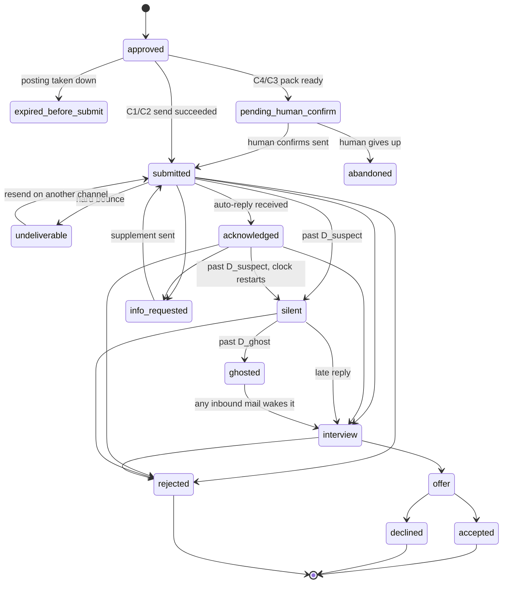

# Delivery Layer and Status Tracking

> This document belongs to the `ai-career` analysis and planning series. Upstream is [`07-review-gate.md`](./07-review-gate.md) (approval gate), downstream is [`09-analytics-feedback.md`](./09-analytics-feedback.md) (analytics and feedback). For data structures, cross-reference [`03-data-model.md`](./03-data-model.md).

---

## 1. This Layer's Responsibilities and Boundaries

The delivery layer is responsible for five things and nothing else:

1. **Mechanical checks (preflight)**: catch the low-level errors that get a good artifact thrown away within three seconds.
2. **Pick a channel and execute the send**: channels are tiered by degree of automation; the more automated the channel, the higher the risk and the narrower the applicability.
3. **Confirm it really went out**: including backfilled confirmation for manual channels, and bounce detection.
4. **Write an immutable delivery record**: which version of the bytes went out, at what time, to whom, over which route.
5. **Turn responses from the outside world (mostly email) into state-transition events**, and make a ruling when there is no response.

**Not done here**: it does not generate content (that is [`06-content-assembly.md`](./06-content-assembly.md)), does not make the final quality judgement (07), does not produce decision recommendations (09). What the delivery layer receives is a set of **approved, frozen** artifacts.

### 1.1 Six Changes to the Original Architecture

The original flow sketch wrote the delivery layer as a three-way choice between "Playwright semi-automated / email / manual", with tracking as a single arrow at the end. What follows is the original thinking → why it changed → what it became.

| # | original thinking | why it changed | what it became |
|---|---|---|---|
| 1 | Send as soon as approval passes | Human approval judges whether the content is good, but most send failures are mechanical (wrong company name, broken PDF, 404 link). Mixing the two fatigues the reviewer, and humans have a high miss rate on repetitive checks | Split out an independent **preflight gate**: pure machine, re-runnable, fail means block |
| 2 | Put preflight after approval | Finding out only after a human review that the PDF has no embedded fonts wastes the most expensive resource in the whole system | **Run it twice**: early, **before** entering the 07 queue (blocking artifacts that should not waste human eyes), and final again **before** sending (verifying the content has not changed since approval and the posting is still live) |
| 3 | List "official API" alongside "email" as a primary channel | The ingestion side has plenty of usable APIs; the **delivery side has almost none**. Submission endpoints on mainstream ATSs are employer-permissioned, and a job seeker cannot get them. If this asymmetry is not stated plainly, planning will badly overestimate how much can be automated | Keep an adapter interface for the API channel but mark it a placeholder; not implemented in v1. The primary channels are email and manual |
| 4 | Tracking is an arrow at the end of the flow | Tracking is in fact a long-running "fetch mail → classify → event" service, and it reads the **same mailbox** as ingestion (recruiter mail, job alert mail). Splitting it in two means two IMAP connections, two deduplication paths, two sets of credentials | Merge into a single `MailWorker`: fetch mail once, classify, then triage to ingestion or tracking. See [`04-ingestion.md`](./04-ingestion.md) |
| 5 | Manual submission = done the moment it is sent | The actual send for T4/C4 happens **somewhere the system cannot see**. Without backfill, the system mistakes "the human forgot to paste it" for "they read it and did not reply", polluting every statistic in 09 | Manual channels enter `pending_human_confirm` first; only when the human presses "I have sent it" does it move to `submitted`. Unconfirmed after 48 hours, it returns to today's to-do list |
| 6 | Follow-up has no clear owner | A follow-up message is a complete small loop of "generate content → human approval → send", sharing the gate with the main flow | Follow-up belongs to the delivery layer, goes through the same 07 gate, plus one extra layer of **global harassment throttling** |

---

## 2. Delivery Channel Tiers

Ordered by automation × risk. **The default is the lowest-risk viable channel, not the most automated viable channel.**

> Naming note: this document uses `C1–C4` (Channel) for channel tiers, to avoid confusion with the day-threshold symbols in §5.5.

| Tier | Channel | Automation | ToS risk | Maintenance cost | Where it applies |
|---|---|---|---|---|---|
| **C1** | Direct email submission | High (assembled automatically, human presses send) | None | Very low | Recruiters, startups, small companies, referrals, postings with a named HR mailbox |
| **C2** | Official API / explicitly permitted integration | High | None | Low (but the permission is almost never obtainable) | Placeholder, see §2.2 |
| **C3** | Semi-automated Playwright | Medium (form filled automatically, sending handed to the human) | Low but non-zero | **High** | Only for the 1–2 highest-frequency ATSs with stable forms; recommend not doing it in v1 |
| **C4** | Pure manual Apply Pack | Low (the system only prepares the materials) | None | Very low | Everything else, including every platform that requires login, has a CAPTCHA, or forbids automation in its ToS |

```
                 Named recipient email available?
                        │ yes → C1 Email
                        │ no
                 Official submission API available and permitted?
                        │ yes → C2 API
                        │ no
          Annual submissions to this ATS ≥ threshold (§8.1) and no login/CAPTCHA?
                        │ yes → C3 Playwright semi-automated
                        │ no
                        └───→ C4 Apply Pack (default landing spot)
```

> **C4 is the default landing spot, not a failure.** The system's value is spending human time on judgement rather than typing; pasting five fields takes two minutes, and that is acceptable.

### 2.1 C1 — Direct Email Submission

The cleanest route: entirely legal, touches no platform's automation detection. "Highest reply rate with recruiters and small companies" is **speculation and needs verification against your own data** (09 computes reply rate grouped by `channel`).

Implementation points:

- **Send mechanism**: Gmail API `users.messages.send`, or SMTP plus an app password. Credentials live in the OS keychain (Windows DPAPI / macOS Keychain), never in a plaintext config file on disk.
- **Thread binding**: record the `Message-ID` on send; follow-ups carry `In-Reply-To` and `References` so the recipient sees one conversation rather than three orphaned messages. This is also the most reliable anchor for matching replies.
- **Correlation key**: lets a reply map unambiguously to an Application.
  - Option A: Gmail plus-address `me+app-01J8Z@gmail.com`. Zero cost, but **some forms reject emails containing `+`** (needs verification).
  - Option B: own-domain catch-all, `app-01J8Z@apply.example.com`. Cleanest, but it needs a domain and correct SPF/DKIM/DMARC, or the mail lands in spam.
  - **Recommendation**: use option A or B for C1; when filling third-party forms always use the clean primary address and fall back on the fuzzy matching in §5.4.
- **Resolving the conflict with preflight**: preflight checks that the contact details on the résumé match the email used to send, but the correlation key deliberately makes the two differ. The fix is that **the résumé body always prints the primary address**, and the correlation key appears only in the envelope sender; the consistency check compares the local part with `+tag` stripped. If this is not written down explicitly, the implementation will trip over a check it set for itself.
- **Explicitly forbidden**: no tracking pixel, no read-receipt detection of whether the recipient opened the message. That violates product principle 3 (do not fight, do not deceive); the cost of being caught far exceeds the intelligence value.
- **Send time**: can be scheduled to avoid the middle of the night. "Tuesday through Thursday mornings get higher reply rates" is a widely repeated claim on **weak evidence — do not treat it as fact**; randomize first, and let 09 judge whether there is a signal once 50+ records have accumulated.
- **Send rate**: personal accounts have a daily send cap (the actual threshold for a free Gmail account **needs verification**). In practice fewer than 10 a day will not come near it, but still set a `max_sends_per_day` cap so a runaway script loop cannot blow past it.

### 2.2 C2 — Official API (Placeholder, Not Implemented by Default)

This tier has to state the current reality honestly or planning goes off the rails. Every endpoint and permission description in the table below **needs verification**; see §10 for how.

| ATS | Read postings | Programmatic submission | Notes |
|---|---|---|---|
| Greenhouse | Public Job Board JSON exists (shaped like `boards-api.greenhouse.io/v1/boards/{token}/jobs`, **needs verification**) | A submission endpoint exists, but **presumably requires an employer-issued Job Board API key** | If true, the job-seeker side cannot obtain a key, so it is unusable in practice |
| Lever | Public postings endpoint exists (shaped like `api.lever.co/v0/postings/{company}`, **needs verification**) | The endpoint exists, permission model **needs confirmation** | Test against a public test posting whether a keyless POST is accepted |
| Workday | No public API (inferred) | None | Each tenant needs its own account registration; manual only |
| LinkedIn / Indeed | Limited | ToS presumably forbids automated submission | **Explicitly excluded**, see [`10-risk-compliance.md`](./10-risk-compliance.md) |
| 104 / CakeResume / Yourator | Some have public posting pages | Requires on-site login | ToS and robots.txt **need verification**; default to C4 |

**Conclusion**: C2 stays on the architecture diagram; not implemented in v1. If some company ever grants submission access (a referral channel, a partner recruiter system), the adapter interface is already in place.

### 2.3 C3 — Semi-Automated Playwright: Where the Line Is Drawn

**How**: Playwright opens a **headed, user-visible** browser, navigates to the application page, fills the fields, attaches the files, scrolls to sit beside the submit button, and then **stops and hands control to the human**. The human reviews the screen themselves and presses that final submit button themselves.

**Why the line is drawn at the final button** — four reasons, each standing on its own:

1. **Do not hide the automation**: the browser is visible, the User-Agent is not spoofed, no stealth plugins, no anti-detection scripts injected.
2. **Do not get around CAPTCHAs**: on hitting a CAPTCHA, a login wall, or device verification, stop and fall back to C4. Never call a CAPTCHA-solving service.
3. **The human performs the final send = human-in-the-loop preserved**: making the human press that button with their own hand is the implementation least likely to be bypassed, because it is physically a human doing it.
4. **Matches the spirit of the ToS, not merely its letter**: what most ATS terms forbid is automated bulk submission. **This is an interpretation, not legal advice**; if a platform explicitly forbids any auto-fill tool, do not do that platform.

**Engineering constraints**:

- Selectors always use **semantic locators** (`getByLabel('First Name')`, `getByRole('button', { name: /submit/i })`), never CSS classes or XPath paths; the former survive redesigns far better.
- Every adapter must implement `degrade()`: a failure at any step does not throw and stall, it **leaves the already-filled portion on screen and generates a C4 Apply Pack** for the human to take over.
- Take and store a screenshot automatically before sending (evidence for the delivery record, §4).
- **Never auto-tick** any agreement-to-terms, EEO self-identification, salary expectation, or visa status field. Those are left blank for the human.

### 2.4 C4 — Apply Pack

The system produces a folder plus a local web page, and the human pastes from it.

```
apply-pack/{application_id}/
├── WangDaMing_SeniorBackendEngineer_Resume_202609.pdf
├── WangDaMing_SeniorBackendEngineer_CoverLetter_202609.pdf
├── cover-letter.txt          # plain-text version, easy to paste into a textarea
├── form-fields.md            # field crosswalk, one copy button per field
├── links.md                  # portfolio / GitHub / LinkedIn (liveness verified)
└── preflight.md              # check results, including the warning list
```

`form-fields.md` is a **question-and-answer crosswalk** covering the common ATS fields (name, email, phone, LinkedIn, portfolio, current salary, expected salary, available start date, whether a work visa is required, Why this company). Each cell has a "copy" button. **Fields that need judgement, like "Why this company", get a draft, not a final version**, explicitly labelled "confirm manually before pasting".

At the bottom of the Apply Pack page is an "I have sent it" button; only when it is pressed does a Submission get written and the state move to `submitted` (§1.1, change 5).

---

## 3. Preparation Before Sending

This section corresponds to the "bid submission" task in a bid/RFP response management system.

### 3.1 Deadline Management

The difference between job seeking and bidding: **most postings have no hard deadline, but they do have a very real soft one**.

| Type | Source | Handling |
|---|---|---|
| Hard deadline | Campus recruiting, government postings, visa intake cohorts, JDs that state a deadline outright | Store `hard_deadline`, escalate reminders at T-3 / T-1 days |
| Soft deadline | Ordinary postings | `soft_deadline = posted_at + 14d` (**an initial guess that must be calibrated against your own data**: 09 correlates "sent on day N after posting" against "received a reply") |
| Internal SLA | From approval to send | **≤ 24 hours**. Past that, re-run the final preflight, because the JD may already be down or revised |

Before sending, always run a **liveness check**: re-request the job URL; if it 404s or shows as closed, abort and mark `expired_before_submit`. This is the direct counterpart of a bid system confirming the tender is still open.

### 3.2 Preflight Checklist

Fully machine-executed, split into **BLOCK** (stop it) and **WARN** (show it but let it through). Items marked `early` run before human review.

| Check | Level | When | Notes |
|---|---|---|---|
| **Cross-submission contamination**: the artifact contains another company's name / another job title | BLOCK | early | See the false-positive handling below |
| LLM output residue: `[Insert`, `[Company Name]`, `As an AI`, unrendered `**` or `##` | BLOCK | early | A regex is enough |
| PDF text is selectable (not a scanned image) and fonts are embedded | BLOCK | early | Use `pdftotext`; fewer than 100 extracted words counts as a failure |
| Filename matches `{EnglishName}_{Position}_{DocType}_{YYYYMM}.pdf` | BLOCK | early | Their inbox holds hundreds of files called `resume.pdf` |
| File size ≤ 5 MB, format on the target form's accepted list | BLOCK | early | 5 MB is a common cap (**needs verification**; it varies by ATS) |
| Name / email (with `+tag` stripped) / phone on the résumé match the values entered in the form | BLOCK | final | A mismatch makes the ATS create a duplicate candidate record |
| Portfolio / GitHub / personal site links are reachable and not private | BLOCK | final | HEAD first, fall back to GET on 403/405; repeated network errors downgrade to WARN and are marked "could not verify" |
| Content hash matches the hash at approval time | BLOCK | final | Prevents content being altered after approval |
| Duplicate submission to the same company within 90 days | BLOCK | final | Block when the same `company_id` already has an active application and the job titles are highly similar, so the same posting is not submitted twice from two sources |
| Cover letter has a named recipient (not "Dear Hiring Manager") | WARN | early | If none can be found, let it go; not worth blocking on |
| Résumé is ≤ 2 pages (≤ 3 for senior) | WARN | early | |
| Must-have requirements from the JD have a corresponding section in the résumé | WARN | early | Carried in from the 05 scoring results |

**False-positive handling for cross-submission contamination** (the first draft missed this, which would force the check to be switched off in practice): a résumé legitimately contains the names of former employers, clients, and open-source organizations. So the matching logic is:

```
flag(name) = name ∈ company_roster(target companies previously engaged)
           ∧ name ∉ own_history_entities(own-experience entities registered in the content library)
           ∧ name ≠ this submission's target company
```

`own_history_entities` is maintained by the content library (see 06); it is an explicit allowlist, not a heuristic.

The preflight report is stored and linked to the delivery record — the bid system's pre-submission sign-off sheet.

---

## 4. Delivery Record (Submission)

**Append-only; an existing row is never updated.** State changes are written as timeline events, never overwriting the original record. One Application can have several Submissions (supplementary documents, re-application).

```ts
type Submission = {
  id: string;                   // ULID
  application_id: string;
  channel: 'email' | 'api' | 'playwright_assisted' | 'manual_pack';
  outcome: 'sent' | 'send_failed' | 'aborted_preflight' | 'aborted_by_human';

  // what was sent — must be frozen
  artifacts: Array<{
    kind: 'resume' | 'cover_letter' | 'portfolio_link' | 'answers';
    blob_path: string;          // the actual bytes that were sent, not something regenerated
    sha256: string;
    template_version: string;   // corresponds to the content library version in 06
  }>;

  // to whom
  recipient?: { email: string; name?: string; role?: string };
  ats?: { vendor?: string; job_url: string; req_id?: string };

  // when, and who pressed it
  submitted_at: string;         // ISO8601 with timezone
  actor: 'human' | 'human_assisted';   // no 'system': a send always involves a human
  approval_id: string;          // points at the 07 approval record
  preflight_report_id: string;
  idempotency_key: string;      // hash(application_id + artifact hashes + channel)

  // evidence
  form_snapshot?: Record<string, string>;  // the field values C3 actually submitted
  screenshot_path?: string;                // final screen for C3/C4
  outbound_message_id?: string;            // Message-ID for C1
  correlation_key?: string;                // plus-address or catch-all address

  // delivery
  delivery?: {
    bounced: boolean;
    bounce_type?: 'hard' | 'soft';
    bounce_detected_at?: string;
  };
  confirmation?: {
    expected: boolean;
    received_at?: string;
    inbound_message_id?: string;
    detected_by: 'rule' | 'llm' | 'human';
  };
};
```

**Why store the actual bytes and not just a template ID plus parameters**: the content library keeps evolving. When an interview invitation arrives three months later, you must be able to reproduce exactly the version of the résumé they saw, or what you say in the interview will not line up with what is on the page. It is also the precondition for 09's version-effectiveness analysis.

**Why `idempotency_key`**: a send API timing out after the mail has in fact been delivered is a common situation. Before retrying, look up a Submission with the same key, so the recipient does not get two identical messages.

---

## 5. Status Tracking

### 5.1 State Machine



Key design point: `ghosted` is **not a terminal state**. Any inbound message that can be matched pulls it back to active. In practice, a reply arriving three months later is not rare.

### 5.2 Delivery Failure and Bounces

The first draft did not handle this, and it directly corrupts the statistics: on a hard bounce (`550`, a DSN report) the Application never arrived at all, yet it walks all the way to `ghosted` and gets counted by 09 as "submitted, no response".

- `MailWorker` detects bounces: sender is `MAILER-DAEMON` / `postmaster`, `Content-Type: multipart/report; report-type=delivery-status`, or the body contains the original `Message-ID`.
- Hard bounce → `undeliverable` plus an entry on today's to-do list, offering "switch to C4" or "find another contact".
- Soft bounce (mailbox full, transient) → retry once after 24 hours; only if that fails too is it handled as a hard bounce.
- An `undeliverable` Application **does not count in 09's reply-rate denominator**.

### 5.3 Reply Parsing (Inbound Pipeline)

```
IMAP/Gmail fetch
   ↓
[1] Rule layer: sender domain match + subject regex + List-Unsubscribe header
   ↓ hit → high-confidence classification, emit the event directly
[2] Binding layer: In-Reply-To/References → correlation_key → (company domain + fuzzy title match + time window)
   ↓
[3] LLM layer: only handles what the rules missed. PII masking before sending, and only the subject + first 1500 characters
   ↓
[4] Confidence triage: high → automatic transition; medium/low → into the 07 manual queue
```

**Classification taxonomy**: `ack` (receipt auto-reply), `rejection`, `interview_invite`, `scheduling`, `info_request`, `offer`, `recruiter_new_role` (handed to ingestion), `noise`.

**Misclassification costs are severely asymmetric**, so the degree of automation has to be tiered:

| Class | Auto-transition? | Reason |
|---|---|---|
| `ack` | Yes | The cost of a misclassification is near zero |
| `rejection` | Conditionally: yes, but keep a 7-day undo and delete no data | Mistaking an interview invitation for a rejection is catastrophic |
| `interview_invite` / `offer` / `info_request` | No, always notify the human | Time-sensitive, and needs a human reply |
| `noise` | Yes | |

> **An objection**: you could argue that even `rejection` should not be automated. Below 10 submissions a week, manual classification is cheap enough that this whole pipeline is not worth writing. **The recommendation is to run it by hand for 4 weeks, count the actual mail volume, and only then decide whether to implement the LLM layer.**

### 5.4 Feasibility of Tracking ATS Status Pages

Conclusion: **not feasible in most cases, and not recommended.**

| Situation | Feasibility |
|---|---|
| Greenhouse / Lever hosted application pages | Most have no candidate portal; status arrives only by email, so **the mailbox is the only reliable source** |
| Workday (`*.myworkdayjobs.com`) | Has a Candidate Home status page, but **each tenant is a separate account**. Automated login polling means storing dozens of passwords plus a high chance of tripping MFA and bot detection — **do not do it** |
| Taleo / SuccessFactors | Same as Workday |

**Recommended approach**: for postings that have a status page, store only the URL and list it on a weekly manual check list for the human to open. Do not build automated login for this.

### 5.5 Ghosted Ruling Rules

Thresholds **vary by channel**, and an `ack` resets the clock (a receipt confirmation is not a response). `D_suspect` is when you start to suspect no response; `D_ghost` is when it is ruled ghosted.

| Channel / recipient | D_suspect | D_ghost |
|---|---|---|
| Direct email to a recruiter / small company | 7 days | 21 days |
| Direct email to a named HR contact | 10 days | 30 days |
| Large-company ATS (C3/C4) | 21 days | 45 days |
| After an `ack` (clock restarts) | +14 days | +45 days |

The ruling happens in a **once-daily batch job**, never firing a real-time notification (reasons in §8.4).

---

## 6. Runtime Environment and Scheduling

This is a tool for one person, running on a laptop that gets shut down, loses network, and gets carried to a coffee shop. That reality determines the scheduling design.

- **No resident daemon, no message queue, no Redis/Celery/Kafka.** All state lives in a single SQLite database plus a filesystem blob store (see [`11-tech-stack-roadmap.md`](./11-tech-stack-roadmap.md)).
- **Batch jobs use catch-up semantics**: each job records `last_run_at`; on application startup, check what should have run but did not and run it then. Missing a day has no consequence at all, because the ghosted ruling is day-grained to begin with.
- **Mail fetching can be more immediate**: pull every 10 minutes while the application is open; do not pull when it is closed. During a job search there is no message that has to be handled within 30 seconds.
- **The only case that needs an OS-level scheduler** is wanting to receive mail while the application is closed. If that is genuinely needed, have Windows Task Scheduler / launchd fire a CLI subcommand once a day; do not write a service for it.

---

## 7. Follow-Up Cadence

### 7.1 Rules

- **First**: **D+7 to D+10** after sending.
- **Second (and last)**: **+10 days** after the first, and the message states plainly that this is the last contact.
- **Cap: at most 2 messages per posting.** After that, mark `closed_no_response` and send nothing further.
- **Precondition**: there must be a named, or at least deliverable, human address. **Do not send follow-ups into an ATS black hole with no person's name and no mailbox** — nobody would see them anyway.
- **Global throttle**: follow-ups across **any posting** at the same company total no more than 2 in 30 days. This avoids applying to three postings at once and the recipient getting six messages.
- **Exception quota**: a thank-you note within 24 hours after an interview does not count against the quota, but it still goes through the approval gate.
- **When the subject line may use `Re:`**: only when you are genuinely replying to your own original message with `In-Reply-To`. Faking `Re:` to a recipient who has no original thread is a small deception and violates product principle 2.
- **Follow-ups are bound by the same honesty constraints**: do not imply interactions that never happened ("as we discussed last time", when you did not, is fabrication).

### 7.2 Templates

**First (D+7 to D+10)**

```
Subject: Re: Application for {job title}

Hi {recipient name},

I submitted my application for {job title} on {date} and wanted to confirm my résumé arrived safely.

I am particularly interested in {a specific technology or product area from the JD}, and my experience
with {a real piece of history from the content library} should apply directly. If you need anything further from me, just let me know.

Thank you for your time.
{name}
```

**Second (and last)**

```
Subject: Re: Application for {job title}

Hi {recipient name},

I will not take up more of your time; this is my last follow-up. If this role is not the right direction right now, I completely understand.
If a related opportunity comes up later, please feel free to reach out.

{name}
```

### 7.3 Where the Line Is

Explicitly forbidden: more than 2 messages for the same posting, consecutive sends within 48 hours, forwarding to the recipient's manager or CEO, carpet-bombing with a LinkedIn DM and an email at the same time, re-applying to the same posting from different email addresses. **The cost of crossing the line is being flagged by the company as a problem candidate, and that is usually permanent** — a direct violation of product principle 4 (fewer but better).

---

## 8. Pain Points: Where This Design Will Hurt

### 8.1 Playwright Auto-Fill Costs More to Maintain Than the Time It Saves

Rough numbers (**all estimates, not measured**):

| Item | Estimate |
|---|---|
| First version of a single ATS adapter | 4–8 hours (take 6) |
| Repairs caused by front-end redesigns | 1–3 hours each, 2–4 times a year (take 6 hours/year) |
| **First-year cost** | ≈ 12 hours = 720 minutes |
| Pasting one application by hand | 5–8 minutes (take 6.5) |
| **Still required per application even with C3** | About 2 minutes (review the screen, fill in the judgement questions, press send) |
| **Net saving per application** | ≈ 4.5 minutes |

**Break-even point**: `720 ÷ 4.5 ≈ 160` — **it only pays off if you submit more than about 160 times to the same ATS in the first year**. An individual job seeker's total for one round is usually 30–80 submissions, spread across 5–10 different ATSs. Note that the first draft's arithmetic ignored the item "C3 is not free to use", so the real threshold is higher than intuition suggests.

> **Honest conclusion: for the overwhelming majority of individual users, C3 should not be built at all.** Its reason for existing in this document is "if your target companies are highly concentrated on a single ATS and you are submitting more than 100 times" — a minority situation, not the default. For v1 the recommendation is to **skip C3 outright** and put the engineering time into preflight and reply parsing, both of which every single submission uses.

### 8.2 When Not to Do Auto-Fill at All

Hitting any one of these downgrades to C4:

- The form has a CAPTCHA or any bot detection
- Account registration / login / MFA required
- The ToS explicitly forbids automation tools
- You will apply to this company exactly once in your life
- There is a multi-step questionnaire: EEO self-identification, salary expectations, visa status, "where did you hear about this posting" — **getting these wrong is expensive, and they are things a human should be thinking about anyway**
- Only `.doc` or another format needing special conversion is accepted
- There are dynamically dependent fields (B only appears once A is selected)

**A cheaper alternative**: rather than writing a Playwright adapter, build a browser bookmarklet or a user script that reads the local Apply Pack's JSON and injects a "fill" button into the page. The maintenance surface is an order of magnitude smaller than Playwright's, and it preserves human-in-the-loop naturally, because the whole process already happens in the human's own browser. The downsides, stated honestly: reading local files cross-origin needs a local HTTP endpoint to cooperate, and each ATS still needs its own field mapping written out — you just do not have to maintain a whole browser automation stack.

### 8.3 Other Places It Will Hurt

- **Plus-addresses rejected by forms**: the correlation key strategy may fail exactly where it is needed most (third-party forms), degrading to fuzzy matching with lower accuracy.
- **Email deliverability**: sending from your own domain with SPF/DKIM/DMARC misconfigured goes straight to spam, and **you will not know**. Mitigation: BCC a second mailbox on the first 10 messages to verify delivery.
- **The long tail of reply parsing**: mail that mixes Chinese and English, image-only HTML mail, forwarded mail from outsourced recruiting platforms — the rule layer's hit rate may be far below expectation. **Needs verification**: collect 100 real replies as a labelled set, measure the rule layer's coverage, then decide whether the LLM layer is necessary.
- **PII sent to the cloud**: replies may contain personal data and salary figures. If the masking before the LLM call is not clean, that violates product principle 5. Mitigation: the classification task is simple enough, so prefer a local small model.
- **The human confirmation step gets ignored**: if the human cannot be bothered to press C4's "I have sent it" button, the statistics break anyway. This part is unsolvable by design; all you can do is keep poking with "unconfirmed items return to today's to-do list", and mark "N records unconfirmed" on 09's reports rather than quietly counting them as sent.

### 8.4 Psychological Cost

A dashboard showing "23 ghosted" in real time will destroy morale if you look at it every day, and morale is the scarcest resource during a job search. Design mitigations:

- The ghosted ruling runs as a **daily batch**, and the results are **presented only in a once-weekly review**, never as a real-time push.
- The main screen shows only "N things that need your judgement today", never a cumulative failure count.
- Rejection letters are **collapsed by default** once classified automatically, with no popup per message.

---

## 9. Phased Rollout

| Phase | Scope |
|---|---|
| **P0 (usable baseline)** | C1 email + C4 Apply Pack; the BLOCK items in preflight (early + final); Submission records; human confirmation and manual status updates |
| **P1** | Mail fetch → rule-layer classification → automatic `ack` / `rejection` transitions (with 7-day undo); bounce detection; batch ghosted ruling |
| **P2** | Follow-up scheduling and throttling; LLM classification layer (only if P1's statistics show the rule layer's coverage is insufficient) |
| **P3 (conditional)** | C3 Playwright, and **only started when 09's data shows a single ATS accounts for > 40% of submissions and the total is already close to the §8.1 threshold** |

---

## 10. Open Verification Items

| # | Fact to verify | How to verify |
|---|---|---|
| 1 | The actual endpoint shape of the Greenhouse Job Board API, and whether the submission endpoint requires an employer-issued key | Read the authentication chapter of Greenhouse's official Job Board API documentation; issue a real read request against a known public board token and observe the response |
| 2 | The path of the Lever postings API and the permission model of its submission endpoint | Read Lever's official API documentation; test a keyless POST against a public test posting and record the response code |
| 3 | Whether Workday has any public candidate-facing API | Read Workday's developer documentation; sample 2–3 `*.myworkdayjobs.com` tenants and observe the network requests |
| 4 | The specific ToS clauses of LinkedIn / Indeed / 104 / CakeResume / Yourator on automated submission and auto-fill | Read each site's terms of use and robots.txt, extract the original clause numbers into [`10-risk-compliance.md`](./10-risk-compliance.md), and note the date consulted |
| 5 | Whether mainstream ATS forms accept email addresses containing `+` | Find one public form each on Greenhouse / Lever / Workday, enter a plus-address without submitting, and watch whether front-end validation errors |
| 6 | Attachment size caps and accepted formats per ATS | Same as above, from the help text on the form's attachment field; or use a 6 MB test file and observe the front-end rejection message |
| 7 | The daily send cap on a personal Gmail account and the actual behaviour when the limit trips | Read Google's official sending-limits documentation; in practice, set `max_sends_per_day` to a conservative value first |
| 8 | Whether "Tuesday through Thursday mornings get higher reply rates" holds | Randomize send times, accumulate 50+ records, and let 09 run a statistical test; do not schedule on this basis before then |
| 9 | Whether the 14-day soft deadline assumption is reasonable | Have 09 correlate "sent on day N after posting" with "received a reply", and recalibrate on your own data |
| 10 | The rule layer's coverage of real replies | Collect 100 real replies as a labelled set, measure precision/recall, then decide whether the LLM layer is needed |
| 11 | Whether C1 really does have a higher reply rate than C4 with recruiters and small companies | Have 09 compute it grouped by `channel`; treat it as a hypothesis until the sample is large enough |

---

## 11. Related Documents

[`00-overview.md`](./00-overview.md) · [`03-data-model.md`](./03-data-model.md) · [`04-ingestion.md`](./04-ingestion.md) · [`05-scoring-triage.md`](./05-scoring-triage.md) · [`06-content-assembly.md`](./06-content-assembly.md) · [`07-review-gate.md`](./07-review-gate.md) · [`09-analytics-feedback.md`](./09-analytics-feedback.md) · [`10-risk-compliance.md`](./10-risk-compliance.md) · [`11-tech-stack-roadmap.md`](./11-tech-stack-roadmap.md)
