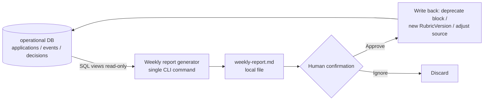

# Analytics Layer and Feedback Loop

> The counterpart to a bid/RFP response management system's "win-rate analysis". The main conclusion of this document: **an individual job search will never have enough samples to support statistical inference**, so this layer must be downgraded from "find out what works" to "direct attention + generate hypotheses + control cost + audit your own consistency". The downgrade is not conservatism, it is honesty — an analytics layer that emits percentages at n=6 produces false belief, not insight.

Related documents: [07-review-gate.md](./07-review-gate.md) (source of the decision labels), [05-scoring-triage.md](./05-scoring-triage.md) (rubric and triage thresholds), [03-data-model.md](./03-data-model.md) (events and state machine), [08-delivery-tracking.md](./08-delivery-tracking.md) (response event capture), [06-content-assembly.md](./06-content-assembly.md) (content library), [10-risk-compliance.md](./10-risk-compliance.md) (sensitive data leaving the machine), [11-tech-stack-roadmap.md](./11-tech-stack-roadmap.md) (phasing).

---

## 1. Boundaries and Three Invariants

Nail the boundaries down first, or this layer will expand without limit.

| Invariant | Content | Rationale |
|---|---|---|
| **A. Read-only** | The analytics layer only reads the operational DB defined in [03-data-model.md](./03-data-model.md); it owns no tables of its own. Every metric is a SQL view | No second source of truth, no ETL, no sync problems, recomputable at any time |
| **B. Write-back must pass human approval** | The analytics layer may "suggest" deprecating a ContentBlock or adjusting rubric weights, but every write-back action is listed in the weekly report waiting for you to confirm | Product Principle 1 (human-in-the-loop cannot be skipped). Automatic write-back lets noise change system behavior directly |
| **C. Refuse to emit when the denominator is short** | When a ratio's denominator is below threshold, show only the raw numerator/denominator, never a percentage | See §4. The human brain automatically grants a percentage a precision it does not have |



**Explicitly not done**: data warehouse, dbt, Metabase / Grafana / Superset, event streaming, interactive web dashboard. This is a tool for one person; the whole layer's implementation budget is roughly 300 lines of SQL + 100 lines of template rendering. Rationale in §10.3.

---

## 2. Observability: What You Can Actually Measure

The first principle of a metric system is **do not define what you cannot measure**. An enterprise bid system can compute a win rate because outcomes arrive as formal documents; job hunting is not like that — for the vast majority of submissions the outcome is "no outcome".

| Signal | How it is obtained | Reliability | Notes |
|---|---|---|---|
| Send timestamp, delivery channel | Written by the system itself | High | The only fully trustworthy batch |
| LLM token usage and cost | The usage field of the API response | High | Recorded per call |
| Human review minutes | Review UI heartbeat | Medium-high | Implementation below |
| Time to first response | Email parsing / manual backfill | Medium | An auto-acknowledgement does not count as a response, needs classification |
| Interviews, offers | Almost exclusively manual backfill | **Medium-low, and the missingness is non-random** | See §9.5 |
| ATS internal state (read, opened by the HM) | Unobtainable | — | Do not design metrics that depend on it |
| "Why I was rejected" | Unobtainable in practice | — | Rejection letters are overwhelmingly canned text (speculation, needs verification: see §11) |

**How to actually measure review time** (do not use wall-clock time from "opened ~ submitted"; it gets polluted by leaving the window open while you go eat):

```
The review UI sends a heartbeat every 30 seconds,
  condition: document.visibilityState === 'visible'
       and a keyboard/mouse/scroll event within the last 300 seconds
active_minutes = heartbeat count × 0.5
```

Be honest about the error sources: if you stare at the screen thinking without touching the mouse for more than 5 minutes, that stretch is counted as idle. This **underestimates** thinking time. Accept the bias, because the bias in the other direction (counting lunch as review cost) would invalidate the entire cost argument.

### 2.1 Non-response is censored data, not a negative sample

**No response ≠ rejected.** It is censored data — all you know is "no response so far". Feeding it into any model as a negative label means learning a target dominated by noise.

Engineering compromise: **mark as `ghosted` after N days with no response of any kind**; present it separately from explicit rejections in analysis, never merged into "failure".

The default for N is 21 days, but this is **an uncalibrated guess, not a fact**. Calibration method (low risk, worth doing): compute the empirical distribution of "send → first response" latency over the responses you have already received, and take P95 as N. When cumulative responses < 20, that quantile is itself wildly unstable, so:

- Responses < 20: stay with 21 days, and mark "threshold not calibrated" in the UI.
- Responses ≥ 20: recompute P95 once a quarter, with the change capped at ±50%.

This is the only cost-effective use of survival analysis in this project. **No Kaplan–Meier curve comparisons**: at n=72 the KM confidence bands are wide enough that no two curves can be told apart, and plotting them only makes people believe they have seen a difference.

---

## 3. Metric System (Layered)

Four layers; the higher the layer, the less trustworthy. Lay them out in this order in the UI, with **the untrustworthy ones at the bottom and annotated with sample size**.

### L0 — Counts (fully trustworthy)

`ingested` / `deduped` / `scored` / `shortlisted` / `assembled` / `approved` / `submitted` / `responded` / `interviewed` / `offered`.

All of them are `COUNT(DISTINCT app_id)` over `application_events`, grouped by `event_type`. Sketch (actual table names per [03-data-model.md](./03-data-model.md)):

```sql
CREATE VIEW v_funnel AS
SELECT
  campaign_id,
  COUNT(DISTINCT CASE WHEN e.type='ingested'  THEN e.app_id END) AS ingested,
  COUNT(DISTINCT CASE WHEN e.type='submitted' THEN e.app_id END) AS submitted,
  COUNT(DISTINCT CASE WHEN e.type='responded'
        AND e.payload->>'kind' <> 'auto_ack'   THEN e.app_id END) AS responded
FROM application_events e
GROUP BY campaign_id;
```

Note `campaign_id`: **statistics are never merged across job-search rounds**. The market two years ago, your résumé and your seniority were all different; merging only manufactures a fake large sample. Each round is one `SearchCampaign`, and by default all analysis stays inside a single campaign.

### L1 — Conversion rates (trustworthy when the denominator is large)

```
Ingested 1,240 ────────────────────────────────────  (3 months, illustrative numbers)
  │ after dedup 620                       (50.0%)
Scored    620 ────────────────────────────
  │ into shortlist 96                     (15.5%)   ← set by a threshold, not "performance"
Assembled  96 ──────────
  │ sent to review 88                     (91.7%)
Reviewed   88 ─────────
  │ approved 72                           (81.8%)   ← an 18% send-back rate is an important signal
Submitted  72 ────────
  │ responded 6                           (6 / 72)  ← denominator fine, numerator short, no % shown
Interview   4 ─
  │ offer 1                               (4 → 1)
```

Three things: (1) the `shortlist` ratio is produced by **a threshold you set yourself**, not by an outside judgment of you — do not read it as performance; (2) the send-back rate is one of the few metrics with both a large enough denominator and a direct bearing on quality; (3) any ratio with a numerator under 10 is always shown as `6 / 72`, never `8.3%`.

### L2 — Time and cost (trustworthy, and the most underrated)

| Metric | Definition | Why it matters |
|---|---|---|
| Lead time (discover → submit) | Median, not mean | See §6.2; one of the few operational variables that is mechanistically sound |
| Queue age | P90 of days stuck in the review queue | Detects "the human has become the bottleneck" directly |
| Token cost / submission | input + output cost | Breakdown below |
| **Human minutes / submission** | active minutes of review + editing | **The real cost** |
| Total cost / offer | cumulative cost ÷ number of offers | The only meaningful summary metric, but n=1~3 — record it, do not interpret it |

**Cost breakdown** (splitting the estimate open is what makes it checkable, and what lets you replace it once your own usage data arrives):

| Component | Estimated tokens | Notes |
|---|---|---|
| system prompt + format spec | 0.5–1k | Fixed, a good fit for prompt caching |
| Full JD text | 0.8–3k | Depends on posting length |
| Retrieved content library candidate snippets | 3–8k | 10–20 ContentBlocks |
| 6–12 few-shot anchors | 3–8k | See §7.3 |
| Second self-critique call | resend context + 2–3k output | |
| Output (résumé sections + cover letter) | 1.5–3k output | |

That accumulates to roughly 15–40k input and 3–6k output per submission. At a mid-tier model's **US$3/M input, US$15/M output** (pricing needs verification, see §11), each submission costs about **US$0.09–0.21**; 80 submissions about **US$8–17** (roughly NT$250–550).

For the same 80 submissions, human review at 8–15 minutes each is **11–20 hours**. Even pricing your own time cheaply (NT$500/hr), the human cost is still **10–30×** the token cost.

> The conclusion is blunt: **this system's optimization target is not saving tokens, it is saving human minutes.** It is worth deliberately spending 2–3× the tokens (longer prompts, more few-shot, self-critique before emitting) to get the draft to the point where it only needs a light touch.

But the price has to be written down honestly, not just the benefit:

- Longer prompts **increase latency** (an extra 10–30 seconds per submission), which you feel when you want to run 20 at once.
- Self-critique readily produces a regression-to-the-mean effect where each pass gets blander, grinding memorable sentences into safe filler — which **increases** your editing load instead. So this trade-off has to be continuously validated against the "editing volume trend" in §8.1, not settled once.
- 3× tokens is still cheap, but if you later move to a high-end model (5–10× the unit price), the margin on this conclusion thins and it needs recomputing.

### L3 — Inferential metrics (untrustworthy by default, see the next section)

Between-group comparisons of reply rate, ContentBlock effectiveness, opening-line A/B.

---

## 4. Version Effectiveness Analysis — and Why It Is Almost Certainly Doomed

The original idea is natural: "which ContentBlocks appear in submissions that got a response? which cover-letter opening line performs best?" That is reasonable inside an enterprise bid system (hundreds to thousands of bids a year, accumulated over years); for an individual job search it **does not hold mathematically**.

What follows is pure arithmetic, not an external fact — you can check it yourself.

### 4.1 Statistical power

Normal approximation for two proportions, α = 0.05 two-tailed, power = 0.80:

```
n_per_group ≈ (z_{α/2} + z_β)² × [p₁(1-p₁) + p₂(1-p₂)] / (p₁ - p₂)²
            = 7.85 × [...] / (p₁ - p₂)²
```

Taking 8% as the baseline reply rate:

| Difference you want to detect | n per group | Total n | Reality |
|---|---|---|---|
| 8% → 8.8% (+10% relative) | ~18,900 | ~37,700 | Never possible |
| 8% → 12% (+50% relative) | ~880 | ~1,760 | Impossible |
| 8% → 18% (+10pp, more than double) | ~175 | ~350 | 2–5× a whole job-search round, still out of reach |
| 8% → 20% (+12pp, 2.5×) | ~130 | ~260 | Theoretically borderline, and it requires testing this one variable and nothing else throughout |

One job-search round usually totals 50–200 submissions (under the "fewer but better" principle, more likely closer to 50–80). **Even if some opening line really did double your reply rate, you could not detect it.**

### 4.2 The intuitive version: confidence intervals

For small-sample proportions use the Wilson score interval, not the normal approximation (the latter gives absurd lower bounds, even negative ones, when p and n are small).

- 72 submitted, 6 responded: Wilson 95% CI ≈ **[3.9%, 17.0%]**, a 4× spread between the ends.
- A ContentBlock that appears in 30 submissions, 4 of which got a response (13.3%): Wilson 95% CI ≈ **[5.3%, 29.7%]** — an interval that covers "worse than average" and "three times better than average" at once. It contains no actionable information.

### 4.3 Multiple comparisons make it worse

If the content library holds 40 ContentBlocks and you run a test on each, at α = 0.05 you **expect 2 false positives**. And the 2 you will notice are precisely the most extreme ones — that is, the 2 that look most like a discovery. A leaderboard-style UI actively pushes you into this trap.

### 4.4 Conclusion

**This system explicitly does not implement a ContentBlock effectiveness leaderboard and does not implement cover-letter A/B testing.** Not because it cannot be built (the SQL is trivial), but because building it would only produce false beliefs.

**An honest objection, and the conditions under which it holds**: if the user deliberately submits in bulk (500+ per round) and is willing to accept comparisons only on coarse-grained variables such as channel and timing, then the threshold in §4.1 could indeed be crossed. But that usage directly violates Product Principle 4 (fewer but better), and it damages reputation. Which is to say: making effectiveness analysis work requires first abandoning this system's core positioning — so it is not done.

---

## 5. The Pivot: The Three Things the Analytics Layer Should Actually Do

### 5.1 Funnel bottleneck diagnosis (signal is strong enough, do it first)

Why does this work when §4 does not? Because **the denominators are large and the differences are usually orders of magnitude, not 10%**. Seeing `submitted 72 → responded 6` (8%) next to `reviewed 88 → approved 72` (82%) tells you where the bottleneck is without any test at all.

Reading rules (deliberately hard-coded into the report generator to prevent over-reading):

> Only when the **ratio between two stage conversion rates is > 2×** and **the denominator is > 30** does it count as an actionable signal; otherwise it is always labeled "insufficient sample".

| Bottleneck stage | Possible cause | Action |
|---|---|---|
| ingest → shortlist extremely low (<5%) | wrong sources, rubric too strict | Adjust the sources in [04-ingestion.md](./04-ingestion.md), or loosen the threshold |
| shortlist → approved low (high send-back rate) | poor assembly quality | Read the send-back reason codes, fix the prompt / template |
| approved → submitted backing up | the delivery layer is stuck (too many platforms need manual work) | See [08-delivery-tracking.md](./08-delivery-tracking.md) |
| submitted → responded extremely low | positioning mismatch / a problem with the résumé itself | **This is not something the system can fix; it is a job-search strategy problem** |
| responded → interview low | something is wrong in the screening conversation | Out of the system's scope, but worth knowing |

Those last two rows matter: one of the most valuable outputs of the analytics layer is telling you honestly that **the problem is not in the system**.

### 5.2 Qualitative induction (generates hypotheses, not conclusions)

Method: feed summaries of the cases that got a response to an LLM and ask "what do these cases have in common".

Doing that straight gives you beautiful garbage — an LLM will always find something in common, even when the data is random. So two cheap falsification mechanisms are mandatory:

1. **Control group**: run the same procedure once over the cases that got no response. If the "commonality" shows up in both groups, it is not a commonality, it is a property of your submission mix itself.
2. **Blind test**: give the LLM a mixed batch of cases (outcome labels stripped) and ask it to predict which ones got a response. At an 8% baseline with 20 cases it is near-certain to come out non-significant — which is exactly the point. When it is non-significant, write "no identifiable pattern found this round" straight into the report.

**Privacy constraint (Product Principle 5: local-first)**. The first draft said "send the JD, résumé version and company name to the LLM as one package", which violates local-first and is the single most concentrated egress of sensitive data in the whole system. Changed to:

- By default send only **structured summary fields**: industry, company size band, seniority, `channel`, lead time, rubric sub-scores, the ContentBlock IDs used. **Do not send** full résumé text, full cover-letter text, company name, or the original JD.
- Anyone who wants to send full content must explicitly opt in, and is advised to route it through a local model (see [11-tech-stack-roadmap.md](./11-tech-stack-roadmap.md)). Related risk and ToS discussion in [10-risk-compliance.md](./10-risk-compliance.md).

The output format is forced into hypothesis register, carrying the sample size and the test result:

```
[Hypothesis · n=6 · failed the control check] Of the cases that got a response, 4 were B2B SaaS companies of 50–200 people.
  → The no-response group is dominated by the same category (55% of the population). Adjusting on this basis is not advised.

[Hypothesis · n=6 · passed the control check] All 6 cases that got a response were sent within 5 days of the posting going live;
  the no-response group's median lead time is 11 days.
  → Worth treating as a hypothesis to verify; prioritize the ingest latency.
```

The second is more credible because it is not comparing content versions but an **operational variable with a large denominator, a plausible mechanism, and nothing to do with content**. Note it is still a hypothesis — reverse causation is entirely possible: you submit faster for postings you genuinely want, so the early batch was already the batch you matched better.

### 5.3 Consistency checks on your own decisions (most neglected, lowest cost)

Borrowed directly from reviewer consistency audits in eDiscovery. You are that reviewer, and humans drift.

- **Calibration of scoring vs approval**: if you send back 40% of the cases the AI scored 85 or above, that is not you being fickle, it is the rubric coming loose from your actual preferences → trigger a rubric review.
- **Test–retest consistency**: each month, pull 5 random cases decided three months ago, mask the decision made at the time, and judge them again. In practice: re-render the assembly output from back then, hide the `decision` field, and require a fresh approve/send-back. If the agreement rate falls below roughly 70%, the standard is drifting, and **at that point every feedback signal built on your decisions should be suspended**.
  - Say the price plainly: this eats 30–60 minutes a month, and it is spent on old cases that no longer matter. Psychologically it is hard to sustain. If you keep only one practice, keep this one; if you cannot even manage this one, you must accept that every feedback mechanism in §7 rests on unvalidated labels.
  - The 70% threshold has no theoretical basis; it borrows the order of magnitude commonly cited for reviewer consistency in the eDiscovery world (speculation, needs verification: see §11). Its job is to trigger "stop and think", not to adjudicate.
- **Editing volume trend**: if the median edit distance per submission keeps rising, assembly quality is degrading (or your standard is rising) — both are worth investigating.

---

## 6. Confounders: Not Stratifying Is Self-Deception

| Confounder | Scale of impact | Handling |
|---|---|---|
| **Referral vs cold application** | Possibly 3–10× (speculation, needs verification) | **Stratification is mandatory.** Without it, any ContentBlock analysis will be dominated by whichever few happened to come with a referral — a textbook Simpson's paradox |
| Economic / industry climate | Reply rates can halve during a layoff wave | Mark the events as annotations on the timeline; do not compare across periods |
| Seasonality | Q1 budgets opening, December freezes, the post-Lunar-New-Year job-changing wave | Same as above, annotation only |
| Multiple submissions to the same company | Not independent events; the ATS remembers you | Cluster by company, or take only the first submission per company into the analysis |
| Seniority gap | Reaching above your level has a structurally lower reply rate | Stratify or exclude |
| Language / region | Japanese and English postings differ a lot | If the volume is small, exclude; do not force a split |

**Minimum stratification recommendation: split on `channel` (referral / official ATS / headhunter / cold application) and nothing else.** Every extra dimension halves the sample, and cells drop to single digits fast. A single-digit cell is more dangerous than no cell at all — because it looks like data.

---

## 7. Human Decision Feedback: How to Use It, and How Not To

The review layer ([07-review-gate.md](./07-review-gate.md)) produces three kinds of labels every day: **approve/send-back decisions**, **send-back reason codes**, and **edit diffs**. This is the highest-quality labeled data in the entire system — because an expert (you) produced it one submission at a time. But there are only one or two hundred records.

### 7.1 Priority order of use (lightest to heaviest)

| Means | Samples required | Interpretability | Rollback | Adopted |
|---|---|---|---|---|
| Hard rules / filters | 1 | Total | Yes | First choice |
| Edit diff → style rule / deprecate block | 3–5 | Total | Yes | Adopted |
| few-shot anchors | 10–20 | High | Yes | Adopted |
| Rubric weight fine-tuning | 50–100 | Medium | Yes (versioned) | Adopted with care |
| fine-tune / LoRA | 10³–10⁴+ | Low | Hard | **Not adopted** |

**Fine-tuning is explicitly not done.** One or two hundred records does not even touch the threshold for SFT, and it would freeze your current preferences into the weights, after which the behavior is neither explainable nor easy to roll back. Incidentally, this is also a line of defense for the honesty principle: you can see the behavior of rules and few-shot examples; you cannot see the behavior sitting inside weights.

### 7.2 The correct use of edit diffs (this is the key part)

Intuition says take the diffs and train on them. The better use is to **treat them as direct instructions, not statistical signals**:

> If you have rewritten the same opening line 5 times in a row, that is not "a weak n=5 signal", that is an explicit declaration of preference → change the template directly, or mark that ContentBlock `deprecated`.

**A repeated edit at n=5 is more credible than a reply-rate difference at n=50** — because the former is a directly observed preference and the latter is inferred through an extremely noisy external channel. This is the largest cognitive difference between this document and the original architecture sketch.

The price: this rule makes the system converge quickly on "the way you like it written", and the way you like it written is not necessarily the way recruiters like it. It optimizes **review time** (a real cost, see §3 L2), not reply rate (unmeasurable). Say the trade-off out loud; do not pretend it improves both.

Implementation: aggregate edit diffs weekly, find the "ContentBlocks / sentence patterns modified ≥3 times", list them in the weekly report for your confirmation, and write back to the content library only after confirmation (Invariant B).

### 7.3 How to pick few-shot anchors

Do not sample at random. Sample **the cases where model and human disagree most**:

- AI scored high (≥85) but you sent it back → negative anchor
- AI scored low (≤50) but you pulled it back manually → positive anchor

These are the highest-information samples (analogous to uncertainty sampling in active learning). Keep a rolling pool of 6–12 and retire the old ones. The price: anchors are the most expensive stretch of the prompt (see the cost breakdown in §3), and the anchor pool itself drifts — when the test–retest agreement rate in §5.3 is low, the anchor pool should be frozen along with it.

### 7.4 Rubric weight adjustment

The objective function is "agreement rate with human decisions", not reply rate (reply rate has too few samples and lags by two or three weeks). The method is deliberately dumb:

```
Adjust the weight of only one dimension at a time, by no more than ±20%,
record it as a new RubricVersion (see 03-data-model.md),
and only evaluate whether to keep it after at least 20 human decisions have accumulated under that version.
```

No gradient descent, no automated search. With samples this scarce, automatic optimization is just fitting noise. 20 is also nowhere near enough for a statistical judgment — its job is to **force a cooling-off period**, stopping you from itching to change the rubric every week and leaving no version time to accumulate comparable data.

### 7.5 Selection bias and the exploration quota

The feedback loop has a fatal flaw: **cases the AI scored low are never sent, so you can never know whether they would have gotten a response.** A model that only learns on data it selected itself narrows progressively into an ever more parochial preference — and it looks like the agreement rate is going up.

Mitigation: **an exploration quota** — force out 1–2 gray-zone or low-scoring cases per week (echoing the sampling audit in [05-scoring-triage.md](./05-scoring-triage.md)). Conceptually this is ε-greedy, but three things must be said honestly:

1. Its sample size is equally insufficient to form a statistical conclusion.
2. It has a real cost: each one still takes 8–15 minutes of your review, roughly 50–100 a year, a considerable share of total submissions. Under the "fewer but better" principle, this is budget spent deliberately.
3. Whether to keep the mechanism at all **cannot be validated** (you have no counterfactual); it is a choice of principle. If you decide it is not worth it, turning it off and accepting the narrowed field of view is also an honest option — what is dishonest is leaving it on and claiming it works.

---

## 8. The Weekly Report: Just Those Few Numbers

Deliberately designed as **one CLI command emitting one Markdown file**, not a web dashboard.

```bash
$ jobs report --week 2026-W38 > reports/2026-W38.md
```

```
=== Job Search Weekly  2026-W38 ===   campaign: 2026-autumn

Sent this week 7 | Cumulative this campaign 72

Funnel (cumulative)
  ingested 1240 → deduped 620 → shortlisted 96 → approved 72 → submitted 72 → responded 6 → interview 4 → offer 1
  Actionable signals: none (the only stage with a ratio >2 has a denominator <30)

Time
  Median lead time (discover→submit)   6.5 days
  In review queue, untouched >3 days   4       ← handle this
  Sent >21 days ago, no response (to mark ghosted)  9   [threshold not calibrated: responses 6 < 20]

Cost
  Tokens this week  US$2.10  |  human 96 minutes  |  13.7 minutes each
  Cumulative median human minutes per submission 12.4 (trend: ↑ 3 weeks running) ← see 7.2

Consistency
  Last retest: 2026-08-20, agreed 4/5
  AI scored ≥85 but sent back: 2 this week (cumulative 9/41 = 22%)

Needs your eyes
  · Responses this week: Acme(referral) / Beta Inc(official) — app#231, #244
  · Top 3 send-back reasons this week: opening too generic(3) / overstated proficiency(2) / posting mismatch(1)
  · Content blocks modified ≥3 times: CB-014 "cross-team collaboration"  [Confirm deprecate? y/N]

[Hypothesis · n=6 · failed the control check] ...
```

**Explicitly not done**: a weekly reply-rate line chart (n is too small, the fluctuation is all noise, and looking at it only breeds anxiety), a ContentBlock effectiveness leaderboard (it will be mistaken for truth), pie charts, any number that "predicts offer probability".

**The headline deliberately does not put "submissions this week" on a line of its own.** The Goodhart effect is especially strong in a personal tool: you will lower your standard and send a few more just to make the number look good, in direct violation of "fewer but better". So the submission count is always presented alongside "human minutes per submission" and "send-back reasons".

---

## 9. Differences from the Original Architecture Sketch

| Original thinking | Why it changed | What it became |
|---|---|---|
| "Version effectiveness analysis": compare which ContentBlock / opening line performs better | Statistical power is simply insufficient (§4); building it would only produce false positives and reinforce bias | Downgraded to a **qualitative hypothesis generator + control/blind-test falsification**, with leaderboards explicitly not done |
| "Human decision feedback scoring model": use labeled data to improve the scoring model | "Feedback" got read as "training", but the sample is two or three orders of magnitude short | Changed to **rubric weight fine-tuning + few-shot anchors + hard rules**, with fine-tune explicitly excluded |
| "Reply rate" as the core metric | The numerator is too small, and non-response is censored data, not a negative sample | The core metrics become **where the funnel bottleneck sits** and **human minutes per submission**; reply rate is kept but always carries a Wilson CI and the sample size |
| (not previously mentioned) | The feedback loop locks itself in through selection bias | Added an **exploration quota** and **decision consistency retesting** |
| (not previously mentioned) | Token cost vs human time differ by more than an order of magnitude | Added a cost layer, and made "spend more tokens to save human minutes" a cross-layer design principle (including its price) |
| (not previously mentioned) | Qualitative induction that ships the résumé and company name wholesale violates local-first | By default only structured summary fields are sent; full text requires explicit opt-in or a local model |
| (not previously mentioned) | Merging across job-search rounds manufactures a fake large sample | All analysis is bound to `campaign_id`, never crossing rounds by default |

---

## 10. Pain Points: Where This Design Will Hurt

**10.1 Over-analyzing a small sample actively manufactures false beliefs.**
You will "discover" that nothing mentioning Kubernetes got a response and strip it from the résumé — when the truth may simply be that those few companies happened to freeze their postings. The moment the analytics layer emits something that looks like a conclusion, the human brain uses it as one. **The only line of defense is Invariant C: when n is short, refuse to emit the ratio.** That makes the report look "empty" and the user will complain — the complaint is a sign the design is working, not a bug.

**10.2 The feedback loop forms a filter bubble.**
The scoring model learns your preferences → it only sends you the familiar type → the data only comes from that type → the agreement rate rises → you grow more certain. A rising agreement rate is simultaneously a signal of "the model is getting better" and "the field of view is narrowing", and **the agreement rate alone cannot distinguish the two**. The exploration quota is mitigation, not a solution.

**10.3 Analysis becomes a vehicle for procrastination.**
Tidying a dashboard, tweaking charts, rerunning SQL — all far more comfortable than actually sending one more résumé. For a personal tool this is the most realistic failure mode, and it is the real reason for the "explicitly not done" list in §1 — not that a dashboard is technically out of reach, but that **being able to build one is exactly what makes it dangerous**. Countermeasure: the weekly report is capped at one page, one command, and 10 minutes of reading.

**10.4 Attribution is unobservable in principle.**
Whether you get a response is shaped by too many unobservable factors: whether a preferred candidate is already lined up, how busy HR is that week, whether the posting exists only for compliance. Your résumé content may explain only a small fraction of the variance in outcomes. Any analysis that treats the résumé version as the main cause is assigning unobservable variance to an observable variable.

**10.5 For the most important outcome variable, the missingness mechanism correlates with the outcome.**
Interviews and offers can only be backfilled by hand, and **the person who lands an offer is the least likely to come back and fill it in** — they no longer need this system. This is not missing completely at random (MCAR), it is missingness highly correlated with the outcome (MNAR), which means your data systematically underestimates the success end. Mitigation: move the offer field's backfill prompt to a single forced prompt when you "mark the campaign closed"; but accept that this will still miss cases. **Any metric with offers in the denominator must carry a "backfill completeness x/y" annotation next to it.**

**10.6 When this layer should not be built at all.**
**When a single campaign has fewer than 30 cumulative submissions, the analytics layer is entirely meaningless.** At that point, record faithfully (L0 counts + cost) and emit no ratios, hypotheses or recommendations whatsoever. This maps directly onto the phasing in [11-tech-stack-roadmap.md](./11-tech-stack-roadmap.md): P0 does event recording and cost accumulation only; the weekly report and hypothesis generation are deferred to P2. If you only plan to apply to 20 companies, this entire layer can go unwritten — use a spreadsheet instead.

---

## 11. Positioning Summary

Treat the analytics layer as an **attention router**, not a source of truth.

Its correct output is "here are the 3 things you should look at this week", not "here is what works". The first only needs the direction of the signal to be right; the second needs statistical tests — and the second is something you can never afford. An analytics layer that honestly says "no identifiable pattern found this round, carry on" is worth far more than one that produces beautiful insights every week.

---

## 12. Open Verification Items

Everything below is an external fact this document relies on but that I cannot confirm. Each should be checked before implementation, or at minimum marked as an assumed value in the code.

| # | Open verification item | How to verify |
|---|---|---|
| 1 | LLM pricing (this document uses US$3/M input, US$15/M output illustratively) | Check the chosen vendor's official pricing page, and after the first month recompute per-submission cost from the accumulated actual `usage` field, replacing the estimate |
| 2 | Whether prompt caching applies, its discount rate and minimum cache length | Check the caching chapter of the vendor's API docs; measure it: call twice in a row with the same system + content library prefix and compare the cached token count and billing returned the second time |
| 3 | The actual token distribution per assembly (this document estimates 15–40k input) | Run 10 real cases, record `usage`, plot the distribution. If the median is off the estimate by more than 2×, the "save human time, not tokens" conclusion in §3 needs recomputing |
| 4 | Actual time spent reviewing each submission (this document estimates 8–15 minutes) | Measure the first 20 with the heartbeat from §2 and take the median. This is the single most critical number in the document |
| 5 | The job market's baseline reply rate (this document uses 8% for the power calculation) | No reliable public source; replace it with your own actual value over your first 30 cases. Note that this value only affects the size of the thresholds in the §4 table, not the "insufficient sample" conclusion |
| 6 | Whether rejection letters really are overwhelmingly canned text with nothing parseable | Collect the first 10 rejection letters and read them manually for posting-specific information. If there is any, the "unobtainable" row in §2 must be rewritten and parsing added in [08-delivery-tracking.md](./08-delivery-tracking.md) |
| 7 | The empirical distribution of "send → first response" latency (which sets the ghosted threshold N=21 days) | Compute P95 once ≥20 responses have accumulated. Until then, 21 days is only a placeholder |
| 8 | The reply-rate gap between referral and cold application (this document says 3–10×) | No reliable public data to cite; observe it stratified in your own data, but expect the sample to be too small to quantify — all that is needed here is confirming "the gap is large enough that stratification is mandatory", not a precise value |
| 9 | Whether the 70% test–retest agreement threshold is reasonable | Borrowed from the order of magnitude commonly cited for eDiscovery reviewer consistency; unvalidated for this project. Method: for the first three retests, record only and do not trigger; set the threshold after seeing where your actual agreement rate lands |
| 10 | Whether each ATS / job platform permits sending the original JD text to a third-party LLM | Check that platform's terms of service for clauses on content reproduction and third-party processing; when uncertain, apply the §5.2 default (structured summary only, no original JD). See [10-risk-compliance.md](./10-risk-compliance.md) |
| 11 | The chosen LLM vendor's data retention and training policy | Check the vendor's data use terms and the differences between enterprise/API plans; confirm whether training use must be explicitly disabled. This determines whether the opt-in default in §5.2 can be relaxed |
