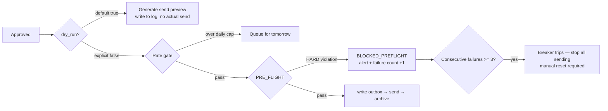

# Risk, Ethics, and Compliance

> This document is not legal advice. Every statutory citation and description of platform terms here may be out of date; verify the current version yourself before acting on any of it. Anything marked "**needs verification**" is a fact the author is not confident about, and the [Open Verification Items](#open-verification-items) table at the end collects how to check each one.

The risk structure of this system has one very unusual property: **it has almost no "small errors"**.

The error distribution of an ordinary backend system is long-tailed — most bugs cost a little latency or one retry. This one is not. Send company A's cover letter to company B and that single slip permanently zeroes out your chances at that company, with no path to remedy (you can send another email apologizing, but the damage is done). Likewise, one inflated tenure claim on a résumé can become the employer's grounds for terminating the contract six months after you start — Taiwan's Labor Standards Act, Article 12(1)(1), provides that where a worker makes a false representation when entering into the employment contract such that the employer is misled and is liable to suffer damage, the employer may terminate the contract without advance notice (**needs verification** on the current statutory text and how courts actually apply it).

So this document has exactly one principle: **hold the red lines by mechanism, not self-discipline**. Any defense that depends on "I'll remember to check" fails late at night on submission number 40. Every red line listed here must be followed by a piece of code or a database column; a bare "should be careful about this" does not count.

---

## 1. Corrections to the Reference Architecture

| Original thinking | Why it changed | What it became |
|---|---|---|
| "Approval gate: diff review → approve" | It never said which version the approval binds to. If the content is regenerated after approval (a retry triggers a re-render), the approval is void and the system does not know it | Approval binds to a **render key** (see the next row); recompute and compare before sending, abort on mismatch (see [07-review-gate.md](07-review-gate.md)) |
| Using `sha256(rendered_bytes)` as the approval fingerprint | PDF/DOCX generators write `CreationDate`, `ModDate` and a random file ID by default, so the same input yields different bytes on every render, the hash never matches, and this gate gets bypassed or switched off on day one | The fingerprint becomes `render_key = sha256(fact_ids ‖ template_id ‖ template_version ‖ params ‖ normalized_text)`, and **separately** the output file gets metadata normalization (fixed timestamp, cleared author field) before its bytes hash is computed. Store both; `render_key` is authoritative for comparison (see [06-content-assembly.md](06-content-assembly.md)) |
| Pre-send checks are an internal detail of the delivery layer | Cross-company content misplacement is this system's only "irreversible and destructive" error class; buried in implementation detail it has no observability, cannot be counted, cannot be tested | The state machine gains an explicit `PRE_FLIGHT` state; failure moves to `BLOCKED_PREFLIGHT`, raises an alert, and cannot be retried automatically (see [03-data-model.md](03-data-model.md)) |
| "Scan the full text for any other known company name" | The naive approach — substring-match every known company — has a brutal false-positive rate: `Meta` hits `metadata`, `Box` hits `toolbox`, and **your own former employers' names are supposed to appear on your résumé** | Narrow the comparison set to "target-company tokens from other applications", minus "an allowlist of employers from your own history"; word boundaries for ASCII, direct substring for CJK. Details in §7.2 |
| Product principle 3, "do not fight the platform" | Too abstract; everyone defines "fight" differently and each implementer reads it their own way | Seven executable operational definitions plus a red-line list (§2.4) |
| "Re-review platform terms every quarter" | That is a resolution, not a mechanism. You forget by the second quarter | Becomes the `tos_reviewed_at` column on the `source_registry` table, plus automatic disabling of that source once it expires (§2.2) |

---

## 2. Platform Terms and Legal Risk

### 2.1 Current State of Each Source

The "terms" column below is **mostly speculation**: platform terms change frequently, regional versions differ, and the author has not checked them clause by clause. That is exactly why §2.2's re-review mechanism exists.

| Source | Official available route | Automation terms (mostly speculation, needs verification) | Risk | This system's position |
|---|---|---|---|---|
| **Greenhouse** | `boards-api.greenhouse.io/v1/boards/{token}/jobs`, public, no auth, designed precisely so companies can embed it on their own sites (**needs verification** on the current path and rate limits) | No explicit prohibition found for this endpoint | Low | **Adopt**. Poll 1–2 times per company per day, identifiable User-Agent, honor 429 |
| **Lever** | `api.lever.co/v0/postings/{company}?mode=json`, public (**needs verification**) | Same as above | Low | Adopt, same policy |
| **Ashby** | `api.ashbyhq.com/posting-api/job-board/{name}`, public (**needs verification** on the path and whether query parameters are required) | Same as above | Low | Adopt, after verifying |
| **SmartRecruiters** | Has a public posting API (**needs verification** on the path, rate limits, and whether an API key is required) | Same as above | Low–Medium | Adopt after verification |
| **Workday** | **No** public job board API. Its frontend uses undocumented internal endpoints such as `/wday/cxs/{tenant}/{site}/jobs` | Undocumented endpoints are an unintended use and can change or be blocked at any time | Medium–High | **Do not adopt**. Subscribe to that company's job alert email instead and go through the email-parsing path in [04-ingestion.md](04-ingestion.md) |
| **LinkedIn** | No job-search API open to individuals; the partner API requires an application | The User Agreement explicitly bans accessing the service by bot or automation and bans unauthorized scraping (**needs verification** on the current clause numbering and wording) | **High** | **No automation at all**. Official Job Alert emails plus manual browsing only |
| **Indeed** | The old public Job Search API is no longer open to general developers (**needs verification** on the current state); today's API leans toward the employer side and Indeed Apply | The ToS bans scraping (**needs verification**) | **High** | Job Alert emails and RSS only (if the region still offers it, **needs verification**) |
| **104 / 1111 / CakeResume** and other Taiwan platforms | No public API aimed at job seekers found (**needs verification**) | The ToS generally bans automated extraction (**needs verification**) | Medium–High | Subscription emails only; every in-platform action is manual |
| **Company sites / RSS / email alerts / recruiter emails** | Your own mailbox, public RSS | Uncontested | Low | **Primary sources** |

One inference that is easy to miss: what this system's high-risk sources have in common is not "technically hard to scrape" but "**you need logged-in session state to see the full content**". That line happens to coincide with the boundary between legal risk and account-ban risk, so it can be used directly as an engineering criterion.

### 2.2 Turning Terms Re-Review into a Table

```sql
CREATE TABLE source_registry (
  source_id        TEXT PRIMARY KEY,     -- 'greenhouse', 'lever', 'linkedin_alert_mail'
  kind             TEXT NOT NULL,        -- 'public_api' | 'rss' | 'email_alert' | 'manual'
  endpoint         TEXT,
  requires_login   INTEGER NOT NULL,     -- 1 = needs logged-in session state -> never automated
  tos_url          TEXT,
  tos_reviewed_at  TEXT,                 -- ISO date
  tos_verdict      TEXT,                 -- 'allowed' | 'gray' | 'forbidden' | 'unverified'
  rate_limit_note  TEXT,
  enabled          INTEGER NOT NULL DEFAULT 0
);
```

Scheduling rule: if `tos_reviewed_at` is more than 90 days old, or `tos_verdict` is `unverified` / `gray`, that source's `enabled` is zeroed automatically and a notice prints at CLI startup. This turns "re-review every quarter" from a personal resolution into a check that actually blocks you. The cost is a dozen-odd lines of code.

### 2.3 Two Layers of Legal Risk

**Contract layer**: violating ToS is primarily a civil contract matter, and the most common real consequence is account suspension, not a lawsuit. For an individual job seeker, **getting the account banned is the actual disaster** — a LinkedIn account carries years of connections, recommendations and message history, and rebuilding it costs far more than any automation ever saves. That asymmetry alone is enough to support the decision not to automate LinkedIn, with no need to appeal to legal argument at all. This is also the most useful sentence in this document: **decide on account-ban risk rather than legal risk — the conclusion comes out more conservative, and it is far easier to explain to yourself.**

**Criminal layer**: in Taiwan, breaking protective measures or causing damage to a system may implicate Articles 358–360 of the Criminal Code, offenses against computer use (**needs verification** on the elements and the practical scope of application). Fetching public, login-free endpoints at negligible volume is very unlikely to fall inside that scope, but that is not a guarantee.

In the US, in hiQ v. LinkedIn the appellate court held that the CFAA does not reach the scraping of public data, but LinkedIn subsequently prevailed on its **contract claims**, and the parties ended in a settlement plus an injunction (**needs verification** on the final posture, the dates, and the scope). Practical conclusion: "scraping public data is not a crime" is not the same as "scraping public data is fine".

### 2.4 Operational Definition of "Do Not Fight the Platform", and the Red Lines

Principle 3 lands as seven checkable rules; violating any one of them is a bug:

1. Only access endpoints obtainable **without login**; sources with `requires_login = 1` are always manual
2. Never use logged-in cookies or session tokens for any automation
3. Honor the `robots.txt` covering that path
4. At least 5 seconds between requests to a single domain, honor `429` and `Retry-After`, back off exponentially with a cap
5. Send an identifiable User-Agent including a contact address (`ai-career/0.1 (+mailto:...)`)
6. Never circumvent any technical access control: CAPTCHA, rate limit, WAF, paywall, fingerprint detection
7. **An undocumented endpoint you can only find in browser DevTools is gray by default — do not use it**

> **Ruled (B1)**: rules 1 and 2 **both stay absolute, with no exceptions**. The "read-only status query while logged in" proposed in `14` §9.3 is **not adopted** — once you attach five conditions, rule 2 stops being the **binary, checkable question** of "did you use logged-in session state" and becomes a **judgement call**, and at least two of those five conditions ("a human is present", "read-only") cannot be verified by code. Incidentally, that proposal asked for an exemption from rule 2 only and **missed rule 1**; the omission itself shows that the boundary of an exception is harder to hold than its author assumed. See [17-decisions.md](./17-decisions.md#b1--logged-in-session-state-automation-no-exception).

### Red-Line List

> **Ruled (B2)**: the red lines split into two tables. The reason is that this round of revisions surfaced a **meta-level contradiction** — `12` argues that "only what code can enforce counts as a red line", while the new red line in `16` R-10-1 admits to being "the weakest mechanism tier". If the former holds, the latter does not qualify. Splitting the tables keeps the most important ethical commitments on the top-priority list while stopping the term "red line" from being devalued by admitting entries nothing can enforce.

#### Table 1: Mechanism Red Lines (Enforceable by Code, **Violation = Bug**)

How they are checked: CI and tests. For example, the sender flatly refuses to run against a non-allowlisted domain.

1. No bypassing CAPTCHAs, no CAPTCHA-solving services, no browser fingerprint spoofing or stealth plugins
2. No using anyone else's account, no fake accounts, no sending anything under another person's identity
3. No forging any document (degree certificate, employment verification letter, reference letter) — in Taiwan this is forgery under the Criminal Code and carries criminal liability
4. No mass-mailing to non-public personal addresses
5. **Never send automatically under any circumstances** — a human presses approve before every send
6. No scraping and bulk-storing other people's login-gated content (other people's LinkedIn profiles, other people's résumés)
7. No sending full correspondence bodies to a third-party endpoint that will train on them
8. No duplicate submissions to the same job posting
9. No real personal data or credentials anywhere in the git repo
10. **Never fill in statutory identifiers on someone's behalf** (national ID number, passport number, financial account number) — the mechanism is **not building that field at all**, not a reminder
11. **Human-in-the-loop must be implemented as an executable code constraint**; any change that moves the approval gate into a prompt, `CLAUDE.md`, or documentation counts as a red-line violation (proposed by `12`)

#### Table 2: Commitment Red Lines (**No Code Defense, Self-Discipline Only**)

> ⚠ **Nothing in this table has a code defense. Violating one breaks no test; it just means lying to yourself.**
> It genuinely is weaker than Table 1 — which is exactly why it is listed separately, instead of being mixed into Table 1 where it would make Table 1 look soft too.

1. Do not enter false information in an application form's **factual fields** (education, years of experience, salary, work authorization, whether you previously worked at that company, non-compete clauses)
2. **Do not let AI take an employer's aptitude test for you** (such as TSMC's English test) — merging the duplicate proposals from `15` and `16` R-10-1. The strongest available mechanism is disabling LLM assistance while `application.state = 'assessment'` (ruling A4 makes this state directly readable), but **that mechanism can be bypassed**, so it belongs in this table

---

## 3. Personal Data and Data Protection

### 3.1 What You Are Holding

- **Your own complete career record**: start and end month of every job, salary, reason for leaving, rejection history, interview performance. This is a file ten times more detailed than your résumé, and its value to a social-engineering attacker is high.
- **Other people's personal data**: recruiter names and mobile numbers, hiring manager addresses, interviewer names, full correspondence bodies. These people **did not consent** to you storing their data in a database, and certainly did not consent to you sending it to an LLM vendor.

### 3.2 The Boundary of the Exemption (Speculative, Needs Legal Confirmation)

Article 51(1)(1) of Taiwan's Personal Data Protection Act provides that the Act does not apply where a natural person collects, processes, or uses personal data **solely for the purpose of personal or household activity**. Personal job-seeking use **very likely** falls inside this exemption (**needs verification**; this is the most important uncertainty in this section). GDPR Article 2(2)(c) has a structurally similar household exemption.

Three boundaries to be careful about:

1. **The moment you share the tool or operate it for someone else**, the exemption fails — which directly constrains how this project can be open-sourced: the code can be open, but no data and no fixtures can be, and offering an operate-it-for-you service is inadvisable.
2. **The moment you transfer someone else's data to a third party** (for example, handing a recruiter's email to a cloud LLM), that is no longer the natural reading of "solely personal activity".
3. **When a data subject exercises their rights**: a recruiter asks you to delete their contact details, and even where there is no legal obligation, complying costs far less than arguing. The system has to be able to do it (§3.5's `purge` must support immediate deletion by `contact_id`).

So this system takes the position of "**follow GDPR's principles even if the exemption applies**" — not because the law requires it, but because data minimization, retention limits, and deletability are good engineering practice anyway.

### 3.3 Data Classification and the LLM Boundary

The single most critical design decision: **data of different sensitivity goes to different models**.

```
                                  ┌──────────────────────────────────────────┐
 Full public JD text              │  L0 Public: no incremental risk if sent  │→ Cloud LLM
 Job title / company name         └──────────────────────────────────────────┘   (Claude / GPT)

                                  ┌──────────────────────────────────────────┐
 Own claim verbatim text          │  L1 Own-sensitive: send, but redact      │→ Cloud LLM (redact first)
 Résumé drafts                    └──────────────────────────────────────────┘

                                  ┌──────────────────────────────────────────┐
 Email bodies / recruiter names   │  L2 Others' PII: stays local by default  │→ Local model
 Phone / interview feedback       └──────────────────────────────────────────┘   (Ollama + mid-size open model)
```

If some step absolutely must use a cloud model on content containing personal data (say a local model cannot sustain the quality email parsing needs), it has to clear a **redaction pass** first: rules (regexes for email, phone, URL) plus local NER replace names and addresses with `<PERSON_1>`, `<EMAIL_1>`; the mapping table lives only in local memory, and the placeholders are backfilled once the response returns.

This pass will definitely miss things, so it reduces risk rather than eliminating it. The verifiable approach: build a set of email fixtures using **fictional people**, write regression tests against the redaction pass, measure recall, and record it in [09-analytics-feedback.md](09-analytics-feedback.md). Redaction that is not measured is just self-reassurance.

A footnote: mainstream API vendors currently mostly state that API data is not used for training by default (**needs verification** on each vendor's current terms and retention periods). But "not trained on" is not "not retained" — most vendors keep data for a period for abuse detection.

### 3.4 Metadata in Generated Files (The One That Gets Missed)

PDF and DOCX automatically carry the author name, company name, file path, edit times, and even residual content from the previous version. A PDF saved out of `C:\Users\real_name\...\resume_for_CompanyA.docx` can leak, in its metadata alone, your real name, how you organize your files, and the fact that **you also applied to company A**.

So the final step of the render pipeline always runs: clear `Author` / `Title` / `Producer` / `Creator`, pin `CreationDate` to a constant, strip XMP. This is simultaneously the precondition for a stable bytes hash in §1 — two birds, one stone. `PRE_FLIGHT` should treat "output file metadata is non-empty" as a HARD violation.

### 3.5 Retention and Deletion

A database with no retention limit becomes a liability. Defaults (matching the `purge` schedule in [03-data-model.md](03-data-model.md)):

| Data category | Retention | On expiry |
|---|---|---|
| Full job posting JD text | 24 months | Delete the full text, keep the structured summary and scores (for analytics) |
| Full correspondence bodies | 12 months | Delete the body, keep metadata (sender domain, timestamp, classification) |
| Other people's contact details | 18 months after the last interaction | Delete; delete immediately on the data subject's request |
| Sent résumé / cover letter files | 12 months after the case closes | Delete (they are kept for evidence in disputes and for per-version effectiveness analysis) |
| LLM prompt / response log | 30 days | Delete; already masked at write time |
| Your own content library | Permanent | Never deleted; this is the system's asset |

Real deletion is more troublesome than it sounds and deserves an honest description: SQLite's `DELETE` does not return space and can leave residue inside pages, so a purge needs a `VACUUM`; and `VACUUM` needs roughly as much extra disk space as the database itself and rewrites the entire file. More importantly, **old data in the WAL file and in existing backups does not disappear because of it** — so the real guarantee of "deletion" covers only the main database. The backup rotation policy has to let old backups expire naturally within a reasonable window (for example, keeping only the 3 most recent encrypted backups), or the deletion is fake.

### 3.6 Encryption

| Aspect | Approach | Trade-off |
|---|---|---|
| At rest | Lean first on **BitLocker full-disk encryption** plus filesystem permissions | On a single machine with a single user, SQLCipher's key-management hassle (type a password at boot, back up the key, lose it and everything is gone) usually does not pay for itself |
| At rest (exception) | If the data directory sits in a sync folder such as OneDrive / Dropbox / iCloud, you **must** switch to application-layer encryption (SQLCipher, or age-encrypted backups) | A sync folder means handing the data to a third party, and full-disk encryption stops none of it |
| In transit | HTTPS everywhere; TLS for SMTP/IMAP; never accept a certificate error | No trade-off, just do it |
| Backups | Encrypt with `age` or `7z -mhe=on` before anything leaves the machine | The price of local-first is that backups are your own job (§8.4) |

---

## 4. Honest Representation: Where the Line Is Drawn

This is the ethical core of the entire system, and also the place most likely to loosen quietly by résumé number 40.

### 4.1 Gray Areas, Adjudicated One by One

| Situation | Ruling | Reasoning |
|---|---|---|
| Rewriting "wrote a few Python scripts" as "built internal automation tooling" | ✅ Allowed | The same fact at a different level of phrasing; you can reconstruct it in full in an interview |
| Reordering your experience, shifting emphasis to match the JD | ✅ Allowed | This is exactly where the system's value lies |
| Stating a team result but labeling it "a project I participated in achieved X" | ✅ Allowed (role must be stated) | It separates "the team achieved" from "I owned" |
| Omitting an unflattering short stint or an employment gap | ⚠️ May omit, may not deny | Omission is not the same as commission. But if the form explicitly asks "list all employment", omitting it is a false statement |
| Turning "assisted with" into "owned" | ❌ Not allowed | Unless you can name the specific decisions you made and the outputs you held. If you cannot name them, you did not own it |
| Writing 6 months as "close to a year" | ❌ Not allowed | Numbers are facts, not rhetoric. And one reference check breaks it |
| Claiming "proficient" in a skill you barely know | ❌ Not allowed | A technical interview exposes it in 15 minutes, and the impression left is "this person lies", not "this person doesn't know that technology" |
| Presenting the internal title "Engineer II" externally as "Senior Software Engineer" | ❌ Not allowed | Unless the company has an official English title mapping. Titles are verifiable |

The criterion compressed into one sentence: **if an interviewer presses you line by line, can you hold the story together without adding a new lie?** That is the "interview defensibility test", and it is the ethical criterion and the practical criterion at once.

### 4.2 Hold It by Mechanism, Not Self-Discipline

Here are the hard mechanisms the fact check pass in [06-content-assembly.md](06-content-assembly.md) should implement:

1. **The generator may not freely produce factual sentences**. Every factual assertion in the content library has a unique id, verbatim source text (`verbatim`), and an evidence link (`evidence_ref`). During assembly the LLM may only choose which fact ids to cite and adjust the phrasing; it may not introduce new facts.

2. **Verbatim number allowlist**. Every number extracted from the generated text (years of experience, percentages, amounts, team size, user counts) must **exist verbatim** in the content library, or `PRE_FLIGHT` fails outright. This rule is the most mechanical, the easiest to write tests for, and blocks the most damage — if you can only do one thing, do this one.

3. **Verb strength tiers**. Every claim is tagged with an ownership level, and templates may only draw from the verb list for that level:

   | ownership | Permitted verbs |
   |---|---|
   | `owned` | owned, led, designed, decided, held |
   | `co_owned` | co-owned, designed jointly with X, took part in the decision |
   | `contributed` | assisted, implemented, contributed, supported |
   | `observed` | participated in, was exposed to, familiar with |

   The LLM may not pick its own verbs. This turns the most common form of inflation — sliding from contributed toward owned — into something code can block.

4. **Unsupported claims are a hard block**. Sentences the check pass marks as unsupported are highlighted red in the review UI, and **you cannot press approve until each one has been dealt with — corrected, or backed by a new claim carrying an `evidence_ref`**. Not a hint; a block.

### 4.3 Where This Mechanism Fails

- **The fact check pass is itself an LLM, so it will miss things** (false negatives). It lowers the error rate; it does not guarantee zero. Mitigation: periodically re-review a sample of approved output and quantify the miss rate (see [09-analytics-feedback.md](09-analytics-feedback.md)).
- **Hard gates manufacture review paralysis**. If every piece of output throws 15 red warnings, by day three the human starts clicking through without reading — the classic failure mode of a human-machine review queue (see [01-domain-mapping.md](01-domain-mapping.md)). Mitigation: the gate blocks **only** high-risk categories (numbers, job titles, tenure, ownership verbs, company names, metadata) and everything else is a hint. The false-positive rate is the gate's core design parameter: it must be configurable and observable, not a hard-coded constant.
- **The system blocks "the AI made things up"; it cannot block "the human wants to inflate"**. Nothing stops the user from hand-writing a false claim into the content library. The only defense at that point is that a claim must carry an `evidence_ref` — forcing you to face "where is the evidence for this". That is psychological friction, not a technical guarantee, and it should be admitted honestly.

---

## 5. Whether to Disclose the Use of AI Assistance

First, clear up a common misconception: current regulation aimed at AI in recruiting — New York City's Local Law 144 AEDT audit and notice obligations, the EU AI Act classifying recruiting uses as high risk — imposes obligations on **employers and tool vendors**, not on job seekers (**needs verification** on the current scope and effective dates of both). On the job seeker's side the question is honesty, not compliance.

**For**: it is the natural extension of the honesty principle; if they ask explicitly and you conceal it, the act shifts in character from "using a tool" to "making a false statement". Some companies already put an explicit question in the application flow, and answering it falsely can be grounds for terminating the contract after you are hired. For teams that value AI literacy, explaining how you built this pipeline counts in your favor.

**Against**: nobody discloses that they used a spell checker, Grammarly, or a friend who polished the draft; singling out AI treats one tool as special. Volunteering it introduces bias: a reviewer may mark you down even when everything in the document is true. And there is an obvious asymmetry — the employer side broadly uses ATS auto-screening and AI scoring, and almost never volunteers that.

**Practical recommendations**:

1. **Answer truthfully when asked directly**, including checkbox fields on the application form. This is a red line with no exceptions.
2. **Do not volunteer it in the résumé or cover letter**. The document should be judged on its content.
3. **Take-home assignments and coding tests always follow the stated rules**. If the brief says "no AI assistance", then no AI — this is the arena where detection is easiest and getting caught hurts most.
4. **Treat "interview defensibility" as the real test**. If you can explain every technical decision in the document line by line, the tool does not matter; if you cannot, neither disclosing nor concealing will save you.
5. If it comes up in an interview, explain it openly and talk about it as an engineering project.

---

## 6. The Backfire of Mass Submission: Why "Fewer but Better" Is Strategy, Not Just Morality

### 6.1 Mechanisms on the Company Side

Most of what follows is high-confidence industry practice that still **needs verification**:

- ATSes such as Greenhouse and Lever **deduplicate candidates within an organization keyed on email**. When you submit to a third job posting at the same company, the recruiter sees a merged file containing your previous two applications and their rejection reasons, not a fresh application.
- Some ATSes support a `Do Not Hire` or blacklist flag, and that flag usually does **not** lapse on its own over time.
- Submitting to several unrelated positions at the same company in a short window signals "this person doesn't know what they want to do", not "this person is motivated".

### 6.2 A Crude but Sufficient Quantitative Model

The numbers below are **illustrative assumptions, not measured data**; users should recalibrate against the real data accumulated in [09-analytics-feedback.md](09-analytics-feedback.md):

| Strategy | Effort per submission | Weekly capacity | Assumed reply rate | Replies per week | Collateral cost |
|---|---|---|---|---|---|
| Heavy customization (fully hand-written) | 40 min | 12 | 12% | 1.4 | None |
| Moderate customization (this system) | 8 min of review | 30 | 8% | 2.4 | Low |
| Indiscriminate spraying | 1 min | 200 | 0.8% | 1.6 | Company blacklists, standing with recruiters, your own tracking burden |

Two observations. First, **spraying does not necessarily yield more replies in absolute terms**, because the reply rate typically falls further than the volume rises. Second, spraying is **the only strategy that generates negative externalities**: the list of companies that flagged you travels with you, and the recruiter world is smaller than you think — one consultant often serves several companies at once, and a single unprofessional contact taints every later referral.

An honest counterexample: **under a layoff wave or visa-timeline pressure, volume genuinely does have value**. The right adjustment then is not to abandon quality but to lower customization depth (cite fewer claims, use more generic templates) and raise the daily cap, while **keeping the fact check gate fully intact** — what you get to tune is customization depth, not honesty. The system should make this trade-off a tunable parameter (`customization_depth: deep | standard | light`) rather than pretend it does not exist.

### 6.3 The KPIs the System Should Track

Change the KPI from "how many submissions this week" to "how many replies from a real human this week" and "time invested per reply". The change looks minor, but it decides which direction the user optimizes the system in — whatever number sits on the dashboard is the number people will chase.

---

## 7. Foolproofing Against Runaway Automation

### 7.1 The Most Terrifying Error

Sending company A's cover letter to company B. The cause is usually not "the LLM wrote it wrong" but a mundane engineering slip: cached output not keyed by `job_id`, a retry picking up the previous context, a batch loop's variable running past the end, forgetting to switch back to dry-run after manual testing.

### 7.2 The PRE_FLIGHT Check

```python
def preflight(app: Application, art: Artifact, cfg) -> list[Violation]:
    v = []
    # 1. Identity consistency
    if art.job_id != app.job_id:
        v.append(HARD("artifact/application job_id mismatch"))

    # 2. Cross-company misplacement scan
    #    Compare only against "target companies of other applications", minus the employers
    #    on your own résumé, or a former employer's name blocks every résumé (false-positive disaster)
    foreign = (other_application_company_tokens(exclude=app.company_id)
               - own_employer_tokens())          # own_employer_tokens comes from the content library
    for tok in foreign:
        if token_appears(art.text, tok):          # \b boundaries for ASCII; direct substring for CJK
            v.append(HARD(f"another company's name appears in the text: {tok}"))

    # 3. The target company name must appear at least once (catches an unfilled template)
    if not token_appears(art.text, app.company_token):
        v.append(HARD("target company name does not appear in the text"))

    # 4. Leftover placeholders or un-backfilled masks
    if re.search(r"\{\{.*?\}\}|\[TODO\]|<(PERSON|EMAIL|PHONE)_\d+>", art.text):
        v.append(HARD("leftover template placeholder or un-backfilled mask"))

    # 5. Approval binding (see §1: use render_key, not the raw bytes hash)
    if render_key(art) != app.approved_render_key:
        v.append(HARD("content changed after approval"))

    # 6. Output file metadata already cleared (see §3.4)
    if not metadata_is_clean(art.file_path):
        v.append(HARD("output file still carries author/path metadata"))

    # 7. Approval freshness
    if now() - app.approved_at > cfg.approval_ttl:        # default 48h, configurable
        v.append(HARD("approval has expired, needs re-review"))

    # 8. Duplicate submission (keyed on the normalized job posting fingerprint, not job_id alone —
    #    a repost changes job_id, but (company_id, title_norm) stays the same)
    if exists_submission(app.job_id) or exists_submission_like(app.company_id, app.title_norm):
        v.append(HARD("this job posting (or an equivalent one) has already been submitted to"))
    if company_submissions_within(app.company_id, days=90) >= cfg.per_company_cap:
        v.append(SOFT("recent submissions to this company are at the cap, needs a second confirmation"))

    # 9. Verbatim number allowlist (see §4.2)
    v += verify_numbers_against_content_library(art)
    return v
```

Any `HARD` violation moves to `BLOCKED_PREFLIGHT` without exception, with **no automatic retry and no automatic repair**; a human has to handle it. Item 2 is the highest value-per-line code in the entire system: a few dozen lines that block the one catastrophic error class. It is also the piece most likely to get switched off by false positives — so the `own_employer_tokens()` allowlist has to be right on day one, not patched in after it has blocked you three times.

### 7.3 The Other Gates



| Mechanism | Setting | Notes |
|---|---|---|
| **dry-run on by default** | Requires explicitly passing `--for-real` or `LIVE_SUBMIT=1` | The default decides which way a mistake falls. Defaulting to not sending means the worst case is "nothing happened" |
| **Daily submission cap** | For example, 15 | Even with a bug, a single day's damage has an upper bound |
| **Per-company quarterly cap** | For example, 2 | Matches the deduplication mechanism in §6.1 |
| **Send rate** | At least 60 seconds apart, and no sending late at night | Also keeps the mail service from judging it anomalous behavior |
| **Circuit breaker** | 3 consecutive PRE_FLIGHT failures or send errors stop everything | **The implementation is one counter column in the DB plus one `if`** — not Hystrix, not a sidecar |
| **Idempotency** | Unique index on `(job_id)` plus the outbox pattern | The send record is written before the actual send, so a restart after a crash does not resend |
| **Archive immediately after sending** | Store the full payload, recipients, and a copy of the attachments exactly as sent | The only trustworthy source for later disputes and debugging |

An anti-over-engineering reminder: every item above is doable on one machine, in one process, with SQLite. This is a tool for one person — no message queue, no distributed lock, no separate alerting service. "Alerting" is red text in the CLI plus an email to yourself.

### 7.4 After It Goes Wrong: Incident Handling

Foolproofing fails, so there has to be an after-the-fact process. Most design documents skip this section, but it is the part that actually gets used.

| Situation | Immediate action | What the system must support |
|---|---|---|
| Sent to the wrong company | Send a short correction email immediately (no excuses, no essay) and mark that application `INCIDENT` | Retrieve the original payload and recipients from the archive; one-click draft of the correction email (still requires human approval) |
| Discovering a false statement in output that has already gone out | If there has been no interview yet, correct it proactively; if the process has started, clarify it yourself during the interview | Look up the fact ids cited at the time from `render_key`, to establish what was actually written |
| Duplicate submission | Usually no remedy is needed, just record it | Add that `(company_id, title_norm)` to the deduplication fingerprints |
| Credential leak / accidental repo commit | Revoke the token and rotate the password immediately; if it was pushed to a public repo, treat it as permanently leaked and do not rely on a force push | A single central list of credentials, so you know which ones to revoke |
| Circuit breaker tripped | **Read the log first, do not just reset it** | Resetting the breaker requires a manual command that prompts for a reason and writes it to the log |

Every incident should write back one rule or one test case, or the same error happens again.

---

## 8. Accounts, Credentials, and Sending Mail

### 8.1 Account Isolation

- Use a **dedicated job-search mailbox** (for example `name.career@gmail.com`), never your everyday mailbox. The benefits: the parser does not have to face noise, the whole thing can be archived as one bundle when you are done, and a credential leak does not reach your main account.
- Prefer **OAuth 2.0 desktop flow plus a refresh token** for mail access over an app password; Google keeps tightening its app-password policy (**needs verification** on the current state).
- Store the refresh token in **Windows Credential Manager** (DPAPI-protected) or the `keyring` package, never in a file.

### 8.2 The Risk of Sending Mail Itself (Routinely Underestimated)

Sending job-application mail from a self-hosted SMTP server or a new domain very likely goes straight to the spam folder, and **you will not know**. Practical approach:

- Send through an existing Gmail / Outlook account over OAuth; do not run your own MTA, and do not buy a new domain for job hunting
- Consumer Gmail has a daily send limit (commonly stated as around 500/day, **needs verification** on the current figure and how it is counted), but this system's daily cap of 15 is far below that; the real risk is **tripping anomalous-behavior detection**, which makes the rate gate more important than the cap
- Plain text or minimal HTML, no tracking pixels (open tracking is both impolite and easily blocked in a job-search context)
- **Treat a bounce as a first-class state**: a successful send is not a delivery, and a bounce must write back to the application state, see [08-delivery-tracking.md](08-delivery-tracking.md)

### 8.3 Physical Separation of Data and Repo

```
C:\my\build\github\ai-career\      ← git repo, code and config templates only
%LOCALAPPDATA%\ai-career\          ← data directory, outside the repo, git never sees it
    ├── career.db
    ├── artifacts\
    ├── mail_cache\
    └── secrets.env
```

The reason: `.gitignore` is a **procedural defense**, and it gets bypassed by `git add -f`, `git stash -u`, or one badly written glob. Putting the data directory outside the repo tree is a **structural defense** — even `git add -A` cannot possibly add the career database. The price is slightly more setup friction (you need the `AI_CAREER_DATA_DIR` environment variable), and it is entirely worth it.

### 8.4 The Second Layer of Defense

```gitignore
.env
.env.*
!.env.example
secrets/
*.db
*.sqlite3
*.pdf
*.docx
data/
artifacts/
mail_cache/
*.token
*.pem

# Even fixtures need care: test data must be fictional people
tests/fixtures/real_*
```

On top of that:

- **A pre-commit hook runs `gitleaks` or `detect-secrets`**, blocking the commit the moment a high-entropy string or a known key format is detected
- The config template is `.env.example`, with every value set to `CHANGEME`
- **Test fixtures always use fictional people**; do not drop your real résumé in "for convenience" — this is also the precondition for the §3.3 redaction tests
- If the repo is public, periodically scan **history** with `gitleaks detect --log-opts="--all"`; `.gitignore` does nothing about content already committed
- Encrypt backups with `age` or `7z -mhe=on` before they leave the machine, and **actually restore one every month** to verify (see §10 for the skepticism about that discipline)

---

## 9. Risk Register

Likelihood and impact both use four levels: Low / Medium / High / Very high.

| ID | Risk | Likelihood | Impact | Mitigation | Residual risk |
|---|---|---|---|---|---|
| R-01 | Cover letter content misplaced (sent to the wrong company) | Medium | Very high | PRE_FLIGHT cross-company token scan hard fail; approval bound to `render_key`; dry-run by default | Low |
| R-02 | Duplicate submission to the same job posting | Medium | Medium | Unique index on `job_id` plus the `(company_id, title_norm)` fingerprint; outbox idempotency; per-company quarterly cap | Low |
| R-03 | LinkedIn / Indeed account restricted or banned | Medium (if automated) | High | No automation of logged-in session actions at all; alert emails and RSS only | Low |
| R-04 | A ToS violation triggers a dispute | Low | Medium | Public login-free endpoints only, low frequency, honor 429; gray endpoints blacklisted; `source_registry` auto-disables on expiry | Low–Medium (terms change) |
| R-05 | Generated content is inflated or false | Medium | Very high (contract terminated after hiring) | content library + verbatim number allowlist + ownership verb tiers + a hard block on unsupported sentences | Medium (LLM checking always misses some; covered by sampled re-review) |
| R-06 | Credentials or personal data committed into a public repo | Medium | High | Data directory physically separated from the repo; gitleaks pre-commit; history scanning | Low |
| R-07 | Other people's personal data (recruiters / HMs) leaks to a third-party LLM | High (if unaddressed) | Medium | Data classification; redaction pass with measured recall; email parsing on a local model | Medium |
| R-08 | Device lost or disk read by someone else | Low | High | BitLocker full-disk encryption; data directory kept out of sync folders; encrypted backups | Low |
| R-09 | Mass submission damages reputation | Medium | Medium–High | Daily cap, per-company quarterly cap, triage thresholds; KPI switched to reply count | Low |
| R-10 | An automation bug causes mass erroneous submission | Medium | Very high | dry-run by default, rate gate, circuit breaker, daily cap, human approval before sending | Low |
| R-11 | Scoring model bias causes good opportunities to be missed | High | Medium | The gray zone always goes to the manual queue; sampling audit of low scores (see [05-scoring-triage.md](05-scoring-triage.md)) | Medium |
| R-12 | LLM vendor retains or uses the data | Medium | Medium | Choose a no-training plan and re-review quarterly; sensitive steps run on a local model | Medium (terms need verification) |
| R-13 | Inconsistent answers when asked whether AI was used | Low | Medium | Written policy: answer truthfully; the interview defensibility test | Low |
| R-14 | Data hoarding becomes a long-term liability | High | Low–Medium | Retention table + automatic purge + `VACUUM` + backup rotation | Low |
| R-15 | Review fatigue reduces the gate to a formality | High | High | The gate blocks high-risk categories only; track the false-positive rate; periodic sampled re-review | Medium |
| R-16 | Local-first leads to data loss (no backup) | Medium | High | Encrypted backups to an external device; monthly restore verification | Medium (depends on execution discipline) |
| R-17 | Output file metadata leaks your real name, paths, or other submission targets | High (if unaddressed) | Medium | Mandatory metadata clearing after rendering; included as a PRE_FLIGHT HARD check | Low |
| R-18 | Mail lands in spam or bounces without being noticed | Medium | Medium | Send from an existing mailbox over OAuth; bounces write back to state; manual re-review of long-silent cases | Medium |
| R-19 | Too many PRE_FLIGHT false positives make the user switch the check off | Medium | Very high (equivalent to R-01 wide open) | Former-employer allowlist; token boundary matching; false-positive rate tracked as a monitored metric | Medium |

---

## 10. Where This Design Will Hurt, and When Not to Do It This Way

**Compliance cost eats part of the efficiency, and it really does eat it.** Every gate you add is one more interruption. If reviewing one piece of output goes from 5 minutes to 20, this system's advantage over "seriously hand-writing 10" disappears. State the design target plainly: compress 40 minutes of **typing time** into 8 minutes of **judgement time**, not into 0 minutes. Any mechanism that pushes review time back above 15 minutes has to be re-evaluated on whether the risk it blocks is worth it.

**Hard gates and alert fatigue are two sides of the same coin.** Block too much and nobody reads it; block too little and it does not block. The only fix is to keep measuring the false-positive rate and tune against it — which means the gate's thresholds have to be configurable, observable parameters. R-19 is the real hidden risk: a check with a high false-positive rate does not end up tuned, it ends up commented out.

**"Do not fight the platform" is a decision with a price.** Giving up automation on LinkedIn and Indeed means giving up timeliness on the two largest sources of job postings. Someone willing to carry the account-ban risk genuinely does collect more postings and sees them sooner. This system chooses not to, but that is **a value judgement plus a risk appetite**, not the only rational choice; writing it up as "the one correct approach" would be dishonest.

**The price of local-first is carrying backup and migration entirely yourself.** No cloud sync means a dead disk takes everything, and switching computers is a manual move. Writing R-16's residual risk as "Medium" is honest — most people will not actually verify the restore process every month, including the person writing this document. The only effective way to raise reliability is to automate backups to the point where *not* doing it is what takes an action.

**Enterprise compliance mechanisms deliberately not built here:** no RBAC, no tamper-proof audit log, no data classification labeling system, no DPIA document, no SIEM integration. These make sense in a multi-person organization; in a single-person local tool they only create maintenance burden without adding any substantive protection — because the threat model contains no "malicious internal user" role at all. If the system ever really has to serve a second person, this entire passage needs rewriting, and §3.2's personal data law exemption fails at the same moment.

**When you should not use this system:**

- **People submitting to only 5–8 dream companies**. Building the system takes far longer than writing by hand, and at that depth of customization hand-written quality is always better.
- **Heavily regulated industries and the public sector**. Application forms for finance and government roles often carry statutory declarations and affidavit clauses, and auto-filling them carries very high legal risk. Manual end to end.
- **Positions requiring a security clearance**. If any automatically generated statement conflicts with the official investigation form, the consequences go far beyond a failed job search.
- **Before the content library is built**. The content library is the foundation of every factual defense; starting mass production before it matures is the same as switching every gate off. For the recommended order, see [11-tech-stack-roadmap.md](11-tech-stack-roadmap.md).

---

## Related Documents

[00-overview.md](00-overview.md) ·
[01-domain-mapping.md](01-domain-mapping.md) (failure modes of the review queue) ·
[02-architecture.md](02-architecture.md) (layering and component boundaries) ·
[03-data-model.md](03-data-model.md) (retention, the `PRE_FLIGHT` / `BLOCKED_PREFLIGHT` states) ·
[04-ingestion.md](04-ingestion.md) (source selection and `source_registry`) ·
[05-scoring-triage.md](05-scoring-triage.md) (sampling audit) ·
[06-content-assembly.md](06-content-assembly.md) (content library, fact check pass, metadata clearing) ·
[07-review-gate.md](07-review-gate.md) (approval bound to `render_key`) ·
[08-delivery-tracking.md](08-delivery-tracking.md) (dry-run, rate gate, circuit breaker, bounce handling) ·
[09-analytics-feedback.md](09-analytics-feedback.md) (KPI calibration, measuring miss rate and false-positive rate) ·
[11-tech-stack-roadmap.md](11-tech-stack-roadmap.md) (credential storage and build order)

---

## Open Verification Items

Every item below is an external fact this document cites but the author is not sure of. Write the verification result back into `source_registry` (platform items) or a document footnote (legal items), and record the date checked.

| # | Open verification item | How to verify |
|---|---|---|
| 1 | The Greenhouse job board API path, whether a token is required, rate limits, and whether automation is explicitly restricted | Read the Job Board API page in Greenhouse's developer docs; make low-frequency requests and observe whether the response headers carry `X-RateLimit-*`; check `boards-api.greenhouse.io/robots.txt` |
| 2 | Current availability and parameters of Lever's `api.lever.co/v0/postings/{company}` | Run it once against a company known to use Lever; cross-check against Lever's official postings API docs |
| 3 | The Ashby posting API path and its required parameters | Check Ashby's official job board API docs; test it against a company known to use Ashby |
| 4 | The SmartRecruiters posting API path, whether an API key is required, and rate limits | Read the Posting API docs on the SmartRecruiters developer portal |
| 5 | The current clause numbering and wording of the LinkedIn User Agreement's bans on automation / scraping | Read the "Dos and Don'ts" section of `linkedin.com/legal/user-agreement` and record the version date |
| 6 | The current state of Indeed's public Job Search API, and whether job posting RSS is still offered per region | Check the Indeed developer portal; test whether the RSS endpoint still responds for search result pages in the target region |
| 7 | Whether 104 / 1111 / CakeResume have a public API aimed at job seekers, and what their ToS says about automated extraction | Read each site's terms of service and developer pages; check each site's `robots.txt` |
| 8 | Whether the "solely personal or household activity" exemption in Article 51(1)(1) of the Personal Data Protection Act covers this use, and where the boundary falls once the tool is shared with others | Check the current text in the national Laws & Regulations Database; consult a lawyer on the case that involves third-party data (recruiters, HMs) |
| 9 | The text of Article 12(1)(1) of the Labor Standards Act and the threshold courts apply in practice (how much résumé inflation amounts to a false representation) | Check the national Laws & Regulations Database; search the Judicial Yuan judgment system for labor-case decisions citing that subparagraph |
| 10 | Whether Criminal Code Articles 358–360 could apply to fetching public, login-free endpoints | Check the current statutory text; search for relevant case law or scholarly surveys |
| 11 | The final outcome of hiQ v. LinkedIn (the CFAA portion, the contract claims, the settlement and injunction terms) and its scope | Read the Ninth Circuit opinion and the subsequent N.D. Cal. rulings; note that it applies only under US law |
| 12 | Each LLM vendor's current API data usage and retention policy (used for training or not, abuse-detection retention period, whether a DPA can be signed, whether a zero-retention plan exists) | Read each vendor's data usage policy and DPA terms pages; ask sales separately about enterprise plans. Write the date checked into the config file |
| 13 | Who New York City's Local Law 144 (AEDT) and the EU AI Act's high-risk recruiting provisions bind and when they take effect, confirming that they impose no obligation on job seekers | Read NYC DCWP's AEDT rules explainer; read the employment-related entries in EU AI Act Annex III and the application timetable |
| 14 | Whether ATSes such as Greenhouse / Lever deduplicate keyed on email, and whether the `Do Not Hire` flag is permanent | Read the recruiter-side documentation for the ATS, or simply ask a friend who works on the recruiting side |
| 15 | Google's current app-password policy, and the available scope of the desktop OAuth flow | Read the "App passwords" page in Google Account help and Google Identity's OAuth for desktop docs |
| 16 | Consumer Gmail's daily send limit and its anomalous-behavior detection threshold | Read the Gmail sending-limits help page; note that the figure may vary by account type and that the detection threshold is never published |
| 17 | Which ATS a target company uses (this decides whether that company goes through the API path or the email path) | Look at the domain of its job posting pages (`boards.greenhouse.io` / `jobs.lever.co` / `*.myworkdayjobs.com`, etc.) and record it in `source_registry` |
