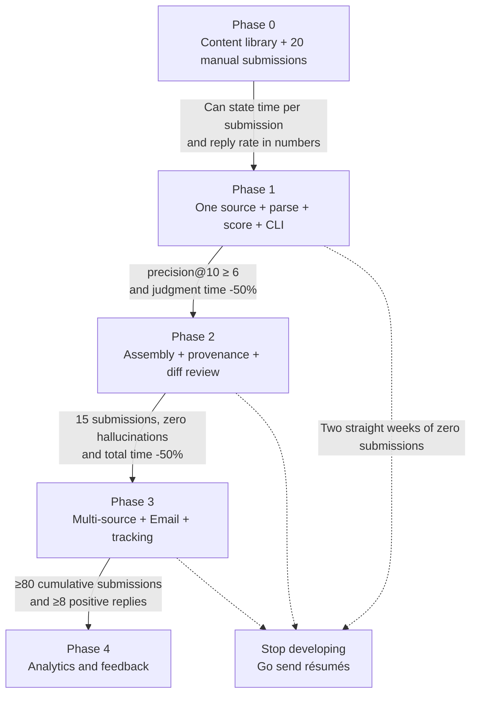

# Technology Choices and Phased Roadmap

This document is the implementation plan for the system: what technology to pick, why, how many phases to run, what counts as done at the end of each one, and the most important thing of all — how to keep the tool itself from becoming an excuse not to job-hunt.

Architecture context is in [`02-architecture.md`](./02-architecture.md), the data model in [`03-data-model.md`](./03-data-model.md), and the legal-compliance boundary in [`10-risk-compliance.md`](./10-risk-compliance.md).

---

## 1. Premises and Scope

These choices rest on four premises. If a premise does not hold, the conclusions have to be recomputed.

| Premise | What happens if it does not hold |
|---|---|
| One user (at most two sharing the same machine), running locally | Concurrent writes from several people → SQLite has to become Postgres, see §4 |
| The primary development and runtime environment is Windows 11 | The scheduling mechanism changes, nothing else does, see the table below |
| The user can read and write Python and is willing to maintain a small project | If not, do not build it yourself, see §2 |
| The job search runs about 3–12 months, with data in the MB range | Change the order of magnitude and the conclusions in §4 and §6 both have to be recomputed |

Cross-platform differences come down to scheduling and nothing else:

| Platform | Scheduling mechanism |
|---|---|
| Windows | Task Scheduler invoking the CLI |
| macOS | `launchd` plist (note that it does not run while the machine sleeps; catch-up behavior after wake needs verification) |
| Linux | `systemd --user` timer (better than cron because it has logs and `Persistent=true` catch-up runs) |

---

## 2. First, a Question: Why Not Use an Off-the-Shelf Tool

The first draft jumped straight into technology choices and skipped build vs buy. That is the section that most needed adding, because for most people the right answer is **do not build it yourself**.

A crop of job-tracking and form-autofill tools already exists (Huntr, Teal, Simplify, Careerflow and the like; **features and pricing change frequently, needs verification**). They typically offer: kanban-style application tracking, browser-extension form autofill, keyword matching between résumé and JD, and one-click saving of a job posting.

| What you want | Off-the-shelf | Build it yourself |
|---|---|---|
| Application status tracking board | Done well, five minutes to learn | Two weeks of coding |
| Form autofill | Done well (they already maintain selectors for a pile of platforms) | High maintenance cost, see §16 |
| Résumé keyword matching | Yes, but mostly shallow literal overlap | Can be made into rubric-based scoring |
| **Content never leaves the local machine** | Impossible (cloud SaaS, your full résumé lives on someone else's machine) | Yes |
| **Every sentence traceable to a real fact (provenance)** | Never seen anyone do it | This is the core reason to build |
| **A rubric you define, that you can override and that learns from it** | Impossible | Yes |
| **Fighting your own procrastination** | Impossible | §14 |

**The honest conclusion**: if all you need is "don't forget what I applied to, don't forget to follow up", open a spreadsheet or install a tracking extension, close this repo, and spend the 150 hours you saved sending out résumés. Building it yourself only pays off when you simultaneously demand "content stays on the local machine" + "output is traceable and may not be fabricated" + "I define the rubric" — and those three are direct consequences of product principles 2 and 5.

A pragmatic middle path also exists: **off-the-shelf tools handle tracking, and the part you build does only the content library and assembly**. If the Phase 0 numbers show your bottleneck is "writing customized content" rather than "managing state", that route cuts half the work in this document.

---

## 3. Technology Selection Summary

Conclusions first, reasoning below. Anything marked "needs verification" is a fact I am not sure of.

| Layer | Recommendation | Main alternative | Why not the alternative |
|---|---|---|---|
| Language / runtime | **Python 3.12+**, `uv` for dependencies | TypeScript / Node | The Python ecosystem is mature enough for LLM SDKs, email parsing, docx generation and Playwright; no reason to drag an entire Node toolchain in for the sake of a UI |
| Database | **SQLite (WAL)** | PostgreSQL | One person, one writer, data in the MB range. See §4 |
| ORM / migration | **SQLAlchemy 2.0 + Alembic** | Raw SQL + hand-written migrations | State-machine columns get changed over and over, and the third hand-written migration is where you make a mistake |
| Scheduling | **The OS scheduler invoking an idempotent CLI** | A resident APScheduler process | No daemon, automatic recovery after reboot, failures visible as an exit code |
| Queue | **DB-backed task table** | Celery + Redis | See §5 |
| LLM access | **A thin in-house abstraction layer, defaulting to the Claude family, switchable to Ollama** | LangChain / LlamaIndex | See §6 |
| Embedding | **Local `fastembed` (ONNX)**, deferred until genuinely needed | OpenAI embeddings API | Private data never leaves the machine, and the volume is small enough for CPU |
| Vector retrieval | **Brute-force cosine in numpy**, `sqlite-vec` once the volume grows | Chroma / Qdrant / pgvector | See §7 |
| Document generation | **`docxtpl` + a hand-laid-out Word template**; PDF via headless LibreOffice conversion | Pandoc / WeasyPrint / ReportLab | See §8 |
| Browser automation | **Playwright (Python)**, persistent context, headed and semi-automatic | Selenium | Auto-waiting and codegen cut maintenance cost; but read the ToS discussion in §8 first |
| UI | **Phase 1 CLI (Typer + Rich) → local FastAPI + Jinja2 + HTMX from Phase 2 on** | React + Vite / Textual TUI | See §9 |
| Configuration | `config.toml` + `.env` (API keys never enter git) | Environment variables scattered around | Version-controllable configuration and non-version-controllable secrets have to stay separate |
| Logging | `structlog` emitting JSONL + Rich console | The default `logging` format | Once it is structured you can query it directly with SQL or `jq` |
| Testing | `pytest` + LLM record/replay + golden set | Hitting the real API on every test run | See §11 |

---

## 4. Why SQLite, and When to Switch to Postgres

Start with orders of magnitude. The upper bound on a year of intensive job hunting is roughly: 2,000–5,000 job postings ingested, 100–300 submissions actually sent, at most 5 output versions each, plus around 20,000 rows of LLM call records. Full JD text averages 4 KB, so all told the **database file stays under 100 MB**. Running Postgres at this scale is renting a warehouse to store one box of books.

Concrete advantages:

- **Zero operations**: no service, no port, no user permissions, no version upgrades. The most expensive cost of a personal tool is "can it still start after three months untouched".
- **A backup is one file copy**: `sqlite3 data/aicareer.db ".backup data/backup-20260916.db"`, which can be hooked in ahead of every scheduled run.
- **FTS5 / JSON1 built in**: full-text search and raw payload storage need no extra components, which fits the progressive-normalization strategy in [`03-data-model.md`](./03-data-model.md).

The required pragmas (set on every connection, not once):

```python
@event.listens_for(engine, "connect")
def _pragmas(dbapi_conn, _rec):
    cur = dbapi_conn.cursor()
    cur.execute("PRAGMA journal_mode=WAL")      # reads and writes stop blocking each other
    cur.execute("PRAGMA busy_timeout=5000")     # wait 5s on lock contention instead of erroring out at once
    cur.execute("PRAGMA foreign_keys=ON")       # SQLite defaults to off
    cur.execute("PRAGMA synchronous=NORMAL")    # a reasonable trade-off under WAL
    cur.close()
```

The **explicit triggers** for switching to Postgres (do not switch until one is hit):

1. Two or more people **writing at the same time**.
2. Deploying to the cloud so several machines can reach it — but that directly violates product principle 5, so establish exactly why you need the cloud before switching.
3. The database exceeds 5 GB, or a single table exceeds ten million rows (essentially impossible for this system).
4. You genuinely need several worker processes writing the same table in parallel (reading in parallel does not count).

**The pain points, stated up front**:

- **Never put the `.db` in a OneDrive / Dropbox / iCloud sync folder**. Sync clients move and rewrite files in the background, breaking SQLite's locking and WAL semantics; the result is a corrupted database, and usually a silent one. Put it in `C:\Users\<you>\ai-career-data\`, and at startup check whether the path falls under a known sync directory and refuse to run.
- **Alembic is limited when altering columns on SQLite**. SQLite has supported `DROP COLUMN` since 3.35 (2021), but still does not support changing a column's type, adding a NOT NULL column with a default, and similar operations. Always use `op.batch_alter_table()`, which creates a new table, moves the data and renames it — that goes wrong easily when foreign keys are involved, so **back up automatically before migrating**.
- **Write concurrency is exactly one**. Irrelevant for this system, but if you later want to run several LLM calls in parallel and have each write back, funnel the writes through a single coordinator.

---

## 5. Scheduling and Queues: Why Not to Reach for Celery / Redis / Kafka on Day One

**Throughput estimate**: 30–100 job postings ingested per day, each triggering 1–4 LLM calls. Peak is around 400 tasks a day, averaging 0.005 per second. Kafka is designed for hundreds of thousands per second. That is not a difference in technology choice, it is eight orders of magnitude.

The concrete cost each one brings in:

- **Celery**: a resident broker, worker lifecycle management, serialization compatibility problems, and Windows support problems — since 4.x the project no longer lists Windows as a supported platform, the prefork pool is unavailable on Windows, and you have to switch to `solo`/`eventlet` (**the actual state in current versions needs verification**). Losing the pool means losing most of the value.
- **Redis**: one more service that has to be started, checked that it has not died, and backed up; on Windows it also means WSL or Memurai.
- **Kafka**: a JVM and broker configuration; just starting it takes longer than a full run of the entire system.

**Recommended approach**: a DB-backed task table + an idempotent CLI + the OS scheduler.

```sql
CREATE TABLE task_queue (
  id           INTEGER PRIMARY KEY,
  kind         TEXT NOT NULL,          -- parse_jd | score | assemble | ...
  ref_id       INTEGER NOT NULL,       -- points at job / application
  dedupe_key   TEXT UNIQUE,            -- kind + ref_id + input hash, guarantees idempotency
  payload      TEXT,                   -- JSON
  status       TEXT NOT NULL DEFAULT 'pending',  -- pending|running|done|failed|dead
  attempts     INTEGER NOT NULL DEFAULT 0,
  max_attempts INTEGER NOT NULL DEFAULT 3,
  run_after    TEXT NOT NULL,          -- ISO8601 UTC, used for backoff
  locked_at    TEXT,
  last_error   TEXT,
  created_at   TEXT NOT NULL
);
CREATE INDEX idx_task_ready ON task_queue(status, run_after);
```

**Claim a task with a single statement, never SELECT then UPDATE.** This was an implementation trap in the first draft: Python's `sqlite3` driver defaults to deferred transactions, `engine.begin()` does not issue `BEGIN IMMEDIATE`, and the transaction only escalates to a write lock at the first DML — the SELECT in between has no protection at all, and two workers will claim the same row. The correct form lets the UPDATE do the selection itself (requires `RETURNING` from SQLite 3.35+; confirm with `sqlite3.sqlite_version`):

```python
row = conn.execute(text("""
    UPDATE task_queue
       SET status='running', locked_at=:now, attempts = attempts + 1
     WHERE id = (SELECT id FROM task_queue
                  WHERE status='pending' AND run_after <= :now
                  ORDER BY id LIMIT 1)
 RETURNING id, kind, ref_id, payload
"""), {"now": now_iso()}).first()
```

Three entries on the scheduler side:

| Trigger time | Command | Notes |
|---|---|---|
| Daily 08:00 | `aicareer poll --all-sources` | Ingestion + enqueue; `dedupe_key` guarantees that a repeated run creates no duplicates |
| Every 30 minutes | `aicareer worker --max-tasks 20 --budget-usd 1.00` | Drain the queue, stop at the budget ceiling |
| Daily 20:00 | `aicareer digest` | Produce today's review list as a local HTML file |

**Where this design will hurt**: nothing is real-time (acceptable — job hunting is not a trading system); retries come from polling rather than events (acceptable); `locked_at` needs a cleanup rule saying "still running after 30 minutes means orphaned, reset to pending", or a task whose worker got Ctrl-C'd stays stuck forever — and that is the rule everyone forgets to write. Store every time as UTC ISO8601 and convert to local time only in the display layer.

---

## 6. The LLM Access Layer

**Do not use LangChain**. For a system with only 4–6 fixed prompts, the framework's abstraction costs more than the code it saves, and its version churn will break things when you come back three months later. Around 200 lines of your own is enough.

```python
class LLMResult(BaseModel):
    parsed: Any
    model: str
    input_tokens: int
    output_tokens: int
    cached_input_tokens: int
    cost_usd: float
    latency_ms: int
    from_cache: bool

class LLMClient(Protocol):
    def structured(
        self,
        prompt_id: str,          # versioned, e.g. 'parse_jd@v3'
        variables: dict,
        schema: type[BaseModel], # the pydantic model is the output contract
        tier: Literal["fast", "standard", "deep"],
    ) -> LLMResult: ...
```

Four must-have properties:

1. **Model aliases (tiers) instead of hard-coded model ids**. `config.toml` maps `fast` / `standard` / `deep` onto concrete models, so switching models is a one-line change. **The recommended default is the Claude family**: structured output and instruction-following over long documents are consistently reliable there; use a Haiku-class model for `fast`, a Sonnet-class model for `standard`, and `deep` only for the final draft of résumé assembly.
2. **Structured output with the pydantic schema as the contract**. Enforce it through tool-use / JSON schema; on a validation failure, feed the raw validation error back and retry, at most twice, and on the third, mark it `needs_human` and put it in the review queue (echoing [`07-review-gate.md`](./07-review-gate.md)). Do not write regexes to fish JSON out of text.
3. **Cost logging is a first-class citizen**. Every call writes a row to the `llm_call` table: `prompt_id`, model, input/output/cached tokens, estimated cost, latency, input hash, and the associated `job_id`. Without that table you cannot answer "is this feature worth it", and it is exactly the data source for the anti-procrastination mechanisms in §14 and the budget gate in §10.
4. **Content-addressed cache**. key = `sha256(prompt_id + model + canonical(variables))`, stored in SQLite. Under a fixed prompt version, JD parsing is near-deterministic work, so the cost of rerunning the same batch of JDs over and over during development drops to zero. This item alone saves most of the development-period spend.

**Degradation and outages**: providers will return 429s, will time out, and will change model versions in the middle of the night. The strategy: exponential-backoff retry three times on 429/5xx, and if it still fails set the task back to `pending` and push `run_after` out by an hour, rather than throwing a stack trace at the user. **Do not fall back to another provider automatically**: switching models changes output quality, and you will not notice until the day you find a batch of oddly written résumés.

**Privacy partitioning** (echoing product principle 5):

| Step | Data sent | Sensitivity | Cloud model allowed |
|---|---|---|---|
| JD parsing | Public job posting content | Low | Yes |
| Match scoring | JD + a profile **summary** (title, years of experience, skill tags) | Medium | Yes, but the summary must be deliberately de-identified |
| Résumé / cover letter assembly | Full content-library fragments (real experience, numbers, company names) | **High** | Requires an explicit switch; go through Ollama when it has to stay fully local |

In implementation, let `tier` additionally accept a `local:` prefix, e.g. `standard = "local:qwen3:14b"`, leaving the interface unchanged. Honestly: 8B–14B-class local models are usable for structured extraction from a JD, but their quality at rewriting résumé bullets is clearly below flagship cloud models (**this is speculation and needs a real measured comparison on your own content library**; the method is the golden set in §11). Also find out whether the provider you choose trains on API input and how long it retains data (**needs verification**) — that determines whether the "High" row can be relaxed.

---

## 7. Embeddings and Vector Retrieval: No Vector Database Needed Here

**Count first**: 3,000 JDs a year + 300 content-library fragments = 3,300 vectors. At 1024 dimensions in float32, 3,300 × 1024 × 4 bytes ≈ **13 MB**, which fits in memory with room to spare. Normalize once at startup and a query is a single matrix multiply:

```python
# at load time: matrix = matrix / np.linalg.norm(matrix, axis=1, keepdims=True)
sims = matrix @ (query / np.linalg.norm(query))
top = np.argpartition(-sims, 10)[:10]
```

A 3,300 × 1024 matrix multiply takes a few milliseconds on an ordinary laptop. At this scale, any vector database only gives you one more thing to maintain.

**Recommended path**:

1. Use no embeddings at all in Phase 1–2. Deduplication uses the composite key `(normalized_company, normalized_title, normalized_location)` plus a `rapidfuzz` token_set_ratio threshold, which is both more accurate and more explainable than semantic similarity (see [`04-ingestion.md`](./04-ingestion.md)).
2. From Phase 3 on, introduce embeddings only if you need to "pick the achievement fragments from the content library most relevant to this JD", using `fastembed` (onnxruntime, **a download on the order of tens to hundreds of MB, needs verification**, with no need to install 2.5 GB of torch) with a multilingual model (mixed Chinese-English JDs are common).
3. Store the vectors as SQLite BLOBs and load them into numpy at startup. Only **past 50,000 vectors** should you consider `sqlite-vec` (a single-file extension that does not break the zero-operations principle; **maturity needs verification**).

**The cost**: brute-force comparison latency grows linearly with data volume, and every startup reloads and renormalizes. At a few hundred thousand vectors this decision is wrong — but until then the operational cost it saves far outweighs a few milliseconds.

---

## 8. Document Rendering and Submission Channels

**Résumé layout is not an automation problem, it is an aesthetics problem**. People stare at it, and ATS PDF parsers routinely turn multi-column layouts, text boxes and tables into scrambled text.

| Route | Approach | Advantages | Pain points |
|---|---|---|---|
| A. Markdown → Pandoc | Jinja2 produces Markdown, Pandoc applies reference.docx | Plain text, so it diffs; clean toolchain | Pandoc is a separate install; layout control is indirect, and fine-tuning is trial and error |
| B. Word template → docxtpl | Lay out in Word, write `{{ }}` and `` in the template | **WYSIWYG**, fine-tuning happens in Word; natively friendly on Windows | The template is a binary file, unfriendly to diff (you diff the generated text instead) |
| C. HTML/CSS → WeasyPrint | CSS Paged Media | Precise layout control; if you can write CSS you can lay it out | Native dependencies on Windows have historically been painful (**whether recent versions improved this needs verification**); PDF only |

> ### ⚠ This section's "Recommendation B" is suspended (A3 ruling)
>
> The table above **remains a set of parallel candidates**, with two candidates it omitted restored: **Typst + Pandoc** (the original recommendation in [06-content-assembly.md](./06-content-assembly.md) §6, silently eliminated here with nobody explaining why) and **HTML + Playwright** (after the A2 ruling `browser/render.py` already exists, so its marginal installation cost genuinely is low — but that only removes one objection, it is not a reason to pick it).
>
> The only reason for Recommendation B is "`.docx` has a higher parse success rate", and the very next sentence marks that **needs verification**. **No ruling until that prerequisite question (V4) is answered.** See [17-decisions.md](./17-decisions.md#a3--résumé-rendering-the-ruling-is-deliberately-deferred).

~~**Recommendation B**, because: in the ATS world `.docx` generally parses more successfully than PDF (**a common industry claim, with wide variation between ATS vendors, needs verification**), and docxtpl lets you tune the layout in Word until you are satisfied while the code only fills in text. Generate the PDF version with `soffice --headless --convert-to pdf`.~~ (Suspended; the original text is kept to preserve the argument.) **Explicitly opposed**: hand-placing coordinates with ReportLab to lay out a résumé — you will spend three evenings tuning line spacing, and one font change destroys all of it.

Always write generated files to `data/artifacts/{application_id}/{version}/` and record the file hash in the DB, so [`08-delivery-tracking.md`](./08-delivery-tracking.md) can establish "which version actually went out".

**On the tension between Playwright semi-automatic form filling and product principle 3** (not discussed in the first draft; it has to be): even with a human present, a human pressing send, no CAPTCHA bypass and no concealed identity, many platforms' ToS still carry clauses such as "you may not access or operate the service by automated means" (**the wording differs per platform and each has to be checked**). My judgment: a persistent context under your own logged-in session state, in headed mode, one submission at a time, stopping one step before send, sits **clearly lower on the risk spectrum** than large-scale scraping — but it is not zero risk, and the risk lands on your account. So this document demotes it to **optional** in Phase 4, for one platform only. If you do not want to carry that risk, take it out entirely; the rest of the system is completely unaffected — that separation is deliberate.

---

## 9. UI: CLI First, Local Web from Phase 2

The review interface is where the entire system's value sits (product principle 1), and it needs: side-by-side diff, long-form reading, keyboard shortcuts, the ability to open the original JD, and in-place editing of a single bullet.

**Reading an 800-word JD in a terminal is torture**, so the CLI cannot be the endpoint. But you should not build a web UI on day one either, because in Phase 1 you still do not know which fields the review interface has to show.

| Stage | Interface | Rationale |
|---|---|---|
| Phase 1 | Typer + Rich: a table listing what is awaiting review, decisions made by opening a temp file in `$EDITOR` | Two days of work, and it forces you to think through the data before the layout |
| From Phase 2 on | FastAPI + Jinja2 + HTMX + a little Alpine.js, bound to `127.0.0.1` | No build step, no node_modules. HTMX is enough for queue paging, in-place editing and keyboard shortcuts |

For diff rendering, generate opcodes with `difflib` and color them yourself, or use a character-level diff library. Do not use an off-the-shelf code-diff component; those are designed for code, and prose needs character-level rather than line-level diffs.

Binding to `127.0.0.1` with no login is a reasonable trade-off (one person, one machine), but know the cost: any local process on the same machine can reach it, and **do not expose it to the LAN just to look at it on your phone** — that one step leaves an unauthenticated service serving up your entire job search.

**An honest objection**: if you are a frontend engineer already, React + Vite + TanStack Query will do the same thing faster and with better interaction quality. This recommendation is for people with a backend/data background who do not want to maintain a frontend toolchain. Pick the one you will still be willing to touch in three months.

**Explicitly excluded**: an Electron desktop build, a mobile app, and a multi-user web app requiring login.

---

## 10. Cost Estimates and Budget Ceilings

**Pricing assumptions (needs verification; model pricing changes frequently)** — computed at indicative tiers: a small/fast model at roughly US$1 per million input tokens and US$5 per million output; a mid-size model at roughly US$3 per million input and US$15 per million output.

The table below covers each job posting that **passes the rule-based pre-filter and actually enters the LLM pipeline** (the first draft contradicted itself here: it said rules cut 40–60% first, then said JD parsing triggers 100% of the time):

| Step | Trigger rate | input | output | Model | Cost per call |
|---|---:|---:|---:|---|---:|
| JD parsing | 100% | 3.5k | 0.8k | Small | US$0.008 |
| Match scoring + rationale | 100% | 4k | 0.6k | Mid-size | US$0.021 |
| Customized résumé assembly | 20% | 14k | 1.8k | Mid-size | US$0.069 |
| Cover letter generation | 15% | 10k | 0.9k | Mid-size | US$0.044 |
| Human-requested revision reruns | 20% (1.5 rounds on average) | 8k | 1.0k | Mid-size | US$0.039 |

Weighted, that is **about US$0.061 per job posting that enters the LLM pipeline**.

Monthly projection: 300 postings a month after deduplication → the rule-based pre-filter cuts 50% → 150 enter the LLM → around 30 assemblies → around 25 submissions. 150 × 0.061 ≈ **US$9 per month**. During development, repeated prompt tuning adds a 2–3× rerun factor (the content-addressed cache absorbs most of it), so budget **US$20–25 per month**.

**Recommended hard ceilings (written into the code, not onto a sticky note)**:

| Level | Ceiling | Behavior when exceeded |
|---|---|---|
| A single job posting | US$0.50 | Mark `cost_exceeded` and drop it into the manual queue |
| One worker run | US$2.00 | Stop; the remaining tasks stay in the queue |
| One month | US$30.00 | Refuse every non-interactive call; only an explicit human trigger is allowed |

Implementation detail: the ceiling must be checked **before the call**, judged on "actual cost accumulated this month + the estimated cost of this call"; that estimate can be a rough input-token count of characters / 4 plus the `max_tokens` ceiling — no exact tokenizer needed.

Three cost-saving measures, ordered by return on investment:

1. **Rules cut first, the LLM comes second**. Location, visa requirements, language and obviously mismatched years of experience let pure rules cut away more than half of the postings, which never need JD parsing at all. This is the single biggest saving, and it raises the signal-to-noise ratio as a side effect (see [`05-scoring-triage.md`](./05-scoring-triage.md)).
2. **Prompt caching**. The content-library prefix in the assembly stage repeats heavily within a single day, so the provider's prompt cache should save a substantial share of the input cost (**the actual discount, whether cache writes carry a surcharge, and the TTL all need verification**). You only get it if the content library sits at the very front of the prompt and the JD comes after.
3. **Content-addressed caching**, see §6.

**The counterpoint that has to be said**: US$30 a month is nothing against the opportunity cost of "two more weeks of job hunting". So **do not use a clearly worse model to save tokens** — that spends the most expensive resources (your time and your hit rate) to save the cheapest one. The purpose of the hard ceiling is not to save money, it is to **stop a buggy loop from burning a laptop's worth of money while you sleep**.

---

## 11. Testing and Evaluation: The Only Places in This System Worth Testing

The testing budget is limited; spend it in exactly three places:

1. **Golden set (regression set)**: put 15–20 real JDs and their expected structured output in `tests/golden/`. Run it whenever you change a prompt or swap a model. Scoring assertions **compare ordering, not absolute scores** — scores drift with the model, but "A should rank above B" is stable decision semantics.
2. **Cassette record/replay**: store `(prompt_id, model, input hash) → response` as files so CI and everyday tests run entirely offline, costing nothing and never going red because the model jittered. Only an explicit `--record` hits the real API.
3. **Machine checks against hallucination** (the cheapest and most effective item): after assembly, extract every number, percentage, year and company name from the text and assert one by one that it appears in the fragments referenced by `source_fragment_ids`; anything not found blocks approval and is marked red. This rule does not catch every hallucination (semantic exaggeration slips through), but it catches the most common and most fatal kind — a number that grew out of nothing.

Everything else (CLI argument parsing, DB CRUD) is not worth testing; break it and you will notice the same day.

---

## 12. Reproducibility, Backups and Restore Drills

"Can it still start after three months untouched" is the most realistic failure mode of a personal tool, so these three things have to be finished in Phase 1, each taking under an hour:

- **Pin versions**: `uv.lock` goes into git. Record version numbers and installation paths for external tools (LibreOffice, the Playwright browser version) in the `README`.
- **Backup**: `aicareer backup` runs `.backup` plus a tar of `content/`, written to a fixed location outside the data directory; hook it in ahead of the daily `poll`.
- **Restore drill**: **at least once**, restore the backup into an empty directory and get `aicareer status` to run. A backup you have never drilled is not a backup.

**Secret management**: `.env` stores the API key in plain text, protected by OS-level full-disk encryption (BitLocker / FileVault). Do not build keyring or SQLCipher into the application layer — key management becomes a new single point of failure, and what it protects (an API key you can revoke and reissue at any time) is worth far less than the trouble it brings. The genuinely sensitive thing is `content/`, see §15.

---

## 13. Phased Roadmap

### Differences from the Original Architecture

I largely adopt the original sketch's phasing, but with five adjustments, stated explicitly here:

| Item | Original thinking | Why it changed | What it became |
|---|---|---|---|
| Status tracking | The whole thing in Phase 3 | You need to track something the moment it goes out, but "automatically parsing email" and "knowing what you submitted" are two different things, and the second takes two hours | Add a **manual status-update CLI** at the end of Phase 2; automatic email parsing waits for Phase 3 |
| Phase 4 analytics layer | Just build it | Statistics on an insufficient sample get misled by noise, and can lead to outright wrong conclusions | Add an **entry threshold**: start only at ≥80 cumulative submissions and ≥8 positive replies |
| Semi-automatic form filling | Formally in scope for Phase 4 | The ROI depends on whether form filling really is the bottleneck, and it stands in a ToS gray zone (§8) | Demoted to **optional**, built only if Phase 0 measures form filling at >30% of the time per submission |
| Embedding | Unstated | Rules are more accurate and more explainable for deduplication | Deferred to Phase 3, and not required |
| Phase 1 acceptance metric | "Agreement between scoring and human judgment ≥70%" | Under a skewed distribution where most postings should be eliminated, overall agreement gets inflated past 90% by the mass of "both said no" cases — it looks great and carries no information | Use **ranking quality** instead: precision@10 plus false-negative sampling, see Phase 1 |

### Overview and Gates



| Phase | Person-hours | Calendar | Prerequisite gate |
|---|---:|---|---|
| 0 Content library and manual baseline | 8–12 | 2 weeks | None |
| 1 One source + scoring + CLI | 30–40 | 3–4 weeks | All Phase 0 DoD passed |
| 2 Assembly + review UI | 40–60 | 4–6 weeks | All Phase 1 DoD passed |
| 3 Multi-source + tracking | 25–35 | 3–4 weeks | All Phase 2 DoD passed |
| 4 Analytics + feedback | 20–30 and up | Ongoing | ≥80 submissions and ≥8 positive replies |

Total effort is roughly **125–180 person-hours**, about 4–5 calendar months (evenings and weekends). **These estimates carry at least ±50% error**, and personal evening projects generally take longer than estimated; which is why the time ledger in §14 doubles as a calibration tool — after three phases you will know your own estimation coefficient. **You should keep sending résumés throughout**, not wait for the system to be finished.

---

### Phase 0 — Building the Content Library and Measuring a Manual Baseline

**This phase writes no code at all.** It is the most counterintuitive phase, the most likely to be skipped, and the one whose skipping guarantees failure.

- **Scope**:
  - `content/profile.yaml`: basic details, target direction, salary range, location constraints, visa status.
  - `content/experience/*.md`, `content/projects/*.md`: **20–30 recombinable factual fragments**, each one an outcome narrative (situation / action / result) with concrete numbers, tagged with a "verifiable source" (who can vouch for it, which public link).
  - One master résumé (a Word file that later becomes the docxtpl template).
  - **Send 20 submissions by hand**, each one genuinely customized.
  - One spreadsheet recording, for each: JD reading time, customization time, form-filling time, submission channel, submission date, reply date, outcome.
- **Definition of done (DoD)**:
  1. The content library holds ≥ 20 factual fragments, each with a number and a verifiable source; not one of them is something you would be afraid to be pressed on in an interview.
  2. 20 submissions actually sent (not "20 prepared").
  3. The spreadsheet can answer six questions: average minutes per submission, how that splits across reading / writing / form filling, reply rate, interview-invitation rate, average waiting days, and which fields most often need customizing.
- **Acceptance**: you can answer "one submission currently takes me N minutes, reply rate X%" with **numbers** rather than a feeling.
- **If you can only do one thing**: write out the 20 real factual fragments.

**Why this phase matters most**:

1. **Without a content library, the assembly layer has nothing to assemble**. If the Phase 2 LLM cannot get real facts, its only way out is fabrication — a direct violation of product principle 2. The content library is the raw material, not an accessory.
2. **Without baseline numbers, you cannot later prove the system works**. You will just console yourself with "I sent 300", and the reply rate on 300 low-quality submissions may well be lower than on 20 hand-made ones (product principle 4).
3. **One manual pass tells you where the real bottleneck is**. Very likely it is not typing, but "finding job postings worth applying to" or "waiting for HR to write back". **Automating the wrong link in the chain is the most common way projects like this die.** Those numbers are also the answer to the "build it yourself or not" question in §2.
4. **The 20 human decisions are the specification for the Phase 1 rubric**. You will find that you are actually using three or four criteria to decide whether to apply, and they are not the criteria you thought they were.

---

### Phase 1 — Single-Source Ingestion + JD Parsing + Scoring + CLI Review + Manual Send

- **Goal**: cut more than half the time spent on "reading a JD and judging whether it is worth applying to".
- **Scope**:
  - One source. Pick the ATS used by the kind of company you applied to most in Phase 0. **Speculation: Greenhouse has a public job board JSON endpoint**, roughly of the form `https://boards-api.greenhouse.io/v1/boards/{board_token}/jobs?content=true`, one token per company; Lever is similar (`https://api.lever.co/v0/postings/{company}?mode=json`). **For both, the endpoint shape, whether a key is required, the rate limit, and the uses the ToS permits all need verification**: open the URL directly in a browser and see whether it returns JSON, and read the platform's developer documentation and terms of service.
  - DB schema + the first Alembic revision, and three commands: `poll` / `worker` / `review`.
  - JD parsing (structured extraction) + the rule-based pre-filter + LLM scoring with rationale.
  - CLI review: a table of candidates, marked go / no-go / undecided, written back to the DB.
  - Assembly and sending are **entirely manual**.
- **Definition of done (DoD)**:
  1. A single command runs poll → parse → score → triage end to end, the results land in the DB, and a rerun produces no duplicate data.
  2. `aicareer review` lists what is awaiting review, and human decisions write back.
  3. **10 submissions actually sent** (assembled by hand).
  4. **Ranking quality**: of the system's top 10 job postings, ≥ 6 are ones you would apply to after reading them (precision@10); and out of 20 postings sampled at random from those eliminated by rules or a low score, ≤ 1 is one you afterwards judge "should have applied to" (false negatives are the real damage here — a false positive costs you 30 seconds of reading, a false negative costs you a job).
- **Acceptance**: against the Phase 0 baseline, the per-submission time to "decide whether to apply" drops by ≥ 50%.
- **If you can only do one thing**: JD → structured output + scoring rationale. It is the only thing that genuinely saves "reading the JD" time.
- **Abandonment list for this phase**: multiple sources, a web UI, automatic submission, embeddings, résumé generation, and push notifications of any kind.

---

### Phase 2 — Assembly Layer + Diff Review UI + Email Send

- **Goal**: cut the time spent "writing customized content" while guaranteeing that every sentence traces back to a real fact.
- **Scope**:
  - Content library retrieval + recombining résumé bullets + a cover letter draft.
  - **Provenance**: every generated paragraph carries `source_fragment_ids`, and one click in the UI shows the original fact. This is the core anti-hallucination mechanism, not a bonus feature.
  - `docxtpl` produces the `.docx`, LibreOffice converts it to PDF.
  - A FastAPI + HTMX review interface: a diff against the master résumé, with accept / reject / edit per item.
  - After approval, generate the final files and open a pre-filled email draft (**a human presses send**).
  - Bundled in: the manual status-update command `aicareer status set <id> <state>`.
- **Definition of done (DoD)**:
  1. 100% of generated paragraphs have provenance; a paragraph with no source is marked red in the UI and **cannot be approved**. The numeric assertion checks from §11 are all green.
  2. The diff review interface is keyboard-operable (j/k to move, a to accept, e to edit).
  3. **15 submissions actually sent** through this path.
  4. Against the Phase 0 baseline, total time per submission drops by ≥ 50%.
  5. Spot-check 15 outputs: **zero hallucinations (facts that do not exist in the content library)**. A single one means the phase did not pass.
- **Acceptance**: show 5 outputs to someone who knows you and ask "is there any sentence in here that does not sound like you, or that you could not do".
- **If you can only do one thing**: provenance + diff review. Without it, this system is a highly efficient lying machine.
- **Abandonment list for this phase**: automatic email sending (drafts only), form autofill, multi-version A/B, and any "one-click submit" button.

---

### Phase 3 — Multi-Source + Email Parsing + Status Tracking

- **Goal**: stop missing job postings, and stop forgetting to follow up.
- **Scope**:
  - Expand to 3–5 sources (two more ATSes + RSS + a recruiter-mail mailbox).
  - Read a **dedicated job-search mailbox** over IMAP (do not hook up your main inbox), classify first with "sender domain + subject rules", and hand only the gray-zone cases to the LLM.
  - Automatic state-machine advancement (see [`03-data-model.md`](./03-data-model.md)) + stall detection.
  - `aicareer status` shows every in-flight application, the days stalled, and the suggested follow-up contact.
- **Definition of done (DoD)**:
  1. ≥ 3 sources working normally, with the deduplication error rate (missed merges / false merges) at ≤ 2 out of a 30-item sample.
  2. Email-driven automatic state advancement is ≥ 90% accurate across a 30-message sample, and it **never auto-marks anything as "rejected"** (that misclassification is far too costly; always leave it for a human to confirm).
  3. **At least one follow-up action taken because the system reminded you**, with the outcome recorded.
- **If you can only do one thing**: stall detection and follow-up reminders. The marginal value of multi-source ingestion falls off fast, but "it sank without a trace after you sent it" is a real loss.
- **Abandonment list for this phase**: a general-purpose email classifier, calendar integration, auto-replying to recruiter mail, and auto-scheduling interviews.

---

### Phase 4 — Analytics Layer + Feedback Loop (+ Optional Semi-Automatic Form Filling)

**Entry threshold (do not start before you reach it)**: ≥ 80 cumulative submissions **and** ≥ 8 positive replies. Below that volume, the confidence interval on any segmented analysis is too wide to mean anything, and you will break an otherwise working system because you believed noise.

- **Scope**:
  - Reply rate by segment: by source / score band / résumé version / company size / time of submission.
  - Feed the record of human score overrides back in as few-shot examples or rubric weight adjustments (see [`09-analytics-feedback.md`](./09-analytics-feedback.md)).
  - **Optional**: Playwright semi-automatic form filling, one platform only, stopping one step before send, with a human pressing send. Read the ToS discussion in §8 before deciding whether to build it.
- **Definition of done (DoD)**:
  1. One report answers "which kind of job posting should I put my time into", with sample size and confidence interval attached to the conclusion.
  2. At least one **data-driven strategy adjustment** made (dropping a source, say, or raising the weight of a criterion), with the effect measured over the next 30 submissions.
- **If you can only do one thing**: record the fact that "a human overrode the system's score" and read back over it regularly. It is the cheapest and most effective feedback there is.
- **Abandonment list for this phase**: fine-tuning your own model, predictive models, probability calibration, and anything that requires modeling.

---

## 14. Global Abandonment List: Sounds Cool, Should Not Be Built

| Item | Why not |
|---|---|
| Pressing "send" automatically | Violates product principle 1. The system's value lies in concentrating human time on judgment, not in removing the human |
| Large-scale scraping of LinkedIn / Indeed / job boards | ToS risk + account bans + product principle 3. What cannot be done is left to the human (see [`10-risk-compliance.md`](./10-risk-compliance.md)) |
| Bypassing CAPTCHAs / spoofing browser fingerprints | Same as above. This is a red line, not an optimization problem |
| A multi-agent autonomous job-hunting system | No verifiable convergence condition, debugging cost explodes, and it will inevitably start fabricating somewhere |
| Fine-tuning your own model | 200 samples is two or three orders of magnitude short of what is needed; tuning the prompt and the rubric returns one to two orders of magnitude more |
| A vector database / full RAG infrastructure | See §7 |
| Multi-service Docker Compose / Kubernetes | One person, one machine. The only sensible use of containers here is pinning external tool versions such as LibreOffice, and a fixed installation path solves that too |
| A general "supports every ATS" adapter framework | Abstract only once the third implementation shows up. Hard-code the first two |
| Slack / LINE / Telegram real-time notifications | Job hunting runs on a scale of days, not seconds. One digest a day is enough, and notifications will distract you all day |
| A Grafana / Metabase dashboard | One `aicareer stats` command plus a few SQL queries is enough |
| A mobile app | Review needs a large screen and a keyboard |
| Turning it into a SaaS to sell to other people | **This is the biggest procrastination trap**, see the next section |

---

## 15. The Biggest Risk: The Tool Becomes an Excuse to Avoid Job Hunting

**The real failure mode of a project like this is not picking the wrong technology.** The symptoms are very specific, and the person exhibiting them usually cannot see them:

- You wrote 400 lines of code this week, sent 0 résumés, and felt "very productive".
- You start refactoring the adapter architecture because "we'll need to support more platforms later", with exactly one connected today.
- You spend an evening tuning the CLI color theme.
- You start thinking "once this is done I could open-source it / turn it into a SaaS", and then start writing the README and a landing page.
- You tell friends "I'm building an AI job-hunting system" instead of "I'm looking for a job".

The cause is the incentive structure: the feedback loop of coding runs in minutes and is entirely under your control; the feedback loop of job hunting runs in weeks, is full of rejection, and is mostly outside your control. **Your brain will honestly pick the more comfortable one.** So the fix has to be a mechanism, not resolve.

### Seven Lines of Defense

1. **Phase 0 forces a manual baseline**. Two weeks in which coding is forbidden will make you face the fact that you are here to find a job. Failing the Phase 0 DoD is telling yourself: what you actually want is this project, not that job.
2. **Every phase's DoD is tied to "how many were actually sent"**, not "the code runs". Submission count is the only metric you cannot inflate by writing code.
3. **A time ledger**. Record "job-hunting hours" and "tool-building hours" in the same sheet, and keep job hunting:tooling ≥ 2:1. Two consecutive weeks below 1:1 is a red flag. It also calibrates your person-hour estimates along the way.
4. **Every feature gets a one-line ROI before it enters the backlog**: "this saves me N minutes × M times a month". Anything at `N × M < 30 minutes/month` gets deleted outright. The Phase 0 baseline numbers exist to fill in that line.
5. **No-refactor weeks**: if last week's submission count was 0, you may not touch the architecture this week, only fix bugs that block submissions.
6. **Write the defenses into the code**:

```python
# src/aicareer/guard.py
STALE_DAYS = 10
DEV_COMMANDS = {"migrate", "new-adapter", "refactor", "bench", "web-dev"}

def assert_not_procrastinating(db, command: str, override: bool) -> None:
    """Blocks development commands only; review / submit / status / poll are never blocked."""
    if command not in DEV_COMMANDS or override:
        return
    last = db.scalar(select(func.max(Application.submitted_on)))  # DATE, local date
    if last is None:
        raise SystemExit("You have not sent a single submission yet. Finish Phase 0 first.")
    days = (date.today() - last).days
    if days > STALE_DAYS:
        raise SystemExit(
            f"Your last submission was {days} days ago. Go send 3, then come back and write features.\n"
            f"(To really skip this: --i-know-what-im-doing)"
        )
```

   Note two design details. It **blocks development commands only, never review and submission commands** — the system will never stop you from job hunting, only stop you from using code to avoid it. And it leaves an escape hatch: the point of a mechanism is to create a one-second pause in which you notice what you are doing, not to lock you out. ("How many days since the last submission" is judged on local dates; every other timestamp is UTC, see §5.)

   **The cost of this defense, honestly**: it can be bypassed with `--i-know-what-im-doing` or by changing one constant, and someone already deceiving themselves needs five seconds to get around it. It cannot stop a person determined to avoid the work, only an unconscious slide — and the latter is the majority of cases.

7. **An explicit termination condition**: stop developing when you find a job. This project's definition of success is "you no longer need it", not "it is feature-complete". Write that sentence on the first line of the README.

### When the Whole System Should Not Be Built at All

- **You are targeting only 5–10 dream companies**. Every one of them deserves hand-crafted work, and the volume simply cannot amortize the cost of automation. Close this repo now.
- **Your field runs on a portfolio rather than a résumé** (design, frontend, creative work). The center of gravity belongs on the work itself.
- **You have to find a job within three weeks**. You will have starved before the system is finished. Use the Phase 0 content library and submit by hand.
- **Your bottleneck is your network or your interview performance, not submission volume**. The Phase 0 numbers will tell you: if the reply rate is decent but interviews always go nowhere, what you should be practicing is interviewing, not writing scrapers.
- **You cannot really write Python**. This is not a good time to learn a new language, see §2.

---

## 16. Suggested Project Structure

```
ai-career/
├── pyproject.toml            # managed by uv, Python >=3.12
├── uv.lock
├── config.toml.example       # model aliases, budget ceilings, source list
├── .env.example              # API key template; .env goes into .gitignore
├── README.md                 # first line reads: success is defined as no longer needing it
├── docs/analysis/            # this document series
├── src/aicareer/
│   ├── cli.py                # Typer entry point
│   ├── config.py
│   ├── guard.py              # the anti-procrastination check from §15
│   ├── db/
│   │   ├── models.py         # SQLAlchemy 2.0 typed models
│   │   ├── session.py        # the pragma settings from §4
│   │   └── migrations/       # Alembic
│   ├── queue/                # task_queue claiming, retries, orphan cleanup
│   ├── ingest/
│   │   ├── base.py           # SourceAdapter Protocol
│   │   ├── greenhouse.py
│   │   ├── lever.py
│   │   ├── rss.py
│   │   └── email_imap.py
│   ├── normalize/            # company name normalization, deduplication
│   ├── parse/                # JD -> structured
│   ├── score/                # rule-based pre-filter + rubric scoring + triage
│   ├── assemble/             # content library retrieval + assembly + provenance
│   ├── render/               # docxtpl + LibreOffice PDF
│   ├── review/               # review queue logic
│   ├── deliver/              # email drafts, (optional) Playwright adapters
│   ├── analytics/
│   ├── llm/
│   │   ├── client.py         # the interface from §6
│   │   ├── providers/        # anthropic.py / ollama.py / openai.py
│   │   ├── cache.py          # content-addressed cache
│   │   └── cost.py           # budget ceilings and cost accounting
│   ├── prompts/              # parse_jd@v3.jinja and so on, versioned
│   └── web/                  # from Phase 2 on: FastAPI + templates + static
├── content/                  # content library: human-readable, version-controlled (see below)
│   ├── profile.yaml
│   ├── experience/*.md
│   ├── projects/*.md
│   └── templates/resume.docx
├── data/                     # .gitignore, and never inside a cloud sync folder
│   ├── aicareer.db
│   ├── artifacts/{application_id}/{version}/
│   └── logs/*.jsonl
└── tests/
    ├── cassettes/            # LLM record/replay
    └── golden/               # regression set for JD parsing and scoring
```

**Three deliberate structural decisions**:

1. **`content/` is version-controlled, `data/` is not**. The content library is the factual record of your life: it needs version history, it needs to be editable in a text editor, and it needs to be restorable on another machine. The DB is only an index and execution state, and it can be rebuilt. This also turns "how did I phrase my résumé three months ago" into a question one `git log` answers.
2. **But think carefully about `content/`'s remote**. `content/` holds your full résumé, salary expectations and visa status — pushing it to any hosting platform (even a private repo) means putting your most sensitive data in the cloud, which conflicts with the spirit of product principle 5. The recommendation is **a local git repo with no remote**, with backups handled by the encrypted external drive in §12; if you really want a remote, first confirm you can accept that platform's access model. **This is a trade-off, not an optimum** — no remote means no off-site redundancy.
3. **`prompts/` holds versioned files, not string constants**. Prompts are the part of this system most prone to degrading, so manage them as code and run the regression in `tests/golden/` (§11) whenever you change one.

---

## 17. Where These Choices Will Hurt (An Honest List)

| Pain point | When it bites you | Mitigation |
|---|---|---|
| SQLite in a sync folder gets corrupted | The day you casually drop the project into OneDrive | Put the data directory outside the sync scope; check the path at startup and refuse to run |
| Deferred transactions cause a task to be claimed twice | The day you start a second worker to go faster | Claim with the single `UPDATE ... RETURNING` statement from §5 |
| Orphaned tasks stuck in `running` forever | The first time you Ctrl-C a worker | Timeout reclamation logic: reset once `locked_at` is more than 30 minutes old |
| Altering columns with Alembic on SQLite is a nuisance | The first time you need to change a state-machine column's type | Always `batch_alter_table`, with an automatic backup before migrating |
| Windows encoding landmines (cp950 vs UTF-8) | When you read a JD or email containing Chinese | Write `encoding="utf-8"` explicitly on all file I/O, and set `PYTHONUTF8=1` |
| Playwright selector rot | Any day a platform ships a redesign | Extract selectors into YAML so a break is a config change, not a code change; do it for the single platform with the most submissions only; be ready to drop the whole thing at any time |
| Unstable LLM output | When you switch models, or the provider adjusts a model version | Versioned prompts + a golden regression set + enforced schema validation |
| The database is unencrypted | When the laptop is lost | Use BitLocker at the OS layer; do not build SQLCipher into the application layer (key management becomes a new single point of failure) |
| Layout shifts in LibreOffice PDF conversion | When the template uses an unusual font or field | Look at the PDF by hand after every template change; restrict fonts to common system fonts |
| The content library and the DB drift apart | You edited `content/` directly and forgot to reindex | Record file mtime + hash when indexing; detect it at startup and prompt for `aicareer content sync` |
| The local web service has no authentication | The day you want to look at it on your phone and bind it to `0.0.0.0` | Hard-code the bind to `127.0.0.1` and offer no configuration option |

There is one more pain point with no mitigation at all, and it has to be said plainly: **this entire set of choices is optimized for "one person, one Windows machine, a few months", and it deliberately leaves no path to scaling**. The DB-backed queue, brute-force vector comparison, single-writer workers, the unauthenticated local web app — growing any one of them means a rewrite. That is a conscious trade-off: for a tool whose definition of success is "use it, then throw it away", extensibility is a negative asset.

---

## Next Steps

Go back to the full picture from [`00-overview.md`](./00-overview.md); the content library format details for Phase 0 are in [`06-content-assembly.md`](./06-content-assembly.md), and the rubric design is in [`05-scoring-triage.md`](./05-scoring-triage.md).

If you are actually going to start, close this document now and go write the first file under `content/experience/`.

---

## Open Verification Items

Everything below is an external fact I am unsure of that will affect a design decision. Confirm each one before starting work, and record the result in `docs/analysis/` or the README.

| # | Item to verify | How to verify | Impact |
|---|---|---|---|
| 1 | The actual shape of the Greenhouse job board JSON endpoint, whether a key is required, the rate limit | Open `https://boards-api.greenhouse.io/v1/boards/{token}/jobs?content=true` in a browser (take the token from the careers-page URL of any company using Greenhouse) and see whether it returns JSON; read the platform's developer documentation | Whether Phase 1 is viable at all |
| 2 | The shape and limits of the Lever postings endpoint | Same as above, testing `https://api.lever.co/v0/postings/{company}?mode=json` | Phase 3 source expansion |
| 3 | Whether the ToS of either one permits low-frequency personal polling | Read the "automated access" and "scraping" sections of each platform's terms of service; if unsure, email and ask, or switch to the company's RSS / subscription alerts | Product principle 3 |
| 4 | Which ATS your target companies actually use | Look at the domain of the careers-page URL (`boards.greenhouse.io`, `jobs.lever.co`, `myworkdayjobs.com`, etc.) | Which source Phase 1 picks |
| 5 | Whether Workday has a usable public job posting data interface | Look for public endpoints and documentation for `myworkdayjobs.com`; my guess is there is no stable public API and it comes down to email alerts or manual work | Phase 3 coverage |
| 6 | Current pricing per model, the prompt cache discount rate, whether cache writes carry a surcharge, the TTL | Check the provider's pricing page; measure with 10 JDs and reconcile the actual bill against the `llm_call` table | Every number in §10 |
| 7 | Whether the chosen LLM provider trains on API input, and how long it retains data | Check that provider's commercial terms and data usage policy | Whether the privacy partitioning in §6 can be relaxed |
| 8 | Windows support status for Celery / Redis in current versions | Check the supported-platforms section of Celery's official documentation | Only affects the strength of the argument for not picking it |
| 9 | The difference in ATS parse success rate between `.docx` and PDF | Find an ATS that shows "the fields the system parsed" after submission (some Greenhouse/Lever forms echo them back) and test the same résumé in both formats | The main reason §8 picks B |
| 10 | Whether WeasyPrint's installation difficulty on Windows has improved | Run `uv pip install weasyprint` in a clean venv and generate a PDF | Whether route C in §8 comes back to life |
| 11 | The maturity of `sqlite-vec` and the availability of Windows wheels | Check its repo's releases and issue activity | The long-term path in §7 |
| 12 | `fastembed`'s actual installed footprint and which multilingual models are usable | Install it once and check the directory size; test retrieval quality with 20 mixed Chinese-English fragments | §7 Phase 3 |
| 13 | The current features and pricing of off-the-shelf job tools (Huntr / Teal / Simplify, etc.) | Their own websites plus a week on each free plan | The build vs buy conclusion in §2 |
| 14 | The real quality of local 8B–14B models rewriting bullets against your content library | Run one pass locally and one in the cloud with the golden set from §11, and compare blind | Whether §6 can go fully local |
| 15 | Whether semi-automatic form filling is acceptable under the ToS of your main submission platform | Read the automation section of that platform's terms; if unsure, do not do it | Whether the Phase 4 optional item exists at all |
