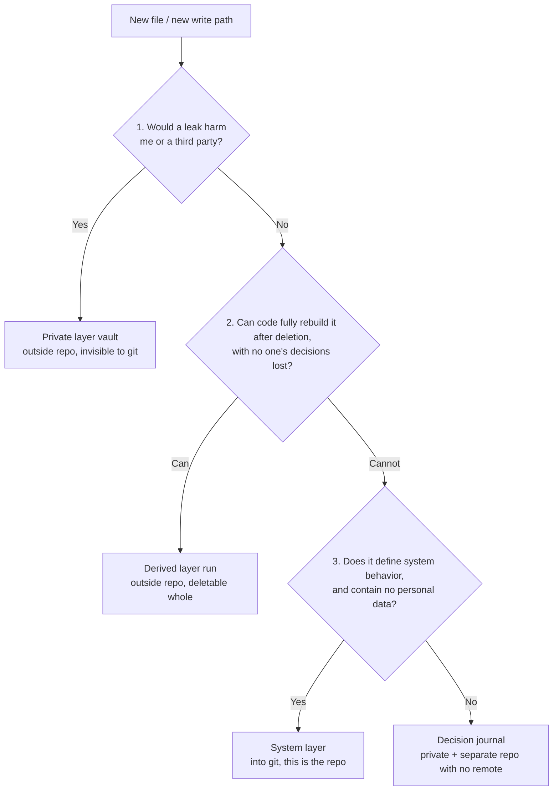

# Directory Layering and Data Governance

This document answers a question that looks trivial but actually decides whether the project can survive safely: **which files go into git, which do not, and what guarantees that the second set stays out.**

The original requirement had three layers: one for private data ("empty after clone"), one for dynamically generated things, one for the system data that supports AI operation. This document accepts that three-way split but makes three corrections: it adds the necessary fourth category (the decision journal), it writes the criteria as a mechanically executable waterfall, and it **upgrades "empty after clone" to "after clone the directory does not exist at all"** — the latter is a structural guarantee, the former is merely procedural.

Upstream context: L0–L7 and the `app.db` + `artifacts/` two-part backup in [02-architecture.md](02-architecture.md), the schema in [03-data-model.md](03-data-model.md), [10-risk-compliance.md](10-risk-compliance.md) §3.5/§3.6/§8.3/§8.4, and the first-draft project structure in [11-tech-stack-roadmap.md](11-tech-stack-roadmap.md) §16. This document conflicts directly with §16 in seven places, all listed in §8.

---

## 1. The four-layer classification

### 1.1 The decision waterfall: the order is not interchangeable

When adding any file (or any code path that writes a file), ask in order; **the first "yes" is the answer**:



**Why confidentiality (Q1) must come before reproducibility (Q2)**: plenty of things satisfy both. Email pulled down over IMAP "can be re-downloaded," but it carries third parties' names and addresses; the LLM cache "comes back on a rerun," but inside it are profile fragments that were sent to the model. Ask reproducibility first and these get classified as derived layer, then dropped into a directory everyone assumes is safe to throw away. **Ask confidentiality first and that branch does not exist.**

This ordering produces a counter-intuitive conclusion:

> **Most "generated output" is actually private layer.**
> The rendered resume PDF carries a real name and phone number; `app.db` holds the content library and recruiter contact details; a Playwright trace holds screenshots of logged-in pages. Every one of them can be regenerated, and not one of them can be treated as "no harm in deleting it."

The real derived layer is far smaller than intuition suggests: **only intermediates untouched by any personal fact** — downloaded raw JDs (public information), sitemap and HTTP ETag caches, render intermediates, redacted run logs, and statistical reports containing no personal data.

### 1.2 Definitions of the four layers

| | **Private layer** | **Derived layer** | **System layer** | **Decision journal** |
|---|---|---|---|---|
| **Code name** | `vault` | `run` | (the repo itself) | `journal` |
| **In one line** | A leak causes real harm | Delete it, rerun, it's back | The system's behavior definition | A record of my judgments |
| **Into the main repo?** | **Never** | **Never** | **Yes, it is the substance** | Into **two separate** repos with no remote |
| **After clone** | Directory does not exist | Directory does not exist | Complete | Does not exist |
| **Physical location** | data root `vault\` | data root `run\` | inside the repo | data root `journal\` |
| **Consequence of deletion** | Disaster, unrecoverable | **None, and there must be none** | Recoverable from git | Severe, retrospective material lost |
| **Backup** | **Required**, encrypted and off-machine | **Do not** (backing it up is waste and widens the exposure surface) | git is the backup | Same as the private layer |
| **Who writes it** | Code + user | Code | User + AI agent | User + AI agent |
| **Typical members** | `app.db`, artifacts, email, contacts, cookies, content library, LLM cache, traces | HTTP cache, downloaded JDs, render scratch files, redacted logs, de-identified reports | prompts, rubrics, schemas, modes, templates, source registry | submission history, scoring results, why I applied / why I did not |

### 1.3 Why the fourth layer must exist

The three-way split jams on one class of thing: **submission history, scoring results, and the reasoning behind "why I decided not to apply to this company."**

It is not a core asset of the private layer (deleting it does not stop you from applying), it is not derived layer (it is human decisions; ten thousand reruns will not produce it), and it cannot go into the system layer — laid open, `journal/pipeline.md` is a list of "the 40 companies I applied to and who rejected me," the thing an employed person most fears leaking ([99-gaps.md](99-gaps.md) C3).

Its real requirement is: **git's version history, but no remote.**

- Version control is needed: "last month I reversed this company from no-go to go — on what grounds" must be answerable with `git log`; after a rubric revision you must be able to diff before against after ([02-architecture.md](02-architecture.md) L3 states explicitly that scores are not directly comparable across versions, which makes visible history all the more necessary).
- No remote: the reason needs no explanation.

This also settles the open question left by [11-tech-stack-roadmap.md](11-tech-stack-roadmap.md) §16 note 2. That document recommends "the local git repo has no remote," but the main repo **already has one** (`git@github.com:rojarsmith/ai-career.git`, confirmed locally with `git remote -v`), so that recommendation is void on the main repo and can only be realized through additional repos. The mechanics are in §4.4.

### 1.4 Classification quick-reference

Every concrete file mentioned in 00–11 and in this batch, run once through the waterfall. **When adding a file later, look for a similar one in this table first; run the waterfall only if nothing matches.**

| File / directory | Layer | Which question it stops at |
|---|---|---|
| `app.db`, `app.db-wal`, `app.db-shm` | Private | Q1: content library + recruiter contact details |
| `vault/artifacts/<sha256>/resume.pdf` | Private | Q1: real name, phone, past employers |
| `vault/content/profile.yml`, `experience/*.md` | Private | Q1: salary expectations, visa status |
| Full email text pulled over IMAP | Private | Q1 (**not** Q2, see §1.1) |
| LLM prompt/response cache | Private | Q1: even with P2 redacted, P1 is still there ([10-risk-compliance.md](10-risk-compliance.md) §3.3) |
| Playwright trace / HAR / screenshots | Private | Q1: contains logged-in screens |
| Chrome `Data\profile\` (cookies, sessions) | Private | Q1: equivalent to a working key |
| `redaction-denylist.txt` (the denylist values) | Private | Q1: it is concentrated PII in itself |
| `.env`, `config.toml` real files | Private | Q1: API keys |
| Downloaded raw JD HTML/JSON | Derived | Q2: public information, re-fetchable |
| `careers.tsmc.com` sitemap cache | Derived | Q2: see [15-target-tsmc.md](15-target-tsmc.md) |
| HTTP ETag / Last-Modified cache | Derived | Q2 |
| Render intermediates (the HTML/DOCX→PDF pass) | Derived | Q2 |
| Redacted run logs `run/logs/*.jsonl` | Derived | Q2 |
| Funnel statistics output with no personal data | Derived | Q2 (the reports in [09-analytics-feedback.md](09-analytics-feedback.md); numbers are not personal data) |
| `CLAUDE.md`, `.agents/skills/**` | System | Q3 |
| `src/aicareer/prompts/parse_jd@v3.jinja` | System | Q3 |
| `knowledge/rubric/*.yml` | System | Q3 |
| `knowledge/sources/registry.yml` (with `tos_note`) | System | Q3: compliance decisions need a review trail ([04-ingestion.md](04-ingestion.md) §2, [10-risk-compliance.md](10-risk-compliance.md) §2.2) |
| `knowledge/schema/*.json` | System | Q3: the LLM output contract, and the main line of defense against prompt injection ([99-gaps.md](99-gaps.md) C1) |
| `templates/resume/resume.html` | System | Q3: the template contains no content |
| `config/*.example.*` | System | Q3: it is all `CHANGEME` |
| `tests/fixtures/` (fictional people) | System | Q3: provided they really are fictional ([10-risk-compliance.md](10-risk-compliance.md) §8.4) |
| `journal/pipeline.md` | Decision journal | Q1 is yes, but it needs version control → §4.4 |
| `journal/assessments/<job_id>.md` | Decision journal | Same as above |
| `doc/analysis-and-planning/*.md` | System | Q3: **currently gitignored; this document recommends putting it into git, with a precondition**, see §5.4 |

Two edge cases, handled on one principle: **reshape the ambiguous thing until it is unambiguous, rather than inventing a fifth layer for ambiguity.**

- **`tests/cassettes/` (LLM record/replay)**: depends on whether the prompt at record time carried a real profile. The approach is to force the recording flow through a redaction pass first, so it lands squarely in the system layer; if that cannot be done, do not record — hand-write the fixture instead.
- **`run/reports/`**: the funnel statistics of [09-analytics-feedback.md](09-analytics-feedback.md) are derived layer, but the moment a report drills down to "these 3 companies rejected me" it becomes decision journal. The cut is that report output may contain aggregate numbers only; when per-item detail is needed, read it from `journal/`, do not produce it from the report.

---

## 2. The three physical locations

This is the one thing this design most needs you to remember: **the files live in three physical locations, and only the first is in git.**

```
Location 1 / git repo ── system layer only. This is an invariant you can write as a test.
C:\my\build\github\ai-career\
├─ .gitignore                          ★root denylist, see §3.2
├─ .gitattributes                      * text=auto eol=lf
├─ .secretscan.toml                    ★scan rules (the values are not here, see §4.3)
├─ pyproject.toml / uv.lock
├─ README.md / README.zh-TW.md
├─ CLAUDE.md                           ★the AI's operating contract
│
├─ .agents\skills\ai-career\SKILL.md   ★vendor-neutral entry point (see 12)
│     └─ .claude\ .cursor\ … point here by link
│
├─ doc\
│  ├─ analysis-and-planning\*.md       recommend moving into git, precondition in §5.4
│  └─ decisions\ADR-0001-*.md
│
├─ src\aicareer\                       maps to L0–L7 of 02
│  ├─ cli.py  config.py  guard.py
│  ├─ db\  queue\  ingest\  normalize\  parse\
│  ├─ score\  assemble\  render\  review\  deliver\  analytics\
│  ├─ llm\                             client / providers / cache / cost
│  └─ prompts\parse_jd@v3.jinja        ★versioned, see §5.3
│
├─ knowledge\                          ★★the substance of "supporting AI operation", see §5
│  ├─ modes\          scan.md assess.md assemble.md review.md deliver.md
│  ├─ rubric\         scoring-rubric@v3.yml  weights.yml
│  ├─ states\         triage-states.yml  application-states.yml
│  ├─ sources\        registry.yml  tsmc.yml      ← see 04, 15
│  ├─ schema\         jd_parsed.schema.json  assessment.schema.json
│  │                  content_block.schema.json  resume.schema.json
│  └─ policy\         redaction-rules.yml  preflight-rules.yml
│                     honesty-invariants.yml
│
├─ templates\                          contains no personal facts
│  ├─ resume\resume.html + resume.css + resume.docx
│  └─ email\cover-letter.jinja
│
├─ config\                             ★deny all by default + allowlist, see §3.3
│  ├─ .gitignore
│  ├─ config.example.toml  .env.example
│  └─ config.toml  .env                (local only, ignored)
│
├─ tests\
│  ├─ fixtures\                        always fictional people, allowlist-protected
│  ├─ golden\                          JD parsing and scoring regression set
│  └─ cassettes\                       precondition: already de-identified (§1.4)
│
└─ scripts\
   ├─ bootstrap.ps1                    see §7
   ├─ hooks\pre-commit  hooks\pre-push see §4.3
   ├─ launch-chrome-job.ps1            see 14
   ├─ backup.ps1  restore.ps1          see §6.2
   └─ close-project.ps1                see §6.3


Location 2 / data root ── private layer, decision journal, derived layer. git cannot see it at all.
%LOCALAPPDATA%\ai-career\              ← AI_CAREER_DATA_DIR
├─ vault\                              private: must be backed up, cannot be rebuilt
│  ├─ app.db  app.db-wal  app.db-shm
│  ├─ content\                         ★separate repo #1 (no remote)
│  │  ├─ .git\
│  │  ├─ profile.yml
│  │  ├─ experience\*.md
│  │  └─ projects\*.md
│  ├─ artifacts\<sha256[:2]>\<sha256>\ frozen sent bytes (02 §2.2)
│  ├─ mail\                            full IMAP email text
│  ├─ contacts\
│  ├─ llm-cache\                       prompts and responses sent to the model
│  ├─ traces\                          Playwright trace / HAR / screenshots
│  └─ redaction-denylist.txt           ★the denylist "values" used for scanning, see §4.3
│
├─ journal\                            ★separate repo #2 (no remote)
│  ├─ .git\
│  ├─ pipeline.md                      master submission history (cf. career-ops in 12)
│  ├─ assessments\<job_id>.md
│  ├─ decisions\<app_id>.md
│  └─ backup-log.md
│
├─ run\                                derived: deleting all of it must be safe
│  ├─ cache\http\                      ETag / Last-Modified
│  ├─ downloads\                       raw JDs, sitemaps
│  ├─ logs\*.jsonl                     redacted
│  ├─ reports\                         aggregate numbers, no per-item detail
│  └─ tmp\
│
└─ backup\                             landing point after age encryption, then copied by hand to an external drive


Location 3 / dedicated browser ── the private layer most easily missed (see 14)
C:\my\build\toolchain\GoogleChromePortable64-Job\
├─ GoogleChromePortable.exe            launcher (handles profile redirection)
├─ App\Chrome-bin\chrome.exe           153.0.8010.37 (verified)
└─ Data\
   ├─ PortableApps.comInstaller\       currently the only entry = brand new, never run (verified)
   └─ profile\                         ★cookies / sessions → private layer
                                        (PortableApps conventional path, needs verification)
```

**Location 3 is neither inside the repo nor under the data root, yet it holds a pile of valid logged-in sessions for job sites.** Any procedure about backup, destruction, or encryption that covers only locations 1 and 2 has a hole in it. The lifecycle table in §6 must therefore list it explicitly.

### 2.1 Mapping to L0–L7

| Layer ([02-architecture.md](02-architecture.md)) | Reads what (system layer) | Writes what | Writes where |
|---|---|---|---|
| L0 source adapters | `knowledge/sources/registry.yml` | raw HTML/JSON, ETag | derived `run/cache/`, private `app.db` |
| L1 normalization and deduplication | `knowledge/schema/` | `job_posting`, `dedup_link` | private `app.db` |
| L2 coarse screening | `knowledge/rubric/`, `prompts/` | `triage_decision` | private `app.db` |
| L3 deep scoring | `knowledge/rubric/`, `prompts/`, `schema/` | `assessment` | private `app.db` + decision journal `journal/assessments/` |
| L4 assembly | `templates/`, `knowledge/policy/honesty-invariants.yml` | `artifact_bundle` | private `vault/artifacts/` |
| L5 delivery | `knowledge/policy/preflight-rules.yml` | `submission` | private `app.db` |
| L6 tracking | — | `status_event` | private `app.db` + `vault/mail/` |
| L7 analytics | — | aggregate reports | derived `run/reports/` |

**What is read is always system layer; what is written never is.** That symmetry can be written as a test: after a full round, `git status --porcelain` must be empty.

The first draft proposed using `icacls` to put a deny-write ACE on `knowledge\` to force read-only. **This document rejects that**: git's `checkout`, `pull`, and `stash` all need to write into the working tree, and with a deny ACE those operations fail in ways that are hard to diagnose — all to prevent a problem a single `git status` already catches. A mechanism that breaks normal operation ends up switched off.

---

## 3. The correct answer to "empty after clone"

### 3.1 First, fix the question

The original requirement said the private layer should be "empty after clone." But an "empty directory" implies the directory exists in the repo — and an empty directory named `vault` is bait in itself, tempting people (and agents) to write into it, until one day a mis-written glob carries it into a commit.

**The correct goal is "after clone the directory does not exist at all"**, and the way to get it is location 2 in §2: neither the private layer nor the derived layer sits under the repo tree. Then even `git add -A` or `git add -f` cannot add them — because they lie outside the field of view of any git.

The first draft kept a `var/` derived-layer mount point inside the repo. **This document deletes it**, for two reasons: first, once the derived layer is split between `var/` in the repo and `run/` in the data root, "delete the derived layer" becomes two commands and two sets of rules; second, it breaks the clean invariant "the repo contains system layer only", and that invariant is the most valuable thing in this design. The cost is that the user cannot see directly in the repo where a downloaded JD ended up — solved with `aicareer show` / `aicareer doctor` from pain point 1 in §8, which always print absolute paths.

So the "a directory carries its own `.gitignore`" trick has exactly two users in this design: `config/` and `tests/fixtures/`, and both use an allowlist, not a placeholder.

### 3.2 The root `.gitignore`: the second line of defense, assuming the first has already fallen

The root can only be a denylist (otherwise the whole repo would need an entry-by-entry allowlist, which is unmaintainable). Its job is to hold the perimeter and block known dangerous extensions and scratch files; the vitals go to the allowlists in §3.3 and the hooks in §4.3.

```gitignore
# ─────────────────────────────────────────────────────────────
# ai-career root .gitignore
# The first line of defense is "the private and derived layers are not in the repo" (see doc/analysis-and-planning/13-repo-layout.md §2)
# This file is the second line of defense, assuming the first has already fallen
# ─────────────────────────────────────────────────────────────

# ── someone hand-created a directory in the repo that belongs in the data root ──
/vault/
/journal/
/run/
/data/
/artifacts/
/mail_cache/
/content/

# ── real config files (templates always end in .example) ──
.env
.env.*
!.env.example
config.toml
!config.example.toml
*.token
*.pem
*.pfx
*.key
*.p12

# ── databases: WAL / SHM are the ones most often missed ──
*.db
*.db-wal
*.db-shm
*.sqlite
*.sqlite3
*.sqlite3-journal

# ── personal output files (a negation rule only works when the parent directory is not excluded) ──
*.pdf
*.docx
*.doc
*.odt
!templates/resume/*.docx

# ── browser-related (see 14-browser-automation.md) ──
**/Data/profile/
*.har
trace*.zip
*-trace.zip

# ── editor and system scratch: the most common way around .gitignore ──
*~
*.swp
*.swo
*.tmp
*.bak
*.orig
*.rej
~$*.docx          # Word lock file
.~lock.*#         # LibreOffice lock file, may contain the account and host name (needs verification, see §10)
Thumbs.db
desktop.ini
$RECYCLE.BIN/
*.stackdump
*.dmp             # a crash dump may contain secrets held in memory

# ── Python ──
__pycache__/
*.py[cod]
.venv/
venv/
.pytest_cache/
.ruff_cache/
.mypy_cache/
```

The `.~lock.*#` line is not filler: converting to PDF with LibreOffice is the settled route in [11-tech-stack-roadmap.md](11-tech-stack-roadmap.md) §8, so this file is certain to appear in the working directory during rendering. Whether its contents really carry the user name and host name is listed as an open verification item (§10 #4), but blocking it costs nothing.

The companion `.gitattributes` (keeps Windows line endings from turning every YAML/Markdown diff red, and protects the binary templates):

```gitattributes
* text=auto eol=lf
*.ps1 text eol=crlf
*.docx binary
*.pdf  binary
*.png  binary
```

### 3.3 Use allowlists for high-risk directories

The principle: **denylists hold the perimeter, allowlists hold the vitals.**

```gitignore
# config/.gitignore — deny everything by default, let through templates only
*
!.gitignore
!README.md
!*.example.toml
!*.example.yml
!.env.example
```

```gitignore
# tests/fixtures/.gitignore — let through only files explicitly marked as fictional
*
!.gitignore
!fake_*
!sample_*
```

That last one turns "test data must be fictional people" from a **verbal agreement** into a **mechanism**: a file not named with a `fake_` or `sample_` prefix simply cannot get into git. This is [00-overview.md](00-overview.md)'s "honesty by mechanism, not self-discipline" implemented at the filesystem level.

**This trick has a sharp edge you must know about**: `*` also ignores subdirectories, and git does not recurse into an ignored directory, so **no negation rule inside a subdirectory takes effect**. `tests/fixtures/emails/fake_recruiter.eml` will not be tracked unless `emails/` carries a `.gitignore` of its own. This design chooses to keep fixtures flat; if subdirectories become necessary later, a copy of the rules must go in with them, and code review must check for it.

---

## 4. Protecting the private layer

### 4.1 Why `.gitignore` is not enough

`.gitignore` is a **procedural** line of defense: it only takes effect at the instant "git decides whether to include an untracked file," and the number of paths around that instant is startling.

| # | Bypass path | How it happens | Does `.gitignore` stop it? | The real countermeasure |
|---|---|---|---|---|
| 1 | `git add -f` | You want to add some output "just this once" to take a look | No, disregarding it is exactly what `-f` means | Keep the data outside the repo |
| 2 | Already-tracked files | You committed first and added the rule afterwards | No, rules have no effect on tracked files | `git rm --cached` + a history scan |
| 3 | `git stash -u` / `-a` | You want to clear the working tree for a moment | `-u` pulls in untracked files; `-a` pulls in ignored ones too | Ban `-a`; keep the data outside the repo |
| 4 | Editor / lock files, crash dumps | What LibreOffice, Word, Python, or Chrome leaves in the cwd | Only if the matching glob was written | glob + a hook that scans content |
| 5 | Mis-written glob / letter case | `Data/` vs `data/`: Windows does not distinguish, git does | A rule that does not match is a rule that does not exist | Have the hook scan **content** rather than rely on file names |
| 6 | An extra worktree or submodule | Opening a second working directory inside the repo to hold data | Not applicable | Keep the data outside the repo |
| 7 | **An AI agent runs `git add -A`** | **The core purpose of this repo is to let an agent do the work** | No | **The hook is the only thing that stops an agent** |

Row 7 is unique to this project and the most realistic risk of the lot. A conventional project assumes a human initiates the commit and glances at `git status`; this project assumes the agent runs the commands itself. **Once you accept that premise, `.gitignore` is only a "hint" and the hook is the "gate"** — the same argument as [02-architecture.md](02-architecture.md) §6, "approval must be an architectural chokepoint, not a UI button," applied to version control.

### 4.2 `AI_CAREER_DATA_DIR`: the benefit, and the fee it collects every day

**Benefit**

- **Structural rather than procedural**: even `git add -A` cannot add a file that is not under the repo tree. This is the only measure that blocks rows 1, 3, 5, 6, and 7 of the table above at once.
- **A clear backup boundary**: backup = pack one directory, no need to enumerate "what's in and what's out."
- **Simple destruction**: close-out disposal = delete one directory (§6.3).
- **Clean machine migration**: clone the repo, restore one directory, and it runs.

**Cost**

- **The layer of indirection makes debugging harder.** "Where did this file actually get written to" costs one extra lookup. Mitigation: every error message prints an **absolute path**; `aicareer doctor` lists all three physical locations at once, with their existence and writability.
- **Windows environment variables have three scopes (Process / User / Machine).** In PowerShell, `$env:AI_CAREER_DATA_DIR = ...` changes only the current process, and **a worker started by Windows Task Scheduler may well not see it at all** (needs verification, §10 #1). The symptom is "it runs fine when I do it by hand, but under the scheduler the database is empty," and it raises no error — it just creates a new empty DB, the nastiest failure mode of all. Mitigation: use `setx` to write the User scope; always give scheduled actions absolute paths and an explicit working directory; **warn loudly at startup when the DB was freshly created** instead of creating it silently.

**Resolution**

| Item | Decision |
|---|---|
| Variable name | **`AI_CAREER_DATA_DIR`** (consistent with [10-risk-compliance.md](10-risk-compliance.md) §8.3). Not `CAREER_DATA_DIR` — too generic a name, prone to colliding with other tools |
| When unset | Use the default `%LOCALAPPDATA%\ai-career`, **not** fail fast. Reason: fail fast turns "the first run" into a configuration exercise, and what this project needs most is a low-friction Phase 0 |
| When set | Must be an absolute path |
| Startup checks (refuse to start) | ① it sits under the repo tree ② the path contains a known cloud-sync directory name (OneDrive / Dropbox / Google Drive / iCloudDrive) or the path contains a reparse point ③ it is not writable |
| Every startup | Print one line: `data_dir=<absolute path>` |
| When the DB is freshly created | Print `WARNING: a new app.db was created, is that expected?` and require the `--init` flag to continue (in non-interactive mode, refuse outright) |

Check ② implements both [11-tech-stack-roadmap.md](11-tech-stack-roadmap.md) §17 ("SQLite in a sync folder will corrupt → check the path at startup and refuse to run") and [10-risk-compliance.md](10-risk-compliance.md) §3.6 ("a sync folder means handing the data to a third party"). `%LOCALAPPDATA%` is chosen over `Documents` because the former is not covered by OneDrive's Known Folder Move by default (**needs verification**, §10 #2).

### 4.3 pre-commit / pre-push scanning (fills [99-gaps.md](99-gaps.md) C2)

Two layers, because generic tools do not recognize Taiwan's personal-data formats.

**Layer one: a generic secret scanner.** `gitleaks` or `detect-secrets`, catching API keys, private keys, and high-entropy strings. [10-risk-compliance.md](10-risk-compliance.md) §8.4 already requires it; this document will not repeat it.

**Layer two: PII scanning specific to this project.** The single most critical point in the design:

> **The scan "rules" live in the repo (system layer); the "values" they compare against live in the vault (private layer).**
>
> This split means **the hook stays effective even if the repo goes public, and the hook itself leaks nothing**. The other way around — writing the real name into a hook config file inside the repo — is leaking once in order to prevent a leak.

```toml
# .secretscan.toml — the rules live here, the values in %AI_CAREER_DATA_DIR%\vault\redaction-denylist.txt
denylist_file = "${AI_CAREER_DATA_DIR}/vault/redaction-denylist.txt"
on_missing_denylist = "warn"     # degrade on a freshly cloned machine, but never pass silently

[[rule]]
id        = "tw_national_id"
pattern   = '\b[A-Z][12]\d{8}\b'
validator = "tw_id_checksum"     # a hit only counts if the checksum passes, or part numbers false-match
action    = "block"

[[rule]]
id      = "tw_mobile"
pattern = '\b09\d{2}-?\d{3}-?\d{3}\b'
action  = "block"

[[rule]]
id      = "tw_landline"
pattern = '\b0[2-8]-?\d{7,8}\b'
action  = "warn"                 # decent odds of false-matching dates and version numbers

[[rule]]
id      = "email"
pattern = '[\w.+-]+@[\w-]+\.[\w.]+'
allow   = ["example.com", "example.org", "example.net", "users.noreply.github.com"]
action  = "block"

[[rule]]
id      = "private_key"
pattern = '-----BEGIN (RSA |EC |OPENSSH )?PRIVATE KEY-----'
action  = "block"

[[rule]]
id      = "denylist_literal"     # real name, address, full names of past employers, matched verbatim
source  = "denylist_file"
action  = "block"

[[rule]]
id          = "high_entropy"
pattern     = '[A-Za-z0-9+/=]{40,}'
min_entropy = 4.0
action      = "warn"             # high false-positive rate, warn only
```

Every regex above is a **draft that needs its false-positive rate measured against real commits** (§10 #3, #4). The false-positive rate is the core design parameter of this hook: a hook that false-positives every day gets permanently bypassed with `--no-verify` by day three.

The engineering details that go with it:

- **`pre-commit` is not enough; add `pre-push`.** `pre-commit` only looks at staged content; it never sees commits brought in by rebase, merge, or cherry-pick. `pre-push` scans `git log -p @{u}..HEAD` and is the last gate before the push to GitHub.
- **Put the escape hatch in plain sight.** The block message says outright: "if you are sure you want to commit, use `--no-verify` and state the reason in the commit message." Hide the escape hatch and people simply disable the entire hook.
- **A local-only project has no CI, so the hook is the only line of defense**, which means `bootstrap.ps1` must install it (`.git/hooks/` does not go into git; that is git's design).
- **Add one line to the Phase 0 DoD: deliberately commit a fake national ID number and a word from the denylist, and confirm both are blocked.** A gate that has never been verified is not a gate — the same discipline as [11-tech-stack-roadmap.md](11-tech-stack-roadmap.md) §12's "a backup you have never drilled is not a backup."

### 4.4 Private data that needs version control: two repos with no remote

| | Option | Confidentiality | Operating cost | Failure mode | Ruling |
|---|---|---|---|---|---|
| A | **Local repo, no remote** | High (data never leaves the machine) | Very low | Disk dies and it is all gone | **Adopted** |
| B | GitHub private repo | Medium (trusts the platform + account security) | Low | Account compromised; accidentally flipped to public | Rejected, violates product principle 5 |
| C | git-crypt | Medium-high | Medium (key management) | File names and directory structure are not encrypted (its current version's behavior needs verification); miss one `.gitattributes` line and it commits in plaintext, and does so **silently** | Rejected, see below |
| D | age-encrypted whole snapshot | Highest | Low | **No diff, therefore no version control** | For backup, not version control |

**Concretely: two repos, not one.**

```
%LOCALAPPDATA%\ai-career\vault\content\.git    ← repo #1: the content library
%LOCALAPPDATA%\ai-career\journal\.git          ← repo #2: the decision journal
```

Why not one repo rooted at the data root (`%LOCALAPPDATA%\ai-career\.git`)? Because that needs an allowlist `.gitignore` to separate "the `content/` and `journal/` that must be tracked" from "the `app.db`, `artifacts/`, and `mail/` that must never be." That allowlist's failure mode: you add `vault/content/skills.md`, the allowlist does not match it, it goes unversioned from that point on, and you believe it is versioned — a **silent failure**.

**With two repos each rooted at a directory where "everything should be tracked," the rule degenerates into no rule at all** — no judgment is required, so nothing can slip through. The cost is two `git log`s, which a single wrapper command handles:

```powershell
# aicareer journal commit -m "..." is roughly equivalent to
git -C "$DataDir\vault\content" add -A; git -C "$DataDir\vault\content" commit -m $Msg
git -C "$DataDir\journal"       add -A; git -C "$DataDir\journal"       commit -m $Msg
```

When `bootstrap.ps1` creates them it must check for a remote and warn if it finds one — the only rule these two repos have to observe.

**Why C (git-crypt) is explicitly rejected**, even though it looks the most elegant: its value is in "letting encrypted data sit safely inside a repo that has a remote," and this project's main repo already has a remote pointing at GitHub. Adopt C and security reduces to every single `.gitattributes` rule being written correctly, where a wrong one manifests as a **silent plaintext commit** — you get no warning until the day you find it has been on GitHub for three months.

> **Physical separation across two repos beats configuration correctness inside one.**

**A's cost must be stated plainly**: no remote means no off-site redundancy, and a dead disk destroys everything. So the encrypted backup in §6.2 is a **mandatory companion, not an option**. And the backup itself has a single point of failure — lose the `age` private key and every backup is destroyed with it. Handling: the age private key is a single line of text, `AGE-SECRET-KEY-1...`; **copy it onto paper and lock it away**, in a different physical location from the external drive. For a one-person setting, paper suits better than a cloud KMS: it has no account that can be stolen and no service that can shut down.

API keys and tokens take none of the routes above; see the ruling on conflict 6 in §8.

### 4.5 Windows-specific traps

Only the ones that actually bite.

| Item | Risk | Countermeasure |
|---|---|---|
| NTFS ACLs are not POSIX `0700` | `%LOCALAPPDATA%` is readable only by you by default, but **copying to `D:\` or a USB drive inherits the destination's permissions** | Always encrypt a backup with `age` or `7z -mhe=on` before moving it |
| OneDrive Known Folder Move | Once enabled, Desktop / Documents / Pictures all sync; SQLite placed there corrupts and is effectively in the cloud | The startup checks in §4.2; default the path to `%LOCALAPPDATA%` |
| Recycle Bin | "Deleting" a private file only moves it to `$RECYCLE.BIN`, fully restorable | The destruction procedure must empty the Recycle Bin; for the real guarantee see §6.3 |
| Volume Shadow Copy / File History | An old `app.db` may survive inside a system restore point | The destruction procedure has to handle it too, or record it explicitly as "accepted residue" |
| Case-insensitive file names | git considers `Data/` ≠ `data/`, Windows considers them identical → a gitignore rule may not match | Keep all rules lowercase; do not rely on file names, rely on the hook scanning content (§4.3) |
| `MAX_PATH` 260 | `artifacts\<sha256[:2]>\<sha256>\...` plus a long file name overruns it easily; the symptom is inexplicable I/O errors | **Use hashes, not company names, in artifact paths**; `git config core.longpaths true` (the actual lengths need verification, §10 #6) |
| Encoding | cp950 blows up on a Chinese-language JD ([11-tech-stack-roadmap.md](11-tech-stack-roadmap.md) §17) | Write `encoding="utf-8"` explicitly on all I/O; set `PYTHONUTF8=1` |
| Junctions / symlinks | The urge to put a link inside the repo pointing at the data root | **Do not.** It turns the structural guarantee "the data is outside the repo" back into a procedural one |
| Windows Search indexing | May read and index the body text of resume PDFs (**needs verification**, §10 #5) | Add the data root to the indexer's exclusion list; costs one minute |
| `setx` length limit | A long path may be truncated (**needs verification**, §10 #1) | Keep the data-root path short; after setting it, verify immediately in a **newly opened** window |

---

## 5. The system layer: what actually "supports AI operation"

The system layer is not "whatever is left over"; it is **the system's behavior definition**.

### 5.1 The list

| Path | Who reads it | Why it must be version-controlled | Explicitly must not contain |
|---|---|---|---|
| `CLAUDE.md` | AI CLI agent | The agent's operating contract. Change it and you change system behavior, so it must be diffable and able to answer "why did it do that last week" | Real name, email address, any vault content |
| `.agents/skills/ai-career/SKILL.md` | Any agent CLI | The vendor-neutral entry point (see [12-reference-career-ops.md](12-reference-career-ops.md)) | Same as above |
| `knowledge/modes/*.md` | agent | Each mode is a reviewable process definition, on a par with code | Same as above |
| `src/aicareer/prompts/*@vN.jinja` | LLM Gateway | Output must be traceable to a prompt version (`prompt_versions` in [06-content-assembly.md](06-content-assembly.md) §5); the prompt is the part that degrades quietly most easily | Few-shot examples drawn from real JDs must be de-identified |
| `knowledge/rubric/*.yml` | L2 / L3 | Scores are not directly comparable across versions ([02-architecture.md](02-architecture.md) L3), so every version must remain available for later excavation | — |
| `knowledge/states/*.yml` | State machine | The state set is a cross-layer contract ([03-data-model.md](03-data-model.md) §4); any change must come with a migration | — |
| `knowledge/sources/registry.yml` | L0 | `tos_note` / `enabled` are a **record of compliance decisions** ([04-ingestion.md](04-ingestion.md) §2, [10-risk-compliance.md](10-risk-compliance.md) §2.2), and need a trail of "who enabled this source, when, and on what grounds" | Accounts, cookies, tokens |
| `knowledge/schema/*.json` | LLM output validation | The contract for structured output, and the main line of defense against prompt injection ([99-gaps.md](99-gaps.md) C1) | — |
| `knowledge/policy/*.yml` | preflight / redaction / honesty checks | The mechanism itself behind "by mechanism, not self-discipline" | The **values** of the denylist (they live in the vault, §4.3) |
| `templates/resume/*` | Render layer | The baseline for layout regression; the diff after a template change is the regression test's input | Any real content; the sample name is always "王小明" |
| `config/*.example.*` | Humans | So that init works after a clone | Anything other than `CHANGEME` |
| `tests/golden/` | Regression tests | The brake on prompt revisions ([11-tech-stack-roadmap.md](11-tech-stack-roadmap.md) §11) | Real personal data |

### 5.2 One mechanically checkable criterion

> **What system-layer files have in common: publish one and the reader can learn only "how this system works," never "who this person is, where they applied, and what offer they got."**

Used in reverse as a check: any file going into git from which, once read, you can derive any of the latter has been classified wrong. That sentence can go into `CLAUDE.md` as it stands.

### 5.3 Prompt version management: the version number is for humans, the hash is for the audit

| Approach | Advantage | Defect |
|---|---|---|
| Version in the file name, `parse_jd@v3.jinja` (adopted in [11-tech-stack-roadmap.md](11-tech-stack-roadmap.md) §16) | `prompt_versions` in the DB is a human-readable string that always resolves | The directory accumulates old versions; the diff is discontinuous (v3 to v4 is two files, not one edit) |
| Pure git hash | Natural diffs, no accumulating files | Can be orphaned after the repo is rebased or force-pushed; an offline artifact cannot prove itself |

**Record both**: the file name carries the **semantic major version** (`@v3`), bumped by a human whenever "this change makes scores incomparable with the previous version"; at the same time `GenerationRun` ([06-content-assembly.md](06-content-assembly.md) §5) records the sha256 of the prompt file's contents, computed automatically by machine.

The version number is for humans (report grouping, communication); the hash is for the audit — **it never lies**: even if someone quietly edits `@v3` and forgets to bump it, the hash will differ. The cost is one field; the return is that "three months from now, can I prove which prompt produced this resume" moves from "probably" to "definitely."

### 5.4 Why `knowledge/` has to be split out of `src/`

[11-tech-stack-roadmap.md](11-tech-stack-roadmap.md) §16 puts `prompts/` under `src/aicareer/`. This document recommends leaving prompts where they are (they share a version and a lifecycle with the code that calls them), but pulling **rubric, states, sources, schema, policy, and modes out into `knowledge/`**:

1. **Different readers.** `src/` is read by the Python interpreter; `knowledge/` is read by humans and AI agents. To answer "why did this job posting score low," an agent needs to read the rubric, not `score/engine.py`.
2. **Different change frequency and risk.** Changing a rubric weight requires no code change, and should not require understanding the code. Once separated, "tuning a parameter" and "changing the logic" are two different kinds of commit in the git history.
3. **It is a portable asset.** `src/` may be rewritten one day, but the rubric, the state definitions, the source registry, and the schemas will survive.

`knowledge/modes/` takes after career-ops's `modes/` (see [12-reference-career-ops.md](12-reference-career-ops.md)), with one critical difference: a career-ops mode is **the whole of the process** (it is CLI-agent-native, with no code underneath), while a mode in this project is only **a script for the human-machine interface**, with real Python underneath running the invariant checks. Blur that and you end up writing constraints that code should enforce (for example, "a bullet must be taken verbatim from a verified block") as a prompt instruction — which is a regression back to self-discipline.

**On `doc/analysis-and-planning/`: recommend putting it into git, but one precondition must be confirmed first.**

It fully satisfies Q3 (defines system behavior, contains no personal data, needs diffs and traceability). Today `.gitignore` blocks it, at the cost that the AI agent re-reads local files every time with no version trail whatsoever — and when the agent is the primary reader, "not version-controlling its behavior definition" is self-contradictory.

**The precondition is that the repo must be private.** The mere existence of [15-target-tsmc.md](15-target-tsmc.md) reveals that "this person is studying how to apply to TSMC," which is exactly the current-employer detection risk in [99-gaps.md](99-gaps.md) C3. The boundary: **15 describes "how TSMC's recruiting system works" (system layer), not "which job postings I applied to" (decision journal)** — the latter always goes into `journal/`. Even so, a public repo still leaks intent, so "confirm repo visibility and record the date of confirmation" must be a precondition for tracking `doc/` (§10 #7).

---

## 6. Data lifecycle

### 6.1 Retention and cleanup

| Layer | Retention | Cleanup method | Backup |
|---|---|---|---|
| System layer | Permanent | No cleanup | git (the main repo has a remote) |
| Derived layer `run/` | Logs 30 days (aligned with [10-risk-compliance.md](10-risk-compliance.md) §3.5); the cache turns over naturally by ETag | `aicareer purge --generated` = **delete the entire `run/` outright** | **No backup** |
| Private layer `vault/` | Purged category by category per [10-risk-compliance.md](10-risk-compliance.md) §3.5 (full JD text 24 months, email 12 months, contacts 18 months, output files 12 months after close-out, LLM logs 30 days, content library permanent) | `aicareer purge --retention` + `VACUUM` | **Required**: encrypted and off-machine, keeping the latest 3 |
| Decision journal `journal/` | 12 months after close-out | Through the close-out procedure in §6.3 | Same as the private layer |
| **Chrome `Data\profile\`** | Per the site's own session expiry; **deleted at close-out** | Delete the whole `profile` directory | **No backup** — backing up a session cookie amounts to printing a second copy of a working key |

"Delete the derived layer's whole directory" is not laziness, it is a **verification method**: if the system will not run after `run/` is deleted, something has been classified wrong. Make it an executable check: `aicareer doctor --fresh` deletes `run/` and runs the smoke test again. This is also the direct payoff of taking `var/` out of the repo in §3.1 — the check has exactly one directory to delete.

### 6.2 Backup: separate "encryption" from "off-machine"

"The private layer must be backed up but must not go to the cloud" sounds contradictory; you only have to split the two concerns — **encryption solves confidentiality, an external drive solves off-site placement**.

```powershell
# scripts/backup.ps1 (illustrative)
$DataDir = $env:AI_CAREER_DATA_DIR
$Stamp   = Get-Date -Format yyyyMMdd

# 1. SQLite must use .backup, never a plain copy (in WAL mode a copy yields an inconsistent snapshot)
sqlite3 "$DataDir\vault\app.db" ".backup '$DataDir\run\tmp\app.db'"

# 2. Pack vault + journal (including each one's .git, or the version history is lost)
tar -cf "$DataDir\run\tmp\snapshot.tar" -C $DataDir vault journal

# 3. Public-key encryption (the private key does not need to be present to back up)
age -r $env:AI_CAREER_AGE_RECIPIENT -o "$DataDir\backup\ai-career-$Stamp.tar.age" `
    "$DataDir\run\tmp\snapshot.tar"

# 4. Clear the intermediate plaintext files (the easiest step to forget; forget it and the first three were pointless)
Remove-Item "$DataDir\run\tmp\snapshot.tar", "$DataDir\run\tmp\app.db"

# 5. Rotation: keep only the latest 3
Get-ChildItem "$DataDir\backup\*.tar.age" | Sort-Object Name -Descending |
    Select-Object -Skip 3 | Remove-Item -Confirm:$false

# 6. By hand: copy the newest .age to the external drive and write one line into journal\backup-log.md
```

Three points that are easy to overlook:

- **`.backup`, not `Copy-Item`.** In WAL mode, copying `app.db` directly gives you a file missing the most recent transactions, or one that will not open at all.
- **Step 4 cannot be skipped.** Leaving the intermediate plaintext in `run/tmp/` means one more unencrypted copy of your complete career data lying on the disk.
- **Keeping only 3 is not merely about space.** [10-risk-compliance.md](10-risk-compliance.md) §3.5 already pointed this out: if old backups never expire, "deletion" is a fiction — contact details someone asked to have deleted go on living in a three-year-old backup. Rotation is part of the deletion guarantee.

**The restore drill** ([11-tech-stack-roadmap.md](11-tech-stack-roadmap.md) §12 requires at least one; this document recommends one per quarter) must restore into **a brand new empty directory** and then run `aicareer doctor`; it must not restore into an existing directory — there, existing files mask the failure and you get the illusion of a "successful drill."

### 6.3 Data disposal after the job search ends (fills [99-gaps.md](99-gaps.md) C4)

Three stages, triggered by the user explicitly running `aicareer close-project`. **Not "delete everything the day you land the job."**

| Stage | Timing | Action | What is left afterwards |
|---|---|---|---|
| **T0 freeze** | The day the offer is accepted | Disable all scheduled tasks; set `enabled=false` across `sources/registry.yml`; switch the worker guard to refuse to start (aligned with [11-tech-stack-roadmap.md](11-tech-stack-roadmap.md) §15) | Everything |
| **T0+7 de-identify** | One week later | Delete **other people's** personal data: recruiter and hiring manager names, emails, phone numbers → replaced with `contact_<hash>`; keep company names and timestamps | De-identified statistics + your own content library |
| **T0+90 destroy** | Three months later | Delete `vault/mail/`, `vault/artifacts/`, `vault/llm-cache/`, `vault/traces/`, Chrome `Data\profile\`, and old backups beyond the latest 3; empty the Recycle Bin; `VACUUM` | `journal/` + `vault/content/` (the content library, a permanent asset, already settled in [10-risk-compliance.md](10-risk-compliance.md) §3.5) |

**Why there is a T0+7 window**: the offer can be withdrawn; a reference check may need the correspondence; you may be applying elsewhere again three weeks later. Deleting everything on the spot is the design that looks most responsible and in practice most easily leads to "just never run the procedure at all." **A strict procedure that is never executed is worth less than a loose one that is.**

**What cannot be deleted must be listed honestly**, or this procedure is handing out a false guarantee:

- Sent email lives in your Sent folder and in the other party's mailbox — entirely outside the system's reach.
- Windows restore points and File History may hold an old `app.db`.
- Old encrypted backups on the external drive (unless physically destroyed, or the age private key is destroyed).
- SQLite's `DELETE` does not return space, and residue may remain inside pages (already described in [10-risk-compliance.md](10-risk-compliance.md) §3.5).

> **There are only two real destruction guarantees: destroy the BitLocker key, or overwrite the whole disk.** Application-level deletion is best-effort, and the documentation must say so, or the user will assume one command left everything clean.

---

## 7. Phase 0 implementation checklist

A misclassification costs five file edits in Phase 0 and a git-history rewrite in Phase 2. The six items below cannot be deferred; estimate two hours:

1. The root `.gitignore` (§3.2) and `.gitattributes`
2. `config/.gitignore` and `tests/fixtures/.gitignore` (§3.3)
3. The default value of `AI_CAREER_DATA_DIR`, the startup checks, and `scripts/bootstrap.ps1`
4. The pre-commit + pre-push hooks, **and deliberately commit a fake national ID number and a denylist word to confirm both get blocked**
5. Confirm the repo's visibility is private and record the date of confirmation (the precondition for tracking `doc/`, §5.4)
6. The `knowledge/` skeleton — Phase 0 needs only two files, `sources/registry.yml` and `policy/redaction-rules.yml`

```powershell
# scripts/bootstrap.ps1 (illustrative; the real version needs error handling)
#requires -Version 5.1
$ErrorActionPreference = 'Stop'
$Repo    = Split-Path -Parent $PSScriptRoot
$DataDir = if ($env:AI_CAREER_DATA_DIR) { $env:AI_CAREER_DATA_DIR } else { "$env:LOCALAPPDATA\ai-career" }

# 1. Refuse dangerous locations (§4.2)
if ($DataDir.StartsWith($Repo, 'OrdinalIgnoreCase')) { throw "The data root must not be under the repo tree: $DataDir" }
foreach ($p in @('OneDrive','Dropbox','Google Drive','iCloudDrive')) {
    if ($DataDir -like "*\$p\*") { throw "The data root must not be on a cloud-sync path: $DataDir" }
}

# 2. Create the directories
@('vault\content','vault\artifacts','vault\mail','vault\contacts','vault\llm-cache','vault\traces',
  'journal\assessments','journal\decisions',
  'run\cache\http','run\downloads','run\logs','run\reports','run\tmp','backup') |
    ForEach-Object { New-Item -ItemType Directory -Force "$DataDir\$_" | Out-Null }

# 3. Two private repos with no remote (§4.4)
foreach ($r in @("$DataDir\vault\content", "$DataDir\journal")) {
    if (-not (Test-Path "$r\.git")) {
        git -C $r init -q
        git -C $r commit -q --allow-empty -m "init"
    }
    $remotes = git -C $r remote
    if ($remotes) { Write-Warning "$r has a remote ($remotes), please confirm this is deliberate" }
}

# 4. Config file (approach D: copy the template into a real file)
if (-not (Test-Path "$Repo\config\config.toml")) {
    Copy-Item "$Repo\config\config.example.toml" "$Repo\config\config.toml"
}

# 5. Install the hooks (.git\hooks does not go into git, so copying is the only way)
Copy-Item "$Repo\scripts\hooks\pre-commit" "$Repo\.git\hooks\pre-commit" -Force
Copy-Item "$Repo\scripts\hooks\pre-push"   "$Repo\.git\hooks\pre-push"   -Force
git -C $Repo config core.longpaths true

# 6. Persist the environment variable (User scope; only takes effect in a new window)
setx AI_CAREER_DATA_DIR "$DataDir" | Out-Null
Write-Host "data_dir=$DataDir"
Write-Host "Note: setx only affects newly opened windows; verify `$env:AI_CAREER_DATA_DIR in a new window"
```

Item 4 deserves special emphasis: Phase 0 in [11-tech-stack-roadmap.md](11-tech-stack-roadmap.md) states explicitly that "no code gets written in this phase," and the six items above look like a violation of that. **They are not system features, they are security prerequisites.** Phase 0 calls for 20 submissions by hand, and that process puts real resume PDFs and real company contact details on your machine. Without items 1–5, Phase 0 is itself an exposure window.

---

## 8. Where this design will hurt

**Pain point 1: the layering is too fine-grained and you cannot find anything.**

One company's data ends up scattered across five places at once: `knowledge/sources/tsmc.yml` (configuration), `run/cache/http/` (sitemap cache), `vault/app.db` (after normalization), `journal/assessments/` (the assessment), and `vault/artifacts/` (the output). "Where is the resume I last sent to TSMC" becomes a question you need specialist knowledge to answer.

Mitigations, in order of effectiveness:

- **Build one aggregating entry point**: `aicareer show <job_id>` prints the relevant content from all five places at once, **absolute paths included**. With it, the user never has to remember the layering. This is the only genuinely effective mitigation.
- **Put a one-sentence `README.md` only in the directories humans actually visit** (`knowledge/`, `config/`, the data root), and none in the machine-only ones.
- **Do not pre-create directories for categories you "might have later."** An empty directory costs as much cognitively as a full one.

**Pain point 2: the layer of indirection in the environment variable.**

Its nastiest form is described in §4.2: the scheduler cannot see the variable set in a shell, silently creates a new empty DB, and you believe the system is running. Mitigation: print `data_dir=` at every startup; have `aicareer doctor` list all three physical locations; **require a flag to continue when the DB has been freshly created** — turn the silent failure into a loud one.

**Pain point 3: two extra git repos you have to remember to commit.**

`vault/content/` and `journal/` are repos with no remote: no CI, no PRs, nobody to remind you. The real failure is "three months later you open `git log` and find the last commit was in week one." Mitigation: hang the commit off the end of a flow so it runs automatically (after approval in `aicareer review`, after each stage of `aicareer close-project`) instead of relying on someone to remember. That trades self-discipline for mechanism, but only partly — an automatic commit guarantees a snapshot, not a meaningful commit message.

**Pain point 4: the denylist is itself concentrated PII.**

`vault/redaction-denylist.txt` holds, in a single file, your real name, phone number, national ID number, home address, and the full names of past employers — the highest information density of any file on the machine. It sits in the vault and gets backed up encrypted, but the hook also reads it on every commit, so it has to be plaintext. This is a trade-off with no good answer, only an honest record: **this design concentrates scattered PII so it can be detected, at the cost of manufacturing a new high-value target.**

**Pain point 5: with the private layer outside the repo, the project cannot be moved as one package.**

Changing machines takes two steps instead of one. Accept the cost, because what it buys is five of the seven bypass paths in the §4.1 table. Portability is solved by the backup script in §6.2 (packing `vault` + `journal` is a one-line command).

**Pain point 6 (the most important, and the most uncomfortable): this governance stops `git add`; it does not stop an agent with shell access.**

Writing "do not read `vault/`" in `CLAUDE.md` **is not a mechanism, it is self-discipline written in a different place**. An agent that can execute shell commands can read anything under `AI_CAREER_DATA_DIR`, and every layer in this document is transparent to it.

| What this design stops | What this design does not stop |
|---|---|
| `git add -A` pushing private data to GitHub | An agent reading private-layer content |
| Committing an output file by mistake | An agent writing private content into a commit message |
| A single mis-written glob causing a leak | An agent sending private content into an LLM |
| Confusion about what should be backed up | The user copying and pasting it themselves |

For the column it does not stop, the countermeasure is not in the directory structure — it is the P0/P1/P2 data classification and the redaction pass in [10-risk-compliance.md](10-risk-compliance.md) §3.3, plus [02-architecture.md](02-architecture.md) D5's "the LLM Gateway is the sole model egress." Directory layering answers for the git side only. **Claiming that a mechanism which solves only problem A also solves B is the most common form of self-deception in security design**, which is why this table stays in the document.

---

## 9. Conflicts with existing documents

The complete revision list is in [16-plan-revisions.md](16-plan-revisions.md); the seven items here are the ones tied directly to directory governance.

| # | Conflict | Source | Recommendation |
|---|---|---|---|
| 1 | Data directory inside the repo vs outside it | [11-tech-stack-roadmap.md](11-tech-stack-roadmap.md) §16 puts `data/` under the repo; [10-risk-compliance.md](10-risk-compliance.md) §8.3 puts it in `%LOCALAPPDATA%` | Take 10, amend 11 |
| 2 | Three versions of the DB file name | `app.db` ([02-architecture.md](02-architecture.md)) / `aicareer.db` ([11-tech-stack-roadmap.md](11-tech-stack-roadmap.md) §16) / `career.db` ([10-risk-compliance.md](10-risk-compliance.md) §8.3) | Standardize on `app.db` |
| 3 | Inconsistent environment variable names | `AI_CAREER_DATA_DIR` ([10-risk-compliance.md](10-risk-compliance.md) §8.3) / `CAREER_DATA_DIR` (this batch's briefing) | Standardize on `AI_CAREER_DATA_DIR` |
| 4 | **The location of `content/`** | [11-tech-stack-roadmap.md](11-tech-stack-roadmap.md) §16 puts it under the repo and version-controls it, while also recommending "the local git repo has no remote" — but the main repo **already has a remote** (confirmed locally with `git remote -v`) | **Move it to `vault/content/` and version-control it with a separate, remote-less repo. This is the most important revision in this document** |
| 5 | Document directory name and visibility | [11-tech-stack-roadmap.md](11-tech-stack-roadmap.md) §16 writes `docs/analysis/`; the actual path is `doc/analysis-and-planning/` and it is blocked by `.gitignore` | Standardize the path; remove that ignore rule once the repo is confirmed private (§5.4) |
| 6 | **Opposite routes for secret management** | [02-architecture.md](02-architecture.md) D6 requires everything to go through Windows Credential Manager; [11-tech-stack-roadmap.md](11-tech-stack-roadmap.md) §12 says outright "keep API keys in `.env` in plaintext, do not bother with a keyring" | **This is a contradiction [99-gaps.md](99-gaps.md) did not catch.** Recommend grading by "revocation cost": an API key that can be revoked and reissued at any time may live in `.env` in plaintext (take 11's pragmatism); **IMAP/OAuth refresh tokens and the HMAC key used for approval must go into Credential Manager** (take 02, because a leak of the former means your mailbox can be read, and a leak of the latter means the approval gate is void) |
| 7 | The draft `.gitignore` is incomplete | [10-risk-compliance.md](10-risk-compliance.md) §8.4 is missing `*.db-wal`, `*.db-shm`, editor lock files, and crash dumps | Replace it with §3.2 |

---

## 10. Related documents

- [00-overview.md](00-overview.md): "the content library is the asset" and "honesty by mechanism, not self-discipline" — this document is both of those implemented at the filesystem level
- [02-architecture.md](02-architecture.md): the L0–L7 layering, D5 LLM Gateway, D6 secret management, §6 approval as an architectural chokepoint
- [03-data-model.md](03-data-model.md): the schema and the two-level state machine, matching `knowledge/states/`
- [04-ingestion.md](04-ingestion.md): the field definitions of the source registry, matching `knowledge/sources/registry.yml`
- [06-content-assembly.md](06-content-assembly.md): `GenerationRun` and prompt versions, matching §5.3
- [09-analytics-feedback.md](09-analytics-feedback.md): the aggregation level of reports, matching the `run/reports/` boundary in §1.4
- [10-risk-compliance.md](10-risk-compliance.md): retention periods, encryption, repo separation — the direct upstream of this document
- [11-tech-stack-roadmap.md](11-tech-stack-roadmap.md): the §16 first-draft project structure, seven parts of which this document replaces
- [12-reference-career-ops.md](12-reference-career-ops.md): how far `modes/` and the agent skill standard are borrowed
- [14-browser-automation.md](14-browser-automation.md): governance of the dedicated Chrome profile (§2 location 3)
- [15-target-tsmc.md](15-target-tsmc.md): the actual content of `knowledge/sources/tsmc.yml`
- [16-plan-revisions.md](16-plan-revisions.md): the complete revision list this document produces
- [99-gaps.md](99-gaps.md): C2 (repo leak protection) is filled by §3–§4, C4 (close-out disposal) by §6.3

---

## Open Verification Items

Every external fact in this document not marked "verified" is collected here. Confirm each one before work starts and record the result back into this document.

| # | Item | Current status | How to verify | Impact |
|---|---|---|---|---|
| 1 | Whether a process launched by Windows Task Scheduler inherits a User-scope variable set with `setx`; the real length limit of `setx` | Speculation, needs verification | Create a test task running `powershell -c "$env:AI_CAREER_DATA_DIR \| Out-File C:\temp\t.txt"`; separately set an extremely long path and watch for truncation | §4.2, whether scheduling is usable; step on this and you silently create an empty DB |
| 2 | Whether `%LOCALAPPDATA%` can be covered by OneDrive's Known Folder Move | Speculation, needs verification | Check the "Backup" → "Manage backup" list on the OneDrive settings page; confirm on the actual machine | §4.2, whether the default path is safe |
| 3 | How `gitleaks` installs on Windows and integrates with pre-commit | Not verified | Run a full-repo scan after `winget install gitleaks` and measure the false-positive count | §4.3, whether layer one holds up |
| 4 | The checksum algorithm for Taiwan national ID numbers; the real false-positive rate of each regex in §4.3; whether the LibreOffice `.~lock` file really carries the user name and host name | Speculation, needs verification | Look up the official ID encoding rules and write unit tests (with known valid/invalid samples); run the hook once over the existing 00–11 documents; convert a PDF and `cat` the lock file directly | §4.3 false-positive rate; too high and the hook gets disabled |
| 5 | Whether Windows Search indexes PDF body text (depends on the installed iFilter) | Speculation, needs verification | Check how the PDF extension is handled in Indexing Options; run a search test on a rare string from inside a PDF | §4.5, whether an indexing exclusion is needed |
| 6 | The Windows build of `age` and its key-file permission behavior; the default of `git config core.longpaths` and the real length of artifact paths | Not verified | After installing, encrypt and decrypt a file and inspect the private key's ACL; construct a worst-case artifact path and measure it | §6.2 the backup chain, §4.5 `MAX_PATH` |
| 7 | The current visibility of the main repo `rojarsmith/ai-career` | Not verified (the remote pointing at GitHub is confirmed) | `gh repo view rojarsmith/ai-career --json visibility` | §5.4 the precondition for tracking `doc/`, [99-gaps.md](99-gaps.md) C2 |
| 8 | Whether `Data\profile` is the actual profile path of this build of Chrome Portable | Speculation, needs verification (`Data\` currently holds only `PortableApps.comInstaller`, brand new and never run, verified) | Run `GoogleChromePortable.exe` for the first time, then read the Profile Path on `chrome://version` | §2 location 3, [14-browser-automation.md](14-browser-automation.md) |
| 9 | Whether the current version of git-crypt still leaves file names and directory structure unencrypted | Speculation, needs verification | Read the limitations section of its README | §4.4, the strength of the argument for rejecting C (the conclusion stands, the reasoning needs to be precise) |
