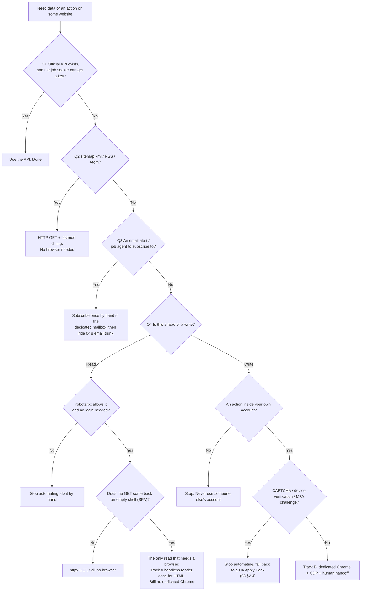
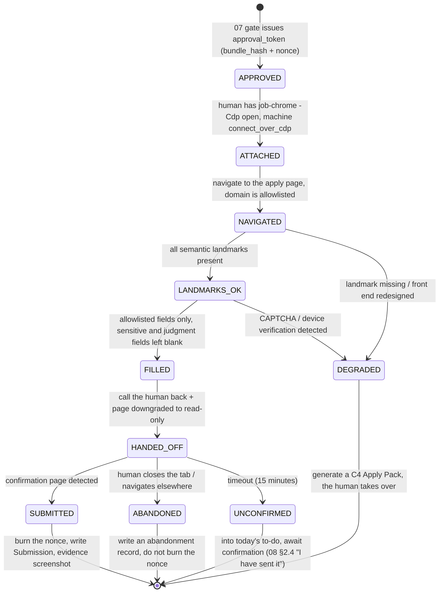

# Browser Automation: Playwright and a Dedicated Chrome

> **Position first: the browser is the last resort, not the first.** TSMC has 774 job postings; two GETs against the sitemap get you the complete index plus a `lastmod` for every entry. Paging through 78 pages of search results with Playwright is not only wasteful, in their logs it also looks more like abuse. There are only four browser uses worth investing in, and the one with the best cost-benefit ratio (rendering HTML to PDF) needs no login, touches no platform, and does not need that dedicated Chrome.
>
> The user has already prepared `C:\my\build\toolchain\GoogleChromePortable64-Job` (Chrome 153.0.8010.37, PortableApps packaging, `Data\` contains only `PortableApps.comInstaller`, no profile created yet). This document covers how it should be used, how it should not, and where it **conflicts head-on with the existing 00-11 documents** — those conflicts have to be laid out, not quietly worked around.

---

## 1. What This Layer Solves and What It Does Not

| Solves | Does not solve |
|---|---|
| Rendering structured résumé data into a PDF with controlled layout | Replacing the content assembly and tool selection of [`06-content-assembly.md`](./06-content-assembly.md) |
| Preserving a JD page that is about to be taken down as local evidence | Building a JD mirror archive |
| Keeping "the human is logged in" state persistent and reusable (read-only, low frequency) | Using logged-in session state to ingest job postings or scrape other people's content |
| Handing typing to the machine when necessary while leaving judgment to the human | Pressing the final send button on the human's behalf |

**The junk this layer most easily turns into**: a system that does everything through a browser. Browser automation is a general-purpose tool, and the danger of a general-purpose tool is that it makes every problem look like a nail. Once you start pulling job postings with Playwright, you start writing retries, then throttling, then selector repairs; three months later what you maintain is a scraper project, not a job-search system. [`02-architecture.md`](./02-architecture.md) §2.2 already marks browser-worker as a separate process that is "heavy, crash-prone, and needs a real browser profile"; what this document does is turn "under what circumstances may this process be started" into a checkable rule.

---

## 2. Decision Flow: Ask First Whether There Is Another Path



The order of the four questions is not arbitrary: they ascend by **cost, fragility, and how much they disturb the platform**. Each level down, maintenance cost jumps roughly an order of magnitude.

### 2.1 What This Test Actually Yields for TSMC

Run it once against the field verification in [`15-target-tsmc.md`](./15-target-tsmc.md):

| Need | Which path | Requests | Basis |
|---|---|---|---|
| Full index of 774 job postings plus update detection | **Q2 sitemap** | **2** (index + the `zh_TW` sub-sitemap) | `robots.txt` explicitly lists `Sitemap: https://careers.tsmc.com/careers/sitemap_index.xml`; the `zh_TW` sub-sitemap holds 815 URLs, of which exactly 774 are `/JobDetail/`, matching the search page's count; every entry carries a `<lastmod>`, so diffing is free |
| Full JD text for a single posting | **Q4-read, httpx GET** | 1 per entry (only those whose `lastmod` changed) | `robots.txt` is `Allow: /careers`, `Allow: /*/careers`, and `Disallow` targets only URLs containing `qtvc=`, while `JobDetail` URLs do not carry that parameter. **Whether JobDetail is SSR or SPA needs verification** (§13 item 4) |
| New-posting notifications | **Q3 email alert** | 0 | Avature already has an `AgentCreate` page (job alert agent). Set it up once by hand in the dedicated Chrome, after which it rides entirely on the email trunk of [`04-ingestion.md`](./04-ingestion.md) |
| Application status lookup | Q4-write (own account, read-only) | Low frequency | Login required. See §9.2, and it **conflicts with the existing conclusion of [`08-delivery-tracking.md`](./08-delivery-tracking.md) §5.4**, see §10.5 |
| Submitting an application | Q4-write | — | Login required. The conclusion is: by hand, see §10 |
| Talent pool registration (jobId=562) | Once, by hand | — | A one-off action; automation has no payback period |

**Control group**: how many requests does the search UI take? Measured: `GET /{locale}/careers/SearchJobs/?jobRecordsPerPage=100&jobOffset=M` returns the same result as `jobRecordsPerPage=10` (10 entries either way) — page size is locked server-side. 774 ÷ 10 = **78 requests**; and the search form POSTs to `/{locale}/careers/SearchJobs` with fields that are Avature-internal numeric facet ids (4177, 1277, 4178, 558, 147, 542) — this kind of thing breaks on every redesign, and when it breaks it does not error, it silently returns 0 rows.

> **78 : 2.** That ratio is the value of "ask first whether there is a sitemap". Executed under rule 4 of [`10-risk-compliance.md`](./10-risk-compliance.md) §2.4, "≥ 5 seconds between requests to a single domain", 78 requests take 6.5 minutes; the sitemap route finishes in seconds. More importantly: in their logs the former looks like a scraper, the latter looks like a client using sitemaps correctly.

### 2.2 Use the Existing `access_mode`, Do Not Add a Second Field

One of the core arguments of [`00-overview.md`](./00-overview.md) is "honesty by mechanism, not self-discipline". If this test lives only in a document, the you of three months from now, at two in the morning, will certainly route around it. But **the way to land it is not to add a field**: [`02-architecture.md`](./02-architecture.md) §5.6 already defines the source registry's `access_mode`, with the value domain `api | feed | email | manual_paste | manual_assisted`, and already states that "no source other than `manual_assisted` may load Playwright". Inventing a second `access_method` would only have the two fields fighting each other.

What is needed is to **extend the existing value domain** and fill in the constraints (this is a revision item for [`16-plan-revisions.md`](./16-plan-revisions.md)):

| `access_mode` | New / modified | Notes |
|---|---|---|
| `public_http` | **New** | HTTP GET of sitemaps and public pages. Today's `feed` covers only RSS/Atom, and TSMC's primary access path is sitemap + JobDetail GET; forcing that into `feed` distorts the semantics |
| `manual_assisted` | **Modified** | 02 §5.6 says "L5 delivery only". But the status lookup of §9.2 is L6 tracking and read-only, and equally needs a browser with a human present. It should read "only with a human present, running in the foreground; covers L5 delivery and read-only lookups inside one's own account" |

Three constraints at the code level:

- `manual_assisted` is the **only** value permitted to load interactive Playwright (Track B), and such a source must satisfy both `requires_login = 1` and, at run time, `human_present = 1`.
- Adding any `manual_assisted` source requires filling in `browser_justification`, answering the four questions of §2 one by one. If you cannot write it, you may not add the source.
- CI check: at most **3** `manual_assisted` sources. This is a deliberately uncomfortable ceiling; its function is not technical, it is friction (honestly, the real binding force of a self-imposed ceiling like this is discussed in §12.6).

---

## 3. Two Unrelated Tracks

This is the most substantive correction this document makes to the original plan. Earlier documents discussed "Playwright" as a single component ([`02-architecture.md`](./02-architecture.md) §2.2 process 3, [`08-delivery-tracking.md`](./08-delivery-tracking.md) §2.3 C3, [`11-tech-stack-roadmap.md`](./11-tech-stack-roadmap.md) §8 on the ToS tension), so when 08 computed "not worth it", it looked as though all of Playwright should be cut. In fact there are two tracks of completely different character, and they **share exactly one line: `pip install playwright`**:

```
Track A: render / capture             Track B: interact
─────────────────────────             ─────────────────────────
Playwright's bundled Chromium         Dedicated Chrome 153.0.8010.37
headless                              headed (the human can see it)
no profile (fresh temp dir each run)  persistent profile (logged-in session kept long-term)
input is file:// or a public page     input is the real site, after login
no logged-in session state            has logged-in session state
unattended (schedulable)              a human must be sitting there
failure = run it again                failure = fall back to manual
use: HTML → PDF, SPA page snapshot    use: status lookup (P2), form handoff (not done)
```

**The two tracks never share a profile.** A persistent profile buys the render track nothing while letting cookies and cache state leak into its output; a temporary profile forces the interaction track to log in every single time, which makes the dedicated Chrome a wasted purchase.

A widely cited technical claim that **this project has not yet measured**: `page.pdf()` is supported only in headless Chromium and is unavailable or behaves inconsistently in headed mode (**Speculation — needs verification**, see §13 item 3). If it holds, it turns the separation of the two tracks into an API-enforced boundary; if it does not, the separation rests solely on the CI checks of §3.1. **This document's design does not depend on it holding** — betting architectural safety on an unmeasured API detail is exactly what this document keeps arguing against.

### 3.1 Consequences for the "sole egress" Rule (Conflict with 02 §6)

[`02-architecture.md`](./02-architecture.md) §6 states that "`delivery/gate.py` is the only module in the whole system allowed to `import smtplib` / `playwright`", enforced in CI with import-linter. Once Track A exists, that rule blocks friendly traffic: rendering and snapshotting both need playwright, and neither has anything to do with sending.

> ### ⚠ This Section's Proposal Has Been Superseded by Ruling A2
>
> The final design is a `browser/` package containing three submodules that **may not import one another**: `render.py` (`file://` only), `capture.py` (read-only GET only), `assisted.py` (human present). This section's "anything under `browser/` is fine" is too broad — without isolation between submodules, `capture.py` only has to import `assisted.py` to route around every restriction.
>
> **Also: the `delivery/` in this section is wrong**, the actual directory name is `deliver/`. **import-linter contracts are string matches, and a rule with a mistyped path passes silently.** The four correct contracts are in [17-decisions.md](./17-decisions.md#a2--a-browser-package-with-three-submodules-that-cannot-import-each-other).

The fix (filed to [`16-plan-revisions.md`](./16-plan-revisions.md)):

```
Rule 1 (import-linter, replaces the original rule in 02 §6):  ← superseded by A2, see above
  playwright may only be imported by modules under src/aicareer/browser/.
  deliver/ and ingest/ may only import the narrow interface browser/ exposes.
  The smtplib restriction is unchanged: still only deliver/gate.py may import it.

Rule 2 (grep/AST check in CI, because import-linter cannot reach function level):
  connect_over_cdp / launch_persistent_context / user_data_dir
      → allowed only in src/aicareer/browser/interactive.py
  page.pdf(
      → allowed only in src/aicareer/browser/render.py
  appearing in any other file → CI fails
```

Rule 2 is crude, but it targets the real threat: not "someone imports the wrong module" but "someone casually uses a persistent profile inside the render code". A string-level check beats a type system against that threat.

---

## 4. Why This Dedicated Chrome

**This section applies to Track B only.** Track A should — and may only — use Playwright's bundled Chromium.

### 4.1 Four Reasons, Examined One by One

| Reason | Examination | Verdict |
|---|---|---|
| Long-term persistence of login state | The bundled Chromium with `launch_persistent_context` does this just as well | **Does not hold as a unique advantage**, and cannot be used as a reason |
| Isolation from the everyday browser | The dedicated instance has its own bookmarks, download directory and extensions; the everyday Chrome's password manager and ad blocker do not interfere with it, and it does not pollute everyday cookies. The `-Job` suffix in the directory name already writes the intent into the filesystem | **Holds**. It is the natural extension of the account isolation in [`10-risk-compliance.md`](./10-risk-compliance.md) §8.1 down to the browser layer |
| Version pinning | The PortableApps packaging does not auto-update; the version is pinned at 153.0.8010.37. When something breaks, "it ran last time, not this time" has one fewer suspect | **Holds, but at a price**: security updates have to be tracked by hand (§12.3) |
| Fingerprint close to a real user | See §4.2 | **Not listed as a reason for choosing it**, only as a known side effect |

### 4.2 Fingerprinting: A Side Effect, Not a Selection Criterion

This has to be written bluntly, because it is the one place in this document that could be misread as "how to evade detection".

First, what is fact and what is not. **Playwright's bundled Chromium differs from release Chrome in detectable ways** (missing proprietary codecs and Widevine, different `navigator.plugins` contents, a different headless User-Agent string, a different font set), and most bot-detection services will flag it as an automated client on that basis — **this is a common industry claim, unmeasured by this project, and therefore speculation**.

What we care about is not "getting caught"; it is that these two things must be kept apart:

- If a site blocks us because "this is an automation tool" — **we accept being blocked and fall back to doing it by hand**. That is designed behavior, not a problem to be solved.
- If a site throws a challenge, clears the form, or even locks the account **while the human is filling it in by hand** — the loss lands on the user's **real job-search account**.

The second point is a legitimate motive for using real Chrome, but only a sheet of paper separates it from "evading detection". So the line is written as checkable clauses, not as intent:

1. Install no stealth / anti-detection extension or patch.
2. Do not modify the User-Agent; do not spoof platform, language or time zone.
3. Do not patch `navigator.webdriver`, do not inject anti-detection scripts, do not override the detection surface.
4. Do not hide the presence of CDP.
5. On any form of bot challenge (CAPTCHA, device verification, risk confirmation), **stop immediately and fall back**; never attempt to pass it.
6. Keep request pacing at human level: the interaction track has exactly one person operating it, and no concurrency.

**A side effect that must be admitted honestly**: when Chrome is started by hand with `--remote-debugging-port` and Playwright then attaches via `connect_over_cdp()`, `navigator.webdriver` may be `false` (because the automation flag is only added when Playwright launches the browser itself) — **Speculation — needs verification** (§13 item 10). If true, Track B is technically harder to detect than `launch_persistent_context`. **That is not why we chose it**; we chose it for the handoff semantics of §5.2.

This has exactly one implication: **the platform's detection will not hold our red lines for us; only we can hold them.** So the list in §7 cannot be written as slogans, it has to be written as code-level hard rules.

### 4.3 The Price: An Honest List

| Price | Detail | Mitigation |
|---|---|---|
| Playwright only does best-effort for non-bundled browsers | What is officially guaranteed is the bundled Chromium and the `channel="chrome"` / `"msedge"` release channels; pointing `executable_path` at an arbitrary build works but is not guaranteed. **CDP compatibility between Chrome 153 and the Playwright version in use needs measuring** | The smoke test of §13.1; the fallback is returning to the bundled Chromium (affects Track B only) |
| It usually fails silently | CDP incompatibility rarely throws outright; more often some API's behavior changes (`bring_to_front()` does nothing, `contexts` is missing one) | The smoke test must assert **behavior**, not merely "no exception was raised" |
| PortableApps adds a wrapper layer | `GoogleChromePortable.exe` does path redirection and moves the `Data` directory around. That layer is worthless to us (the machine is not going anywhere) and adds one more uncontrollable variable | **Bypass the launcher, invoke `App\Chrome-bin\chrome.exe` directly** (§5.4) |
| No profile created yet | `Data\` contains only `PortableApps.comInstaller`; this is a brand-new instance that has never run | The first run must be done in full by a **human**: log in, language, download directory, turn off sync. A one-time cost, with no shortcut |
| No auto-update = security updates fall behind | A browser that permanently carries every job-search login and never gets security patches is a real risk | Check manually each quarter; fold it into the operations cadence of [`11-tech-stack-roadmap.md`](./11-tech-stack-roadmap.md) §12; see §12.3 |

---

## 5. How to Attach: Two Approaches and a Recommendation

### 5.1 Comparison

| | **A. `launch_persistent_context`** | **B. Manual launch + `connect_over_cdp`** |
|---|---|---|
| Who launches the browser | Playwright | The human (or a launch script) |
| Who holds the profile lock | The Playwright process | That Chrome process |
| Can the human log in first | No | **Yes**. The human opens it, logs in, clears MFA, then the machine takes over |
| MFA / device verification | Gets stuck inside the script | Solved for free: that was always the human's job |
| After the script ends | The browser is closed | **The browser stays alive** (`close()` should only sever the connection, **needs verification**, §13.1 item 4) |
| The same profile already open by the human | **Fails** (`SingletonLock` conflict), or worse: it opens as a new window of the existing instance and Playwright loses control | Fine — this is exactly its default scenario |
| Crash isolation | Playwright dies → the browser dies with it | Playwright dies → the browser lives, the human takes over |
| Extra attack surface | None | **Yes**: an unauthenticated local debugging port (§12.4) |
| Suited to | Track A, adapter development | **Track B, recommended** |

### 5.2 Recommendation: Track B Uses `connect_over_cdp()`

The reason is not that it is technically stronger, it is that **the semantics are right**. The worldview of `launch_persistent_context` is "the script is the protagonist, the human is a supporting actor invited in to press a key"; the worldview of `connect_over_cdp` is "the browser belongs to the human, the machine is only borrowing it". The latter is the relationship that "human-in-the-loop, and it cannot be skipped" requires.

A concrete scenario: halfway through checking status, the human just wants to close the window. Under A that is a dead page, an exception stack, an error path to handle; under B it is a normal ending — the wait loop notices the target disappear and writes a closing record.

`launch_persistent_context` is reserved for two occasions: **adapter development** (paired with `playwright codegen` it is the smoothest way to find selectors) and **Track A** (where there is no human and no profile is needed).

### 5.3 Where the profile Belongs

The PortableApps convention is `Data\profile`. [`10-risk-compliance.md`](./10-risk-compliance.md) §8.3 has already established that "the data directory must live outside the repo tree", and [`13-repo-layout.md`](./13-repo-layout.md) classifies login sessions as the private zone. One of the two locations has to be chosen.

> **The test (suggested for [`13-repo-layout.md`](./13-repo-layout.md), because it applies beyond browsers): anything that can be restored by re-downloading and reinstalling goes in `toolchain\`; personal state that cannot be regenerated goes in the data directory.**

| Thing | Regenerable? | Where it belongs |
|---|---|---|
| `chrome.exe` 153.0.8010.37 | Yes (re-download the same PortableApps package) | `C:\my\build\toolchain\GoogleChromePortable64-Job\` |
| Login cookies, logged-in job-search accounts | **No** (you would have to log in and clear MFA again) | Private zone |
| Browsing history (including which companies' postings you looked at) | No, and **extremely sensitive** | Private zone |
| Downloaded JDs, confirmation-page screenshots | No | Private zone |

**Conclusion: the profile goes in the private zone, not in `Data\profile`.** Three reasons:

1. **Separation of responsibility**: the meaning of `toolchain\` is "reinstallable executables". Mixing in personal state that cannot be regenerated invalidates the premise "I can safely delete the whole toolchain and reinstall it".
2. **Backup and retention boundaries line up**: the retention periods of [`10-risk-compliance.md`](./10-risk-compliance.md) §3.5 and the encrypted backups of §3.6 / §8.4 all target the data directory. A profile in the private zone is covered automatically; in `Data\profile` it needs one extra rule you have to remember, and extra rules you have to remember get forgotten.
3. **The PortableApps upgrade/repair flow writes to `Data\`** (**Speculation — needs verification**, §13 item 7). Putting something unregenerable in a directory the installer touches is asking for it.

**The price**: you can no longer double-click `GoogleChromePortable.exe` (the launcher redirects the profile back to `Data\profile`). The fix is a launch script as the sole entry point, plus removing the launcher's shortcuts from the desktop and Start menu so that one misclick does not create a second profile with a second set of logins.

> Someone will want to point `Data\profile` at the private zone with a junction or symlink. **Not recommended**: it makes backup tools behave unpredictably (some follow links, some do not), and it makes "is there personal data in this directory" no longer answerable by eye.

### 5.4 The Launch Script

The actual path is governed by [`13-repo-layout.md`](./13-repo-layout.md); this document only requires that it be **in the private zone, outside the repo tree, and outside `toolchain\`**. Below it is always written as `%LOCALAPPDATA%\ai-career\private\browser\job-chrome\`.

`scripts\job-chrome.ps1` (in the repo, version-controlled, containing no personal data):

```powershell
# The sole launch entry point for the job-search Chrome.
# Deliberately bypasses GoogleChromePortable.exe, because that launcher redirects the profile back to Data\profile.
param(
    [switch]$Cdp,       # Only add this when the machine needs to take over
    [int]$Port = 0      # 0 = pick a high port automatically
)
$ErrorActionPreference = 'Stop'

$ChromeExe  = 'C:\my\build\toolchain\GoogleChromePortable64-Job\App\Chrome-bin\chrome.exe'
# Do not use $Profile: that is a PowerShell automatic variable, and overwriting it produces bugs that are hard to track down
$ProfileDir = Join-Path $env:LOCALAPPDATA 'ai-career\private\browser\job-chrome'
$PortFile   = Join-Path $ProfileDir '.cdp-port'

if (-not (Test-Path $ChromeExe)) { throw "Dedicated Chrome not found: $ChromeExe" }
New-Item -ItemType Directory -Force -Path $ProfileDir | Out-Null

$chromeArgs = @(
    "--user-data-dir=$ProfileDir"
    '--no-first-run'
    '--no-default-browser-check'
    '--window-size=1400,960'
)

if ($Cdp) {
    if ($Port -eq 0) { $Port = Get-Random -Minimum 42000 -Maximum 49000 }
    $chromeArgs += "--remote-debugging-port=$Port"
    # Note: -Encoding utf8 in Windows PowerShell 5.1 writes a BOM,
    # and int(read_text()) on the Python side blows up on it. Use ascii, or read with utf-8-sig in Python.
    Set-Content -Path $PortFile -Value $Port -Encoding ascii
    Write-Host "CDP is open on 127.0.0.1:$Port (please close this Chrome when you are done)"
}

try {
    & $ChromeExe @chromeArgs      # blocks until Chrome exits
} finally {
    if (Test-Path $PortFile) { Remove-Item $PortFile -Force }   # the port file does not stay overnight
}
```

Three design notes:

- **CDP is off by default**. Opening this browser day to day to look at postings and keep sessions alive neither needs nor should have a debugging port open.
- **The port is random and written into the profile directory**. A fixed `9222` is a number every local process knows; randomness is not a security measure (local processes can still enumerate), it only reduces accidental collisions, and the port file lives and dies with the profile.
- **No `--remote-allow-origins`**. Some Chrome versions need it before they will accept Playwright's WebSocket upgrade, **but whether 153 still does is unverified** (§13 item 2). Leave it out and add it only if measurement says otherwise — do not pre-stuff a flag nobody can explain the existence of.

### 5.5 The Playwright Side

**Track B — attaching to the existing Chrome**:

```python
# src/aicareer/browser/interactive.py
# The only file in the whole system where connect_over_cdp / launch_persistent_context / user_data_dir may appear
import os
from pathlib import Path
from playwright.sync_api import sync_playwright

PROFILE = Path(os.environ["LOCALAPPDATA"]) / "ai-career/private/browser/job-chrome"

def attach():
    """Attach to the dedicated Chrome the human has already opened and logged into."""
    port = int((PROFILE / ".cdp-port").read_text(encoding="utf-8-sig").strip())
    pw = sync_playwright().start()
    browser = pw.chromium.connect_over_cdp(f"http://127.0.0.1:{port}")

    # Key: use the existing context, do not call new_context().
    # new_context() opens an environment with no logged-in session state, which throws away the reason this dedicated Chrome exists.
    ctx = browser.contexts[0]
    page = ctx.pages[0] if ctx.pages else ctx.new_page()
    return pw, browser, ctx, page

def detach(pw, browser):
    """Sever the connection only; leave the browser for the human. This is the core value of the CDP track and must be guarded by the smoke test."""
    browser.close()   # for connect_over_cdp this should be equivalent to disconnect (needs verification)
    pw.stop()
```

**Track A — rendering (headless, no profile, no network)**:

```python
# src/aicareer/browser/render.py
# The only file in the whole system where page.pdf( may appear
from pathlib import Path
from playwright.sync_api import sync_playwright

def html_to_pdf(html_path: str, pdf_path: str) -> None:
    src = Path(html_path).resolve()
    with sync_playwright() as p:
        browser = p.chromium.launch(headless=True)      # bundled Chromium, not the dedicated Chrome
        page = browser.new_page()

        # Hard-block the external network: résumé rendering should not fetch any remote resource.
        # Fonts, CSS and images are all inlined or use relative file:// paths.
        # Note: whether route intercepts file:// requests varies by version and needs measuring (see §13 item 8).
        page.route("**/*", lambda r: r.continue_()
                   if r.request.url.startswith("file://") else r.abort())

        page.goto(src.as_uri(), wait_until="load")      # use as_uri() for Windows paths, never hand-assemble file:///
        page.emulate_media(media="print")
        page.pdf(path=pdf_path, format="A4", print_background=True,
                 margin={"top": "16mm", "bottom": "16mm", "left": "16mm", "right": "16mm"},
                 prefer_css_page_size=True)
        browser.close()

    # Not optional: PDFs produced by Chrome carry metadata such as Producer / CreationDate,
    # and 10-risk-compliance.md §3.4 requires clearing Author/Title/Producer/Creator and pinning CreationDate.
    strip_pdf_metadata(pdf_path)
```

On "does rendering need byte-level reproducibility", the first draft overstated it. The `bundle_hash` of [`02-architecture.md`](./02-architecture.md) §6 is **recomputed from the bytes about to be sent**, so render nondeterminism causes no correctness problem; what it causes is an **experience problem** — re-rendering once invalidates an existing approval and forces a re-review. So the goal is "rendering the same input twice, after metadata stripping, yields the same sha256", treated as a property **worth pursuing but acceptable to fail** (§13.1 item 7 measures it). If it cannot be achieved, the fallback is "render a given piece of content once and reuse the file thereafter".

If you insist on running Track A with the dedicated Chrome (say, to guarantee the fonts match what the eye sees), you can point `executable_path` at `chrome.exe` — but **still headless, still a temporary profile**; do not touch the `job-chrome` profile.

---

## 6. Human Handoff: A Design, but Not Implemented in v1

The approval gate of [`07-review-gate.md`](./07-review-gate.md) settles "may this content be sent"; this section settles "after approval, whose finger presses the send button". **Per the conclusion of §10, form-fill handoff is not built in v1**, so this section is deliberately compressed to the minimum: only the state machine and two reusable mechanisms (the read-only wrapper, the timeout semantics); implementation details wait until it is actually built. Distinguishing "thought it through, then decided not to" from "never thought about it, so did not do it" is the only reason this section exists.

### 6.1 State Machine



Four non-negotiable properties:

1. **"Filled, unconfirmed" is written to the DB before `FILLED`**. If the machine crashes after the handoff, that application still exists in the world (the form may already have been submitted) and the system cannot lose its memory. This maps to P0 gap D1 of [`99-gaps.md`](./99-gaps.md).
2. **After `HANDED_OFF` the machine may issue no write action whatsoever** (§6.2).
3. **A timeout is neither failure nor success**. `UNCONFIRMED` is a first-class state that returns to today's to-do and keeps poking the human, consistent with the handling in [`08-delivery-tracking.md`](./08-delivery-tracking.md) §8.3.
4. **Only `SUBMITTED` burns the nonce**. `ABANDONED` does not; that approval is still valid, and the human may come back ten minutes later.

### 6.2 The Read-Only Wrapper: This One Is Needed Now

`ReadOnlyPage` serves more than the handoff: it is also the default interface for the §9.2 status lookup (P2), which makes it the only thing in this section to implement in v1:

```python
class ReadOnlyPage:
    """The machine's only handle on the page. Every write API is absent here."""
    _ALLOW = {'url', 'title', 'get_by_text', 'get_by_role', 'locator',
              'screenshot', 'content', 'wait_for_timeout'}

    def __init__(self, page):
        object.__setattr__(self, '_page', page)

    def __getattr__(self, name):
        if name not in ReadOnlyPage._ALLOW:
            raise RuntimeError(f'Calling page.{name}() is forbidden: the machine may not write to the page in this context.')
        return getattr(self._page, name)
```

This is not defense against hackers, it is **defense against your future self** — three months from now, when you want to add a small feature that "scrolls him down to the send button while we are at it", it will stop you and force you back to this document. [`02-architecture.md`](./02-architecture.md) §6 calls this kind of thing an architectural chokepoint; this document just applies the same technique to the browser.

### 6.3 Why Not `page.pause()`

`page.pause()` opens the Playwright Inspector: a separate window, an English-language developer UI, whose main button is labeled "Resume" (which means "let the machine continue", whereas what we want to express is "the machine stops"). It also disables timeouts (under `PWDEBUG=1`, **Speculation — needs verification**), scrapping the entire `UNCONFIRMED` path of §6.1. The person sitting in front of the screen at that moment is "a job seeker submitting an application", not "an engineer debugging" — even if it is the same person, the state is different.

**Retained use**: adapter development. `playwright codegen` + `page.pause()` for finding selectors is exactly what it was designed to do.

### 6.4 There Is No Reliable Way to Call the Human Back

Windows restricts focus stealing by background processes. In decreasing reliability: taskbar flash (`FlashWindowEx`, does not steal focus, is not blocked by the system) > system notification (the human may not see it, but it will not be blocked) > forced foreground (`SetForegroundWindow`, mostly fails, and stealing focus from a user who is typing is a terrible experience). Actual reliability **needs measuring on this machine** (§13 item 9).

**The design conclusion matters more than the mechanism**: nothing is 100% reliable at "calling the human back", so the wait loop has to assume the human will not come back promptly — a timeout of 15 minutes or more, and on timeout the state moves to `UNCONFIRMED` and into the to-do list. Moving responsibility for reliability from "the notification mechanism" to "the state machine" is the only robust move.

### 6.5 Evidence Screenshots

Once submission is detected: **remove any screen element we injected before taking the shot** (an evidence image should contain nothing that is not native to that site, or its evidentiary value is discounted) → full-page screenshot → also save a `page.content()` (a screenshot is not full-text searchable) → write the sha256 of both into the DB, hooking into the delivery record of [`08-delivery-tracking.md`](./08-delivery-tracking.md) §4. Storage location and retention period are in §8.3.

---

## 7. The Absolutely-Never List

Each item names the mechanism that enforces it — **only what is written as code counts**.

| # | Never | Enforcement mechanism |
|---|---|---|
| 1 | **Never bypass a CAPTCHA**. No solver services, no in-house recognition, no retry-and-hope | Semantic landmarks for CAPTCHA / device verification detected → immediately `DEGRADED`, generate a C4 Apply Pack. This is an `if`, not an agreement |
| 2 | **Never auto-tick consent terms** (terms of use, privacy policy, data-processing consent, reference check authorization) | Field filling is **default-deny**: only fields on the adapter's allowlist are ever filled, and `input[type=checkbox]` is never on the allowlist |
| 3 | **Never fill sensitive fields on the human's behalf**: national ID number, passport number, bank account, password, date of birth, emergency contact | As above, plus a deny-list matched on accessible name (in both Chinese and English); a hit blocks the field even if the allowlist was misconfigured. Credentials and the national ID number are **entered by the human**, per [`10-risk-compliance.md`](./10-risk-compliance.md) §8.1 |
| 4 | **Never fill judgment questions on the human's behalf**: salary expectation, availability date, visa status, EEO self-identification, "how did you hear about this posting", "have you worked for this company before" | Same default-deny; these fields go into `pending_fields` and are stated plainly to the human at handoff |
| 5 | **Never press the final send button automatically** | The `ReadOnlyPage` of §6.2; plus a CI check: `click(` may not appear anywhere in the call chain after the handoff |
| 6 | **Never hide the automation's identity**: no stealth extensions, no UA changes, no patching of `navigator.webdriver` | CI greps for `webdriver` / `stealth` / `user_agent=`. Only so much of this is enforceable; the item rests mainly on the explicit commitment of §4.2 (honestly, this is the weakest item, see §12.5) |
| 7 | **Never make high-frequency requests**: no concurrency on the interaction track, honor `429` and `Retry-After` | Shares one throttler with rule 4 of [`10-risk-compliance.md`](./10-risk-compliance.md) §2.4. **Note that 04 §7 says 1 req/2s while 10 §2.4 says ≥ 5 seconds; the two disagree and must be merged into one number** (§16 revision item) |
| 8 | **Never use logged-in session state to ingest job postings or scrape other people's content** | Logged-in session state serves only "actions inside your own account". The ingestion layer (L0) architecturally cannot reach `browser/interactive.py` |
| 9 | **Never start the interaction track from an unattended schedule** | The entry point checks `human_present`, and that flag can only be set by the interactive CLI, never by the scheduler |
| 10 | **Never bind the CDP port to `0.0.0.0`**, and do no port forwarding | The launch script offers no such option and never adds `--remote-debugging-address` |

> **Item 8 collides head-on with rule 2 of [`10-risk-compliance.md`](./10-risk-compliance.md) §2.4, and that has to be laid out.** The rule reads "do not use logged-in cookies / session tokens for any automation", which literally forbids even the read-only status lookup of §9.2. This document holds that the rule's intent was to prevent "bulk scraping with logged-in state", not "human present, own account, read-only, once a week". But **intent cannot be left to the reader to infer** — either amend 10 §2.4 rule 2 with an explicitly listed exception, or drop use 2 of §9.2. One or the other; you cannot keep both. The revision proposal is in [`16-plan-revisions.md`](./16-plan-revisions.md).

---

## 8. Robustness

### 8.1 Selectors: Semantics First

Verified evidence: the fields of the Avature search form are internal numeric facet ids (4177, 1277, 4178, 558, 147, 542); the SuccessFactors RMK parameters (`optionsFacetsDD_city`, `createNewAlert`, `locationsearch`) are equally artifacts of the product's internals. Identifiers like these shift with back-office configuration, and when they shift they do not error.

```
1. get_by_label('姓名')                         most robust: bound to the label a human reads
2. get_by_role('button', name=/送出|Submit/i)    next best: bound to accessibility semantics
3. get_by_placeholder(...) / get_by_text(...)    usable
4. [data-testid=...] / [name=...]                barely
5. CSS class / absolute XPath                    banned
```

**All selectors are extracted into YAML** (continuing the risk mitigation of [`11-tech-stack-roadmap.md`](./11-tech-stack-roadmap.md)); when the front end changes, only the config file changes:

```yaml
# config/adapters/avature-tsmc.yml   ← only needed if §9.2 is actually built
site: careers.tsmc.com
engine: avature
landmarks:                      # all must be present, otherwise we do not start
  - role: heading
    name_re: "(應徵|Apply)"
  - role: button
    name_re: "(送出|Submit|Apply)"
confirm:
  url_re: "ApplicationConfirmation"
  text: ["應徵完成", "Application received", "Thank you for applying"]
```

`ApplicationConfirmation` is not a guess — it is one of the existing Avature pages seen during field verification (the same set includes `ApplicationForm`, `ApplicationMethods`, `AgentCreate`, `AgentDelete`). **But whether it is the URL actually reached after submitting at TSMC needs verification** (submit once by hand, record the actual URL).

### 8.2 Detecting Front-End Redesigns

Both checks run before "start acting": **all semantic landmarks present** (any one missing → stop immediately; do not get halfway through a redesigned form, where fields may be misaligned and the human will trust the boxes that are already filled); **DOM fingerprint** (hash the sorted accessible names of every field on the page — a changed fingerprint does not mean something is broken, but it is worth telling the human to look twice). The handling is always: screenshot, save the DOM, raise an alert, generate a C4, **do not retry** — a redesign does not disappear because you retried.

An honest limitation: landmarks are selectors too, they rot the same way, and their rot is especially nasty — **the landmark is still there, but one field's label changed from "手機" to "行動電話"**, so the check passes and that field is left blank. The mitigation is not to prevent it but to make it visible: blank fields always go into `pending_fields` and are stated plainly to the human. **Making failure visible is an order of magnitude cheaper than making failure impossible** — the price is shifting the burden onto the human, and human attention is the scarcest resource in this system ([`00-overview.md`](./00-overview.md)).

### 8.3 Traces, Video and Screenshots: The Best Debugging Tools Are Also the Biggest PII Landmine

| Tool | Contents | Decision |
|---|---|---|
| Playwright video | A full recording; it captures every character you type | **Not used**. It has no debugging value unique to it |
| Playwright trace | Step-by-step snapshots + network requests + DOM, including cookies and form contents | `off` by default, enabled only during adapter development and failure reproduction |
| Failure screenshot | A single image, including filled fields | On, but masked (§8.4) |
| DOM snapshot | `page.content()`, including value attributes | On, and likewise treated as highly sensitive |

Storage rules:

1. Always written to the **private zone** `%LOCALAPPDATA%\ai-career\private\traces\`, never into the repo.
2. **Auto-deleted after 14 days**, folded into the purge schedule of [`10-risk-compliance.md`](./10-risk-compliance.md) §3.5 (that table currently has no such row; it needs adding).
3. **Never attached to an issue, a bug report, or anything else meant for other people to see.** This is a single-person system and "for other people to see" happens rarely — and precisely because it is rare, that is when you slip.
4. Add `traces/`, `*.zip` and `browser-profile/` to `.gitignore` as the second layer of defense of [`10-risk-compliance.md`](./10-risk-compliance.md) §8.4.

### 8.4 Screenshot Masking

Playwright's `screenshot(mask=[...])` paints the given locators as solid blocks (API details **must be confirmed against the version in use**). Feed it the fields marked `pii: true` in the adapter and failure screenshots stop carrying phone numbers and email addresses. The price, stated honestly: once masked, a bug like "why did the email field get filled with the phone number" becomes invisible. **Recommendation: mask failure screenshots, do not mask successful evidence screenshots** (those are evidence, and they already sit in the private zone).

### 8.5 A Fetched Page Is Untrusted Input

This is where gap C1 of [`99-gaps.md`](./99-gaps.md) (JDs going straight to the LLM with no prompt-injection handling) lands in this layer. Whether the JD came from an httpx GET or a headless render, it is **text controlled by someone else**, and downstream it goes into an LLM. This layer has three responsibilities: hand out plain text and structured fields only, never HTML/JS; mark `untrusted=1` at the moment of storage; and hand the JD body to L3 wrapped in explicit data boundaries, never on the same level as instructions. The details belong to [`05-scoring-triage.md`](./05-scoring-triage.md) and 99 C1; this document is only responsible for not quietly waving the problem through.

### 8.6 Timeouts, Retries and Version Pinning

| Action | Timeout | Retry |
|---|---|---|
| Navigation | 30 s | At most 2, exponential backoff |
| Waiting for an element | 10 s | No retry (a missing element is drift) |
| **Form-filling step** | 5 s | **Never** — retrying a partially successful fill is the shortest path to a duplicate submission |
| Read-only status lookup | 15 s | At most 2 |
| Waiting at the handoff | 900 s | N/A (timeout = `UNCONFIRMED`) |

Every run writes `chrome.exe`'s `FileVersion`, the Playwright version and the adapter YAML hash into `logs/*.jsonl`. When something breaks, the first question is always "what version was it the last time it ran". Either side upgrades → run the smoke test of §13.1.

---

## 9. Legitimate Uses of Playwright, Ranked by Cost-Benefit

| # | Use | Track | Needs the dedicated Chrome | ToS risk | Maintenance cost | Used for every application | Verdict |
|---|---|---|---|---|---|---|---|
| **1** | **HTML → PDF** | A | No | **None** (no network) | **Very low** (no selectors) | **Yes** | **Do it, P1** |
| **2** | Posting-page snapshot evidence | A | No | None (public page, allowed by robots) | Very low | Yes | **Do it, P1** |
| **3** | Application status lookup while logged in | B | Yes | Low but **non-zero**, and conflicts with 08 §5.4 | Low (2–3 landmarks) | No, once a week | **Conditional, P2**, see §9.3 |
| **4** | Semi-automated form fill, then handoff to the human | B | Yes | Low but non-zero | **High** (the whole form) | Yes | **Do not do it**, see §10 |

### 9.1 Use 1: PDF Rendering

The cost model is clean: input is `file://`, output is a local file, no network at any point, no selectors at all, used for every application.

**But its relationship to the existing tool choices has to be spelled out, and there is a pre-existing contradiction here that was never recorded in [`99-gaps.md`](./99-gaps.md)**:

| Document | Current PDF mainline |
|---|---|
| [`06-content-assembly.md`](./06-content-assembly.md) §6 | Typst + custom templates; HTML + WeasyPrint/Playwright is only one option among several |
| [`11-tech-stack-roadmap.md`](./11-tech-stack-roadmap.md) §8 | **docxtpl (Word templates) is the recommendation**, with PDF produced by `soffice --headless` |

**The two documents do not recommend the same route.** This document does not adjudicate (that belongs to 06 and 11), but it adds a variable neither 06 nor 11 counted: **marginal installation cost**. Since use 2 already forces Playwright to be installed, the extra dependency for the HTML route is zero; Typst is a new toolchain dependency, and so is LibreOffice. That is not enough to flip the decision (Typst's pagination control really is better than CSS's, and docxtpl's WYSIWYG really does have value), but it is enough to make HTML + Playwright the **official fallback** rather than a discarded option. What actually needs doing is for [`16-plan-revisions.md`](./16-plan-revisions.md) to force out a single ruling — three documents with three answers is the state most likely to cause rework.

Whichever route is chosen, all of them start from the same `resume.json` and run the `pdftotext` round-trip check that 06 §6 already requires in CI (that is a chokepoint common to every option, not a demerit specific to Playwright).

### 9.2 Use 2: JD Snapshot Evidence

JDs get taken down, and usually right when you need them most (while preparing for the interview).

- For SSR pages: an `httpx` GET saving the HTML is enough, **no browser needed**.
- For SPAs: Track A renders headless, then saves `page.content()` plus one full-page screenshot.
- Stored in `artifacts/{application_id}/jd-snapshot/`, hash recorded, marked `untrusted=1` (§8.5).

This is also the prerequisite for the open question of [`02-architecture.md`](./02-architecture.md) §6 (whether `bundle_hash` should include `jd_snapshot_hash`): only with stable snapshots can you measure "the actual frequency at which a JD's structured fields change", which is what makes that open verification item runnable at all.

### 9.3 Use 3: Application Status Lookup (Conditional, and Conflicts with 08 §5.4)

TSMC's own application-process text says "the selection process takes two to four weeks on average". During those two to four weeks the human wants to know "what state is my application in right now". The method: the human opens `job-chrome -Cdp` (already logged in) → the machine attaches, navigates to the application list, reads the status text through `ReadOnlyPage`, diffs against the DB, and notifies only on a change; once a week, not once an hour.

**But this collides directly with the existing conclusion of [`08-delivery-tracking.md`](./08-delivery-tracking.md) §5.4**, which says "infeasible in most cases and not recommended... do not build automatic login for it". 08's argument targets the Workday-style situation: **one account per tenant, dozens of passwords, a high probability of triggering MFA and bot detection**. TSMC is a single employer, a single account, the human logs in first, and the machine never touches the password — the premises really are different. But "the premises are different" has to be written into 08, otherwise it is a silent contradiction.

Until all three of the following hold, use 3 **does not start**:

1. 08 §5.4 has been explicitly amended with an exception for "single employer, human present, read-only, low frequency" (§16 revision item).
2. 10 §2.4 rule 2 has the matching exception added (the callout in §7).
3. An application has been submitted by hand once and it has been confirmed with your own eyes that TSMC's application status page **really does carry machine-readable status text at a meaningful granularity** (§13 item 6). If the only status is "received", this use is worth approximately nothing and gets cut outright.

If any of the three fails, the right answer is the one 08 §5.4 already gave: store the URL only, put it on the weekly manual check list, and open it yourself.

### 9.4 If Form-Fill Assistance Ever Gets Built: Build an Extension, Not an Adapter

[`08-delivery-tracking.md`](./08-delivery-tracking.md) §8.2 mentioned a bookmarklet, whose drawback is that "reading local files across origins needs a local HTTP endpoint to cooperate". With the dedicated Chrome, that option can be upgraded to an **unpacked extension** (loaded in developer mode, living in the repo's `browser-ext/`):

| | bookmarklet | unpacked extension | Playwright adapter |
|---|---|---|---|
| Reading the local Apply Pack | Needs a local HTTP endpoint | Yes (`host_permissions` pointed at `http://127.0.0.1:PORT`) or the human picks the file | Yes |
| Human-in-the-loop | **Guaranteed for free** | **Guaranteed for free** | Has to be guaranteed by the mechanism of §6.2 |
| Selector maintenance | One mapping per ATS | One mapping per ATS | One mapping per ATS **plus a whole automation framework** |
| Needs CDP / Playwright | No | **No** | Yes |
| On failure | The button does nothing, the human fills it in | Same as left | Needs a degrade path, alerts and C4 fallback |

**Conclusion**: if it ever gets built, build the extension first. Its maintenance surface is an order of magnitude smaller, and it lands on the mental model of "a button in the human's own browser" — no layer has to explain "why is a machine operating my browser". The dedicated Chrome makes this option cleaner still: the extension is installed only on that instance and does not pollute the everyday browser. **Still not built in v1**, but it replaces C3 as the answer to "if we build something, which one".

---

## 10. The 160-Submission Threshold in 08: A Re-examination

[`08-delivery-tracking.md`](./08-delivery-tracking.md) §8.1 computed: a single ATS adapter costs about 720 minutes in the first year, nets 4.5 minutes saved per submission, and breaks even at **160 submissions**, with the conclusion "v1 skips C3 outright". This document brings three new facts; each is examined in turn.

### 10.1 New Fact 1: PDF Rendering Was Not in the Original Cost Model — Partly Holds, Limited Impact

PDF rendering really is value the original model did not count, but what it lowers is the **shared fixed cost** (installing Playwright, learning the API), not the form-fill adapter's **marginal cost** (writing selectors, handling dynamic fields, maintaining against drift).

Estimating the shared fixed cost at 2 hours, the recomputation gives `(720 − 120) ÷ 4.5 ≈ 133` submissions. **But the recomputation itself does not stand up well**: 08's 720 minutes is "6 hours for the first adapter version + 6 hours/year of maintenance", and the text never says whether that already includes the learning and installation cost. If it does, subtracting 120 is double counting; only if it does not is the recomputation valid.

**Either way the conclusion is unchanged**: the threshold sits between 133 and 160, while an individual job seeker makes 30–80 submissions in a round, spread across 5–10 ATSs — an order of magnitude short of the threshold. **This uncertainty is not worth more time to resolve**, because it changes no decision.

### 10.2 New Fact 2: TSMC Is One Employer with Many Postings — Not Only Does It Not Hold, It Strengthens the Original Conclusion

On the surface, 774 postings, a single Avature instance and one set of forms look like the ideal "high concentration" case. But field verification brought back one decisive piece of information, from TSMC's own application-process text:

> Your résumé will be open to all TSMC managers. You may therefore be invited into the selection process for positions other than the one you applied for.

Add to that a permanent "register in the TSMC talent pool" entry point (jobId=562). Together the two say: **submitting for one posting at TSMC effectively means entering the company-wide candidate pool.**

Consequences:

1. The marginal benefit of submitting for 10 TSMC postings is far below intuition — the résumé is already visible to every manager.
2. Submitting for many postings may itself be a negative signal ("what does this person actually want to do"), which is exactly the mass-submission backfire discussed in [`10-risk-compliance.md`](./10-risk-compliance.md) §6.
3. So for TSMC, even the ceiling that "fewer but better" permits is on the high side; the reasonable number is closer to **2–4**.

`2–4 ≪ 133`. **This pushes C3's payback period at TSMC out to infinity.**

> This is the methodological point this document most wants to stress: the most valuable thing field verification brings back is not "how to automate this" but "this is not worth automating at all". One sentence on a corporate website settles the answer better than an entire cost model.

### 10.3 New Fact 3: The User Already Has the Dedicated Chrome — Does Not Hold; This Is the Sunk Cost Fallacy

The dedicated Chrome lowers the **startup cost** (install and configure, about 1 hour), while 08's threshold is driven mainly by **maintenance cost** (repairs after front-end redesigns, 6 hours/year). Sunk costs do not change future marginal costs.

**But the dedicated Chrome was not a wasted purchase** — its value lies in use 3 (status lookup, conditional) and in the manual work itself (logging in, creating the job agent, talent pool registration, an isolated environment for submitting by hand). The cost model of the former is nothing like that of form filling:

| | Use 4, form filling | Use 3, status lookup |
|---|---|---|
| Number of selectors | The whole form (10–30) | 2–3 |
| Sensitivity to redesigns | Extremely high | Low |
| Cost of failure | Misaligned fields, may mislead the human | Nothing gets read, the human looks for themselves |
| Frequency of use | Once per application | Once a week, for months |
| Needs a degrade path | Yes, and a complex one | No |

### 10.4 Conclusion: Keep 08's Conclusion, but State Its Scope

**Upheld: the C3 form-fill adapter is not built in v1, and TSMC's new facts make it an even worse deal than before.** But 08's conclusion is written too broadly: executed to the letter as the "single ruling: do not do it" that [`99-gaps.md`](./99-gaps.md) §3 suggests, it would also cut PDF rendering, snapshot evidence and status lookup — all three of which have far better cost-benefit than form filling. Four corrections are needed, all filed to [`16-plan-revisions.md`](./16-plan-revisions.md):

| Correction | Content |
|---|---|
| **(i) Scope it** | Add one sentence at the top of 08 §8.1: "This section's cost model applies only to automated form filling. Playwright's other uses (PDF rendering, snapshot evidence, status lookup) have their own independent cost models and are not bound by this conclusion." |
| **(ii) Split C3 in two** | `C3a` form-fill handoff (not built, threshold 133–160 submissions) and `C3b` logged-in read-only status lookup (conditional, P2). Their ToS risk and maintenance cost are completely different, and putting them in one cell forces an unnecessary either/or |
| **(iii) Add a third P3 trigger condition** | Currently it is "a single ATS accounts for > 40% of submissions and the total is near the threshold". Add: **and that employer is not the "one submission puts you in the company-wide pool" type**. TSMC proves this condition alone can veto a case that otherwise satisfies the first two completely |
| **(iv) Upgrade the alternative** | The bookmarklet of 08 §8.2 becomes the unpacked extension of §9.4 |

### 10.5 Two More Conflicts to Fix

(v) **08 §5.4** needs amending to "what is opposed is multi-account automatic login polling; single employer, human logs in manually first, read-only, once a week is an explicitly listed exception, and must satisfy the three preconditions of §9.3".
(vi) **10 §2.4 rule 2** needs the same exception added, otherwise §9.3 is a red-line violation as written (the callout in §7).

---

## 11. Phased Rollout

| Phase | Scope | Why this order |
|---|---|---|
| **P0** | The §13.1 smoke test; complete the dedicated Chrome's first run by hand (log into Avature, create the job agent, set the download directory); `scripts\job-chrome.ps1`; the `access_mode` value-domain extension and CI ceiling of §2.2 | Confirm the foundation first. The `access_mode` gate has to exist before the first source is added, otherwise it is just documentation written after the fact |
| **P1** | Use 1 (PDF rendering) + metadata stripping + render reproducibility measurement; use 2 (snapshot evidence) | Touches no platform at all, zero ToS risk, used for every application, and it is the prerequisite for that open verification item of [`02-architecture.md`](./02-architecture.md) §6 |
| **P2 (conditional)** | Use 3 (status lookup): `attach()` + `ReadOnlyPage` + once a week | **Starts only after all three preconditions of §9.3 hold**. It is Track B's first real outing, and the scenario is deliberately chosen to be "read-only, low frequency, cheap to fail" |
| **P3 (conditional)** | The unpacked extension of §9.4 | Starts only if the funnel diagnosis of [`09-analytics-feedback.md`](./09-analytics-feedback.md) shows that "typing into forms" really is the bottleneck. **Not done by default** |
| **Not done** | The C3a Playwright form-fill adapter | The conclusion of §10 |

Note that P1 needs no dedicated Chrome and no CDP at all. **This is deliberate**: the most complex, highest-risk piece goes last, and behind a gate with an explicit trigger condition.

---

## 12. Pain Points: Where This Design Will Hurt

### 12.1 The Dedicated Chrome Is a Pet That Has to Be Fed

It is not a tool, it is a stateful long-term asset. Leave it closed for three months and: sessions expire, password policies demand resets, unpatched vulnerabilities pile up, the profile directory bloats, and some site's login goes stale without you knowing (until the day you need it). **There is no good fix**, only damage reduction: put "open job-chrome once, confirm you can still log into each site" on the monthly operations checklist, scheduled on the same day as the backup-restore drill of [`11-tech-stack-roadmap.md`](./11-tech-stack-roadmap.md) §12. Honestly, the real completion rate of checklists like this is very low.

### 12.2 The Last Mile of the Handoff Has No Technical Guarantee

After the machine gives up control, the human may go to lunch, get interrupted by a phone call, or decide halfway through that the role is wrong and close it. This is **the same problem in a different place** as [`08-delivery-tracking.md`](./08-delivery-tracking.md) §8.3's "if the human cannot be bothered to press C4's 'I have sent it' button, the statistics break the same way". Browser automation does not solve it, it only moves it from "a button on the Apply Pack page" to "a 15-minute wait loop". The only mitigation is to make `UNCONFIRMED` conspicuous and keep returning it to today's to-do — which has its own price: a permanent "you have 3 unconfirmed" is extra psychological load during a job search ([`08-delivery-tracking.md`](./08-delivery-tracking.md) §8.4).

### 12.3 A Browser That Never Auto-Updates, Carrying All Your Job-Search Logged-In Sessions

The flip side of pinning the version: Chrome 153.0.8010.37 stays put, its profile holds sessions for every job site you use, and you will use it to open links from email, from job alerts, from sources you are not entirely sure of. This is a **real trade-off that cannot be fully eliminated**. Mitigation: check for a new version manually each quarter, with the profile unaffected by the update (because it lives in the private zone, not in `Data\` — an unplanned dividend of the §5.3 decision); and use this browser only for job-search-related things. But the compliance rate of "only use it for X" rules is equally low.

### 12.4 The CDP Port Is an Unauthenticated Local Back Door

Anything that can execute code on this machine can connect to that port and take full control of a browser carrying all your job-search logged-in sessions: read cookies, issue requests, send things as you. The mitigations of §5.4 (off by default, random port, delete the port file when done, close Chrome) **are not security measures, they only lower the collision probability**. On a single-person machine the threat model already assumes "whoever can run local code is you", so the real risk is low — but this genuinely trades isolation for convenience, and not at a particularly good rate, since §11 shows CDP is not needed until the conditional P2. **If P2 never starts, the CDP-related code should be deleted wholesale rather than kept around for "we might use it someday".**

### 12.5 Four of the Rules in §7 Rest on Self-Discipline Alone

Of the ten items in §7, six can be enforced by code; item 6 (never hide the automation's identity) rests almost entirely on a promise — CI string scanning catches "someone imported a stealth package" but not "someone edited the contents of the UA string by hand". And §4.2 already explained that the CDP track is technically harder to detect, which means the platform's detection will not hold the line for us. A single-person project has no code review; this is a structural weakness. All that can be done is: write the rules as CI checks (however crude), write exceptions as fields that require a stated reason, and write "why we are not doing this" in more detail than "how to do it" — this document is itself part of that mechanism.

### 12.6 The "Do Not Use a Browser" Test Will Be Routed Around

This is the most likely failure. The decision flow of §2 is very persuasive at the moment it is written and not at all persuasive at two in the morning. The gates of §2.2 (`access_mode`, a mandatory justification, the CI ceiling of 3) are all self-imposed and all self-removable. **There is no real fix for this one, only friction.**

### 12.7 The Complexity of Two Browser Instances Is Real

Separating Track A from Track B is clean architecturally; in user experience it means two Chromium copies on disk, two paths to remember, two update responsibilities, and one more question to settle first every time something breaks: "which track is this a problem in". For a personal system that "wanted to be simple", this is a real increase in complexity. The only thing that justifies it is that P1 needs only Track A — **if P2 and P3 never start, Track B along with the entire automation half of the dedicated Chrome should disappear from the code, leaving only "the browser the human uses themselves".**

### 12.8 This Document's Revision Requests to 08, 10 and 06/11 May Never Be Executed

§10.4 and §10.5 list six revisions. If they are never actually written back, this document becomes one that silently contradicts the existing documents — and a silent contradiction is more dangerous than an open conflict, because whoever reads them six months from now will not know which to believe. [`16-plan-revisions.md`](./16-plan-revisions.md) exists for exactly this, but it too depends on someone actually making the changes.

---

## Related Documents

[`00-overview.md`](./00-overview.md) (honesty by mechanism, not self-discipline; manual review throughput is the bottleneck) ·
[`02-architecture.md`](./02-architecture.md) (§2.2 the browser-worker process boundary, §5.6 `access_mode`, §6 sole egress and `bundle_hash` + nonce) ·
[`04-ingestion.md`](./04-ingestion.md) (source registry, §7 scheduling and politeness) ·
[`05-scoring-triage.md`](./05-scoring-triage.md) (the boundary at which JD text enters the scoring layer) ·
[`06-content-assembly.md`](./06-content-assembly.md) (§6 rendering toolchain selection) ·
[`07-review-gate.md`](./07-review-gate.md) (the approval gate; this document picks up the "who presses send" that follows it) ·
[`08-delivery-tracking.md`](./08-delivery-tracking.md) (§2.3 C3, §5.4 status-page tracking, §8.1 the 160 threshold, §8.2 alternatives) ·
[`09-analytics-feedback.md`](./09-analytics-feedback.md) (funnel bottleneck diagnosis, the source of P3's trigger condition) ·
[`10-risk-compliance.md`](./10-risk-compliance.md) (§2.4 red lines, §3.4 metadata, §3.5 retention periods, §3.6 encryption, §8.1 account isolation, §8.3 separating data from the repo, §8.4 the second layer of defense) ·
[`11-tech-stack-roadmap.md`](./11-tech-stack-roadmap.md) (§8 rendering and the ToS tension, §12 backup-restore drill, §13 roadmap) ·
[`12-reference-career-ops.md`](./12-reference-career-ops.md) (career-ops's HTML→PDF approach and its "never send on the user's behalf" principle) ·
[`13-repo-layout.md`](./13-repo-layout.md) (definition of the private zone, the split of responsibility between toolchain and the data directory) ·
[`15-target-tsmc.md`](./15-target-tsmc.md) (sitemap, robots.txt, application process and other field verification results) ·
[`16-plan-revisions.md`](./16-plan-revisions.md) (the six revisions this document derives) ·
[`99-gaps.md`](./99-gaps.md) (§3 the three Playwright rulings, C1 prompt injection, D1 delivery reconciliation)

---

## Open Verification Items

### 13.1 The First Thing to Do: The Smoke Test

Confirm this path actually works before writing any adapter. It touches no real website and runs entirely against local `file://` test pages; rerun it on every Chrome or Playwright upgrade.

```python
# tests/smoke/test_dedicated_chrome.py

def test_cdp_attach_and_read():
    """1. a manually launched Chrome 153 can be attached to with connect_over_cdp
       2. browser.contexts[0] yields the existing context (not an empty one)
       3. get_by_role / get_by_label work correctly inside that context
       4. the Chrome process is still alive after browser.close()   ← the most critical one
       5. bring_to_front() raises no exception"""

def test_bundled_chromium_pdf():
    """6. page.pdf() from the bundled headless Chromium produces output pdftotext extracts correctly (in the right order)
       7. whether the same HTML rendered twice has the same sha256 after metadata stripping (measured, not asserted)"""

def test_readonly_page_blocks_writes():
    """8. ReadOnlyPage raises on click / fill / press, every time"""
```

Item 4 is the foundation of the entire CDP track: if `browser.close()` kills Chrome, half the value of the human handoff disappears and a different disconnection method has to be used (or Track B abandoned).

### 13.2 The Rest of the List

| # | Open item | How to verify | Consequence if false |
|---|---|---|---|
| 1 | CDP compatibility between Playwright and Chrome 153.0.8010.37 | The §13.1 smoke test | Fall back to the bundled Chromium and drop use 3; uses 1 and 2 are unaffected |
| 2 | Whether Chrome 153 needs `--remote-allow-origins` before it accepts Playwright's WebSocket upgrade | Run `connect_over_cdp` with and without the flag | One extra parameter in the launch script, no other impact |
| 3 | The actual behavior of `page.pdf()` in headed mode (error, or silent degradation) | Call it once against a headed bundled Chromium | If it works, the A/B separation loses a natural barrier and rests entirely on the CI checks of §3.1 |
| 4 | Whether Avature's `JobDetail` page is SSR or SPA | `httpx` GET one `JobDetail` URL and check whether the response HTML already contains the JD body and structured fields | If it is an SPA, JD capture needs a headless render (**still no dedicated Chrome**) |
| 5 | Whether TSMC's actual post-submission confirmation page URL and copy is `ApplicationConfirmation` | Submit once by hand, record the URL and the page text | Affects only the adapter example of §8.1; given that form filling is not built, the impact is small |
| 6 | Whether TSMC's application status page exists, and whether its status granularity is meaningful | Submit once by hand, then log in a week later and look | If the only status is "received", use 3 of §9.3 is cut outright |
| 7 | The actual write behavior of the PortableApps upgrade/repair flow against `Data\` | Run a repair once on a test copy | Affects the strength of §5.3's argument, not its conclusion |
| 8 | Whether Playwright's `page.route("**/*")` intercepts `file://` requests; the parameter name and behavior of `screenshot(mask=...)` | Measure against a local test page | If it does not intercept, block the network with a CSP `<meta>` or an offline container; if masking does not work, failure screenshots are no longer kept |
| 9 | The actual reliability of `FlashWindowEx` / `SetForegroundWindow` on Windows 11 26200 | Write a small ctypes test that fires 5 seconds after going to the background | Affects the ranking of mechanisms in §6.4, not the state machine |
| 10 | The actual value of `navigator.webdriver` over a CDP connection; and the current state in 153 of Chrome's restriction on "default user data dir + `--remote-debugging-port`" | Read `navigator.webdriver` on a test page; try opening the port once against the default profile and once with an explicit `--user-data-dir` | Affects only the descriptive accuracy of §4.2 and §5.4. **Whatever the result, §7 item 6 does not change** |
| 11 | The specific ToS clauses of each target platform on "browser-assisted operation with a human present" (Avature/TSMC, SAP SuccessFactors) | Read each site's Terms of Service and copy the clause numbers and access dates into [`10-risk-compliance.md`](./10-risk-compliance.md) §2.1 | If any automated operation is explicitly forbidden, use 3 is simply not built for that platform and everything stays manual |
| 12 | How to rule on the PDF mainline conflict between 06 §6 (Typst) and 11 §8 (docxtpl) | Not an external fact but a decision this project has to make; [`16-plan-revisions.md`](./16-plan-revisions.md) forces out a single answer | Three documents with three answers is the state most likely to cause rework |
