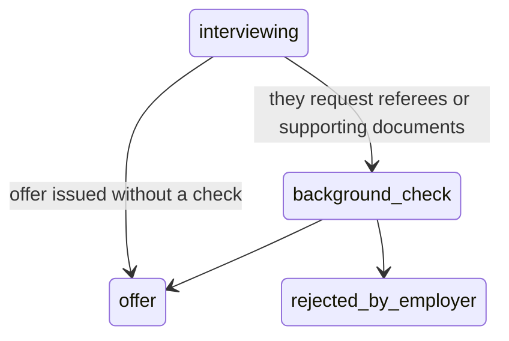

# First Target: the TSMC Application Playbook

> This document takes the abstract design from [`00-overview.md`](00-overview.md) through [`11-tech-stack-roadmap.md`](11-tech-stack-roadmap.md) and stress-tests it against a real employer.
>
> **Fact discipline:** This document marks in bold **[Measured]** the observations obtained by actually driving a browser on 2026-09-16; **[Inferred]** marks what follows directly from those measurements with high confidence but without independent verification; **[Speculation — needs verification]** marks everything else. Every speculative item is listed with its verification method in `## Open Verification Items` at the end. An unmarked sentence is a design claim, not a factual assertion.

---

## 1. Why this is the first target

Picking the wrong first implementation target turns acceptance of the whole system into "was the design wrong, or is this company just impossible?" TSMC holds up on four dimensions at once:

| Dimension | Situation | What it means for the system |
|---|---|---|
| Machine readability | [Measured] `robots.txt` says `Allow: /careers` explicitly, and proactively offers a sitemap index | The ingestion layer can take the cleanest possible path and never parse any UI |
| Data availability | [Measured] A single sitemap carries all 774 job posting URLs, each with a `<lastmod>` | The steady-state cost of a complete index is **1 request per day** |
| Right order of magnitude | [Measured] 774 job postings | Big enough to be worth automating, small enough that one laptop's cache holds it |
| It will overturn assumptions | [Measured] Official wording: "your résumé is open to every TSMC manager" (§5) | **This is the actual reason for choosing it** |

The fourth point deserves unpacking. An experiment that can only confirm the existing design carries no information. TSMC's recruiting model demolishes a core assumption in [`06-content-assembly.md`](06-content-assembly.md) — and **discovering that is worth more than the résumé you submit**.

### 1.1 Objection: it may not deserve to be your first target

Three rebuttals recorded honestly, because all three hold:

1. **Technically clean ≠ worth applying to.** Three of this document's reasons for choosing it are engineering reasons. If TSMC is not in your top three target employers, you are writing config for an employer you will never apply to — exactly the kind of "avoidance that looks like progress" that [`11-tech-stack-roadmap.md`](11-tech-stack-roadmap.md) §15 warns about.
2. **`robots.txt` permission is not Terms of Use permission.** These are different layers: `robots.txt` is a technical directive to crawlers, while the site's Terms of Use is a contract. This document's compliance argument currently rests only on the former. **You must first read `tsmc.com`'s Terms of Use and its applicant privacy notice**, file the excerpts in the source ledger at [`10-risk-compliance.md`](10-risk-compliance.md) §2.2, and only then may `enabled` be set to `true` (see §9 step 0.5, open item V1).
3. **A single employer is worth only 2–3 submissions a year** (§8). Making it the first implementation target means validating a very long pipeline with a very small output volume. That is a deliberate trade-off — what is being validated is the design, not the throughput — but you should know exactly what you are doing.

---

## 2. Target inventory: three entry points, not one

[Measured] TSMC runs **two ATS platforms** simultaneously, plus a separate R&D job posting page. Treating them as one source leads straight to deduplication errors and polluted statistics.

```
                         ┌─────────────────────────────────────────┐
                         │  tsmc.com/chinese/careers/ (front door)  │
                         └───────────────┬─────────────────────────┘
          ┌──────────────────────────────┼──────────────────────────────┐
          ▼                              ▼                              ▼
┌───────────────────────┐   ┌──────────────────────────────┐   ┌──────────────────────────┐
│ careers.tsmc.com      │   │ ro.careers.tsmc.com          │   │ research.tsmc.com        │
│ ── Avature ──         │   │ ── SAP SuccessFactors ──     │   │ /chinese/careers/        │
│                       │   │        RMK                   │   │   openings.html          │
│ [Measured] 774 jobs   │   │ [Measured] all observed      │   │ [Measured] exists,       │
│ four-locale sitemaps: │   │ locations overseas: Japan    │   │ separate from the main   │
│ de_DE ja_JP zh_TW     │   │ (Yokohama/Osaka/Tsukuba/     │   │ site                     │
│ en_US                 │   │ Kumamoto), US states, Canada │   │ size/overlap unverified  │
└───────────┬───────────┘   └────────────┬─────────────────┘   └───────────┬──────────────┘
            │                            │                                 │
     [main subject here]          [excluded in Phase 1]           [revisit in Phase 2]
```

**Evidence chain (all measured, not inferred):**

- `careers.tsmc.com/sitemap.xml` points at `https://tsmc.avature.net/favicon.ico` → the main site runs on Avature.
- `ro.careers.tsmc.com`'s URL parameters look like `createNewAlert=false`, `optionsFacetsDD_city=`, `locationsearch=` → the parameter naming of SAP SuccessFactors Recruiting Marketing (RMK).
- The `careers.tsmc.com` search page shows **774 records**, and `zh_TW/careers/sitemap.xml` contains exactly **774 `/JobDetail/` URLs**. Two independent channels producing identical numbers is the single strongest piece of evidence for sitemap completeness.

### 2.1 A trap that has to be settled first: locale ≠ location

[Measured] The 774 is **the total on the search page with no filters applied**, and the zh_TW sitemap's 774 matches it.

[Inferred] Therefore `zh_TW` is a **locale**, not a **location** — `zh_TW/careers/sitemap.xml` holds "the Traditional Chinese pages for all 774 job postings", not "the 774 job postings in Taiwan". The four locale sitemaps are very likely four language versions of the same set of postings.

This distinction is the foundation of everything downstream. Mistake the zh_TW sitemap for a list of Taiwan job postings and you will think you are tracking 774 Taiwan openings when the set actually includes ESMC Germany and JASM Japan postings. **Filtering for Taiwan must go through the Location field, never through the locale** (open item V3).

### 2.2 Which one a job seeker in Taiwan should lock onto

**Lock onto `careers.tsmc.com`; the other two are explicitly excluded in Phase 1.**

| Entry point | Decision | Reason |
|---|---|---|
| `careers.tsmc.com` (Avature) | **The only implementation target** | Contains Taiwan postings; the sitemap is complete and authoritative; robots.txt allows it explicitly |
| `ro.careers.tsmc.com` (SuccessFactors) | Excluded | [Measured] every observed location is overseas. For a user who is in Taiwan and targeting Taiwan, these postings would all be blocked by the location/work-visa rules in [`05-scoring-triage.md`](05-scoring-triage.md) §4.1 Stage 0. Wiring up a source whose every result dies at the first gate is a negative return |
| `research.tsmc.com` | Deferred | Neither its size nor whether it overlaps the main site has been verified. If its postings are also in the main sitemap, connecting it only adds deduplication load |

> **This exclusion is conditional.** If the user's target profile includes "willing to relocate to Japan" (the multi-persona problem in [`99-gaps.md`](99-gaps.md) A3), the SuccessFactors site flips from "everything blocked" to "primary source" and the decision reverses completely. That is why it has to live as `enabled: false` in the `source_registry` of [`04-ingestion.md`](04-ingestion.md) §2.1, not as a comment line in the code.

---

## 3. Ingestion layer: the sitemap is the authoritative index, not a supplement

The core claim in one sentence: **TSMC has already handed you the complete job posting index for free, publicly, with change timestamps, and any design that bypasses it to parse the search UI is asking for trouble.**

### 3.1 The interfaces as measured

```
robots.txt @ careers.tsmc.com          [Measured]
──────────────────────────────────────────
User-agent: *
Allow: /careers
Disallow: /careers/*qtvc=
Allow: /*/careers
Disallow: /*/careers/*qtvc=
Sitemap: https://careers.tsmc.com/careers/sitemap_index.xml
(there are also separate sitemaps for /talentcommunity /events /CampusPhD /Agency /onboarding)
```

```
sitemap_index.xml                       [Measured]
   ├── de_DE/careers/sitemap.xml
   ├── ja_JP/careers/sitemap.xml
   ├── zh_TW/careers/sitemap.xml   ◀── 815 URLs, of which 774 are /JobDetail/
   └── en_US/careers/sitemap.xml
```

[Measured] The `zh_TW` sitemap holds 815 URLs, 774 of them `/JobDetail/`, every one carrying a `<lastmod>`.
[Speculation — needs verification] What the other 41 are (search pages, talent community, login pages are the reasonable guess, but they were not checked one by one). Those 41 do not affect the design — parsing only accepts what `JOB_RE` matches and ignores the rest.

[Measured] Job detail pages come in two forms:

```
https://careers.tsmc.com/zh_TW/careers/JobDetail/<slug>/<jobId>
  e.g. .../JobDetail/Physical-Design-Engineer-Taiwan/248
       .../JobDetail/IT-Security-Engineer/250

https://careers.tsmc.com/{locale}/careers/JobDetail?jobId=<id>&source=External+Career+Site
```

The slug in the first form **contains the job title itself**, and sometimes the region (`-Taiwan`). That apparently trivial detail lets us run a first filter without fetching a single detail page (§3.4).
[Speculation — needs verification] Whether the two forms point at exactly the same content, and whether the slug is stable (does it change when the title is edited). The design keys only on `jobId` and never relies on slug stability.

### 3.2 Why not the search UI: three independent reasons

The search UI's endpoint is `GET /{locale}/careers/SearchJobs/?jobRecordsPerPage=N&jobOffset=M`.

**Reason one: page size is locked server-side.** [Measured] `jobRecordsPerPage=100` and `=10` return identical results (10 records either way). The parameter is accepted and ignored.

**Reason two: the request count to obtain the index differs by 78×.**

| Approach | Requests needed for "all 774 current index entries" |
|---|---|
| sitemap | **1** |
| search UI pagination | `ceil(774 / 10)` = **78** |

Under rule 4 of [`10-risk-compliance.md`](10-risk-compliance.md) §2.4 — "interval between requests to a single domain ≥ 5 seconds" — 78 requests take 6.5 minutes, and repeat every day. The sitemap is 1 request.

> **While we are here, a contradiction in the existing documents:** [`04-ingestion.md`](04-ingestion.md) §7 says "default 1 req / 2s per host", while [`10-risk-compliance.md`](10-risk-compliance.md) §2.4 rule 4 says "≥ 5 seconds". These two numbers conflict directly, and the contradiction list in [`99-gaps.md`](99-gaps.md) does not record it. **This document always takes the stricter value (5 seconds)** and recommends registering it in the shared constants table in [`00-overview.md`](00-overview.md).

**Reason three: the search form's interface is a set of brittle numeric ids.** [Measured] Filtering POSTs to `/{locale}/careers/SearchJobs`, and the field names are Avature-internal numeric facet ids (`4177`, `1277`, `4178`, `558`, `147`, `542` were observed). None of these ids carry any stability guarantee. The corresponding facet dimensions [Measured]:

| Facet dimension | Values |
|---|---|
| Organization | TSMC Group / ESMC / JASM |
| Location | 17 of them (Taiwan included) |
| Job Category | 21 categories (Information Technology, R&D, Manufacturing, …) |
| Job Type | Technician / Associate Engineer / Engineer / Manager / Others |
| Employment Type | Regular / Temporary / Intern / Apprenticeship |

These dimensions are genuinely useful (§4.1), but **extract them from the detail page; do not query them through the search form's numeric ids**. The difference is the failure mode: when the former breaks, the field goes `null` and trips the alerting in [`04-ingestion.md`](04-ingestion.md) §8; when the latter breaks, you **silently get a wrong subset** and never know.

> **One honest exception:** `SearchJobs` sits inside robots.txt's `Allow` scope, and hitting it violates no rule. §3.6 keeps **one request per day** to the search page — not to obtain data, but to **obtain the total record count and reconcile it against the sitemap**. That is the only mechanism that can detect a silent failure of the sitemap.

### 3.3 Algorithm: one GET, full diff, fetch only what changed

```python
# ingest/sources/tsmc_avature.py
# The generic part of this module should be factored out into a sitemap_diff component
# (see the revision proposals at the end); TSMC is merely its first config.

SITEMAP_ZHTW = "https://careers.tsmc.com/zh_TW/careers/sitemap.xml"
JOB_RE       = re.compile(r"/careers/JobDetail/[^/]+/(\d+)/?$")

# The mailbox in the UA is the job-search-only mailbox from 04 §4.2, not a personal one
HONEST_UA = ("ai-career/0.1 (personal job-search agent; "
             "+https://github.com/rojarsmith/ai-career; contact: <job-mailbox>)")


def sync_tsmc(db, http) -> Delta:
    prev = db.get_source_state("tsmc_avature")
    # prev.snapshot : {job_id: {"url": str, "lastmod": str}}

    # ── 1. One GET. Conditional requests are a bonus, not a prerequisite ──
    resp = http.get(SITEMAP_ZHTW,
                    headers=conditional_headers(prev),   # empty if prev has no etag
                    user_agent=HONEST_UA)

    if resp.status == 304:                # whether the server supports this: open item V2
        db.touch_checked_at("tsmc_avature")
        return Delta.empty()
    # No conditional-request support is fine: cost is still 1 request a day, just one more XML download.

    if resp.status in (403, 429):
        # 04 §7: 3 in a row → permanently disable the source automatically and notify a human.
        # Never change the UA, never rotate IPs, never retry faster.
        db.record_refusal("tsmc_avature", resp.status)
        raise SourceRefused(resp.status)

    db.put_raw_document(resp)             # immutable original (04 §0 item 4)

    # ── 2. Parse + honor robots.txt Disallow ─────────────────
    cur = {}
    for url, lastmod in parse_sitemap(resp.body):
        if "qtvc=" in url:                # Disallow: /*/careers/*qtvc=
            continue
        m = JOB_RE.search(url)
        if m:
            cur[m.group(1)] = {"url": url, "lastmod": lastmod}

    # ── 3. Three-way diff. Note that added / removed do not depend on lastmod ──
    added   = cur.keys() - prev.snapshot.keys()
    removed = prev.snapshot.keys() - cur.keys()
    changed = {j for j in (cur.keys() & prev.snapshot.keys())
                 if cur[j]["lastmod"] != prev.snapshot[j]["lastmod"]}

    # ── 4. Gone = the posting closed. A strong signal at zero extra requests ──
    for job_id in removed:
        db.mark_posting_closed("tsmc_avature", job_id, observed_at=now())
        # → drives approved → expired from 03 §4.2 (see §3.8)

    # ── 5. Fetch only the changes that clear the slug-level gate ──
    to_fetch = [j for j in sorted(added | changed)
                  if slug_gate(cur[j]["url"])]          # see §3.4
    to_fetch = to_fetch[:DAILY_DETAIL_CAP]              # see §3.6, daily hard cap

    for job_id in to_fetch:
        polite_sleep(min_interval_s=5, jitter_ms=(0, 500))   # 10 §2.4 rule 4
        page = http.get(cur[job_id]["url"], user_agent=HONEST_UA)
        db.put_raw_document(page)
        db.enqueue_parse(job_id, page.ref)

    db.put_source_state("tsmc_avature",
                        etag=resp.etag,
                        last_modified=resp.last_modified,
                        snapshot=cur)
    return Delta(added, removed, changed, fetched=len(to_fetch))
```

**`DAILY_DETAIL_CAP` is not decoration.** It is the circuit breaker for the worst case where `lastmod` refreshes wholesale every day (open item V4): if `changed` is suddenly 774 one morning, this line makes the system fetch 30 and stop with an alert, instead of quietly hitting the other side 774 times.

### 3.4 The slug-level gate: zero cost, but strictly one-directional

The slug contains the job title → obviously irrelevant postings can be excluded before any detail page is fetched. This gate comes with one hard usage rule:

> **It may only exclude, never select.** A slug carries the title (sometimes plus a region) and nothing else — no seniority requirement, no field-of-study restriction, no JD text. Using it to make a positive judgement is concluding without evidence, which violates rule 4 of [`04-ingestion.md`](04-ingestion.md) §1, "missing means missing".

The implementation is recall-first conservative exclusion:

```python
HARD_EXCLUDE = [
    r"(?i)\b(technician|operator)\b|作業員|技術員",   # Job Type clearly does not match
    r"(?i)\b(intern|internship)\b|實習",              # Employment Type does not match
    r"(?i)\b(facility|廠務|公用|環安衛)\b",           # Job Category clearly does not match
]

def slug_gate(url: str) -> bool:
    slug = url.rsplit("/", 2)[-2].replace("-", " ")
    return not any(re.search(p, slug) for p in HARD_EXCLUDE)
```

The user maintains the exclusion list, and every entry must be defensible in one sentence: "why this class of posting is 100% impossible for me". If you cannot say it, do not add it — better to fetch an extra page than to silently drop an opportunity. This is the same spirit as [`05-scoring-triage.md`](05-scoring-triage.md) §9.3, "failures always fail open".

**This gate belongs to 04, not 05.** It decides "is this worth spending a request on", not "is this posting worth a submission". Stuffing it into 05's Stage sequence conflates two things: Stage 0 in 05 judges a complete `NormalizedJob`, whereas here we do not even have the JD yet.

### 3.5 Request volume estimate

**Cold start (first run)**

| Step | Requests |
|---|---|
| sitemap_index + zh_TW sitemap | 2 |
| detail pages for the 774 slugs that clear the gate | depends on the exclusion list, roughly 80–200 (**speculation**, needs to be recomputed against the actual list) |
| **Total** | **~200, about 17 minutes @ 5s intervals, one-off** |

Without the slug gate, a cold start fetches 774 pages ≈ 65 minutes. Acceptable, but unnecessary.

**Steady state (daily)**

[Speculation — needs verification] Assuming a median posting lifetime of 60–90 days, daily additions and disappearances are each about `774/60 ≈ 13` to `774/90 ≈ 9`, and fewer still after the slug gate.

| Approach | Steady-state requests per day |
|---|---|
| **sitemap diff (this design)** | 1 (sitemap) + 1 (search page for reconciliation) + **5–15** (detail pages for changes that clear the gate) |
| sitemap without diff (fetch everything daily) | 1 + 774 |
| search UI pagination + fetch everything | 78 + 774 |

Steady state is roughly **7–17 requests per day**, done in under 90 seconds at 5s intervals. At that scale TSMC's servers see the equivalent of one person browsing slowly.

### 3.6 Politeness design checklist

All of it maps to existing rules in [`10-risk-compliance.md`](10-risk-compliance.md) §2.4; this document adds no principles, it only implements them:

| Item | Concrete practice |
|---|---|
| Conditional requests | Record the sitemap response's `ETag` / `Last-Modified` and send `If-None-Match` / `If-Modified-Since` next time. 304 → done for the day. **Server support is unverified**; without it the cost is unchanged (still 1 request) |
| Request interval | Single host ≥ 5 seconds + 0–500ms jitter, concurrency 1 |
| User-Agent | Honest UA carrying the repo URL and a contactable mailbox (the job-search-only one). **Never impersonate a browser** |
| robots.txt | Honor `Disallow: /careers/*qtvc=` and `/*/careers/*qtvc=`. Re-fetch and diff robots.txt every 7 days; any content change disables the source and notifies a human |
| Terms of Use | **robots.txt permission is not ToS permission.** The source ledger must record `robots_checked_at` and `tos_checked_at` separately; while `tos_checked_at` is null, `enabled` must be false |
| Backoff | `429`/`5xx` → exponential backoff with full jitter, respect `Retry-After`. Three consecutive `403`/`429` → permanently disable automatically and notify |
| Daily hard cap | Total requests per source per day ≤ 60, detail pages ≤ 30 (`DAILY_DETAIL_CAP`). Exceeding it stops the run and alerts — normal operation never reaches 20 |
| Index completeness reconciliation | Once a day, fetch the first search page for the total record count and compare it against the sitemap's JobDetail count; alert on a difference > 5% |

The last row deserves special mention. [`04-ingestion.md`](04-ingestion.md) §8 says "silent failure is far more dangerous than a broken integration" — if Avature changes its sitemap generation one day and lists only some postings, the diff keeps working, nothing errors, and all you notice is "TSMC doesn't seem to have many new openings lately". The count reconciliation is the only mechanism that catches this, and it is worth one extra request a day.

### 3.7 Two tracks: sitemap for completeness, email alert for immediacy

[Measured] The Avature site has `AgentCreate` / `AgentDelete` pages — the entry points for creating and deleting a job alert agent (email alert). This is a **push channel the platform provides itself**, and it lines up naturally with the Email backbone in [`04-ingestion.md`](04-ingestion.md) §4.
[Speculation — needs verification] Whether creating an agent requires a logged-in account (some Avature tenants only ask for an email). Either way, a human does this step by hand; the system never touches the account.

```
                  ┌──────────────────────────────────────────┐
                  │  careers.tsmc.com (Avature)              │
                  └──────┬────────────────────────┬──────────┘
        daily pull       │                        │  platform push
                         ▼                        ▼
            ┌────────────────────────┐   ┌─────────────────────────┐
            │ sitemap diff           │   │ Job Agent (email alert) │
            │                        │   │                         │
            │ ✔ completeness (774)   │   │ ✔ immediate (on posting)│
            │ ✔ closure: only source │   │ ✔ platform's relevance  │
            │ ✘ delay up to one cycle│   │ ✘ only matching ones    │
            │                        │   │ ✘ blind to closures     │
            └───────────┬────────────┘   └────────────┬────────────┘
                        │                             │
                        └──────────┬──────────────────┘
                                   ▼
                    merge on jobId as primary key → NormalizedJob
                    (04 §6.2: one record across sources — the first to arrive
                      creates the row, later ones only log an Observation)
```

The complementarity is structural: **the sitemap is the only source that can detect a posting disappearing**, and **the email alert is the only source that can tell you about a new posting inside the schedule interval**. Drop either side and you go blind in a specific scenario.

The cost has to be stated: email alerts pull the deduplication pressure of [`04-ingestion.md`](04-ingestion.md) §6 forward — the same jobId arrives once down each path. Using `(source_id, source_job_id)` as the natural key solves it, with no similarity comparison at all.

### 3.8 A disappearing posting drives the state machine directly

This is a bonus of the sitemap approach worth calling out on its own, because in the existing design the `expired` state has no trigger source whatsoever. State names follow the vocabulary of [`03-data-model.md`](03-data-model.md) §4.2 (see the naming note in §7.0).

```
jobId disappears from the zh_TW sitemap
        │
        ├── no corresponding application
        │       └→ normalized_job.posting_closed_at = now()
        │          (the triage layer of 03 §4.1: no longer enters the scoring queue)
        │
        ├── application exists and state ∈ {queued, assembled, pending_review, approved}
        │       └→ application.state = expired (03 §4.2)
        │          ⚠ goes into today's to-do at once. "The posting you were about to
        │             apply to just closed" is the most time-critical notification (99-gaps D3)
        │
        └── application exists and state ∈ {submitted, acknowledged, ...}
                └→ do not change state. Log one observation for the funnel diagnostics in 09.
```

The last branch is the point: **do not automatically translate "posting closed" into "you were rejected"**. The cost of misjudging is severely asymmetric (same principle as [`08-delivery-tracking.md`](08-delivery-tracking.md) §5.3 applies to `rejection`), and especially so under TSMC's talent pool model (§5) — a closed posting may only mean that position was filled, while your profile is still in the system.

**A missed case that has to be acknowledged:** a posting disappearing from the sitemap can also mean the sitemap generator glitched, not that the posting closed. The count reconciliation in §3.6 only catches large-scale omissions; a single erroneous drop slips through. The mitigation is to treat `posting_closed_at` as a **revocable observation** — if that jobId reappears within 14 days, clear the field and log a `flapping` warning.

---

## 4. Parsing layer: what to extract from a JobDetail page, and what will bite

> **This entire section is design, not measurement.** What the field work obtained was the sitemap, robots.txt, search UI behavior and the official process page; **the actual layout of JobDetail pages was not inspected page by page**. The field mapping below is inferred from "the facet dimension exists → the detail page very likely displays it", and needs to be verified against the first batch fetched in §9 step 9.

### 4.1 Extraction schema

Mapped onto the `NormalizedJob` of [`04-ingestion.md`](04-ingestion.md) §5:

| Field | Source | Maps to NormalizedJob | Status |
|---|---|---|---|
| `job_id` | last URL segment | `source_job_id` | [Measured] exists. **Whether it stays stable across a re-posting: speculation, needs verification** |
| `title_raw` | page title | `title_raw` / `title_core` | Speculation; the slug also carries a copy for cross-validation |
| `locations[]` | Location field | `locations` | Speculation. **Whether Taiwan is further broken down by site (Hsinchu / Tainan / Taichung) is unknown** — if it is not, the collapsing logic in §4.3 has to change |
| `organization` | Organization field | (new field) | Speculation. TSMC Group / ESMC / JASM, determines the actual employing legal entity |
| `job_category` | Job Category field | (new field) | Speculation. 21 categories, the key dimension for job_family grouping |
| `job_type` | Job Type field | partial input to `seniority` | Speculation |
| `employment_type` | Employment Type field | `employment_type` | Speculation |
| `jd_text` | body text | `jd_text` | [Measured] the page exists; its content structure was not inspected |
| `education_req` | JD paragraph | (new field) | Speculation. Degree thresholds and field-of-study restrictions are a hard gate in Taiwan's semiconductor industry, worth extracting separately |
| `posted_at` | Posted date on the page | `posted_at` | [Measured] at least jobId=562 shows `Posted 2023-09-01`; whether every page has it is speculation |
| `comp` | — | `comp = null` | **Speculation, needs verification**: whether TSMC JDs disclose compensation. Either way, per 04 §5, `is_disclosed: false` and **never estimate** |

The relationship between the three time fields has to be spelled out, because they are easy to conflate:

- `posted_at` = the posting date TSMC claims. Usable for judging "how long this posting has been up".
- `lastmod` = the last change time the sitemap claims. **Used only to trigger the diff, never treated as business semantics.**
- `first_seen_at` = when we first observed it. Per 04 §9.3, this is the primary timeline.

### 4.2 Two predictable traps

**Trap one: boilerplate paragraphs dilute information density (speculation, needs verification).**

Large employers' JDs usually repeat a lot of company background, benefits, EEO statements and application process guidance. **Whether TSMC does this, and in what proportion, was not verified here** — but the risk is common enough to warrant designing the countermeasure now and validating it against the first batch of JDs.

The consequence hits [`05-scoring-triage.md`](05-scoring-triage.md) directly: Stage 3's six-facet anchored scoring needs sufficient information density, and a JD that is 60% template leaves several facets at "cannot determine". This is exactly the degradation described in [`99-gaps.md`](99-gaps.md) D4, except the cause is not a short JD but a diluted one.

The countermeasure is deterministic preprocessing, no LLM required:

```python
# Template fingerprinting: paragraph-level statistics over the N JDs accumulated for one company_key
def build_boilerplate_index(jds: list[str], min_docs=20, threshold=0.5):
    counter = Counter()
    for jd in jds:
        for para in split_paragraphs(jd):
            counter[normalize_hash(para)] += 1
    n = len(jds)
    if n < min_docs:
        return set()              # Too few samples, strip nothing. Better not to strip than to strip wrong
    return {h for h, c in counter.items() if c / n >= threshold}
```

**There is a chicken-and-egg problem here to acknowledge:** the index needs ≥ 20 JDs, while the slug gate in §3.4 exists precisely to fetch fewer JDs. The resolution is that the index **accumulates incrementally** — the 80–200 fetched at cold start are enough to build it once; after that, every fetch updates the counts. Below 20, strip nothing.

Three accompanying rules:

1. Stripped paragraphs **must be retained in the RawDocument and expandable with one click in the review interface** (04 §0 item 4: `_raw` is kept forever). Stripping affects only what goes into the LLM, not what the human sees.
2. Record the strip ratio. If a JD gets 80% stripped, that is not "improved information density", it is "this posting says essentially nothing" — mark it `low_information` and route it down D4's manual quick-screen path, not to elimination by low score.
3. `threshold=0.5` is a guess. Set it after looking at the distribution of paragraph repetition in the first batch of data; do not treat it as a constant.

**Trap two: mixed Chinese and English.** [Measured] the recruiting system and the official pages carry both languages, so `jd_lang = 'mixed'` should be the norm rather than the exception (04 §5 already anticipated this). Two practical consequences: technical term matching has to handle both the Chinese and the English rendering (實體設計 / "Physical Design"); and the bilingual dual-track blocks of [`06-content-assembly.md`](06-content-assembly.md) §2.4 must here have both tracks populated — someone with only Chinese blocks scores zero on English keywords, and vice versa.

**No exception for prompt injection.** The path that sends full JD text into an LLM is subject to every defense in [`99-gaps.md`](99-gaps.md) C1: the JD is wrapped in an explicitly delimited data block, the system prompt declares it untrusted data, output is forced through schema validation, and every evidence citation must string-match successfully against the original JD. The odds of an official TSMC JD being injected are very low, but **once the process grants an exception, the next source inherits it**.

### 4.3 Deduplication: is the same title at a different site the same posting?

[Speculation — needs verification] TSMC has fabs in Hsinchu, Tainan and Taichung, so the same title being posted repeatedly across sites should be the norm (not confirmed in this round of field work). There are two distinct questions here, with different answers.

**Question A: should the data layer merge them into one row? No.**

`jobId` is Avature's authoritative primary key. A different `jobId` is a different posting, with its own `lastmod`, its own lifecycle, its own application URL. Automatic merging produces: one of them closing gets the whole row misjudged as closed, applications going to the wrong URL, and closure detection failing.

```
natural key = (source_id='tsmc_avature', source_job_id=jobId)
→ maps onto 04 §6.1 "same source, repeated over time", no similarity comparison needed
```

**Question B: should the human review queue collapse them? Yes, and it must.**

If the same title at three sites each takes a review slot, the throughput of [`07-review-gate.md`](07-review-gate.md) §8 — the only real bottleneck in this system, about 32 minutes a week — gets consumed three times by the same thing.

```
job_family_key = sha256(company_key + title_core + job_category + job_type)
```

| Level | Condition | Handling |
|---|---|---|
| Same family | identical `job_family_key` | Collapse into one entry in the queue, expandable to show each site's jobId and location. **Create exactly one application** |
| Probably same family | different family key, but `title_core` edit distance ≤ 2 and same category | Flag for human confirmation, accumulate into an alias table (the approach in 04 §9.3) |
| Different | everything else | Handle separately |

**After collapsing, which site do you apply to? That is a human decision.** The site determines commute, dormitory, shift system, department culture — none of which is in the JD, so the system has no informational advantage. What the system should do is present the options side by side (location, jobId, posting date, JD diff) so the human can choose in 30 seconds.

---

## 5. The single talent pool model: what it overturns

**This is the most important section in the document.** The previous four sections are engineering; this one is a finding that rewrites the existing design.

### 5.1 Two measured facts

[Measured] The first stage, "fill in your résumé", on TSMC's official application process page (`tsmc.com/chinese/careers/application_process.htm`) reads:

> "Your résumé will be open to all TSMC managers. You may therefore be invited into the selection process for positions other than the one you applied for."

[Measured] The site also carries a permanent posting, "Register your profile on TSMC Talent Pool" (jobId=562, Posted 2023-09-01) — a résumé registration entry point that **names no job posting at all**.

### 5.2 Drawing the line between fact, inference and open item

| Level | Content | Status |
|---|---|---|
| Fact | Official wording: the résumé is open to all TSMC managers; you may be invited to positions other than the one you applied for | **[Measured]** |
| Fact | A permanent, posting-independent talent pool registration entry exists (jobId=562) | **[Measured]** |
| Inference (high confidence) | Inside the system you have exactly **one** structured résumé, and every manager sees that same one | Follows directly from the two facts above |
| Open item | Whether each application can upload a **different attached PDF** | Observe the actual fields of `ApplicationForm` / `ApplicationMethods` after logging in |
| Open item | Which one recruiters actually read, the attached PDF or the structured résumé | Hard to verify externally; can be asked directly at the interview |

**Even if "attachments can differ per application" turns out to be true, the core inference is unchanged**: what is shared across postings is the structured profile, and that is precisely what managers see when they search and browse in the system. The attached PDF is at best a secondary channel.

### 5.3 What it overturns in 06

First, credit where it is due to [`06-content-assembly.md`](06-content-assembly.md): its §4.2 "platform form-field version" **already anticipated** that Taiwanese employers read the on-site structured résumé rather than a PDF. So what gets overturned is not "produce structured fields".

What gets overturned is a deeper, unstated assumption: **each application is an independent submission, so content can be assembled specifically for that JD** — regardless of whether that content ends up as a PDF or as form fields.

```
The model 06 currently assumes (Mode D)
────────────────────────────────────
  JD_1 ──▶ assemble ──▶ output_1 ──▶ recruiter sees output_1
  JD_2 ──▶ assemble ──▶ output_2 ──▶ recruiter sees output_2
  JD_3 ──▶ assemble ──▶ output_3 ──▶ recruiter sees output_3
  ↑ every submission is an independent chance to customize


TSMC's actual model (Mode P)
────────────────────────────────────
                    ┌──────────────────────┐
  JD_1 ──▶ apply ──▶│                      │
  JD_2 ──▶ apply ──▶│  one canonical       │ ──▶ every manager sees this one
  JD_3 ──▶ apply ──▶│  structured profile  │ ──▶ even managers you did not apply to
    (no application)▶│                      │
                    └──────────────────────┘
  ↑ the target of customization is not "this JD", it is "every manager who might see you"
```

So under Mode P:

| Mechanism in 06 | Under Mode P | Why |
|---|---|---|
| Reordering/swapping bullets for a JD (T1 in §7) | ✘ worthless | You are reordering the same profile, the next application overwrites it, and it retroactively affects applications already submitted |
| Aligning the Skills section to a single JD | ✘ harmful | Narrowing keywords for JD_2 makes JD_1's manager unable to find you in search |
| One document per application (T1/T2) | ✘ mostly ineffective | Managers read structured fields |
| §4.2 platform form-field version | ◐ **semantics change** | From "per-application output" to "the single canonical output across all postings" — same renderer, completely different lifecycle |
| §4.4 "why me" summary | ✔ still valuable | Its audience is the reviewer (you), not the recruiter |
| feasibility gate | ✔ still valuable | It decides "is this worth a submission", independent of submission mode |
| fact check pass | ✔ **more valuable** | The profile persists, so one wrong claim follows you through every application |

**A serious consequence that is easy to miss: updating the profile is destructive.** Under Mode D, editing your résumé does not affect applications already submitted; under Mode P, **you update your profile today, and the application you sent yesterday shows the new version when a manager opens it next week**. Which means:

- The semantics of `GenerationRun` (06 §5) must change: it records not "what this submission sent" but "what this profile update changed".
- At send time, snapshot the profile's contents as they stand (`profile_snapshot_hash`), or [`09-analytics-feedback.md`](09-analytics-feedback.md) has no way at all to reconstruct which version a manager saw.
- Profile update frequency should be measured in **months**, not in submissions.

### 5.4 The four real leverage points for customization

Overturned does not mean abandoned. The customization effort has not disappeared, it has **moved to different leverage points**.

```
        Human time invested (the correct allocation under Mode P)
        ┌──────────────────────────────────────────────────┐
  ① canonical profile  ████████████████████  one-off 4–8h │
     (shared across postings)                quarterly 1h │
                                                            │
  ② personal statement ████████████          one-off 2–3h │
     (TSMC names it explicitly)              rewrite 1h/6mo│
                                                            │
  ③ per-role questionnaire ██████            15–30min each │
     (the real per-application surface)                     │
                                                            │
  ④ which posting to apply to ████           10min each    │
     (choosing = whose field of view you enter)             │
        └──────────────────────────────────────────────────┘
        (times are estimates, not measured)
```

**① One highly optimized canonical structured résumé**

[Measured] TSMC says the key part itself: "detailed education and work history, professional technical keywords, and a personal statement are what make you stand out".

The keyword strategy undergoes a fundamental turn here: from **aligning to a single JD** to **covering the union of every role you are willing to be matched into**.

```
Mode D: keywords = align(my_blocks, JD_i)
Mode P: keywords = ⋃ { supported_keywords(target_role_j) }
                   for j in target_profile.acceptable_roles
```

> **There is a line here that cannot be relaxed.** A wider keyword range **does not mean a looser honesty standard**. Invariant I6 of [`06-content-assembly.md`](06-content-assembly.md) §3.2 (every technical term on the résumé must be supported by the claims of at least one selected block; see §4.2 for the line on keyword stuffing) **applies unchanged** under Mode P, and it is harder to violate undetected — because the profile persists, and a keyword you cannot back up will be asked about in every interview from now on. What widens is the **scope**, not the **honesty**.
>
> The test is still the "interview defensibility test" of [`10-risk-compliance.md`](10-risk-compliance.md) §4.1: if some TSMC manager finds you because of a keyword and calls you in, can you hold the line without adding a new lie? A keyword you cannot answer for does not belong in the profile.

**② The personal statement**

[Measured] TSMC's official process explicitly names the personal statement as the differentiating field. Its nature differs from the cover letter of [`06-content-assembly.md`](06-content-assembly.md) §4.3:

| | Cover letter (06 §4.3) | TSMC personal statement |
|---|---|---|
| Audience | The recruiter for one JD | Every manager who might see you |
| Frequency | Every submission | Written once, reviewed every six months |
| Opening anchor | "Why this company" | Not applicable — there is only one company |
| Spine | Matching the must-haves | **The career-arc narrative**: what kind of engineer you are, where you are heading |

So the personal statement **should not follow the cover letter's four-paragraph template**. It should be its own artifact, supported by `project_narrative` and `role_context` blocks from the content library, pitched by a human-written anchor, run through the same fact check pass as the cover letter, but version-managed rather than regenerated each time.

**③ The per-role application questionnaire**

[Measured] Stage two of the official process: "complete the relevant application questionnaire for the role".

**This is the only genuine per-application customization surface under Mode P.** It is also the place [`06-content-assembly.md`](06-content-assembly.md) is least prepared for — §2.1 has a `faq_answer` type (reason for leaving, salary expectation, employment gap), but that was designed for "generic FAQ", not for "a per-role structured questionnaire".

The minimal extension:

```jsonc
{
  "id": "blk_qa_why_semiconductor",
  "type": "questionnaire_answer",                  // upgraded from faq_answer
  "question_key": "motivation.industry_switch",    // normalized question key (new)
  "question_variants": [                           // different phrasings of one question (new)
    "為什麼想轉入半導體產業？",
    "Why are you interested in the semiconductor industry?"
  ],
  "text_variants": {
    "zh-TW": { "short": "…(within 200 characters)", "medium": "…(within 500 characters)" }
  },
  "claims": [ /* same as ContentBlock, facts still require a source */ ],
  "used_in": [                                     // consistency defense (new)
    {"employer": "tsmc", "application_id": "app_...", "at": "2026-09-20",
     "text_hash": "sha256:..."}
  ],
  "max_chars": 500
}
```

`used_in` is the point, not audit decoration. Under a single talent pool model, **your questionnaire answers from two successive applications to the same company will be read by the same people**. The cost of contradicting yourself is far higher than in the general case. When assembling questionnaire answers, the system should automatically compare against historical answers under the same `question_key`, and any substantive difference should be marked red in the review interface with an explicit human confirmation required.

**④ Which posting to apply to**

Because the résumé is shared, "choosing a posting" changes in kind:

```
Choosing under Mode D: how well does this JD match me?          ← matching is the goal
Choosing under Mode P: whose field of view do I enter with this? ← matching is still the bar, exposure is the goal
```

Practical inferences (**all speculation**):

- **Applying to a department's posting is knocking on that department manager's door.** The posting's Organization and Job Category may therefore matter more than the title itself.
- **"Slightly less matched but the right department" may beat "perfectly matched but the wrong department"** — because the official wording says you may be invited to positions other than the one you applied for.
- How to verify: record the Organization/Category of every application and, once some have accumulated, see whether cross-posting invitations actually appear. The sample size will be tiny (§8, §10 pain point 4), so this can only ever be a qualitative observation, never a statistical conclusion.

### 5.5 Boundary of applicability: do not over-generalize

**This conclusion applies only to a Mode P ATS, not to every ATS.** Expanding "TSMC does not need a customized résumé" into "customized résumés are useless" is a serious mis-inference — for an ATS like Greenhouse or Lever, where each application uploads its own document, 06's original design holds completely.

Four questions decide which mode an employer is in:

1. Does applying require creating an account and filling in **structured résumé fields** (rather than just uploading a file)?
2. Does the interface contain the concept of "one profile, many applications" (e.g. an application pre-populated from the existing profile)?
3. Does the company state explicitly that the résumé is shared across postings?
4. Can each application upload a different attachment?

The result should land as a new table in [`03-data-model.md`](03-data-model.md):

```sql
-- employer_policy (new table; full columns in §8.2)
ats_mode  TEXT NOT NULL CHECK (ats_mode IN (
  'profile_shared',            -- TSMC Avature. One profile shared company-wide
  'document_per_application',  -- Greenhouse / Lever. 06's original design applies
  'hybrid',                    -- has a profile but can also attach different files
  'unknown'                    -- undetermined → conservatively treated as profile_shared
))
```

`unknown` defaults to being treated as `profile_shared` because the cost of misjudging is asymmetric: mistaking Mode D for Mode P costs you a few missed customizations; mistaking Mode P for Mode D costs you believing every application is a fresh chance when in reality you are appearing three times in front of the same set of managers.

---

## 6. Division of labor between human and machine in the application process

[Measured] The four official stages (wording taken from `tsmc.com/chinese/careers/application_process.htm`):

```
  ①résumé ──▶ ②questionnaire + English test ──▶ ③interviews (1–2) ──▶ ④offer + reference check
                                          ↑
                        "the selection process averages two to four weeks"
```

| Stage | What the machine can do | What the human **must** do | Red lines |
|---|---|---|---|
| **① Fill in the résumé**<br>"detailed education and work history, professional technical keywords, and a personal statement are what make you stand out" | Produce the canonical profile's **field text** from the content library (plain text, no markdown, character-limit checks); keyword coverage check; Chinese/English consistency check (06 §2.4); personal statement draft (constrained generation + human anchor) | **Account registration and login**; national ID number, date of birth, military service, household registration address and other statutory identifiers and sensitive fields; the final paste; ticking the consent boxes; pressing submit | Never register an account on the user's behalf; never fill in statutory identifiers; never auto-submit (10 §2.4 red line 6) |
| **② Questionnaire and test**<br>"complete the relevant application questionnaire for the role", "an English test or proof of proficiency" | Retrieve candidate answers from the `questionnaire_answer` library; surface "how you answered this last time"; consistency comparison with red marking; character-limit checks | Confirm and edit every item; press submit; **take the English test entirely yourself** | **AI must not answer any recruiter test on your behalf** ← new red line, see §6.1 |
| **③ Interviews**<br>"a conversation with one or more managers"; managers schedule by email or phone | Produce STAR drafts from the JD + content library ([`99-gaps.md`](99-gaps.md) A1 identifies this as the highest-ROI stretch in the whole system); compile department/technical background research; calendar conflict checks; surface the `caveat` on relevant blocks (06 §2.2) | All conversation; replying with time slots (**the only step under clear time pressure** — a two-day delay in replying can knock you out outright) | No live prompting during an interview. The line between preparation and cheating is the moment the interview starts |
| **④ Offer and reference check**<br>"conduct a reference check", "notify of the offer and send the letter" | Assemble the list of documents to provide; **compare every claim in the profile against the supporting evidence you can actually produce**, catching in advance whatever would blow up during the check | Provide the list of referees (this involves third parties' personal data, so **you must obtain their consent first**); decide when to tell your current employer | Never forge employment certificates, degree certificates or reference letters (10 §2.4 red line 4, which in Taiwan falls under document forgery in the Criminal Code) |

### 6.1 The English test: why this gets hard-coded as a red line

**This is not a new principle, it is a direct corollary of red line 3 in [`10-risk-compliance.md`](10-risk-compliance.md) §2.4 (do not put false data in a factual field of an application form).**

1. The recruiter uses the English test score as a **fact**: "this candidate's English ability".
2. A score produced by an AI answering for you describes the AI's ability, not yours.
3. Therefore submitting an AI-produced score is putting false data in a factual field.
4. It also fails the "interview defensibility test" of §4.1 — a beautiful test score alongside an inability to form a complete English sentence in the interview is a contradiction that detonates within 15 minutes, and the impression it leaves is "liar", not "weak English".

Point 4 shows that this red line is **both an ethical and a practical criterion**: taking the test for someone is not merely wrong, it backfires, and in TSMC's case it backfires especially fast (the test is immediately followed by manager interviews).

The recommendation is to write it into the §2.4 red line list alongside proxy account registration (currently 10 items, adding 11 and 12):

```
11. Do not take any recruiter test on their behalf (language certification, online coding
    tests, aptitude tests, any assessment meant to evaluate the candidate's ability)
12. Do not register accounts on their behalf, do not fill in national ID numbers or other statutory identifiers
```

**How is this enforced in code? Honestly: it cannot be.** Like the trigger in [`03-data-model.md`](03-data-model.md) §4.3, these two guard against accidents and slippery slopes, not against a user cheating deliberately. Only two things actually work: (a) provide no entry point in the system for "answer this test question for me"; and (b) write it down in black and white in the red line list, so that "I was just going to ask quickly" has to cross an explicit psychological threshold first. This follows [`00-overview.md`](00-overview.md)'s "honesty by mechanism, not self-discipline" — here the mechanism is **not building that entry point**.

---

## 7. State tracking

### 7.0 First, a conflict between existing documents

[`03-data-model.md`](03-data-model.md) §4.2 and [`08-delivery-tracking.md`](08-delivery-tracking.md) §5.1 use **two different sets of state names** for the same thing:

| Concept | 03 §4.2 | 08 §5.1 |
|---|---|---|
| Posting closes after approval | `expired` | `expired_before_submit` |
| In interviews | `interviewing` | `interview` |
| They rejected you | `rejected_by_employer` | `rejected` |
| No reply past D_suspect | (no such state) | `silent` |

This is a real contradiction, and the contradiction list in [`99-gaps.md`](99-gaps.md) does not record it. **This document uses the vocabulary of 03 §4.2 throughout** (the data model is the single source of truth for the schema) and adds "pick one" to the revision proposals at the end.

### 7.1 The ghosted threshold: calibrate it with the official number

[Measured] TSMC states that "the selection process averages two to four weeks". This is a rare processing time published by the employer itself, and it should replace the generic value in [`08-delivery-tracking.md`](08-delivery-tracking.md) §5.5.

| | 08 §5.5 generic value (large-company ATS) | **Recommended for TSMC** | Reason |
|---|---|---|---|
| `D_suspect` | 21 days | **28 days** | [Measured] the upper bound of "two to four weeks" is 28 days. Starting to worry before the employer's own stated average upper bound is unreasonable anxiety |
| `D_ghost` | 45 days | **56 days** | Keeps 08's original ratio of about 2.1× (21→45). **This number has no empirical basis; it is just a proportional scale-up** |

> **A correction to the first draft:** an earlier version argued for pushing `D_ghost` to 70 days on the grounds that "your profile is still in the talent pool". That argument is wrong — the profile still being in the talent pool argues that **"this application went nowhere" does not equal "this company is not interested in you"**, not that "this application needs longer before it counts as gone nowhere". Conflating the two has a cost: stretching `D_ghost` delays the funnel signal of [`09-analytics-feedback.md`](09-analytics-feedback.md) §5.1 by two months.
>
> The right move is not to enlarge the constant, it is to **split the two concepts apart**:

```
application.state = ghosted        ← this application went nowhere (reversible, already so in 03 §4.2)
employer.profile_status = active   ← your profile is still in the talent pool (tracked separately)
```

`employer.profile_status` should never be moved off active by any automated schedule. Only two things end it: receiving an explicit blanket rejection, or the user deciding to withdraw the profile.

Incidentally, the SLA for `ghosted` is currently scattered across three places and inconsistent (03 §4.3 says ATS 21 days, 08 §5.5 says 21/45, and [`99-gaps.md`](99-gaps.md) contradiction §5 has flagged it). This document's recommendation goes to the root: **these values should not be global constants, they should be read from `employer_policy`** (§8.2), with the generic values demoted to a fallback.

### 7.2 Follow-up: in most cases, don't

The follow-up rules of [`08-delivery-tracking.md`](08-delivery-tracking.md) §7 need one extra guard here: **only follow up when you have a named contact.**

After submitting through an ATS, you have no named counterpart at all. Sending a follow-up to `no-reply@` or a generic recruiting mailbox has a hit rate near zero and a positive cost in annoyance.

| Situation | Action when `D_suspect` (28 days) is reached |
|---|---|
| Correspondence with a named manager or HR contact | Goes into today's to-do; the human decides whether to send a short inquiry |
| Only the ATS auto-reply, no named counterpart | **Do not follow up.** Instead, flag "consider whether to apply to a second posting", subject to the hard quota limits of §8 |
| No reply at all (not even an ack) | First check for a delivery problem (08 §5.2); once delivery is confirmed, same as above |

### 7.3 Email parsing rules

These map onto the four-stage inbound pipeline of [`08-delivery-tracking.md`](08-delivery-tracking.md) §5.3. **Everything below is speculation** — no TSMC notification email was received in this round, and the rules can only be finalized after the first one arrives in §9 step 3.

```
[1] Rule layer (high confidence, auto-classifiable)
    ├─ From domain = tsmc.com                         ★speculation, needs verification
    ├─ Return-Path / Message-ID contains avature.net  ★speculation, needs verification
    └─ Has List-Unsubscribe + subject has job keywords → this is a job agent notification
                                                       → hand to ingestion, not a reply

[2] Binding layer
    ├─ In-Reply-To / References → correlation_key (existing mechanism)
    ├─ Body contains a jobId     → bind application directly  ★speculation, format unverified
    └─ Neither → bind at the employer level, enter the manual queue to assign an application

[3] Classification (reuses the taxonomy and automation grading table of 08 §5.3, not relaxed)
    ├─ A manager's personal email: no List-Unsubscribe, not no-reply, addressed by name
    │   → always routed to interview_invite / scheduling candidates
    │   → per the 08 §5.3 table: ★no automatic transition, always notify a human★
    └─ rejection: may be automatic, but keep a 7-day undo (existing rule in 08)
```

**Until the rule layer is finalized, everything goes to the manual queue.** This matches 08 §5.3's own objection: if weekly mail volume is under 10, manual classification is cheap enough that writing this pipeline is not worth it.

### 7.4 Phone calls: the system's blind spot, and it needs a manual entry point

[Measured] The official process states that "managers will schedule by email or **phone**".

**Phone calls are entirely outside the email pipeline's observation range.** This is not TSMC-specific; it is a structural gap in [`08-delivery-tracking.md`](08-delivery-tracking.md) §5.3: the inbound pipeline is 100% built on a mailbox, so any non-mailbox interaction leaves the state machine stuck at `submitted` while the real world has already reached `interviewing`.

The consequence is worse than it sounds: the daily schedule will, on day 56, rule an application you interviewed for last week as `ghosted`, and the funnel in [`09-analytics-feedback.md`](09-analytics-feedback.md) will display a completely fictitious bottleneck.

Two layers of remedy:

1. **A manual touch entry point** (the cost of one command line, in exchange for eliminating a whole class of statistical error):
   ```
   ai-career touch --app <id> --kind phone_call \
                   --at 2026-10-12T14:30 \
                   --who "製造部 王經理" \
                   --next "10/20 14:00 現場面試"
   ```
2. **Active reminders**: the daily digest lists applications that have been `submitted` for more than 21 days with no touch at all as "please confirm whether there has been unrecorded phone contact". Do not wait for the system to rule it ghosted before you notice.

### 7.5 What the reference check stage means

It is the last gate in the funnel, usually occurring around the verbal offer. Three implications:

1. **Extremely high signal value.** The conversion rate from this point is far higher than from any earlier stage. The funnel in [`09-analytics-feedback.md`](09-analytics-feedback.md) §5.1 should break it out as its own stage rather than folding it into `offer`.
2. **It is the final acceptance test of the honesty mechanisms.** The mandatory `evidence` field, the structured `claims`, the verb-strength grading (10 §4.2) in [`06-content-assembly.md`](06-content-assembly.md) were all designed for this moment. What the system can do is compare **in advance** — on entering this stage, list every block whose `evidence.kind = self_attested` for the human to review.
3. **It is a risk moment.** A reference check proactively contacts former employers and referees, hitting [`99-gaps.md`](99-gaps.md) C3 (current-employer detection) directly. It needs explicit sequencing control: when the referee list is provided, whether their consent was obtained beforehand, whether the current manager is on the list. The system cannot judge this automatically, but it should force a checklist to pop up on entering this state.

Recommended addition to the state machine in [`03-data-model.md`](03-data-model.md) §4.2:



---

## 8. Single-employer risks and submission cadence

### 8.1 How the risk gets amplified, and one over-inference that must be corrected

[`10-risk-compliance.md`](10-risk-compliance.md) §6.1 already notes that "an ATS deduplicates candidates within the organization keyed on email, so the recruiter sees a merged file containing your two previous applications and their rejection reasons". TSMC's case is one level stronger:

```
A typical ATS (Mode D)
  3 applications → 3 recruiters each see one targeted document
                 → the merged file only surfaces when that same recruiter looks it up

TSMC (Mode P)
  3 applications → 3 managers see [the same] résumé
                 → and managers who never received your application see it too
                 → "this person applies everywhere" is visible by default, with nobody looking it up
```

> **A correction to the first draft: a tempting but wrong inference.** An earlier version argued that "since one application already exposes your profile to every manager, the marginal benefit of the 2nd and 3rd approaches zero". That inference conflates two things, and it contradicts §5.4 ④, "applying to a department's posting is knocking on that department manager's door".
>
> The correct decomposition:
>
> | | Marginal benefit | Explanation |
> |---|---|---|
> | **Passive exposure** (profile becomes searchable) | ≈ 0 from the 2nd onward | Register once and the whole company can see you; applying again does not make you more visible |
> | **Active application** (entering a specific manager's active queue) | **clearly greater than 0** from the 2nd | A manager who is hiring reviews the applicant list for their own posting; that is not passive search |
>
> So the reason to be restrained is **not** zero marginal benefit, it is that **the same résumé appearing repeatedly in front of the same people accumulates an impression cost**, while each additional application has diminishing marginal benefit. This is a decreasing curve, not a zero. The conclusion (be restrained) is unchanged, but its strength is different — it means "deliberately pick the 1–2 best departments", not "one application is enough".

### 8.2 Recommended submission cadence

| Rule | Value | Reason |
|---|---|---|
| Only 1 per `job_family` | **hard rule** | §4.3. Under a shared-résumé model, repeating across sites has almost no marginal benefit while eating three review quota slots |
| Simultaneously active TSMC applications | **≤ 2** | "Interested in two directions" explains being in two departments' field of view; three or more cannot be explained |
| Minimum interval between two submissions | **30 days** | Roughly the [Measured] upper bound of the official selection cycle (28 days). Let the previous one run its course before opening the next |
| Total TSMC submissions in 90 days | **≤ 3** | Conservative estimate |
| Talent pool registration (jobId=562) | **once, and it does not count against the above quota** | It is not an application to a specific posting, it is "make the profile searchable". In character it is configuration, not a submission |
| Mandatory pre-submission check | Whether the previous one is closed out | preflight hard gate (10 §7.2) |

**Stated honestly: the numbers above have no empirical basis.** Only one thing does — **the résumé is shared across postings**, which is official wording. Deriving "be restrained" from it is robust; deriving "30 days" and "≤ 3" is not. Those are conservative estimates, meant to err on the safe side in the absence of data.

So these values must be **overridable, with the reason recorded**:

```sql
-- employer_policy (new table, proposed for 03-data-model.md)
CREATE TABLE employer_policy (
  company_key             TEXT PRIMARY KEY,   -- 'tsmc'
  ats_mode                TEXT NOT NULL,      -- 'profile_shared' (see the CHECK in §5.5)
  cooldown_days           INTEGER NOT NULL,   -- 30
  max_active_applications INTEGER NOT NULL,   -- 2
  max_per_90d             INTEGER NOT NULL,   -- 3
  d_suspect_days          INTEGER NOT NULL,   -- 28
  d_ghost_days            INTEGER NOT NULL,   -- 56
  evidence_url            TEXT,               -- link to the official process page
  rationale               TEXT NOT NULL       -- "official wording: résumé shared across postings; selection averages 2–4 weeks"
);
```

`rationale NOT NULL` is deliberate: a throttling value whose reason you cannot state is a number you will not understand three months from now.

Legitimate override situations (reason must be recorded): a referral path exists ([`99-gaps.md`](99-gaps.md) A2), the recruiter reached out first, or the two postings belong to different Organizations (TSMC Group vs ESMC vs JASM, **speculated** to be separate legal entities, needs verification of whether their candidate data is also separate — if it is, the whole throttling logic should be scoped to Organization rather than company_key).

**One more field is needed: `application.kind`.** If talent pool registration is recorded as an ordinary application, it pollutes the denominator of every rate in [`09-analytics-feedback.md`](09-analytics-feedback.md) (it will never have a "reply"). Recommend `kind IN ('job_application', 'talent_pool_registration')`, with 09's funnel always excluding the latter.

This also delivers [`99-gaps.md`](99-gaps.md) D2 (no rule for per-company cooldown), in a better form than originally envisaged: **cooldown should not be a global constant but per-employer, because its correct value depends on that employer's ATS model.**

---

## 9. An executable first-steps checklist

From zero to submitting the first TSMC application. Markers: **[H]** human, **[M]** machine, **[1×]** one-off.

| # | Action | Marker | Done when |
|---|---|---|---|
| 0 | **Finish repo leak protection first**: switch `.gitignore` to an allowlist, install a pre-commit scanner (email patterns, national ID numbers, PEM private-key headers), confirm repo visibility | [H][1×] | Complete before **any** TSMC data lands ([`99-gaps.md`](99-gaps.md) C2). This step cannot be deferred |
| 0.5 | **Read `tsmc.com`'s Terms of Use and applicant privacy notice**, store excerpts plus source links in the source ledger at [`10-risk-compliance.md`](10-risk-compliance.md) §2.2 | [H][1×] | `tos_checked_at` has a value. Until then `source_registry`'s `enabled` stays false |
| 1 | Set up the job-search-only mailbox ([`04-ingestion.md`](04-ingestion.md) §4.2) and a job-search-only browser profile ([`14-browser-automation.md`](14-browser-automation.md)) | [H][1×] | The mailbox receives mail; the browser is fully isolated from daily use |
| 2 | Register an account on `careers.tsmc.com` **yourself** | [H][1×] | You can log in. The system does not touch this step (proposed red line 12, §6) |
| 3 | Create a job agent on the site (`AgentCreate`), delivering to the mailbox from step 1 | [H][1×] | The first notification email arrives → simultaneously verifies V10 and V11 |
| 4 | Implement the sitemap sync: conditional request → parse → store raw → build the 774-entry index. **This step fetches no detail pages** | [M] | The DB holds 774 `(jobId, url, lastmod)` rows |
| 5 | **Run only step 4, for 7 consecutive days, doing nothing else** | [M] | One report: daily `lastmod` change ratio, additions, disappearances, 304 hit rate. **These numbers decide whether the diff algorithm holds** (V4) |
| 6 | Minimum content library: 20–30 blocks, enough to support a complete profile ([`06-content-assembly.md`](06-content-assembly.md) §10) | [H][1×] | Estimated 4–8 hours. Cannot be skipped, and should not be |
| 7 | Produce a canonical profile draft (primarily in Chinese, including the personal statement) → human confirms field by field | [M→H][1×] | Every field has been seen by a human; the anchor sentences of the personal statement were written by the human |
| 8 | The human logs in **themselves**, pastes the profile into TSMC's form, fills in the statutory identifier fields, and submits | [H][1×] | The profile is created in TSMC's system → simultaneously verifies V7 and V8 |
| 9 | slug gate → select candidates → fetch detail pages → verify the field assumptions of §4.1 → boilerplate stripping → score per [`05-scoring-triage.md`](05-scoring-triage.md) | [M] | A ranked candidate list; each "speculation" in the §4.1 table is converted to measured or corrected |
| 10 | Review queue (same family already collapsed) → **pick 1 posting, not 3** | [H] | One jobId |
| 11 | Produce draft questionnaire answers for that posting | [M] | Every answer has a source block; differences from historical answers are flagged |
| 12 | The human logs in, fills in the questionnaire, takes the English test **themselves**, and submits | [H] | An application confirmation arrives |
| 13 | Record a submission in the system ([`03-data-model.md`](03-data-model.md) §4.3: `approved → submitted` only on human confirmation) | [H] | The DB holds one valid `submission` linked to a `review_task` with `decided_by LIKE 'human:%'` |
| 14 | Turn on the schedule: daily sitemap sync (detect whether the posting closed) + daily mail fetch | [M] | 7 consecutive days with no human intervention |

**The critical scheduling note (the first draft was misleading here): step 5's seven-day observation and steps 6–8 run in parallel, not in series.** The correct timeline is:

```
Day 1     steps 0, 0.5, 1, 2, 3, 4
Days 1–8  step 5 (runs in the background, 30 seconds of attention a day)
          └─ steps 6, 7, 8 proceed in parallel (content library + profile, 3–4 days of human work)
Day 8     read step 5's report → decide whether the diff algorithm needs changing
Day 9 on  steps 9–14
```

Step 5 is worth insisting on, but all it blocks is the automation from step 9 onward. **Its cost is "wait seven days", and during those seven days you were building the content library anyway.**

Incidentally: once steps 0–8 are done, the system has already produced value even if you have applied to nothing — your profile is in the talent pool and every TSMC manager can see it (which is exactly §5's conclusion). This is what makes TSMC most different from a typical employer.

---

## 10. Pain points: where this playbook will hurt

**Pain point 1: §3's request-volume argument rests on an unverified assumption, but the degradation is gentler than the first draft claimed.** If `lastmod` refreshes wholesale every day (V4), the `changed` set balloons toward 774. But be precise:

- Detecting `added` and `removed` **does not depend on `lastmod` at all**; it uses the jobId set difference. So "find new postings" and "detect closures" are unaffected.
- Only detection of "an existing posting's content was edited" fails.

The fallback is therefore clear: **ignore `lastmod` and switch to added-only plus a 14-day rotating `content_sha256` refetch over the subset that clears the slug gate** (about 80–200 entries). That is 6–15 requests a day, essentially unchanged in cost. The first draft's claim that "the sitemap's advantage shrinks from 78× to 1.1×" is wrong — that conflated "obtaining the index" with "obtaining the content". Obtaining the index is always 1 request.

**Pain point 2: Avature can change anything at any time, with no commitment whatsoever.** The sitemap's path, the URL format, even whether a sitemap continues to exist, are protected by no versioning promise. [`04-ingestion.md`](04-ingestion.md) §9.1 says "every source is an integration that will break", and it applies here word for word. Mitigation has two layers: factor sitemap-diff into a generic component (TSMC is just the first config, so a break costs you only a config), and the daily count reconciliation of §3.6 (make it break loudly rather than quietly). As for extracting fields from JobDetail — **do not use CSS selectors**, they are the most brittle link; use the hybrid strategy of "deterministic selectors first, fall back to LLM + schema validation on failure, and log a `template_drift` warning" (the pattern in 04 §9.3).

**Pain point 3: this whole system's value proposition shrinks dramatically against TSMC.** This is the most honest and most uncomfortable point. §5's conclusion is that for a Mode P employer, most of [`06-content-assembly.md`](06-content-assembly.md)'s assembly machinery (bullet selection, Skills alignment, per-JD rendering, cover letter generation) produces no value. Only three things remain genuinely useful — **the content library itself** (still an asset; [`00-overview.md`](00-overview.md)'s core argument holds here), **the questionnaire answer library**, and the posting-selection judgement of [`05-scoring-triage.md`](05-scoring-triage.md).

Pushed to its conclusion, this raises a question you have to face: **if most of your target list is this kind of large employer (TSMC, MediaTek, most of Taiwan's electronics industry), this project's value proposition needs re-estimating.** It may be closer to "a structured career database plus a job posting monitor" than to "a customized document production line". That is not a failure — the former is still worth building, and costs far less — but it changes the priority order in [`11-tech-stack-roadmap.md`](11-tech-stack-roadmap.md). **The method is simple: pull up your target employer list and determine each one's `ats_mode` with the four questions in §5.5. If more than half are `profile_shared`, read this conclusion before deciding whether to write 06's assembler.**

**Pain point 4: a single employer gives a sample size of 1–3, and no statistic holds.** [`09-analytics-feedback.md`](09-analytics-feedback.md) §5.1 hard-codes its own reading rule — "a denominator > 30 before treating it as an actionable signal". Focused on one employer, the denominator is 3. Feedback on the TSMC line can only be qualitative — the closing debrief of [`99-gaps.md`](99-gaps.md) B2 (fixed questions, within 48 hours of the outcome, forced to write down one actionable change) is the only learning mechanism that works. **Do not draw funnel charts on three data points.**

**Pain point 5: the English test is a gate the machine cannot help with at all.** If your English is not strong enough, the first nine steps can be immaculate and still be zeroed out at step 12. There is nothing to mitigate here, only an honest positioning: **the system cannot make a person stronger, only stop them wasting time.** What it can do is put this on the table early (V12: first confirm whether you already hold an acceptable test score, since the official wording is "an English test **or proof of proficiency**" and this gate may be skippable entirely) rather than letting you discover at step 12 that you are unprepared.

**Pain point 6: this playbook looks complete, and that itself is a risk.** Fifteen steps, clear tables, executable pseudocode — it looks like "finish it and you will have made progress". But the truth is that TSMC may only be worth 2–3 submissions a year (§8.2). Spending 40 hours building this automation to get "two submissions" is arithmetic the user has to do for themselves. [`11-tech-stack-roadmap.md`](11-tech-stack-roadmap.md) §15's warning applies in full — **the tool must not become an excuse for avoiding the job search**, and a well-written playbook is exactly the most comfortable place to hide.

If there is only one piece of advice: **do steps 0–8 first (build the profile, get it into the talent pool). That is 3–4 days of work, and it has value independent of all the automation that follows.** The automation of steps 4–5 and 9–14 can wait until the profile is actually sitting in the talent pool.

---

## 11. Related Documents

| Document | How this document relates to it |
|---|---|
| [`04-ingestion.md`](04-ingestion.md) | §3 is the first instance of "sitemap as a first-class source"; §3.4's slug gate belongs to it; §3.2 points out that its rate-limit constant conflicts with 10 |
| [`05-scoring-triage.md`](05-scoring-triage.md) | §4.2 requires adding boilerplate stripping and a `low_information` path before Stage 1; §8.2 requires Stage 0's repeat-submission rule to read from `employer_policy` |
| [`06-content-assembly.md`](06-content-assembly.md) | §5 overturns its per-application customization assumption (Mode P only) and requires a `CanonicalProfile` artifact and a `questionnaire_answer` type |
| [`08-delivery-tracking.md`](08-delivery-tracking.md) | §7.1 overrides the ghosted thresholds; §7.2 adds a follow-up guard; §7.4 points out that the inbound pipeline is completely blind to phone calls |
| [`03-data-model.md`](03-data-model.md) | §5.5 and §8.2 require the `employer_policy` table and `application.kind`; §7.5 requires the `background_check` state; §7.0 points out its state-naming conflict with 08 |
| [`10-risk-compliance.md`](10-risk-compliance.md) | §6.1 requires adding red lines 11 and 12; §3.6 requires the source ledger to distinguish robots.txt from ToS; §8.1 requires grading the multi-application risk at one company by `ats_mode` |
| [`09-analytics-feedback.md`](09-analytics-feedback.md) | §7.5 requires adding a `background_check` stage to the funnel; §8.2 requires excluding `talent_pool_registration` |
| [`99-gaps.md`](99-gaps.md) | §8.2 delivers D2; §7.4 makes D3 concrete; §4.2 makes D4 concrete; §7.0 and §3.2 raise two new contradictions |
| [`13-repo-layout.md`](13-repo-layout.md) | Step 0's repo leak protection, and where the TSMC snapshots and raw data live |
| [`14-browser-automation.md`](14-browser-automation.md) | The environment for the manual login operations in steps 1–3, 8 and 12. Note: this document **requires no browser automation at all** — the sitemap goes over HTTP GET, and applying is manual end to end |
| [`16-plan-revisions.md`](16-plan-revisions.md) | The revision proposals derived from this document are consolidated and ranked there |

---

## Open Verification Items

Ordered by "how badly the design goes wrong if left unverified". V1–V4 should be completed before or alongside writing any code.

| # | Open item | Impact | How to verify |
|---|---|---|---|
| V1 | **Whether `careers.tsmc.com` / `tsmc.com`'s Terms of Use prohibit automated access** | **Highest.** robots.txt permission is not ToS permission. If the ToS prohibits it, all of §3 is void and we fall back to Manual URL Drop | Read `tsmc.com`'s Terms of Use and privacy policy; store excerpts plus source links in the 10 §2.2 source ledger. Until then, `enabled: false` |
| V2 | The applicant privacy notice (the disclosure content required by Article 8 of Taiwan's Personal Data Protection Act) | The boundary for local storage and downstream processing (10 §3) | The consent page necessarily appears during account registration; read it line by line before ticking |
| V3 | **Whether the `zh_TW` sitemap's 774 is the Traditional Chinese version of global postings, or Taiwan postings** | **Very high.** Getting this wrong makes you think you are tracking 774 Taiwan openings | Filter by "Taiwan" on the Location facet in the search UI and record the count; compare with the sitemap's 774 |
| V4 | **Whether `lastmod` updates only on content change** (rather than refreshing wholesale daily) | **Very high.** Determines whether §3.3's `changed` branch is usable (§10 pain point 1 already gives the fallback) | Step 5: fetch the sitemap for 7 consecutive days and tally the daily `lastmod` change ratio. > 50% → switch to added-only + rotating `content_sha256` |
| V5 | Whether the sitemap endpoint returns `ETag` / `Last-Modified` and supports 304 | Low. Without it the cost is unchanged (still 1 request) | Visible in the response headers on step 4's first request |
| V6 | **Which fields the JobDetail page actually renders** (Organization / Category / Job Type / Employment Type / education requirement / compensation) | High. The whole §4.1 table is inference | Fetch the first batch of detail pages in step 9, check field by field and correct §4.1 |
| V7 | **Whether TSMC JDs contain a lot of boilerplate, and in what proportion** | Medium-high. Determines whether §4.2's boilerplate stripping is needed and what `threshold` should be | After accumulating 20 JDs, run `build_boilerplate_index` and look at the distribution of paragraph repetition |
| V8 | Whether an application can upload a **different attached PDF** | Medium. Affects the scale of 06's revision (but not §5.3's core inference) | Observe the actual fields of `ApplicationForm` / `ApplicationMethods` after logging in at step 8 |
| V9 | Whether managers actually read the structured profile or the attached PDF | Medium. §5.4's effort allocation | Hard to verify externally. Can be asked directly at the interview — a completely legitimate question |
| V10 | Whether `jobId` is stable (does a re-posted opening get a new number; does a slug change affect the URL) | Medium. §4.3's natural key and §3.8's closure detection | If step 5's 7 days of data contain an id that was removed and then added, an initial judgement is possible |
| V11 | The sender domain of TSMC notification emails, and whether the body carries a jobId | Medium. The accuracy of §7.3's rule layer | After creating the job agent in step 3, the first notification received verifies it |
| V12 | Whether creating a job agent requires a logged-in account | Low. Affects the order of steps 2 and 3 | Just try it in step 3 |
| V13 | The median number of days a posting stays up | Low. §3.5's steady-state request estimate | Same as V4's 7 days of data tracking additions/disappearances; a more credible estimate is available after 30 days |
| V14 | Whether "Taiwan" in the Location facet is further broken down by site (Hsinchu / Tainan / Taichung) | Medium. §4.3's job_family collapsing and the UI for the human to choose a site | Check when fetching detail pages in step 9; or expand the Location facet in the search UI and read it item by item |
| V15 | Whether TSMC Group / ESMC / JASM have separate candidate databases | Medium. If separate, §8.2's throttling unit should become Organization rather than company_key | After registering, observe whether the application history page spans Organizations; or ask at the interview |
| V16 | Whether Avature merges candidates on the same email, and how that is presented to managers | Medium. The magnitude of §8.1's risk | Cannot be verified externally. Watch at the interview for whether they mention previous applications |
| V17 | Whether talent pool registration (jobId=562) is counted as an application | Low. §8.2's quota and `application.kind` | Observe the application history page after registering |
| V18 | The form of the English test (online / on site, whether proctored, whether an existing score can substitute) | Medium. §6's preparation work and timeline | The official wording is "an English test **or proof of proficiency**" → first confirm whether you already hold an acceptable score, since this gate may be skippable entirely |
| V19 | Whether the sitemap **continues** to cover all postings | Medium. Long-term completeness | §3.6's daily count reconciliation, run long-term |
| V20 | Whether `research.tsmc.com`'s postings duplicate the main sitemap, and how many there are | Low. Whether a third source is worth connecting | Sample 10 titles and compare against a search on the main site |
| V21 | Whether `ro.careers.tsmc.com` (SuccessFactors) offers RSS | Low (unless the target includes overseas). [`04-ingestion.md`](04-ingestion.md) §2.2 notes some tenants have it | Try the common RMK RSS paths, and check that site's robots.txt and ToS at the same time |
